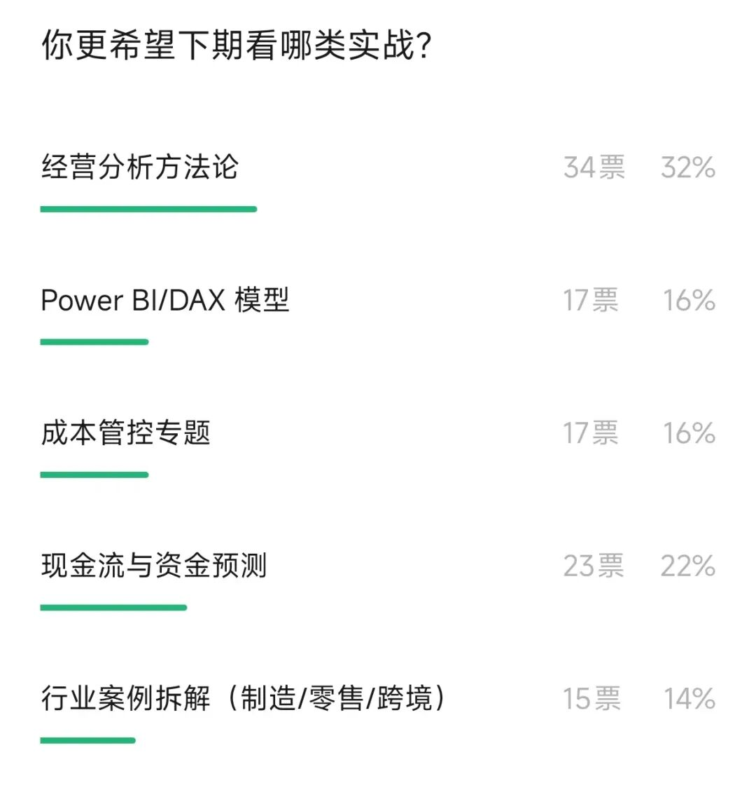
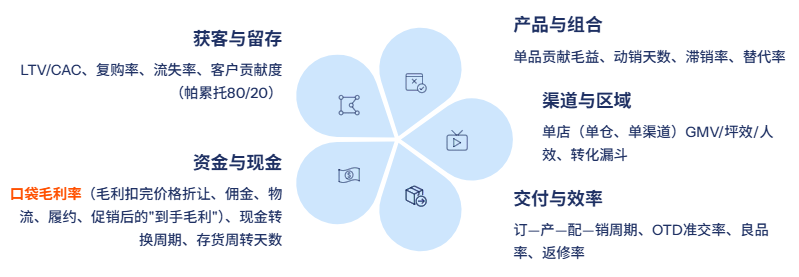
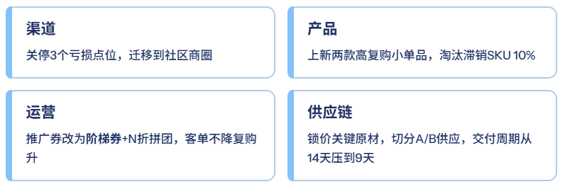
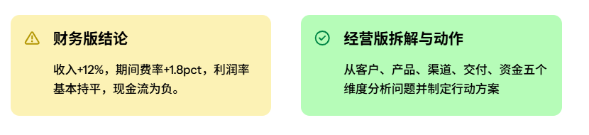
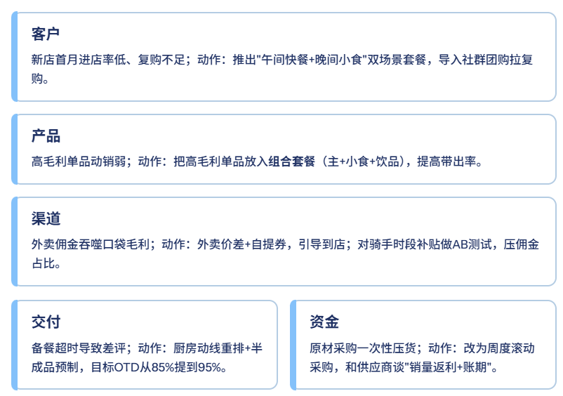
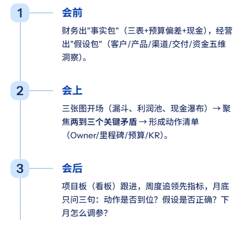

# 经营分析，不要做成了财务分析！（附PPT模板）

> 来源：微信公众号「数据熊」 · 作者 数据熊 · 发布于 2025-08-29 06:41  
> 原文链接：http://mp.weixin.qq.com/s?__biz=Mzg2MTg5OTgzNA==&mid=2247489315&idx=1&sn=1ada4a4f92db6fc1be6677e9016a8eeb&chksm=ce114a76f966c3604b86ba3b0c455364c1b5e4795156e2d274b1407cce9cefda387aa750b786
> 摘要：经营分析的“魂”，不在报表里，在选择里

由于公众号推送机制调整，如您不想错过「数据熊」的文章，请务必把我们设为星标：点文章左上角 蓝色“
数据熊
” → 主页右上角 “
…
” →
设为星标
，这样每篇干货都能第一时间抵达你的订阅列表！

根据前期的投票，大家还是希望能看到经营分析相关的内容，内容共创，大家继续参与文末投票。今天我们来聊聊经营分析和财务分析。

---

很多企业的“经营分析会”，最后开成了“财务报表朗读会”：收入增了多少、成本费率升了几点、利润完成率几何……台上说数据，台下听天书。问题是——报表讲的是“发生了什么”，经营要回答“接下来怎么赢”。

今天数据熊就和大家把这个话题聊透：经营分析，别做成了财务分析！

01

先把边界划清：财务看结果，经营盯路径

财务分析关注结果与合规——利润表、现金流、资产负债表有没有异常；费用是否控制；指标有没有偏离预算。

经营分析则要穿透到路径与选择——客户从哪里来、为什么买、复购如何提；产品怎么组合；渠道资源怎么投；组织能力哪里短板。一句话：

财务分析=“What发生了什么？”

经营分析=“Why/How为什么这样、怎么改变？”

把边界划清，会议就不会迷路：财务给边界与事实，经营给策略与动作。

02

用经营视角重构指标：别只看毛利率，看“口袋毛利率”

指标不是越多越好，要能驱动动作。建议从“五维”搭建指标树：客户、产品、渠道、交付、资金。可落地的一组核心指标：

- 获客与留存：
   LTV/CAC、复购率、流失率、客户贡献度（帕累托80/20）。

- 产品与组合：
   单品贡献毛益、动销天数、滞销率、替代率。

- 渠道与区域
   ：单店（单仓、单渠道）GMV/坪效/人效、转化漏斗。

- 交付与效率：
   订—产—配—销周期、OTD准交率、良品率、返修率。

- 资金与现金：
   口袋毛利率（毛利扣完价格折让、佣金、物流、履约、促销后的“到手毛利”）、现金转换周期、存货周转天数。

先把“看得懂、管得住”的指标放进一张经营驾驶舱：三张图搞定——
客户漏斗图、利润池图、现金瀑布图。
每张图都能引出动作，而不是只报比率。

03

把结论变动作：策略—战术—动作—复盘四步闭环

好的经营分析，最后一定落到动作清单：

1. 策略：今年要从“规模优先”切到“质量增长”；
2. 战术：收缩低产出渠道，拉高高粘性人群；主推高口袋毛利率产品；
3. 动作（谁/何时/预算/里程碑/KR）：

4.复盘：以周为节拍追领先指标（进店率、加购率、准交率），以月审结果指标（口袋毛利率、LTV/CAC、现金转换天数）。

记住一句话：没有动作的分析=情绪；没有复盘的动作=忙碌。

04

一个迷你场景：连锁餐饮同城拓店，怎么做“经营分析版”复盘

背景：同城开新店3家，表面利润还行，但现金吃紧。

经营版拆解与动作：

一个月后复盘：口袋毛利率+2.3pct，复购率+6.8pct，现金转换天数缩短5天。这才是经营分析：从报表问题，走到现场动作。

05

让机制替你省力：一场高质量“月度经营会”的SOP

纪律：禁止“只读报表”；禁止“没Owner的建议”；禁止“没有截止日期的任务”。把机制搭起来，经营分析才能从“一次性展示”，变成“持续性赢法”。

数据熊说

经营分析的“魂”，不在报表里，在选择里：选对客户与场景，选对产品与渠道，选对动作与节奏。

财务让我们不冒险，经营让我们敢赢。把两者握在一起，你的增长才会有质量、有现金、有韧性。

获取

经营分析PPT模板

点击

阅读原文

，

PowerBI看板

定制添加数据熊微信：

