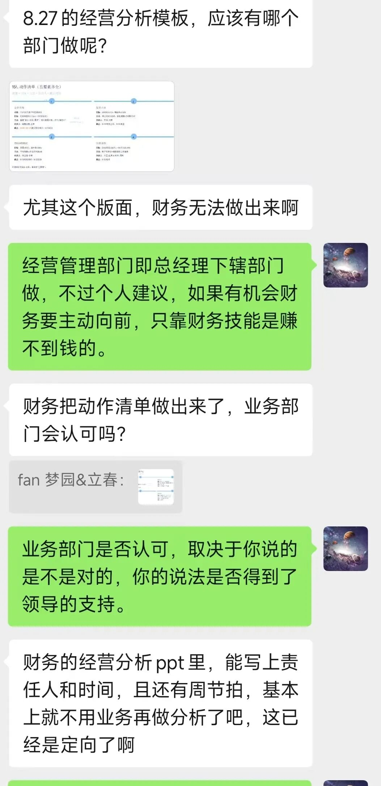
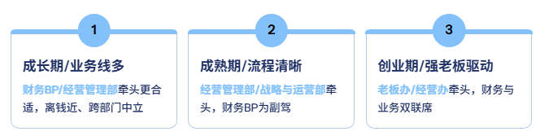
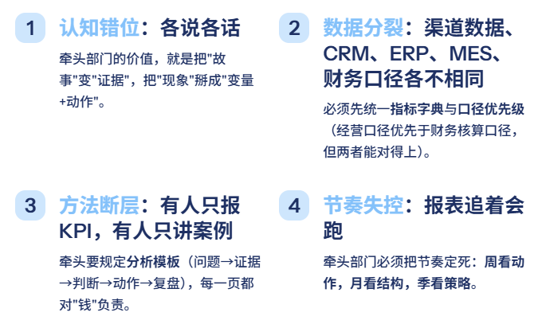
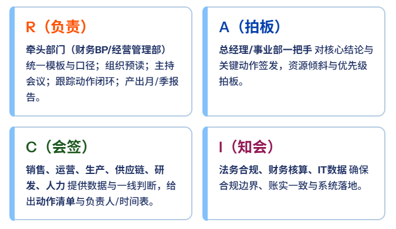
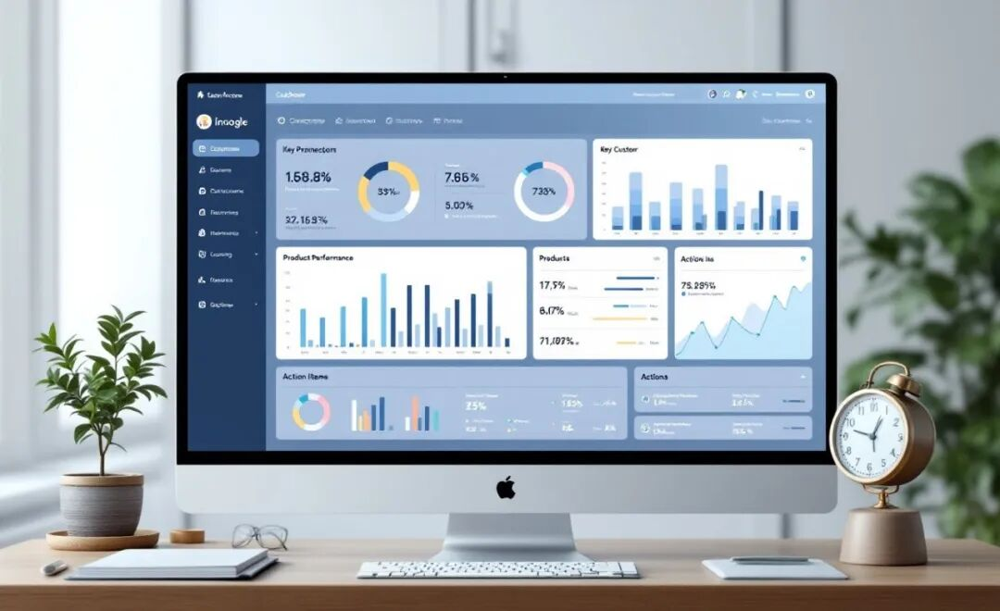
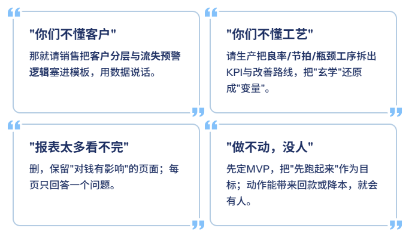

# 经营分析，到底应该由谁来写？

> 来源：微信公众号「数据熊」 · 作者 数据熊 · 发布于 2025-08-30 08:00
> 原文链接：http://mp.weixin.qq.com/s?__biz=Mzg2MTg5OTgzNA==&mid=2247489368&idx=1&sn=e79bc82f3b7b7978c800a159e500d1b0&chksm=ce114a0df966c31b90906c7dc8ce03460d0eea0b9f7ffb25bd0c6728e82d849195558c41b7b0
> 摘要：写得好不好不重要，能不能把钱和动作对上号，才重要。

由于公众号推送机制调整，如您不想错过「数据熊」的文章，请务必 把我们设为星标：点文章左上角 蓝色
“数据熊”
 → 主页右上角
“…”
 →
设为星标
，这样每篇干货都能第一时间抵达你的订阅列表！

先跟大家分享件惊险的事：昨天早上，一进办公室被同事提醒，有给女朋友买礼物么，我才记起来是七夕。赶紧打开看了山姆发现化妆都要两天后才能到，又急忙到京东看才发现有当日达，感谢京东让我有惊无险的度过了七夕。

---

好了回到正题，今天又被粉丝问到，经营分析该谁来写？

很多财务同仁似乎很纠结这个问题。其实说实话，经营分析是个高级工作，需要极强的综合能力，财务同仁如果有机会还是尽量主动去接触，主动打开业务视角，不然仅仅靠算数字是赚不了钱的。

说归说，今天还是要非常客观的来聊聊这个话题——
经营分析，应该由谁来写？

PART 01

结论先给：一个部门牵头，其他部门参与，共同完成

经营分析不是
“哪一堆人最会做表”
，而是“谁能把问题拉到桌面、把动作落到地上”。最佳做法是
一个部门牵头
（对进度、口径、会议、产出负责），
跨部门参与
（对数据、专业结论、纠偏动作负责），
联合签发
（对结果背书）。

落地时，牵头部门一般有三种选择（按企业阶段自选其一）：

不建议“纯财务独写”或“各部门各写一份再拼”，前者容易“会计化”，后者必然“拼盘化”。

PART 02

为什么必须“一个口径、一个节奏、一个总责”

想把经营分析写得有用，至少要穿过四个常见矛盾：

牵头部门怎么挑？三条铁律

- 离钱最近
   ：能把收入结构、口袋毛利率、现金流拉到同一页上；

- 够中立：
   能跨销售/生产/供应链/研发/人力对齐口径，不站队；

- 有数可调度：
   能推动IT/数据中台优先保障明细、口径与权限。

如果三条里只能满足两条，优先保证“中立+调度”，否则很快演变成拉扯战。

分工怎么定？用RACI讲人话（文本版）

开会SOP：T-2天预读（带问题单）→会上只讲
“偏离+原因+动作”
→会后24小时内下发
动作清单
→T+7天动作复盘。

产出长什么样？做“最小可行经营分析”MVP

- 一页驾驶舱：
   本月/本季关键指标（收入、口袋毛利率、现金流、费用率、存货周转、回款周期、产能/良率、客户结构、产品结构）。

- 三页结构：
   客户、产品、区域/渠道的“贡献度×趋势×风险点”。

- 两页专题：
   围绕本月最影响结果的两件事深挖（比如大客户波动、单品毛利坍塌、产能瓶颈、库存积压）。

- 一页动作闭环：
   负责人、里程碑、预期财务影响、复盘时间。

工具层面，建议用
Power BI
做统一视图：一张老板页（看趋势和偏离）、一张经营页（看结构）、若干专题页（看根因与动作效果）。
一套指标字典，一套日期表，一套维度主数据
，别整花活。

30天落地路线（不等完美，先跑起来）

1. 第1周：
    定口径与模板（10个核心指标+一套问题清单）；明确RACI与会议节奏。
2. 第2周：
    接入三块最关键的数据（订单、出入库/产线、回款）；搭建BI草稿。
3. 第3周：
    小范围试跑（一个事业部或单品线），只盯两件最重要的偏离。
4. 第4周：
    复盘试跑，固化模板与动作闭环机制，上线全公司月度版。

PART 03

常见反对意见，怎么回？

数据熊说

经营分析不是“写报告”，而是组织一场跨部门的真相生产。选一个中立、懂业务、能调度数据的部门牵头，把问题、证据、动作、复盘串成闭环；用最小可行模板先跑起来，用真实的改善结果赢得共识。写得好不好不重要，能不能把钱和动作对上号，才重要。

内容共创，欢迎参与投票，您的投票将决定内容走向。

获取

经营分析PPT模板

点击

阅读原文

，

PowerBI看板

定制添加数据熊微信：

