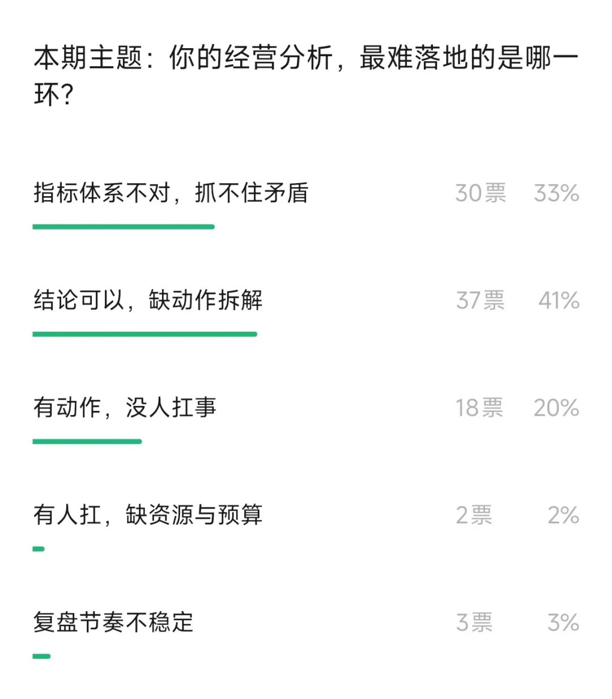
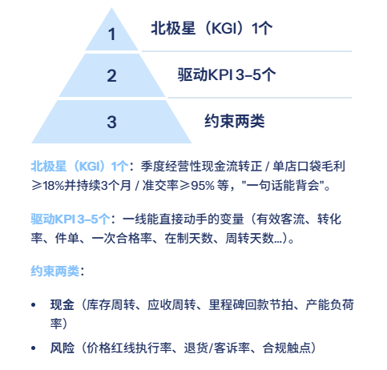
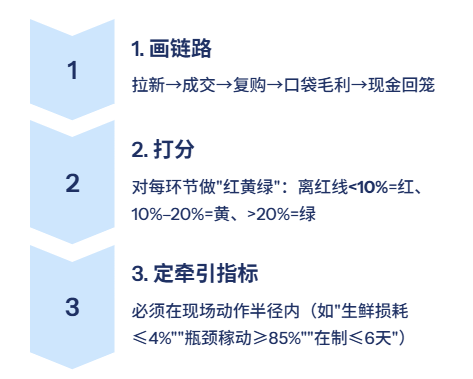
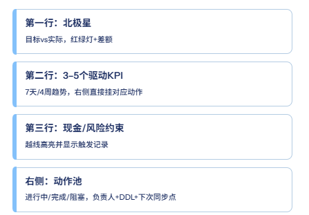

# 经营指标体系，要抓住主要矛盾（附PPT模板）

> 来源：微信公众号「数据熊」 · 作者 数据熊 · 发布于 2025-09-01 07:30
> 原文链接：http://mp.weixin.qq.com/s?__biz=Mzg2MTg5OTgzNA==&mid=2247489474&idx=1&sn=192df92f63e827190af81964a0758471&chksm=ce114a97f966c381efec6006a57dec84f6107b639d417f7b9c292a056cab7a16c672ae3ab3cb
> 摘要：别把报表当战术、别把 PPT 当成果。

由于公众号推送机制调整，如您不想错过「数据熊」的文章，请务必 把我们设为星标：点文章左上角 蓝色“数据熊” → 主页右上角 “…” → 设为星标，这样每篇干货都能第一时间抵达你的订阅列表！

前几天，调研投票，很多朋友反馈公司存在经营指标太多，抓不住矛盾

坦白说，很多公司不是“缺指标”，而是被指标拖着跑。会议室屏幕一亮，五彩仪表盘像庙会烟花——好看、没用；KPI 越堆越多，问题一个不见少。最离谱的是：拿“数据主义”当“经营主义”，
把报表当战术、把 PPT 当成果。

我见过三种典型自欺：

这种“假忙碌”，让团队把时间花在解释而不是改变。所以，别再崇拜大而全的指标目录。经营的三条底线：

- 抓主要矛盾（只打最要命的那一下）；

- 用最少的数字撬最多的动作；

- 每个数字都有主人、有阈值、能触发纠偏。

指标多不等于管理好。经营的本质，是抓住主要矛盾，用最少的数字驱动最多的动作。今天咱们就来聊聊：主要矛盾怎么找、指标怎么减、体系怎么落地，

PART 01

1｜先找矛盾：三问+10分钟快诊

别急着上 KPI，先把方向掰正。先问清“钱从哪来、卡哪儿、漏到哪”，后面才有讨论的资格。

10分钟快诊：

拉出上周真实数据（销售出库、真实履约、费用应计），画一条“从客到钱”小漏斗，
哪一格最薄，哪一格就是当期主矛盾
。

小例：同样营业额，平台费+物流把口袋毛利打到 12%，那“费率结构优化+履约路径”优先于“拉新”。

PART 02

2｜搭骨架：1–5–2 的三层结构

指标不是摆设，是骨架。骨架搭对了，肌肉再多也不驼背。

阶段示例：

- 增长期：
   北极星=有效新增付费用户；驱动=激活率/转化/ARPU；约束=获客成本回收周期。

- 效率期：
   北极星=口袋毛利率；驱动=结构毛利/履约成本/损耗；约束=库存现金占用。

PART 03

3｜锁定当期重点：三步走到位

主意就一个，别贪心。本季只有一个牵引指标，其他都要给它让路。

只选一个牵引指标，其他是配套，不搞“齐步走拖慢节奏”。

PART 04

4｜把指标变成动作：四要素+一句话语法

没有动作的指标，就是“坏数字”。谁负责、怎么干、多久看一次、啥时候纠偏，一条都不能少。

每个指标必须绑定
负责人 / 抓手动作 / 检查频率 / 纠偏阈值。

动作语法（一句话能落地）
：动词+对象+频率+阈值。

预案要双轨：
A 方案（短期止血）+ B 方案（结构性修复），避免“一招鲜”。

PART 05

5｜做减法与守红线：五条铁律

会管事，先学会扔东西。指标瘦下来，动作才跑得动。

- 跨层不重复（同一概念只在一层出现）；

- 只留能被现场改变的数（去掉“外太空指标”）；

- 阈值=会议触发器（不是好看，是要能叫停/改排程）；

- 采集成本<决策价值（高成本数据先降频或抽样）；

- 阶段性毕业（主矛盾解决就撤旧指标）。

口径统一：
为高频指标做“口径小卡”（1页纸：定义/公式/取数口/负责人），例会先对口径，后谈数字。

PART 06

6｜一页纸看板+迭代节奏（会开在一张图上）

开会就看这一张，谁越线谁发言。会议从“讲故事”切到“改排程”。

节奏建议：

- 日站会看异常与纠偏，周例会只看驱动与动作进展，月复盘调结构，季调整主矛盾。

行业快用包（超简）：

- 连锁零售：
   北极星=单店口袋毛利≥18%；驱动=有效客流/转化/件单/高毛利结构/损耗；约束=库存周转、价格红线。

- 多品种小批量制造：
   北极星=准交率≥95%且经营现金流转正；驱动=瓶颈稼动/一次合格/在制天数/计划达成/材料利用；约束=库存占用、重大质量事故。

- ToB项目/软硬件：
   北极星=在手合同口袋毛利≥30%且回款≥95%；驱动=激活客户/ARPU/续费/里程碑准时/返工率；约束=回款节拍、范围蔓延。

仪表盘不超过 9 个图，超过就分“经营层/执行层”两页。

数据熊说：
别把经营做成“数据秀场”。盯住主矛盾，用 1–5–2 的骨架和“一页纸看板”，把会议变成动作，把动作变成钱。能把“看数”开成“改排程”，这套指标体系就真活了。

内容共创，您的投票将决定后续内容走向：

获取

经营分析PPT模板

点击

阅读原文

，

PowerBI看板

定制添加数据熊微信：

