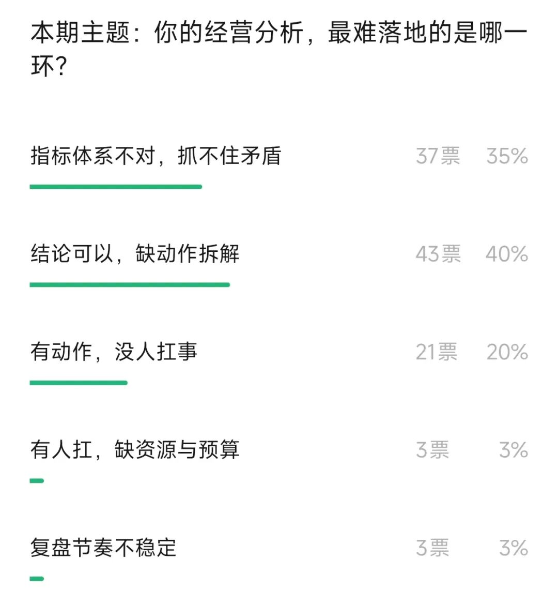
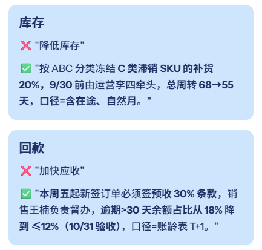
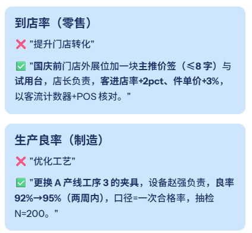
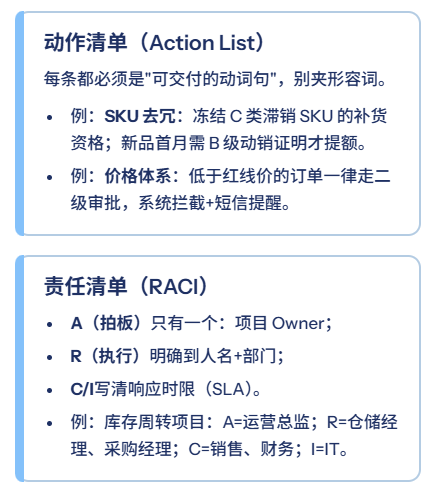
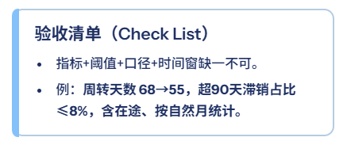
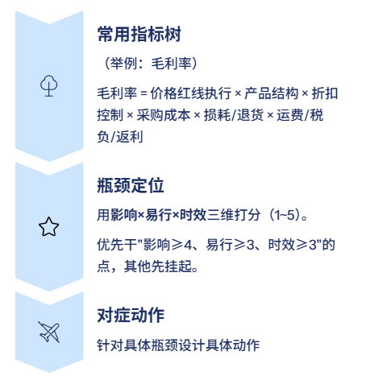
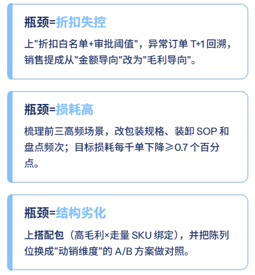
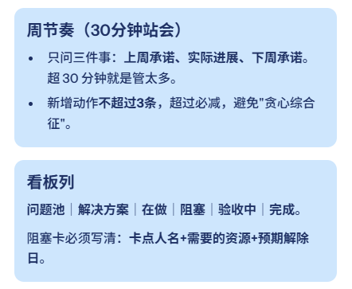
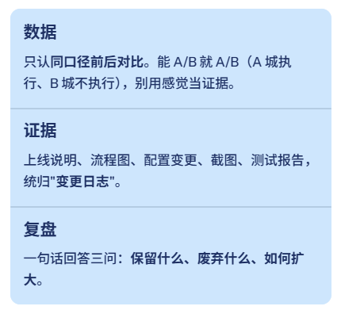

# 经营分析，别老是“加强、优化、推进”（附ppt模板）

> 来源：微信公众号「数据熊」 · 作者 数据熊 · 发布于 2025-09-02 07:30  
> 原文链接：http://mp.weixin.qq.com/s?__biz=Mzg2MTg5OTgzNA==&mid=2247489522&idx=1&sn=668537729f9c855f00435ac0777cb9ec&chksm=ce114aa7f966c3b159e159f8a277452175d579282f95e782cb4c8e143e250410392dadd42678
> 摘要：能上墙的结论，才算结论；能被验收的动作，才叫动作。

由于公众号推送机制调整，如您不想错过「数据熊」的文章，请务必 把我们设为星标：点文章左上角 蓝色“数据熊” → 主页右上角 “…” → 设为星标，这样每篇干货都能第一时间抵达你的订阅列表！

根据前几天的投票，大家反馈经营分析很难拆解到动作：

说实话，这是很多公司分析顽疾，

分析不是为了“写个漂亮结论”，而是为了“把人和钱、货和场动起来”。一句“加强、优化、推进”，落不到班表、落不到动作、落不到验收，那就是在给大家添堵。下面这套打法，目的很明确——让每条结论都能当天开工、下周可验收、月底能复盘。

PART 01

结论要长成“可执行体”

判断标准就一条：读完能立刻排班。
句式固定为：

动词 + 对象 + 范围 + 目标值/幅度 + 截止时间 + 责任人 + 验收口径。

落地小贴士：
对“目标值”别怕拍板。定不下来就用“保底-挑战”双目标：保底必须达成，挑战冲刺评优。

PART 02

从结论落到“三张清单”

结论不是段子，是工单。配齐三张清单，基本就能跑起来：

1个完整小案例（连锁门店）

结论：
“高库存占用现金，先动结构”

动作：
① 冻结 C 类 20% SKU 补货；② 新品 4 周不达标自动下架；③ 门店周补货改为双周。

RACI：
A=运营；R=仓储+采购；C=财务；I=门店。

验收：现金周转天数 42→35；报废损耗率 2.3%→1.6%；达成时间 30 天。

PART 03

用“指标树→瓶颈→动作”三步拆解

别上来就“全面提升”。先画指标树，再锁定唯一瓶颈，最后把动作对准它。

对症动作举例

一个数字化小技巧

用量×价×结构×损耗分解贡献，周报只看“本周净贡献Top3/Bottom3”，所有动作围绕这六个数字打转，团队不会跑偏。

PART 04

让组织动起来：节奏、看板和会议脚本

把节奏打上去，事情就会自己往前滚。

会议脚本（可照抄）

1）每人 2 分钟报“动作+数据”，不用PPT；

2）红/黄/绿灯打标（红=超时或无进展，黄=有进展未达成，绿=达成）；

3）当场定下次验收口径和日期；

4）跨部门卡点，当场拉群，A 角拍板资源。

跨部门“拉齐话术”

- 你提问题：“我们要的不是加班，是达成。给我一个能达成的方案。”
- 你要承诺：“资源我来兜底，你们把验收口径收紧。”

PART 05

闭环验收：用结果说话，用证据留痕

三件套：数据、证据、复盘。

轻量 A/B 设计示例（价格红线）

- A 组（执行红线+审批阈值），B 组（原流程），周期 14 天；
- 指标：毛利率、成交率、客诉率三联看；
- 判定：毛利率 +1.5pct，成交率 -0.2pct 以内可接受；若客诉率上升≥0.3pct，回滚。

复盘模板（四行字）

- 动作：9/1 上线红线+审批阈值；
- 结果：毛利率 +1.7pct、成交率 -0.1pct；
- 证据：订单明细、审批日志、回放截图；
- 经验：阈值过窄易卡单，二级审批放宽至 3% 更稳。

PART 06

常见五个坑，以及怎么绕过去

- 坑1：结论太虚。纠偏：强制“七要素句式”，过会前先把句子改硬。
- 坑2：动作太多。纠偏：周动作≤3条；优先级=影响×易行×时效，低分动作延后。
- 坑3：没一个人背锅。纠偏：每个项目只能有一个 A 角，A 角可以不动手，但必须对结果负责。
- 坑4：数据口径打架。纠偏：建立 SSOT（唯一可信来源） 和“口径公告”，变更必须公告。
- 坑5：跨部门扯皮。纠偏：RACI + SLA 写进项目章程；超时自动升级，别在群里“情感沟通”。

即时纠偏信号灯（看见就刹车）

- 周会 30 分钟开成了 90 分钟；
- 看板“阻塞”栏堆满三排；
- 每个人 在谈“做了多少”，没人说“达成了什么”；
- 复盘只有感想，没有证据。

获取

经营分析PPT模板

点击

阅读原文

，

PowerBI看板

定制添加数据熊微信：

内容共创，您的投票将决定公众号内容走向
