# 经营分析PPT模板：别只提问题，要配动作

> 来源：微信公众号「数据熊」 · 作者 数据熊 · 发布于 2025-09-03 07:30
> 原文链接：http://mp.weixin.qq.com/s?__biz=Mzg2MTg5OTgzNA==&mid=2247489582&idx=1&sn=9b4b6ecf60120cbb0d98a6245cac18d1&chksm=ce11457bf966cc6d541be78c748bb1cf1a1007649c008c925b4879f19d05994606af70b64cb2
> 摘要：经营分析的终点不在PPT，而在一线动作。

由于公众号推送机制调整，如您不想错过「数据熊」的文章，请务必 把我们设为星标：点文章左上角 蓝色
“数据熊”
 → 主页右上角
“…”
 →
设为星标
，这样每篇干货都能第一时间抵达你的订阅列表！

很多人的经营分析汇报，问题找得准，但业务“还是没动起来”。今天这套 17页经营分析PPT模板，就是把“问题→动作”写清楚，让老板一分钟看懂关键，让一线当天就能开干。

这套模板怎么用？

定位：
适合制造、流通、零售、电商等大多数企业，周期建议按月/半年度滚动。

口径：
文内示例采用 2025H1（2025/01-06）数据，集团合并口径，币种人民币、单位万元/%/天。

方法：
每个“现象”后面必须跟“一句动作”，并写清楚 对象/目标/方法/负责人/截止 五要素。

PART 01

01｜封面与目录：定调“问题→动作”

这一页不花活，只把主题亮出来：经营分析，不能只提问题不配动作。第二页做四段式目录，老板扫一眼就明白我们讲啥、怎么落地。

建议文案：
公司的问题不是看不懂数据，而是看不见动作。示例主题图：品牌主KV + 年度范围（2025H1）。

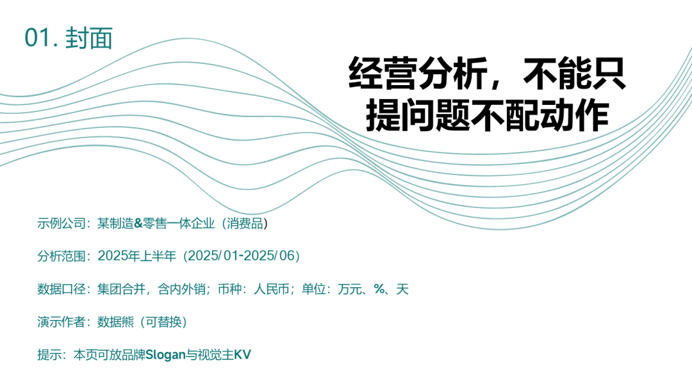

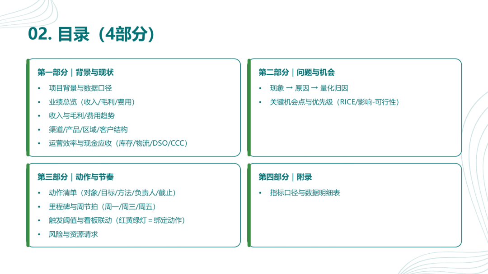

PART 02

02｜背景与现状：先把“口径”说人话

很多报告烂尾，问题出在口径分裂。第三页把“范围/口径/工具”讲清楚，避免会里打口水仗。

范围：
2025H1；直营/经销/电商三渠道；A/B/C三品类

口径：
收入＝含税开票-当期退折；毛利＝标准成本+直接制费+入库物流；三费不含财务费用

工具：
财务+WMS+CRM+BI

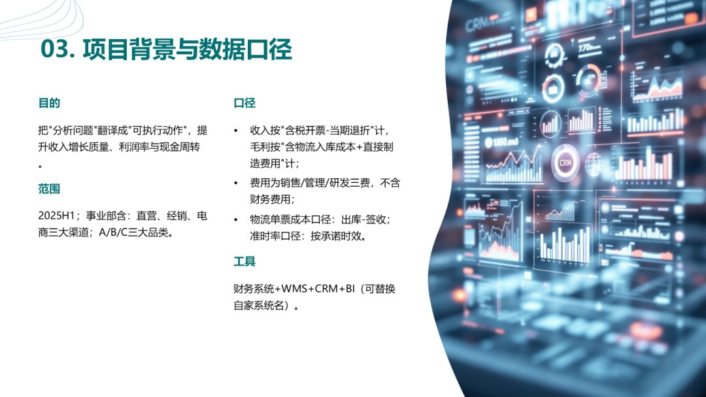

接着给一张 业绩总览（收入39,000万；毛利率31.7%；三费率19.7%；经营利润率11.8%；CCC 85天；新增客户1,240；复购率46%；逾期>90天占比12.6%）。一句话点题：
增长还行，但质量一般，现金周转偏长，毛利承压。

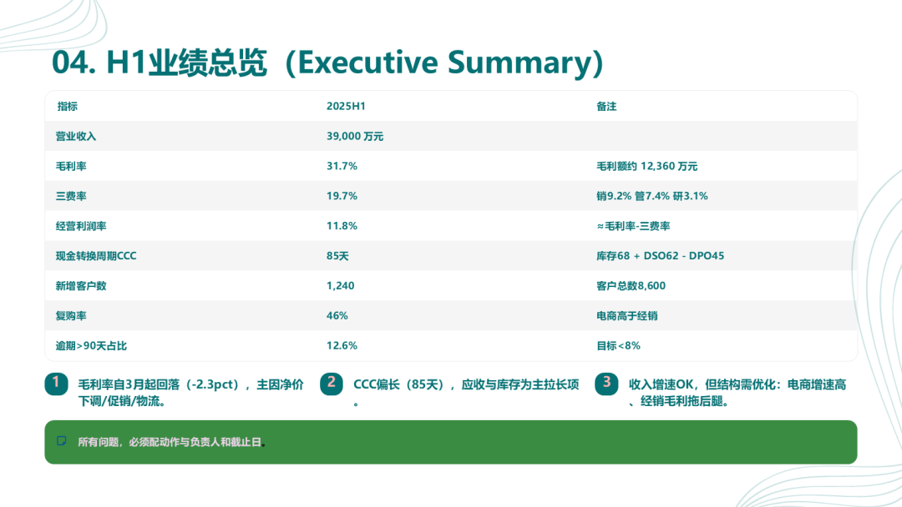

趋势页建议把“收入/毛利/费用”拆到月：2月季节性回落，3-6月环比走高，但均价在下探。

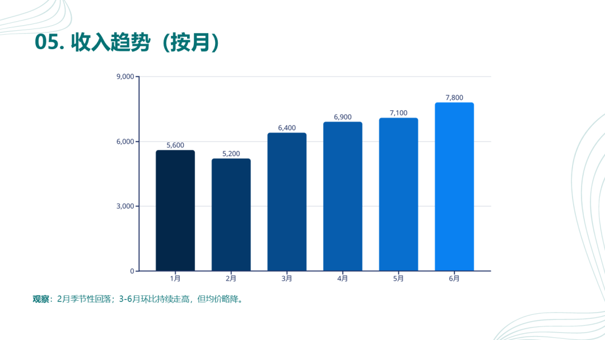

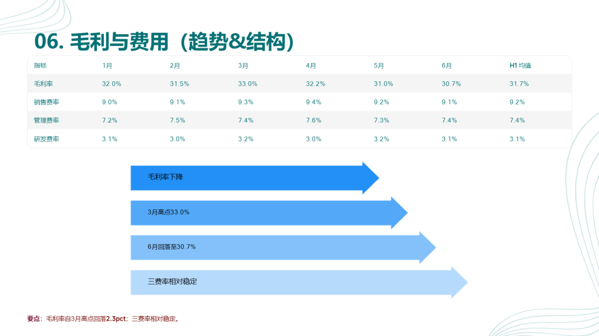

PART 03

03｜结构剖面：渠道、产品、区域、客户

结构是行动的入口。你要在这里把 哪里挣钱/哪里漏血 说清楚。

渠道：
经销占比45%，毛利率29% 最拖后腿；电商增速快，履约需要控成本。

价格/促销：
净价从98.5元降到95.2元；促销补贴率+0.9pct；赠品率+0.3pct。

产品：
A品类贡献48%且毛利35%，要“拉A控C”；B品类做版本区隔。

区域：
华北收入-3%、毛利低，先用陈列重排+二批渠道止血。

客户：
新增1,240；复购46%；流失8.5%；TOP100贡献41%。

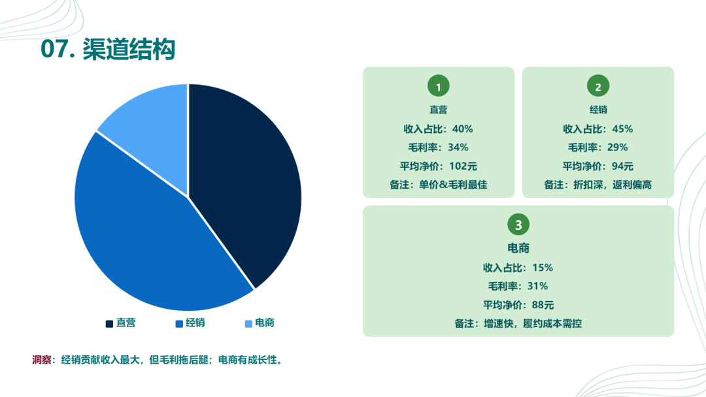

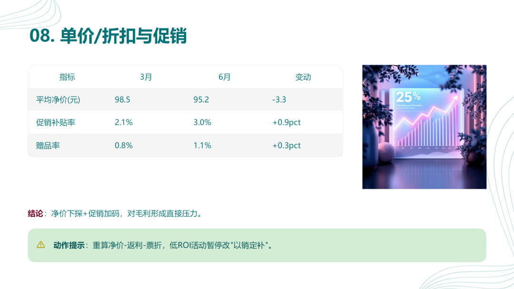

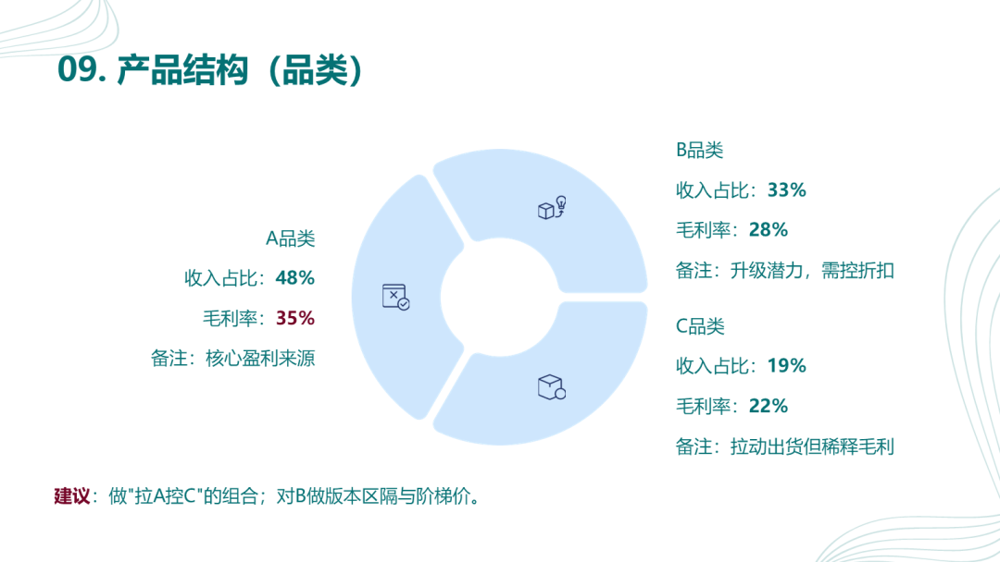

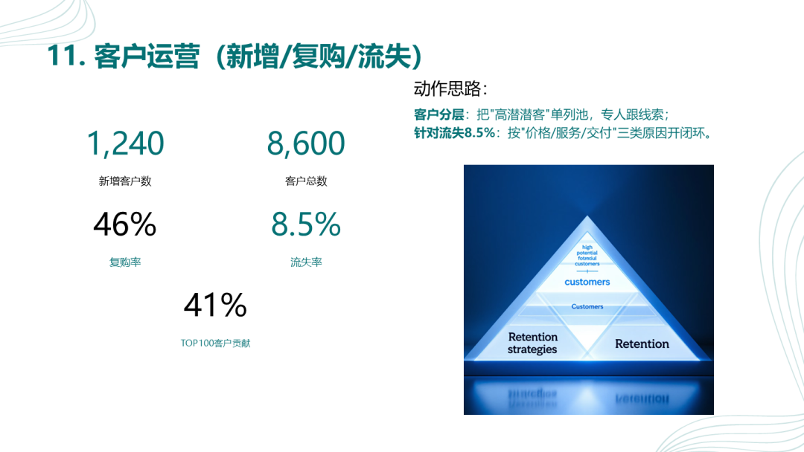

PART 04

04｜效率与现金：把看板变成触发器

“效率页”
不只是看热闹，要能触发动作。
示例：
库存周转天数 68 天（目标≤60）；单票运费 23.5 元（目标≤19）；准时率 96.8%（目标≥98）。
现金页：
CCC 85 天（由库存和DSO拉长），逾期>90天占比 12.6%。

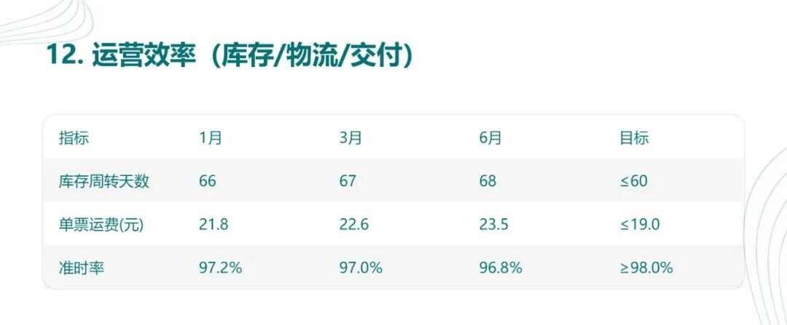

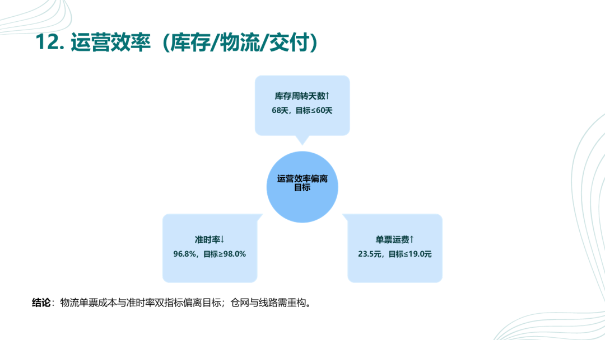

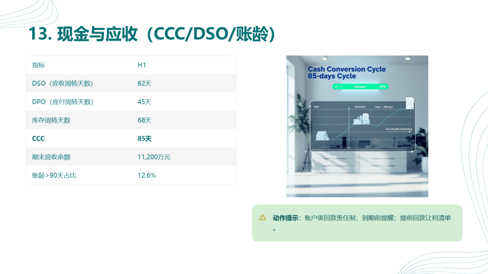

PART 05

05｜问题与机会：把“现象”翻译成“动作输入”

这页只做一件事：量化归因。示例：毛利率自3月33.0%降至6月30.7%（-2.3pct），归因为：净价下调 -1.1pct；促销加码 -0.8pct；物流异常 -0.4pct。这张图输出的是 下一页动作清单的“原材料”。

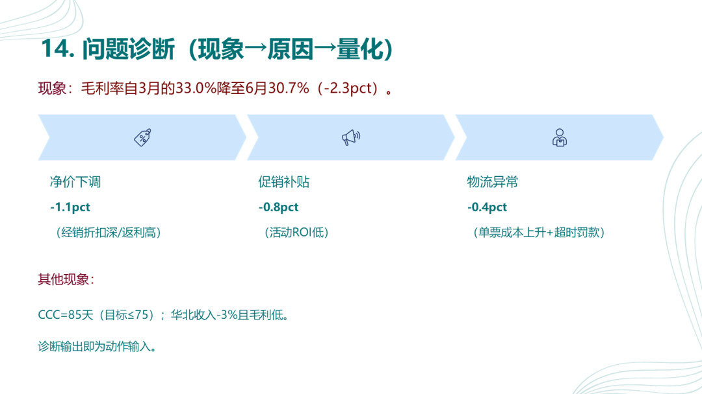

PART 06

06｜动作与节奏：对象/目标/方法/负责人/截止

到了这里就不许再“讲故事”了，每条动作都用“五要素”说人话。

样例（可直接替换）：

1）定价重构：

对象：TOP20大客户与经销体系

目标：毛利率回升≥1.0pct（9/30验收）

方法：重算“净价-返利-票折”，弱化前置补贴，改“以销定补”

负责人：销售运营-王某

截止：9/06提交新阶梯价；9/13试点

2）促销止血：
ROI≥1.5；赠品率≤0.8%；阈值>2%需ROI卡，9/20复盘。

3）物流AB测试：
单票≤19元；准时率≥98%；9/13完成测试，9/22定版。

4）回款逐客：
DSO≤58天；>90天占比≤9%；9/30验收。

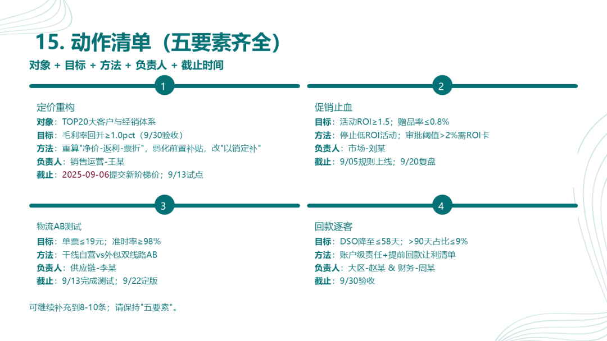

接着是节奏与里程碑：
周一复盘完成率、周三新增问题配动作、周五口径校验。样例里程碑：9/06定价V1；9/13物流AB测试完成；9/20促销ROI复盘；9/22物流定版；9/30回款验收。

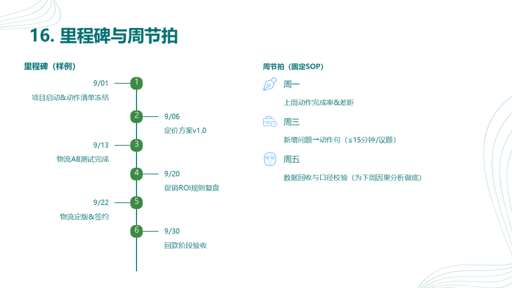

最后一页把“看板触发阈值”写死：

新客转化率 连续2周<12% → 48小时提交落地页A/B方案；

单票运费 连续3周>22元 → 重算仓网与线路（7天）；

CCC >75天 → 回款让利清单+库存去化（2周）。

并列出“风险与资源请求”，例如：物流测试预算20万、定价系统参数调整等。

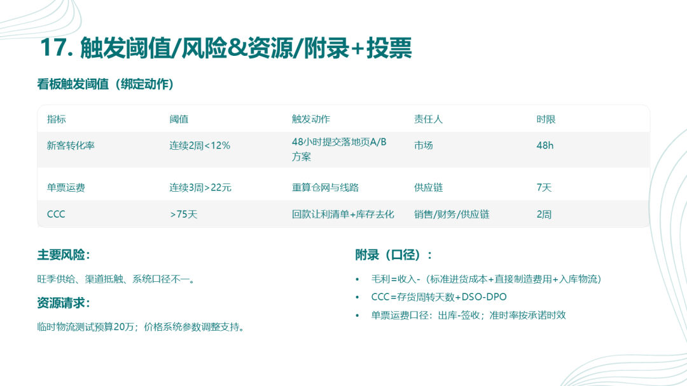

PART 07

数据熊说

经营分析的终点不在PPT，而在一线动作。每个“问题”，请当场写成一句“动作句”，配上人名和截止日，你的企业就会开始变快、变准、变赚钱。

你需要哪个行业的经营分析ppt模板？欢迎评论区留言

获取

经营分析PPT模板

点击

阅读原文

，

PowerBI看板

定制添加数据熊微信：

