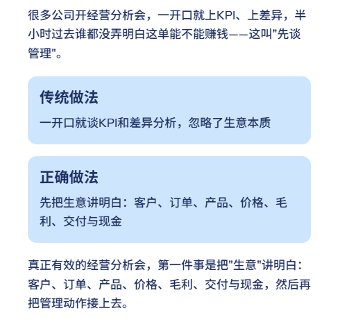
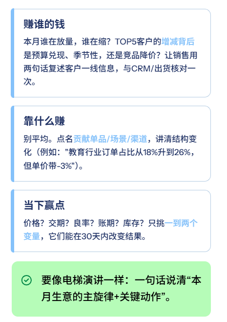
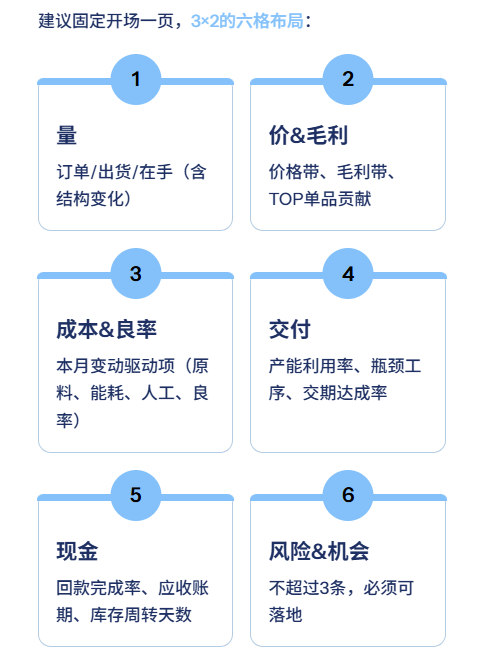
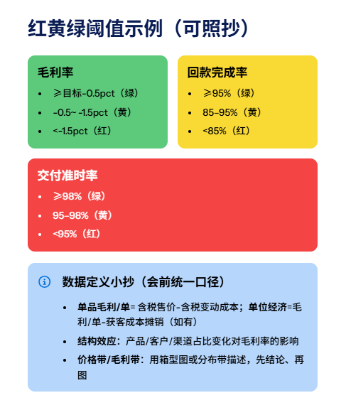
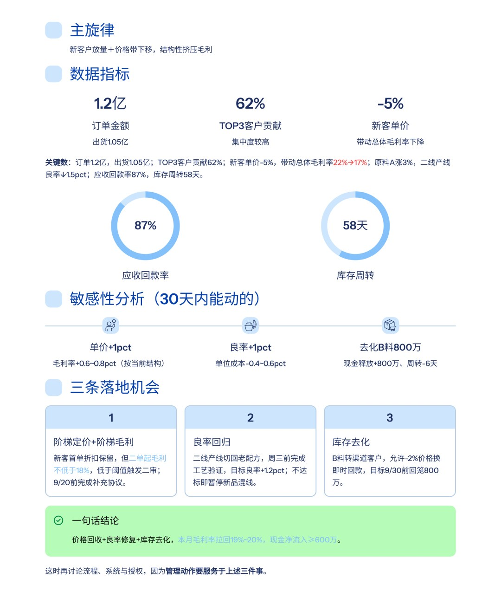
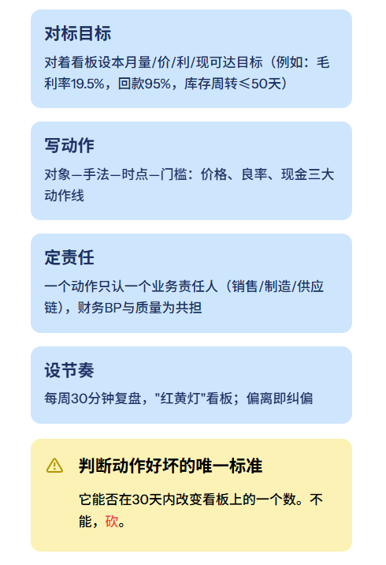
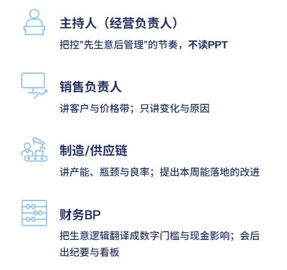
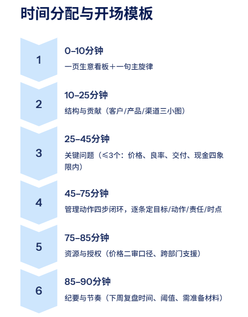
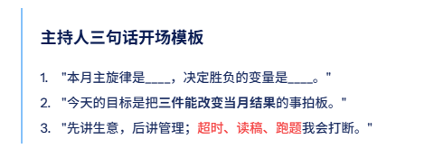
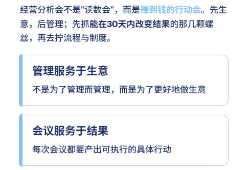

# 经营分析会：要先谈生意，再谈管理（附ppt模板）

> 来源：微信公众号「数据熊」 · 作者 Data Bear · 发布于 2025-09-11 00:57  
> 原文链接：http://mp.weixin.qq.com/s?__biz=Mzg2MTg5OTgzNA==&mid=2247489800&idx=1&sn=f0e8ab12523d013722d3045afe01f5b2&chksm=ce11445df966cd4be9dc3a911221c67a82ce8e295b49cfaedeba278911440f10206017dc792b
> 摘要：先生意，后管理；先抓能在30天内改变结果的那几颗螺丝，再去拧流程与制度。

01

先谈生意的三问：赚谁的钱、靠什么赚、当下赢点在哪

02

分钟"一页生意看板"：把话说明白

03

现场示例（化工材料）：先生意，后动作

04

从"生意问题"到"管理动作"：四步闭环

05

会议术：角色、议程与话术（90分钟够用）

06

数据熊说

点击左下角

阅读原文

，获取

《财务分析报告PPT模板》

不做孤独的财务人

加入数据熊的粉丝群

，与2300+财务精英共同成长。

PowerBI看板定制

，扫码加数据熊微信咨询。

