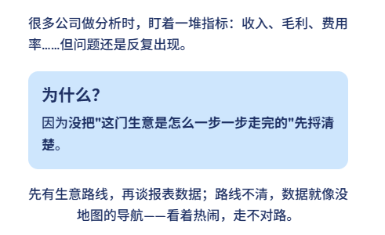
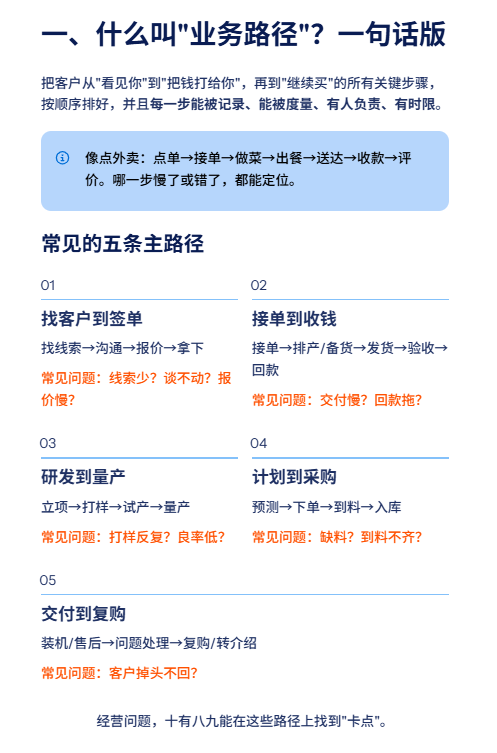
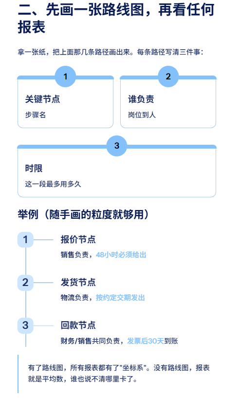
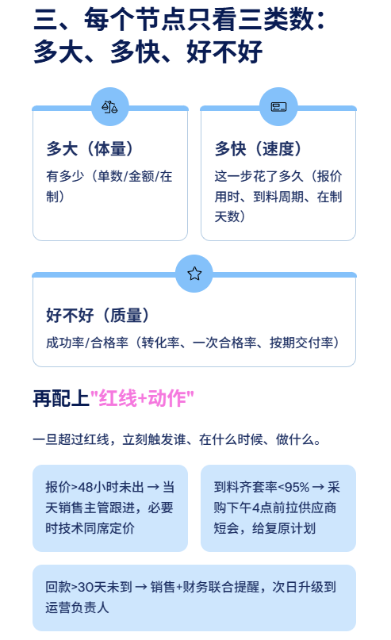
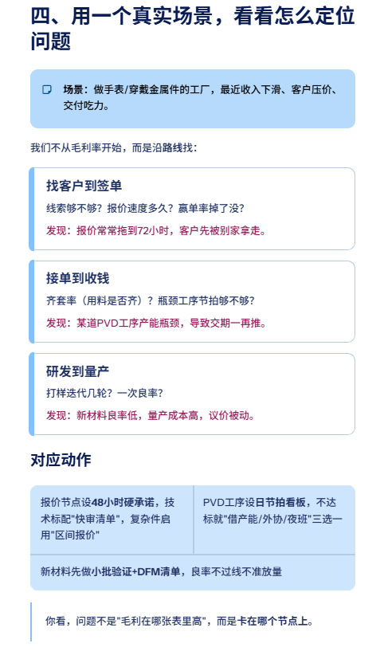
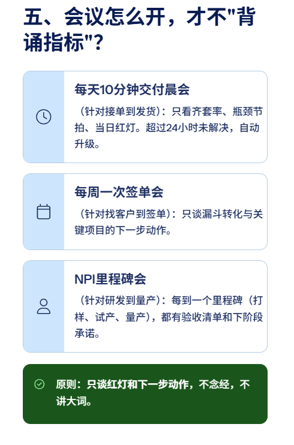
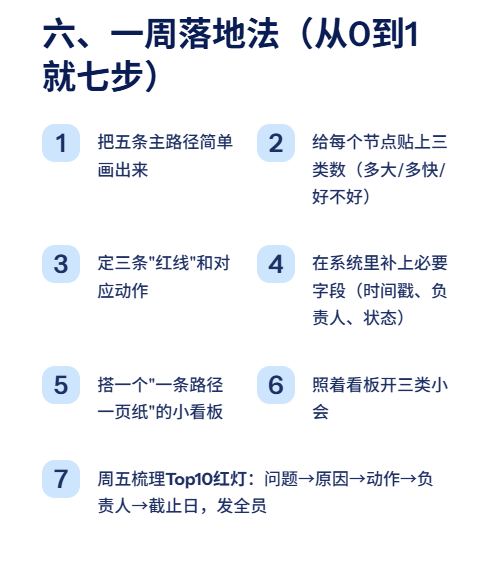
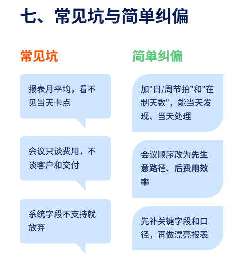
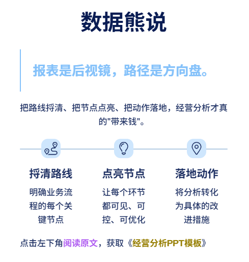

# 经营分析，要先把业务路线捋顺

> 来源：微信公众号「数据熊」 · 作者 数据熊 · 发布于 2025-09-12 07:30
> 原文链接：http://mp.weixin.qq.com/s?__biz=Mzg2MTg5OTgzNA==&mid=2247489814&idx=1&sn=cec9952612bc5a98bc96b6e65ef3d1dc&chksm=ce114443f966cd557c119e0e16bd0c666a2b8833cb1d580e004e6020e88234ddf2b441df7bf2
> 摘要：把路线捋清、把节点点亮、把动作落地，经营分析才真的\x26quot;带来钱\x26quot;。

不做孤独的财务人

加入数据熊的粉丝群

，与2300+财务精英共同成长。

PowerBI看板定制

，扫码加数据熊微信咨询。

#经营分析

#财务

#会计
