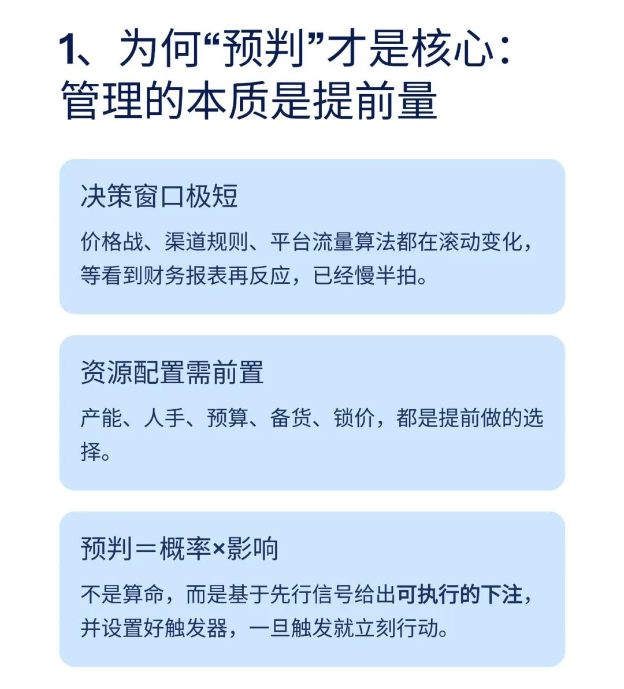
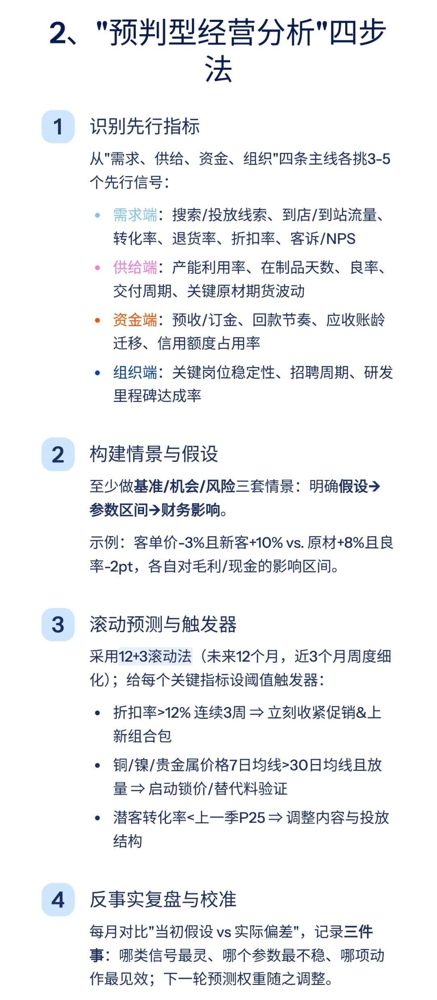
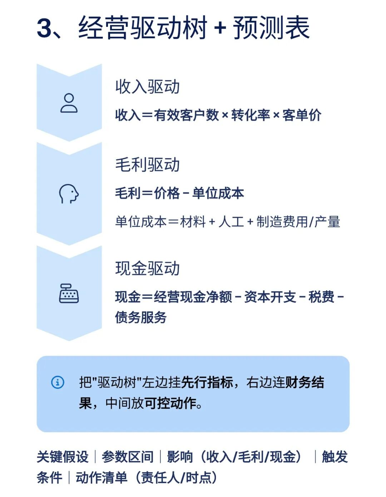
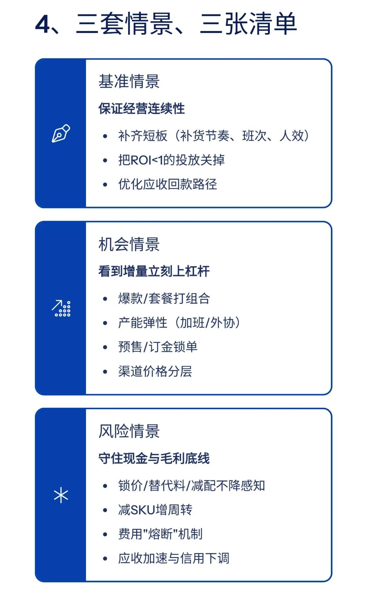
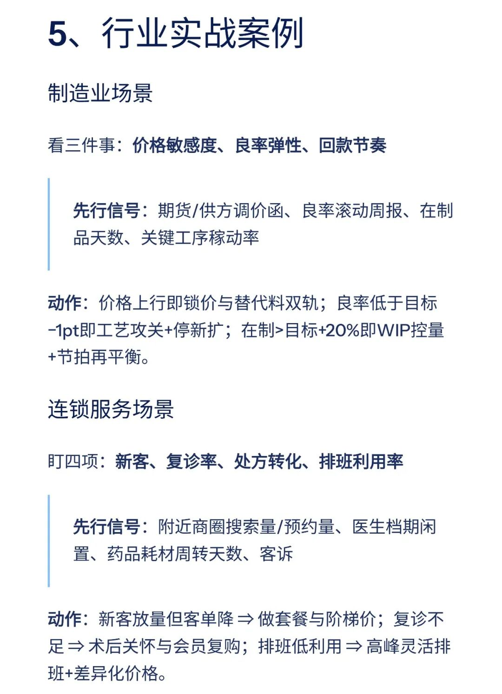
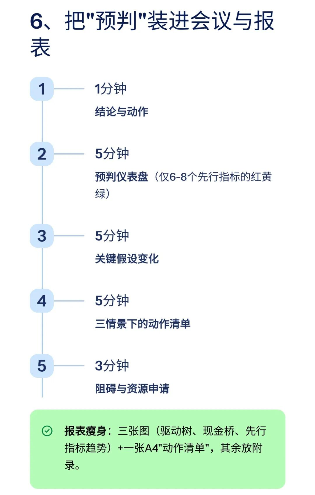
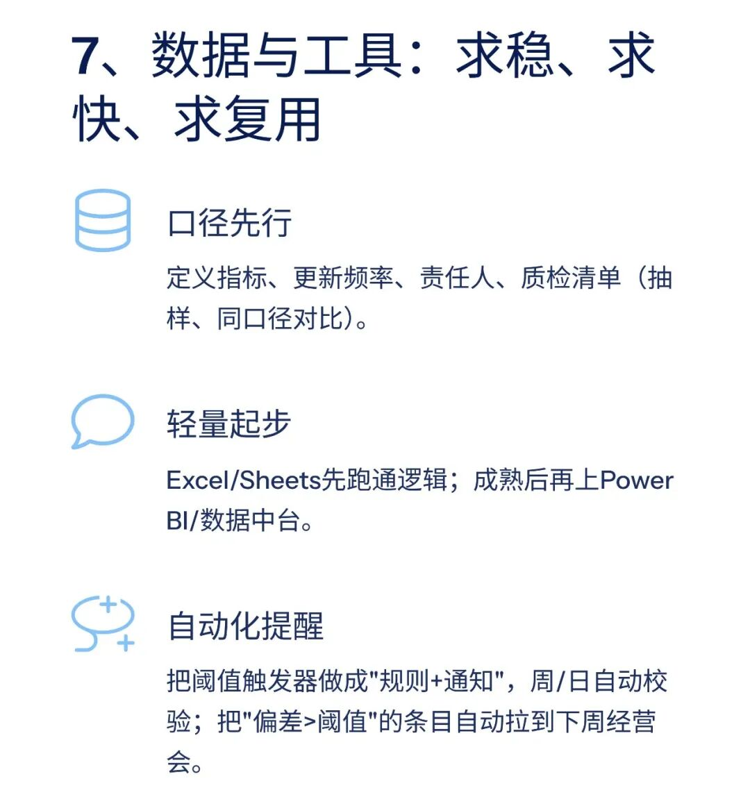
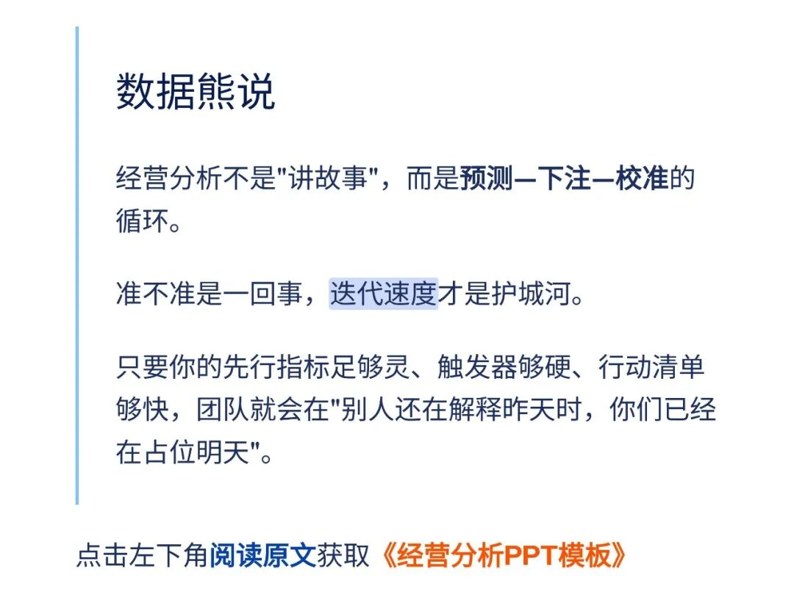

# 经营分析的关键，从来不是数据复盘（附PPT模板）

> 来源：微信公众号「数据熊」 · 作者 数据熊 · 发布于 2025-09-13 08:00
> 原文链接：http://mp.weixin.qq.com/s?__biz=Mzg2MTg5OTgzNA==&mid=2247489841&idx=1&sn=310377228e854f1cb82ca3e6893cebdc&chksm=ce114464f966cd723f537077524b87e6f00f46528e9ac99d9545822c9611c84241622413899f
> 摘要：经营分析不是“讲故事”，而是预测—下注—校准的循环。准不准是一回事，迭代速度才是护城河。

不做孤独的财务人

加入数据熊的粉丝群

，与2300+财务精英共同成长。

PowerBI看板定制

，扫码加数据熊微信咨询。你想看哪个行业的实战案例，评论区留言。

#经营分析

#财务

#会计
