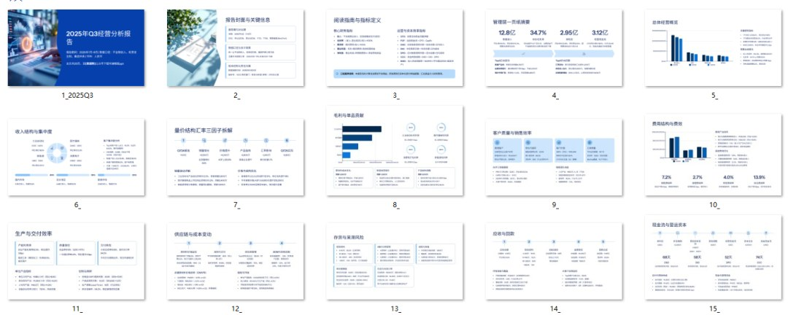

# 经营分析的关键是做好“路径分析”，而不是“数据分析”

> 来源：微信公众号「数据熊」 · 作者 宋岳清 · 发布于 2025-10-14 07:30  
> 原文链接：http://mp.weixin.qq.com/s?__biz=Mzg2MTg5OTgzNA==&mid=2247490336&idx=1&sn=43458e7da02b864ea34a98e13896d404&chksm=ce114675f966cf63e6dcc88465bb587b0f121debbcae24ccb694bd9c4e8cd828064ac8eff7da
> 摘要：很多公司做所谓的“经营分析”，会议开到半夜，PPT翻到第89页，大家却依然不知道明天要做什么。

很多公司做所谓的“经营分析”，会议开到半夜，PPT翻到第89页，大家却依然不知道

明天要做什么

。原因很简单：我们在“看数据”，而不是“走路径”。

数据告诉你发生了什么，路径告诉你接下来干什么。

文末点击

阅读原文

可获取《

2025年Q3经营分析报告PPT模板

》

---

## 一、先把话说清楚：什么是“路径分析”

先定调子

：路径分析不是替代数据，而是让数据回归“为结果服务”的位置。

简要说明

：路径分析从目标出发，拆分关键因子、识别卡点、设计动作、设定节拍、验证结果，形成“目标—>动作—>结果”的闭环。

对比一眼看懂

- 数据分析：多维报表、同比环比、排名分布 →

   看见问题
- 路径分析：目标分解、卡点定位、行动方案、责任节拍 →

   解决问题

---

## 二、一张“路径分析画布”：从目标到动作

先给抓手

：别先做PPT，先把这张画布填满，再谈展示。

路径分析画布（9格模板）

1. 目标：本季度要达到的单一“北极星”指标

2. 拆解：影响目标的3-5个关键因子（可量化）

3. 基线：当前值&差距

4. 卡点：最大的3个瓶颈/不确定性

5. 策略：解决卡点的思路（优先级/组合拳）

6. 动作：本周/本月要落地的10个关键动作清单

7. 责任：每个动作的Owner与协作人（RACI）

8. 节拍：周节奏/里程碑/检查点

9. 验证：成效口径与复盘机制（因果与归因）

使用提示

：画布务必

一页纸

，每条用短句+数据；评审时先看

第6、7、8

（动作、责任、节拍），再问数据怎么支撑。

---

## 三、三个典型场景：把“路径”走通

先拉入场景

：不同业务，不同路径，但

抓卡点、定动作、带节拍

是不变的。

### 1）制造业：良率提升不是“看报表”，而是“改路径”

- 目标：成品良率从97.2%→98.5%（Q3）
- 卡点：一次通过率在A线波动、关键原料批次差异、换线后调机时间过长
- 路径：
- 节拍与验证：每周“战损图”复盘一次通过率；里程碑第4周看98.0%。

### 2）零售/电商：毛利率优化不是“多维看品类”，而是“动结构”

- 目标：整体毛利率+1.2pct（暑期档）
- 卡点：促销结构偏折扣、陈列转化差、尾货周转慢
- 路径：AB价差包搭配→陈列动线AB测试→尾货打包清仓专栏
- 节拍与验证：15天滚动看

   口袋毛利率

   ，GMV不降的前提下毛利爬坡。

### 3）工程/ToB项目：现金流改善不是“催回款”，而是“改条款+改节点”

- 目标：经营性净现金流为正（Q4单季）
- 卡点：验收周期长、合同首付款比例低、结算资料反复
- 路径：新签合同统一“30%首付款+分段验收”；老项目“并行结算专班”；资料标准化一次过
- 节拍与验证：周例会追里程碑节点现金额，月度滚动预测差异<10%。

---

## 四、让数据“为路径而生”

先定原则

：少即是多，围绕路径只保留三类指标。

- 领航指标

   ：紧贴目标的北极星，如口袋毛利率、一次通过率、经营性净现金流。
- 过程KPI

   ：能被动作直接改变的过程量，如换线时长、陈列转化率、资料一次通过率。
- 哨兵指标

   ：风险早预警，如退货率异常、异常批次告警、账龄红线。

实操建议

：把“仪表板”改成“行动板”——每个卡片只回答两个问题：

 1）本周要做的3个动作是什么？2）数据是否证明它们有效？

---

## 五、组织与节拍：路径需要“带队跑”

先把队形排好

：路径分析是跨部门作战。

- Owner

   ：业务一把手对目标负责；
- 财务BP

   ：把目标翻译成可控“过程KPI”和经济性验证；
- 数据/IT

   ：只做两件事——数据“及时、可信”。
- 节拍设计

   ：

---

## 六、常见误区与对应改法

先排坑

：避坑的速度，决定见效的速度。

1. 沉迷报表

     →

    一页画布

    先行；
2. 目标过多

     → 只保留

    一个北极星

    ，其余是因子；
3. 动作泛化

    （“加强”“优化”）→ 动作要可观察、可计数；
4. 无人背书

     → RACI明确到人；
5. 没有节拍

     → 固定周节奏+里程碑；
6. 只看结果

     → 建立过程KPI与因果验证，避免“幸存者偏差”。

---

## 七、立刻可用的“路径分析清单”（收藏即用）

先给清单

：拿着这10问过一遍，你的分析就有了“骨骼”。

1. 本季度唯一的北极星是什么？
2. 影响它的3-5个关键因子是？
3. 当前值、目标值、差距是多少？
4. 最大的三个卡点是什么？证据是什么？
5. 解决卡点的策略组合是什么？优先级如何？
6. 本周10个

    可计数

    的动作是什么？
7. 每个动作的Owner、协作、完成定义？
8. 周节拍与里程碑如何设？哪些检查点？
9. 验证口径与因果方法是什么？
10. 复盘如何沉淀为下一周期的“标准动作库”？

---

## 知识卡片｜路径分析 vs 数据分析

先给速记

：一张卡片，给团队讲清楚。

- 关注点：

   路径

   （因果链） vs

   数据

   （现象面）
- 产出物：

   画布+动作清单

    vs

   报表+图表
- 会议形态：

   战情会

    vs

   汇报会
- 验证方式：

   实验/AB/准实验

    vs

   同比/环比
- 成功标准：

   目标达成+复盘沉淀

    vs

   报告完整度

---

## 结尾｜数据熊说

收个尾

：经营分析的价值，不在于我们看了多少张图，而在于我们能带着团队

走出一条路径

。当“数据让位于路径”，你的分析就从“描述过去”升级为“推动未来”。

点击

阅读原文下载

《
2025年Q3经营分析报告案例

.PPTX

》

工作没思路，困惑没人问？

后台

私信

加入

数据熊的粉丝群

，与2300+财务精英共同成长。

PowerBI看板

定制添加数据熊微信：

