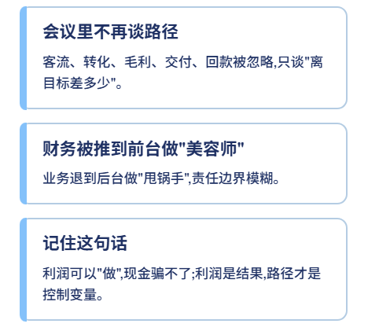
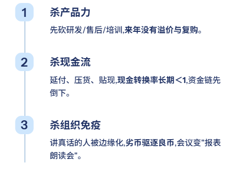
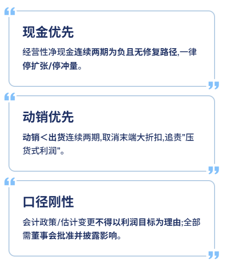
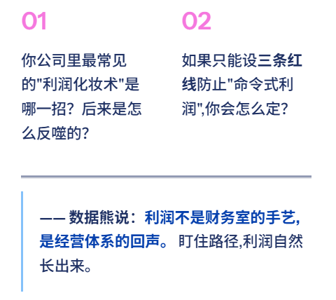

# 公司衰败的开始：向财务要利润

> 来源：微信公众号「数据熊」 · 作者 宋岳清 · 发布于 2025-10-18 19:12
> 原文链接：http://mp.weixin.qq.com/s?__biz=Mzg2MTg5OTgzNA==&mid=2247490438&idx=1&sn=ab1eeb870675695d39bce9e6852ed521&chksm=ce1146d3f966cfc5f4f72bccafb297ebaa65562405b2fd67ca2be0e74d8f32aed700e1a1b722
> 摘要：很多企业不是败给竞争对手，而是败给一句话——“这个月把利润做上去。”这句话像刀，先割向财务，再割向产品、客户与现金，最后把组织的真相割没了。

很多企业不是败给竞争对手，而是败给一句话——

“这个月把利润做上去。”

这句话像刀，先割向财务，再割向产品、客户与现金，最后把组织的真相割没了。

---

## 01｜“利润命令”一出，真相先被赶出会议室

利润是回声，不是按钮；一旦被当成指令，所有人都去演数字而不是做生意。

- 会议里

   不再谈路径

   （客流、转化、毛利、交付、回款），只谈“离目标差多少”。
- 财务被推到前台做“美容师”，业务退到后台做“甩锅手”。
- 记一句：

   利润可以“做”，现金骗不了；利润是结果，路径才是控制变量。

---

## 02｜四个“你就在现场”的小案例（代入感）

下面都是经常发生的真实场景化改写，数据虚构但逻辑扎实。

### 【小案例1｜A服装零售：末日折扣保利润】

场景

：周末收官，董事长一句“再冲30万净利”。销售总监上“晚8折+买二送一”。

- 当月结果

   ：销量**+31%

   ，收入只

   +9%

   ，毛利率从

   38%降到26%**。
- 次月反噬

   ：退货率

   4%→12%

   ；门店导购疲惫，

   高毛利SKU被低毛利走量SKU挤占

   。
- 现金端

   ：经营性净现金

   两月合计−500万

   ，账期被动拉长。

   批判

   ：这是

   以规模掩盖利润质量

   。你若是财务BP，此刻该

   叫停“尾端大折扣”

   ，并用

   口袋毛利（PGM%）

   做日报，拉出“低毛利走量SKU黑名单”。

---

### 【小案例2｜B工业设备：把研发资本化“洗白”】

场景

：月度净利差200万，研发负责人被要求“研究费用资本化”。

- 会计处理

   ：研发资本化率从**20%抬到55%**；报表净利“如期兑现”。
- 季度后果

   ：新品延期两次，售后返修率**+2.4pt

   ，毛利率

   −6pt**。
- 现金端

   ：研发现金仍流出，

   自由现金流为负

   ，只是一时“纸面好看”。

   批判

   ：

   资本化不是利润水龙头

   。你若是CFO，应该立

   红线

   ：资本化口径不以利润目标为依据，

   变更需董事会书面批准与影响披露

   。

---

### 【小案例3｜C快消渠道：压货换利润】

场景

：月末“渠道置换+搭赠”，仓库灯火通明，出货暴增。

- 当月结果

   ：收入**+22%

   ，经销商库存天数

   从28天飙到56天**；报表漂亮。
- 一季后果

   ：动销低迷，

   DSO 45→82天

   ，坏账准备加计；经销商要求

   逆价保

   与退货。

   批判

   ：

   出厂≠动销

   。你若是渠道负责人，必须把

   出货/动销/渠道库存

   放同一张表，

   动销＜出货连续两期

   ，一律

   取消冲量政策

   。

---

### 【小案例4｜D SaaS公司：票据体操当现金**】

CEO问“现金流咋样”，财务说“还不错”，因为贴现了大量票据。

- 当期“好看”

   ：经营性现金流转正。
- 真实代价

   ：

   贴现成本侵蚀利润

   ，且

   到期滚续

   制造风险。

   批判

   ：这是

   把明天的现金借到今天表演

   。你若是财务主管，

   必须双口径披露

   ：现金与“票据净额现金”，并单列贴现成本。

---

## 03｜为什么“向财务要利润”必然“要命”

这不是技术错误，而是

结构性自残

。

- 杀产品力

   ：先砍研发/售后/培训，

   来年没有溢价与复购

   。
- 杀现金流

   ：延付、压货、贴现，

   现金转换率长期＜1

   ，资金链先倒下。
- 杀组织免疫

   ：讲真话的人被边缘化，

   劣币驱逐良币

   ，会议变“报表朗读会”。

金句：利润上墙，现金跌停；报表漂亮，公司空心。

---

## 04｜会里就能识别的“化妆术”信号（实战观察）

你坐在会议室，只需留意这几句话。

- “

   成本先不计，回头再摊

   ” → 查

   费用时间分布

   是否陡峭。
- “

   先把利润做足，研发下月补

   ” → 看

   资本化率与摊销节奏

   。
- “

   经销商先压一波，动销会跟上

   ” → 强制对比

   出货/动销/渠道库存天数

   。
- “

   现金没问题，票据很多

   ” → 披露

   票据到期结构与贴现成本

   。
- “

   为了口径一致，做个估计变更

   ” → 所有

   估计变更出书面影响说明

   。

   对策

   ：

   固定口径复盘＋经营净利双口径并报

   （剔除非经常性）。

---

## 05｜三条止血红线（财务的一票否决）

铺垫

：批判要落到可执行的底线。

1. 现金优先

    ：经营性净现金

    连续两期为负且无修复路径

    ，一律

    停扩张/停冲量

    。
2. 动销优先

    ：

    动销＜出货

    连续两期，取消末端大折扣，追责“压货式利润”。
3. 口径刚性

    ：会计政策/估计变更

    不得以利润目标为理由

    ；全部需

    董事会批准并披露影响

    。

---

## 06｜把“要利润”改成“要路径”的一周改造法

铺垫

：别空谈，给你一张一周表。

- D1：换表头

   ——上“路径看板”：

   线索→下单→交付→回款→复购

   ，每段2个KPI（如CPL、PGM%、一次交付合格率、DSO、留存率）。
- D2：拆毛利

   ——按品类/渠道做

   口袋毛利（PGM%）日报

   ，列出

   低PGM黑名单SKU

   。
- D3：盯现金

   ——客户

   回款Top20逐单推进表

   ，对

   逾期>15天

   红黄线预警。
- D4：清库存

   ——定义

   慢动/滞销/报废

   口径，周五前给出

   处置价与责任人

   。
- D5：改审批

   ——把“费用审批”改成“

   路径节点审批

   ”（先说动作与目标，再批预算）。
- D7：两页会

   ——周例会只看两页：①路径KPI差距 ②

   三条下周动作

   （责任人+时间）。

   口号

   ：

   问利润，不如问动作；问报表，不如问路径。

---

## 07｜给老板的一封公开信（尖一点）

铺垫

：该戳破的泡沫，就该当面戳破。

> 向财务要利润，是向真相开枪。
>
> 真正的领导力，是把枪收回，带队把
>
> 路修通
>
> ：能获客、能涨价、能准时交付、能按时回款、能复购。利润会自己来。

---

工作没思路，困惑没人问？赶快加入

数据熊的粉丝群

，与2500+财务精英共同成长。

PowerBI看板

定制添加数据熊微信：

