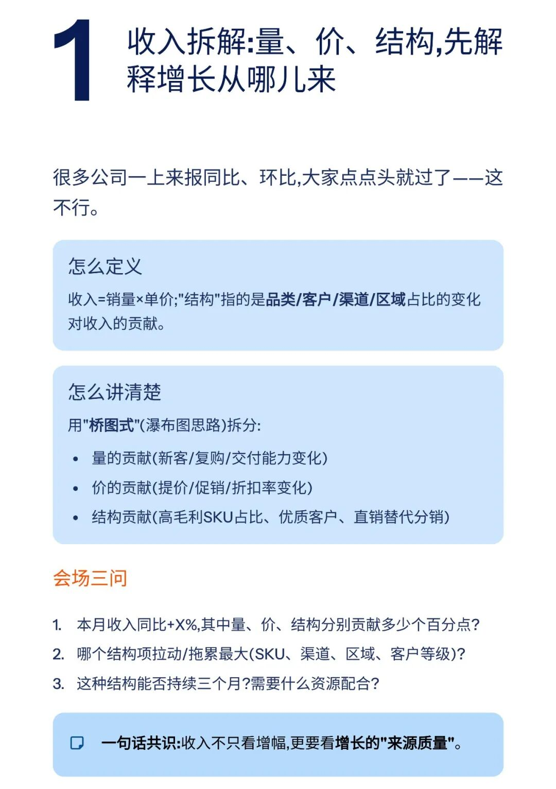
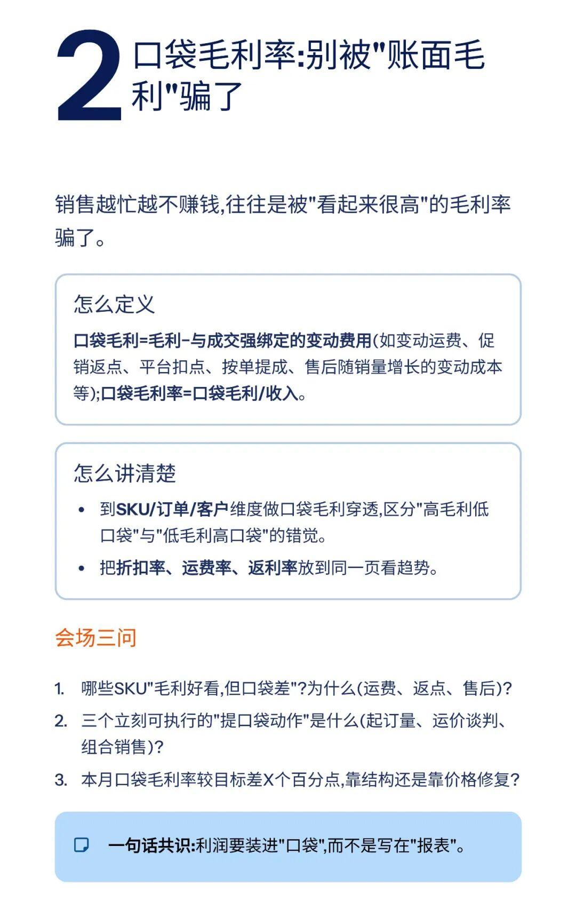
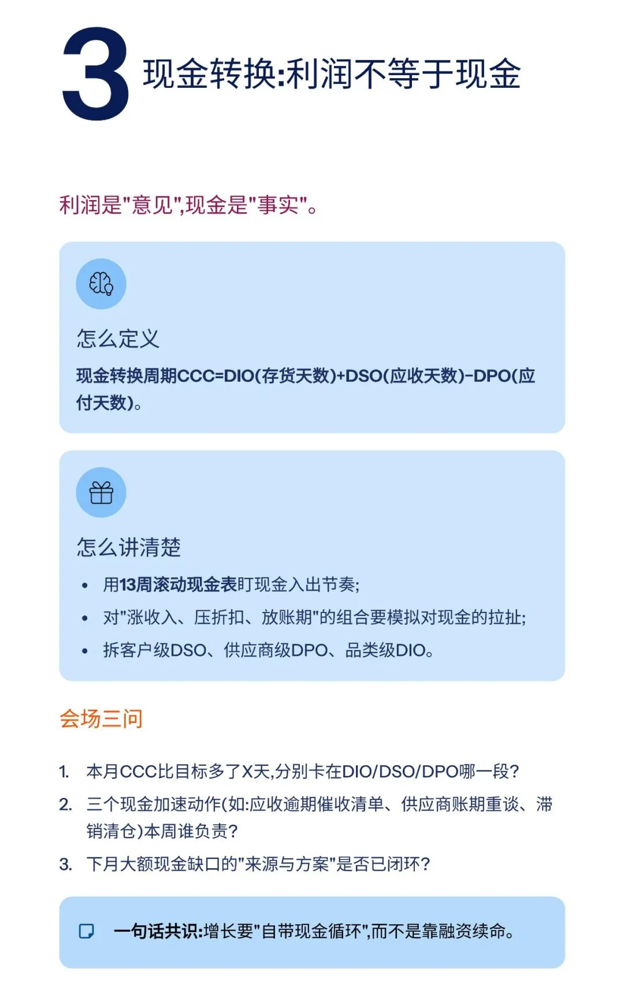
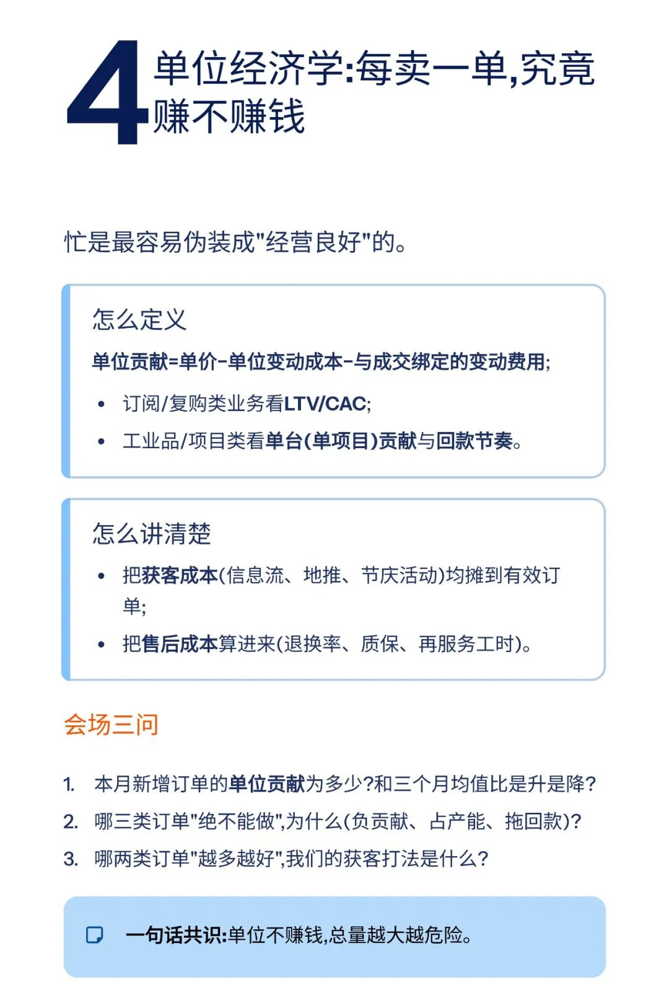
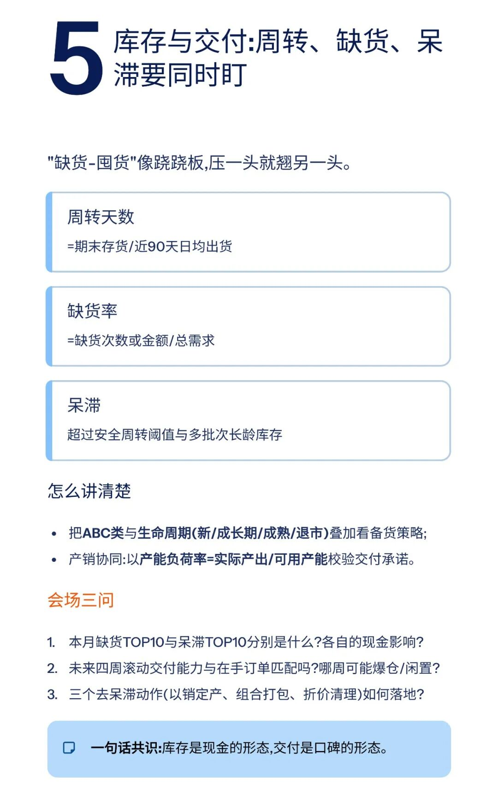
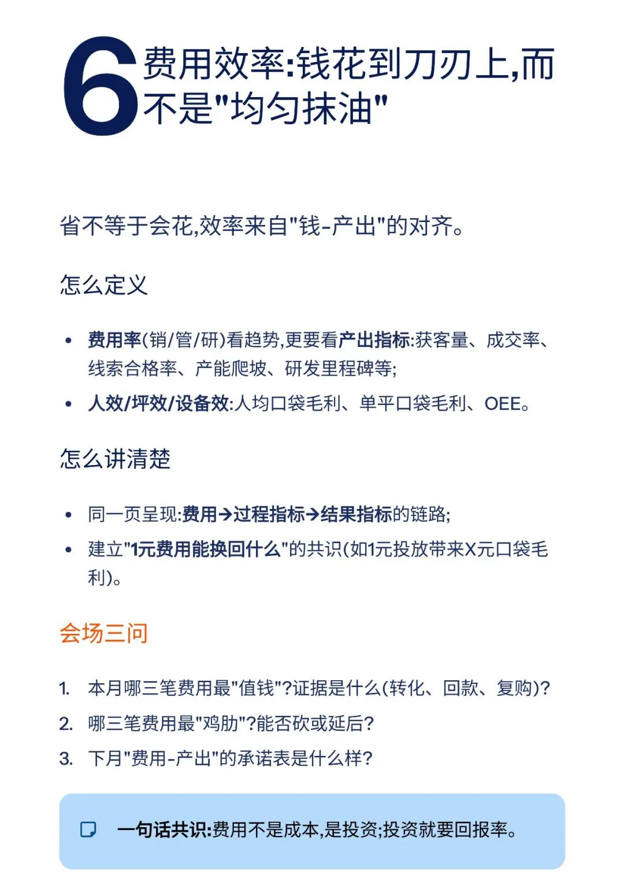
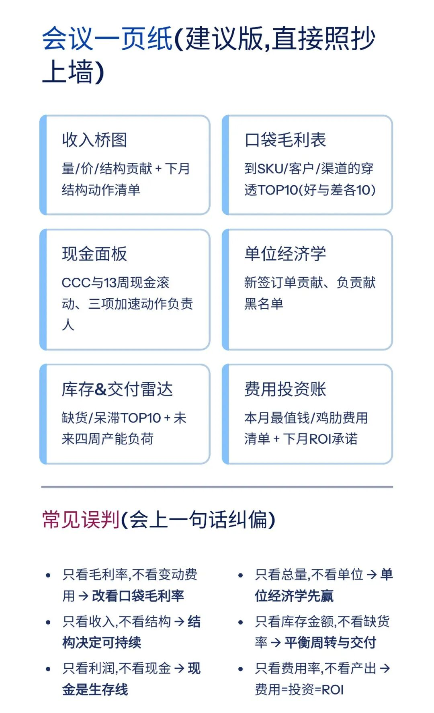
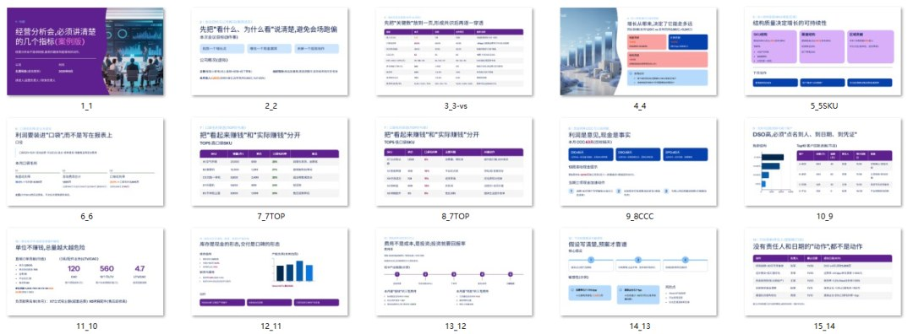

# 经营分析会，这几个指标必须要讲清楚（附PPT模板）

> 来源：微信公众号「数据熊」 · 作者 宋岳清 · 发布于 2025-10-30 07:28  
> 原文链接：http://mp.weixin.qq.com/s?__biz=Mzg2MTg5OTgzNA==&mid=2247490859&idx=1&sn=6f3fc15dcdd05b6328da7689333e243f&chksm=ce11407ef966c96861af1c2095ab17dea9abf527f2cf05c3bff896bc22a4f5d892507e39bb5e
> 摘要：很多公司的经营分析会，一半在“念PPT”，另一半在“讲感受”。真正能把数字变成动作的，不是指标越多越好，而是那一撮能驱动决策的关键指标。

模板即思路，点击
阅读原文
获取完整版《

经营分析ppt模

板

》。

加入

数据熊的财务精进营

，与2500+财务精英共同成长。后台点击
「经典文章」阅读数据熊10W+爆文，
模板定制添加数据熊微信：

Daniel-songyq

点赞

和

转发

就是最大的支持，关注数据熊，工作更轻松。

