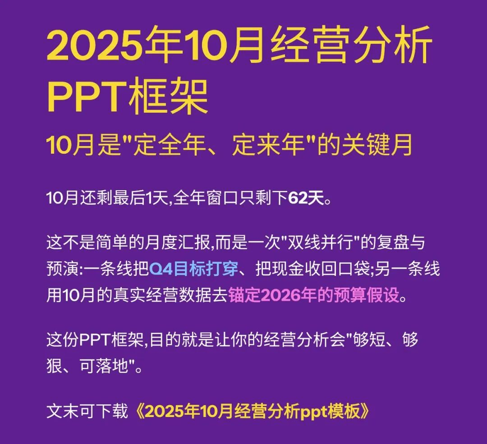
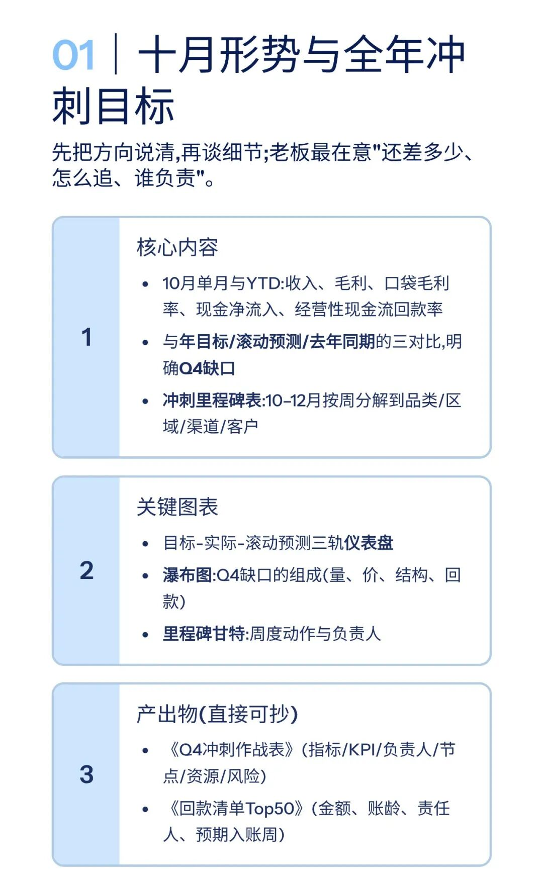
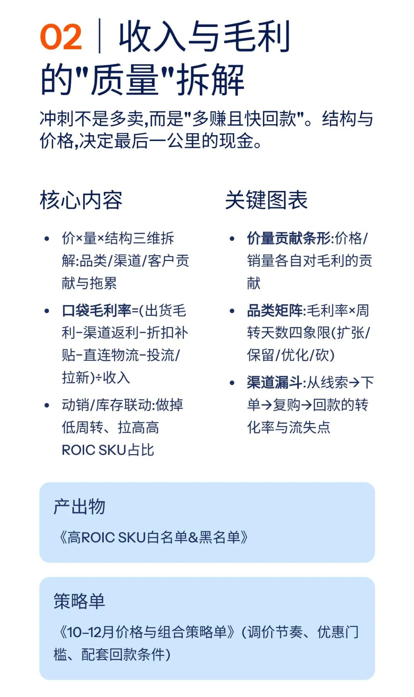
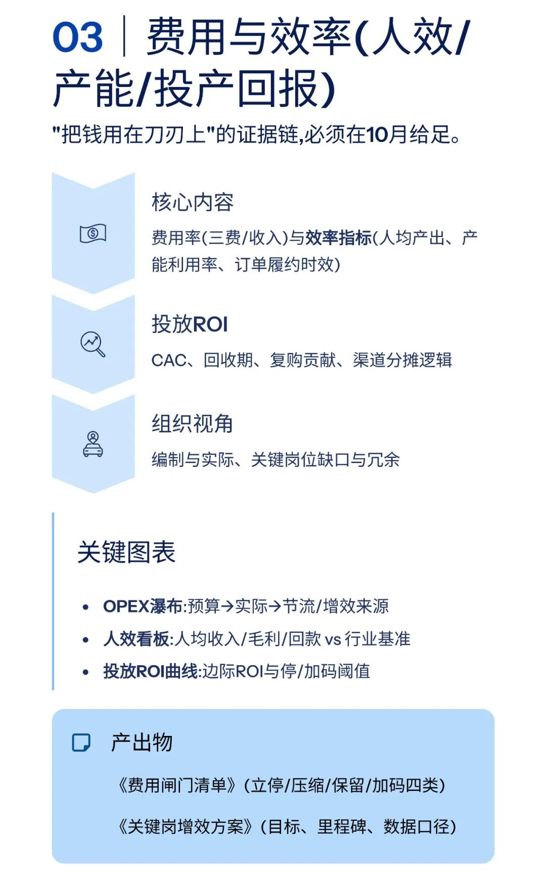
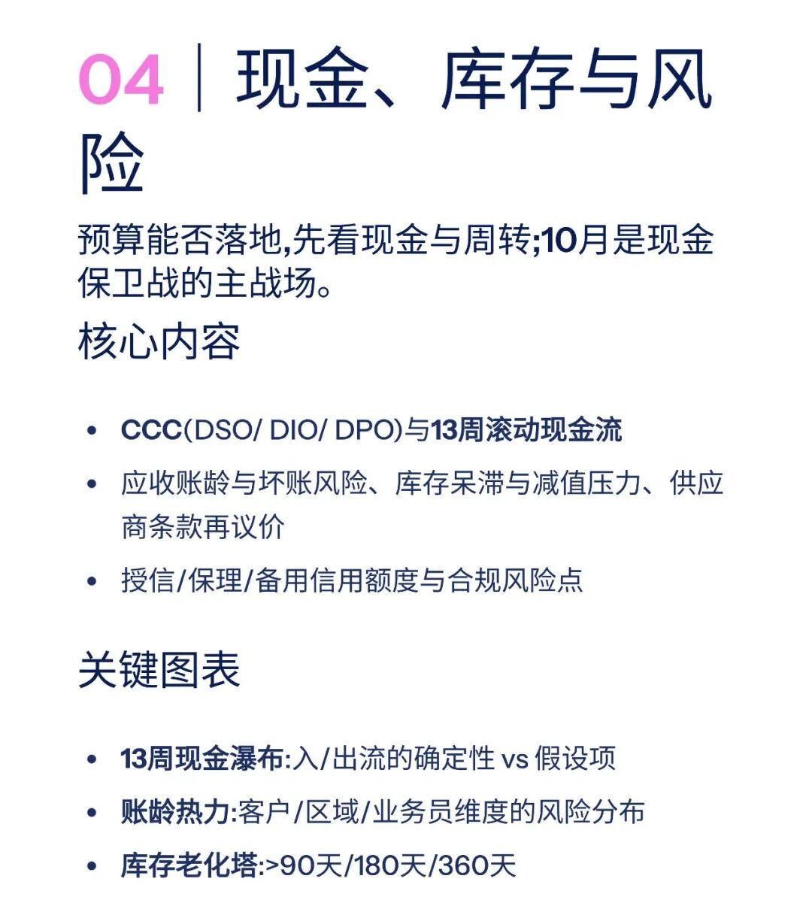
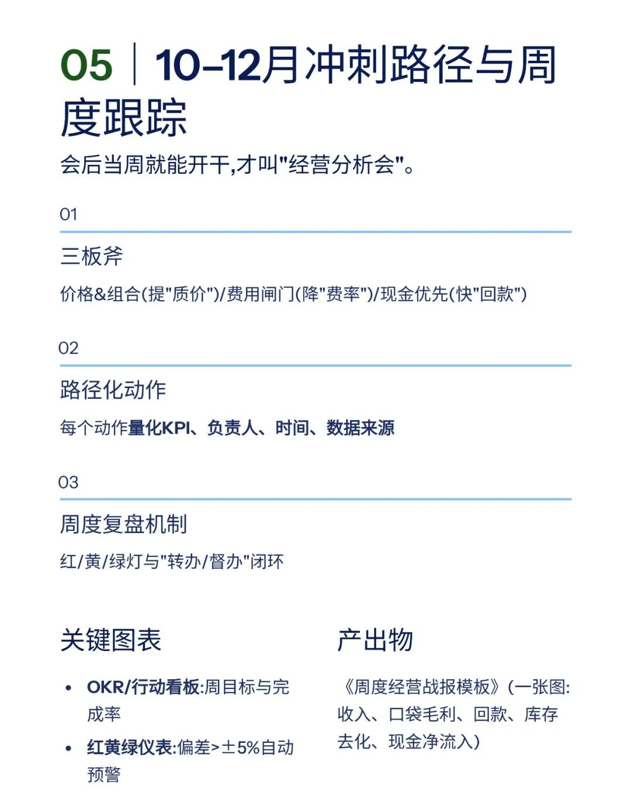
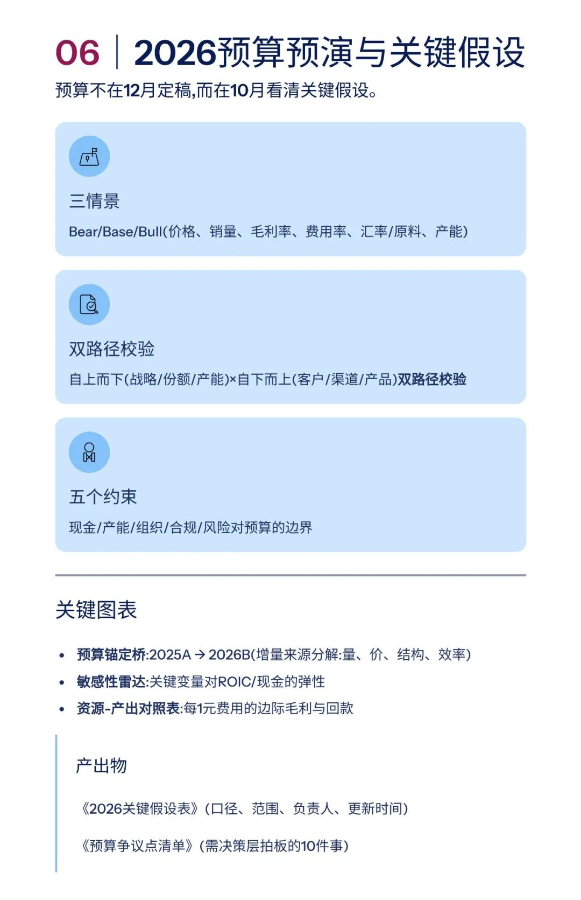
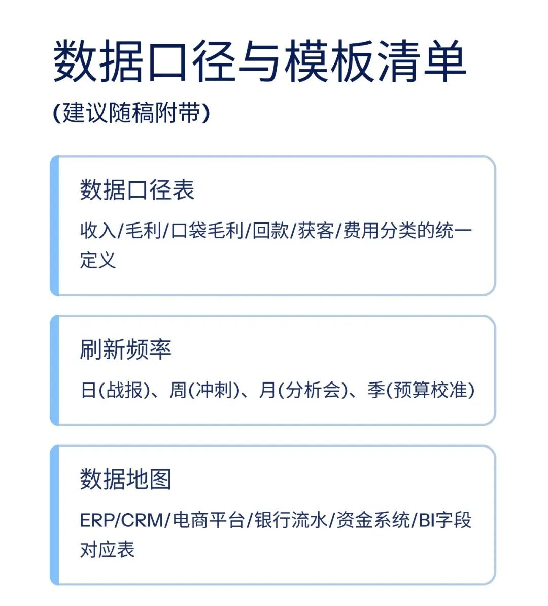
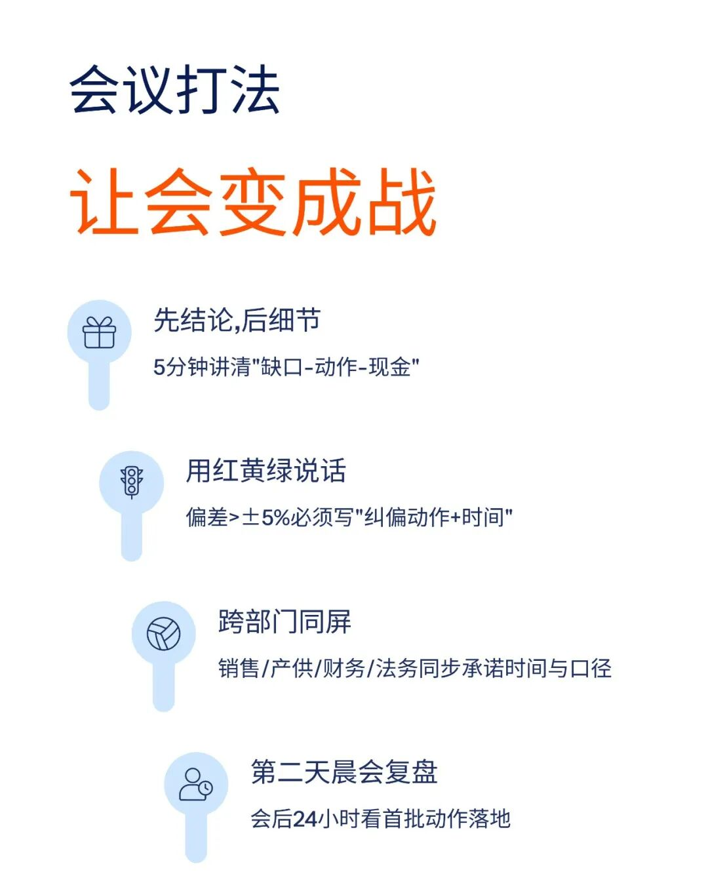
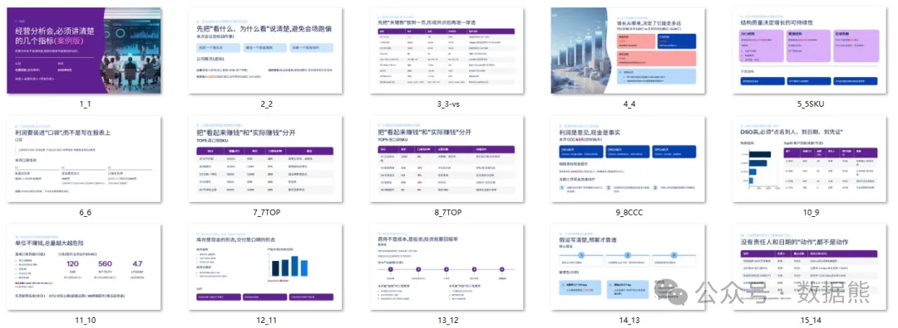

# 2025年10月经营分析PPT框架（可下载PPT模板）

> 来源：微信公众号「数据熊」 · 作者 宋岳清 · 发布于 2025-10-31 07:30
> 原文链接：http://mp.weixin.qq.com/s?__biz=Mzg2MTg5OTgzNA==&mid=2247490912&idx=1&sn=cf1137acd60ca472225fd4be640902b4&chksm=ce114035f966c9234aacf69bc249082348dea46b867b56ad5d2bfebe930ed0407af12d752e51
> 摘要：0月还剩最后1天,全年窗口只剩下62天。这不是简单的月度汇报,而是一次\x26quot;双线并行\x26quot;的复盘与预演:一条线把Q4目标打穿、把现金收回口袋;另一条线用10月的真实经营数据去锚定2026年的预算假设。

模板即思路，点击
阅读原文
获取完整版《

经营分析ppt模

板

》。

加入

数据熊的财务精进营

，与2500+财务精英共同成长。后台点击
「经典文章」阅读数据熊10W+爆文，
模板定制添加数据熊微信：

Daniel-songyq

点赞

和

转发

就是最大的支持，关注数据熊，工作更轻松。

