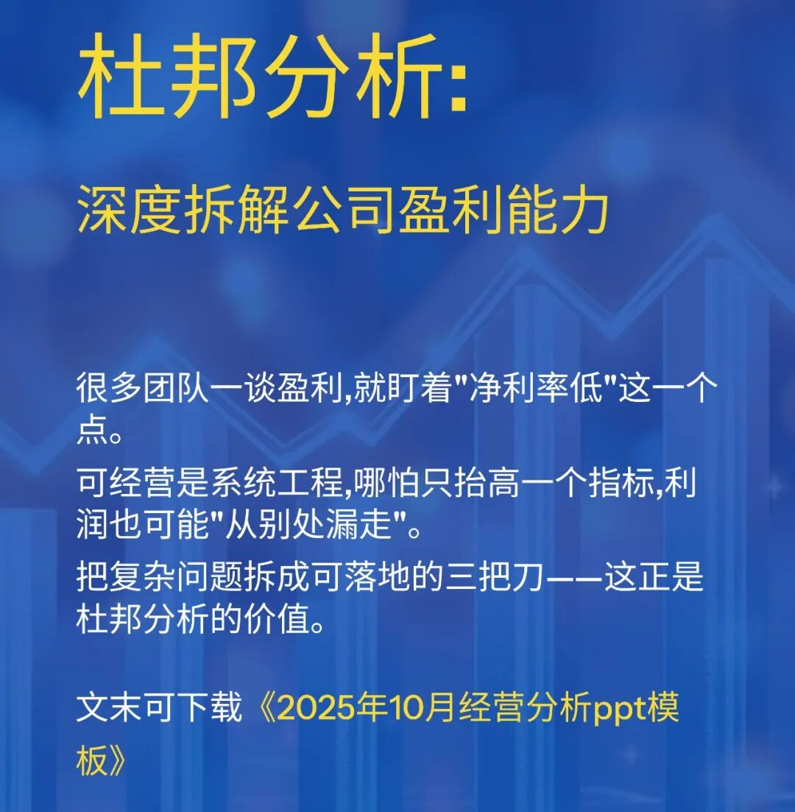
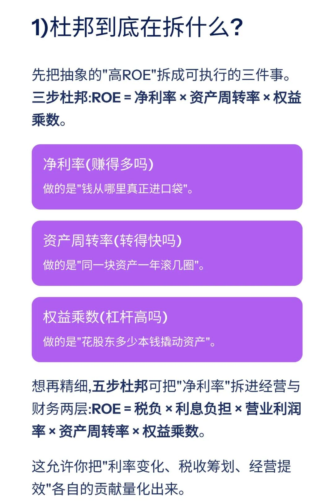
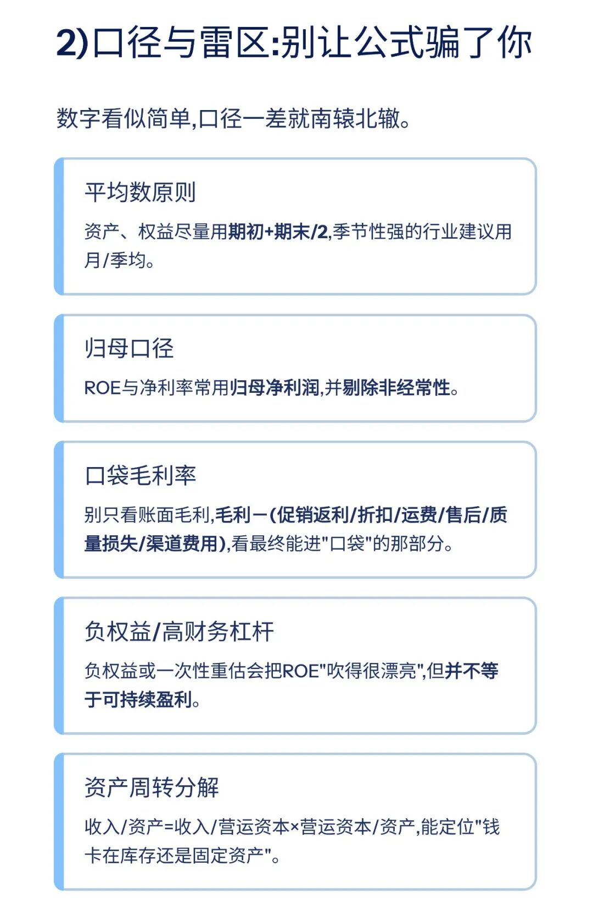
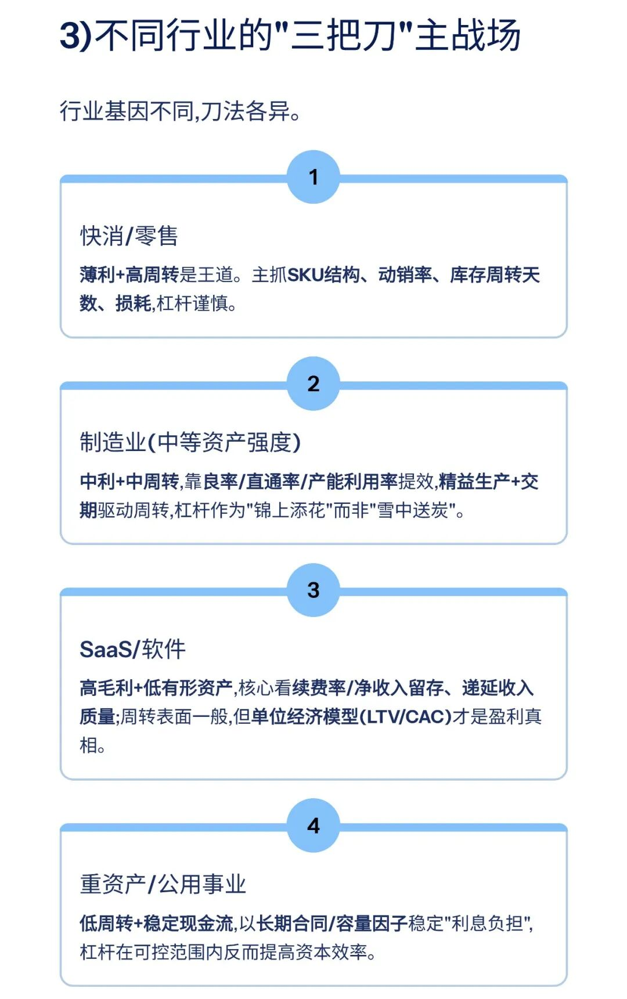
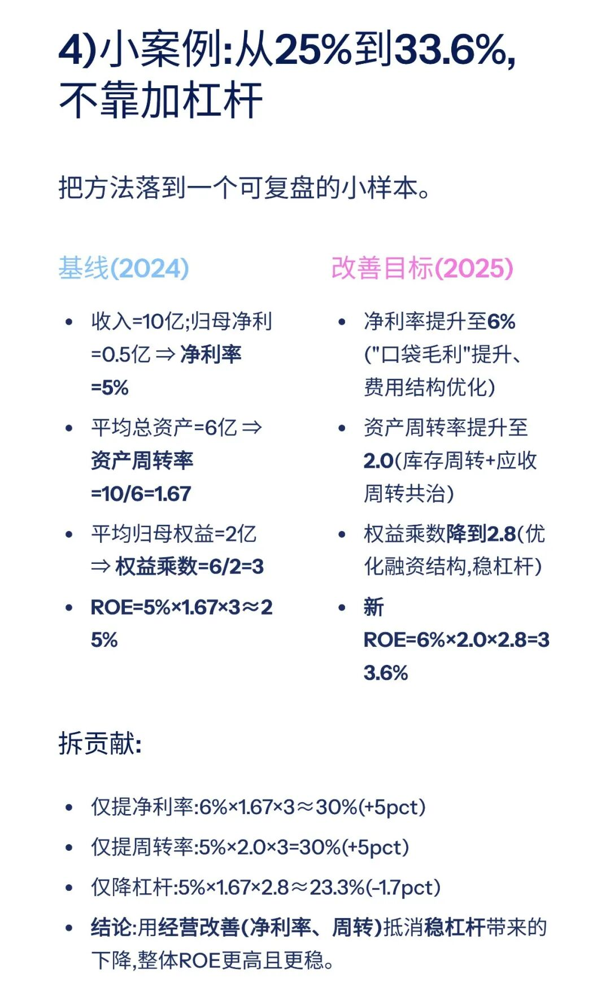
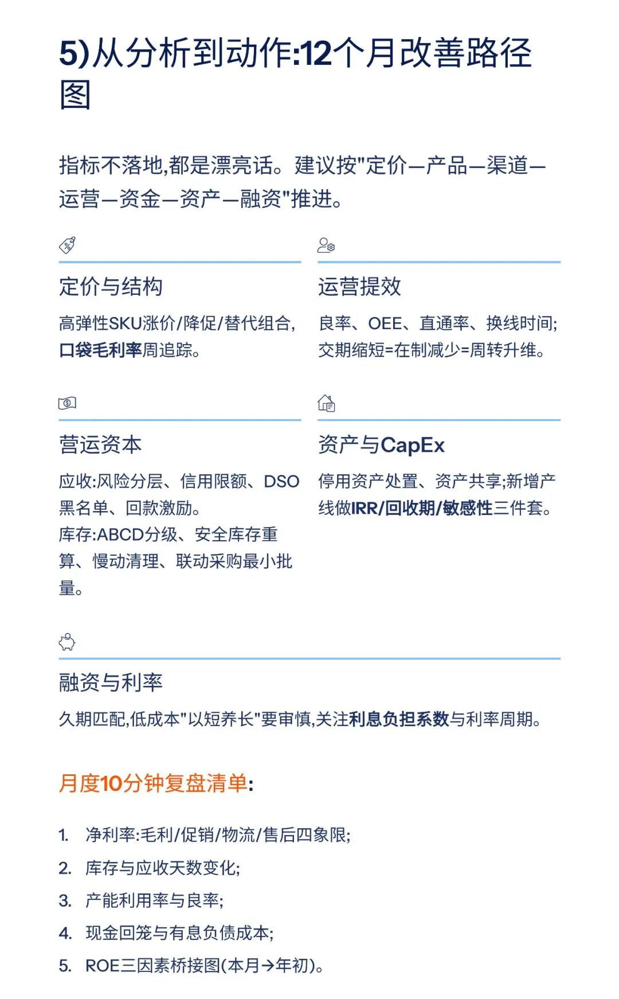
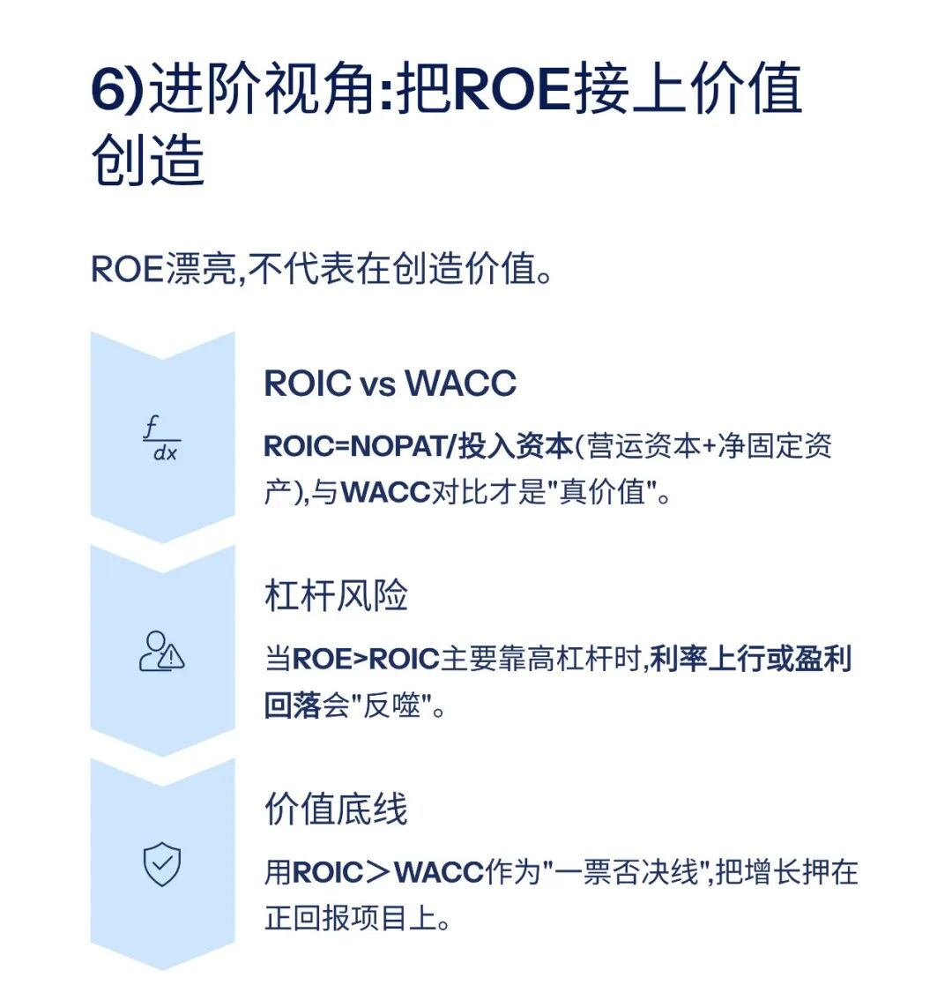
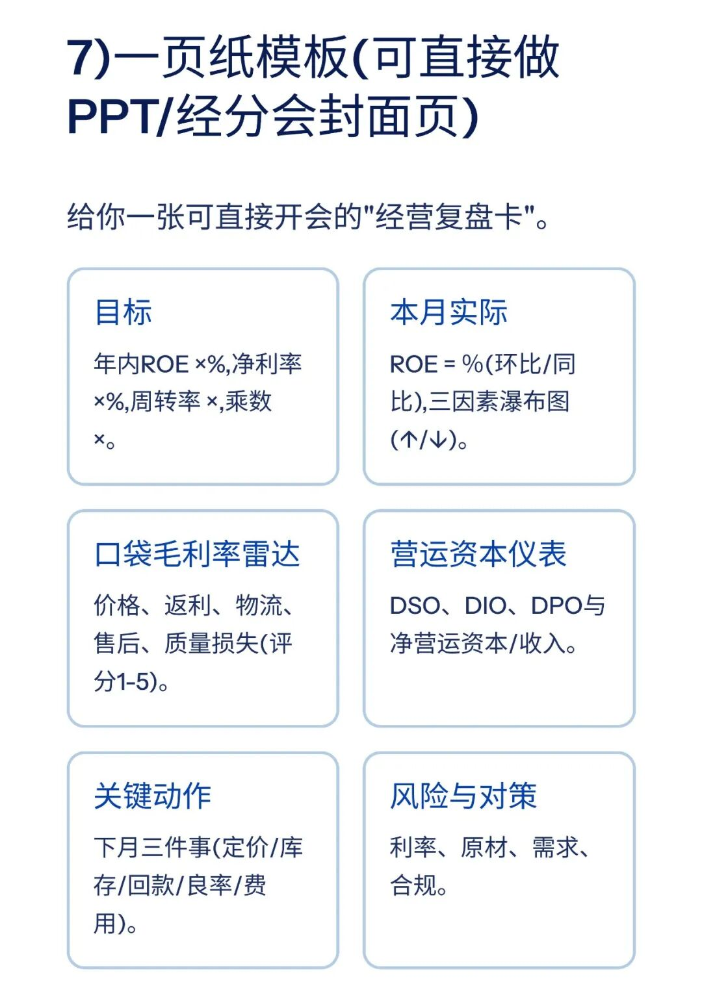
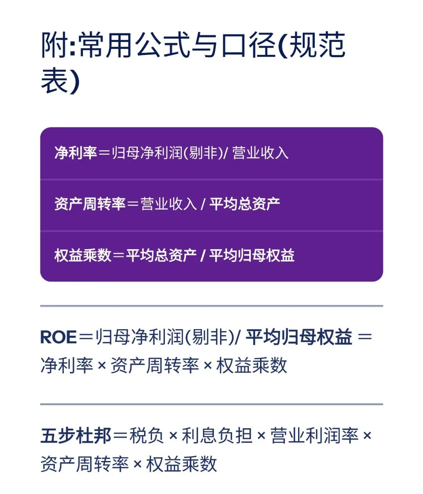
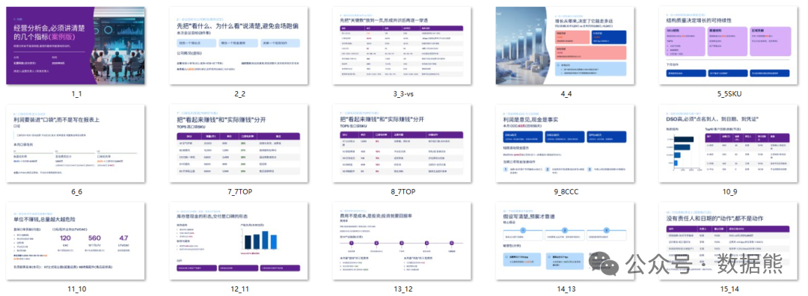

# 杜邦分析法：深度拆解公司盈利能力

> 来源：微信公众号「数据熊」 · 作者 宋岳清 · 发布于 2025-11-02 07:30  
> 原文链接：http://mp.weixin.qq.com/s?__biz=Mzg2MTg5OTgzNA==&mid=2247491029&idx=1&sn=a0fd6f44144e11a14a3ccf3ed9379a6e&chksm=ce114080f966c996a5a5b072987c7e720273b48cc092546c29de3aa6d13e58e6731c82995b14
> 摘要：很多团队一谈盈利,就盯着\x26quot;净利率低\x26quot;这一个点。可经营是系统工程,哪怕只抬高一个指标,利润也可能\x26quot;从别处漏走\x26quot;。把复杂问题拆成可落地的三把刀——这正是杜邦分析的价值。

模板即思路，点击
阅读原文
获取完整版《

经营分析ppt模

板

》。

加入

数据熊的财务精进营

，与2500+财务精英共同成长。后台点击
「经典文章」阅读数据熊10W+爆文，
模板定制添加数据熊微信：

Daniel-songyq

点赞

和

转发

就是最大的支持，关注数据熊，工作更轻松。

