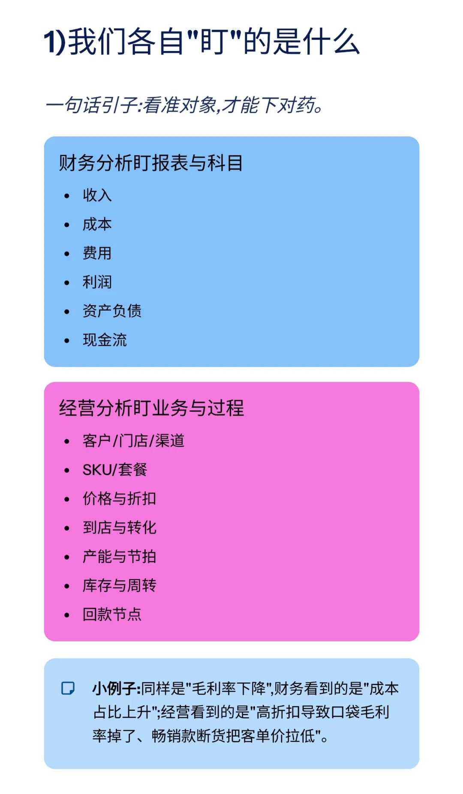
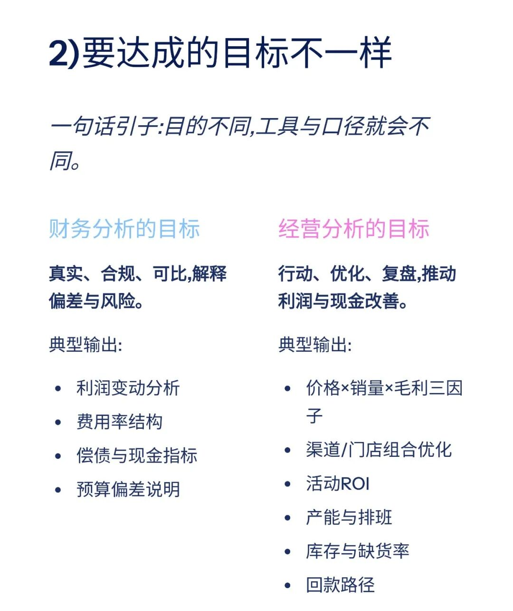
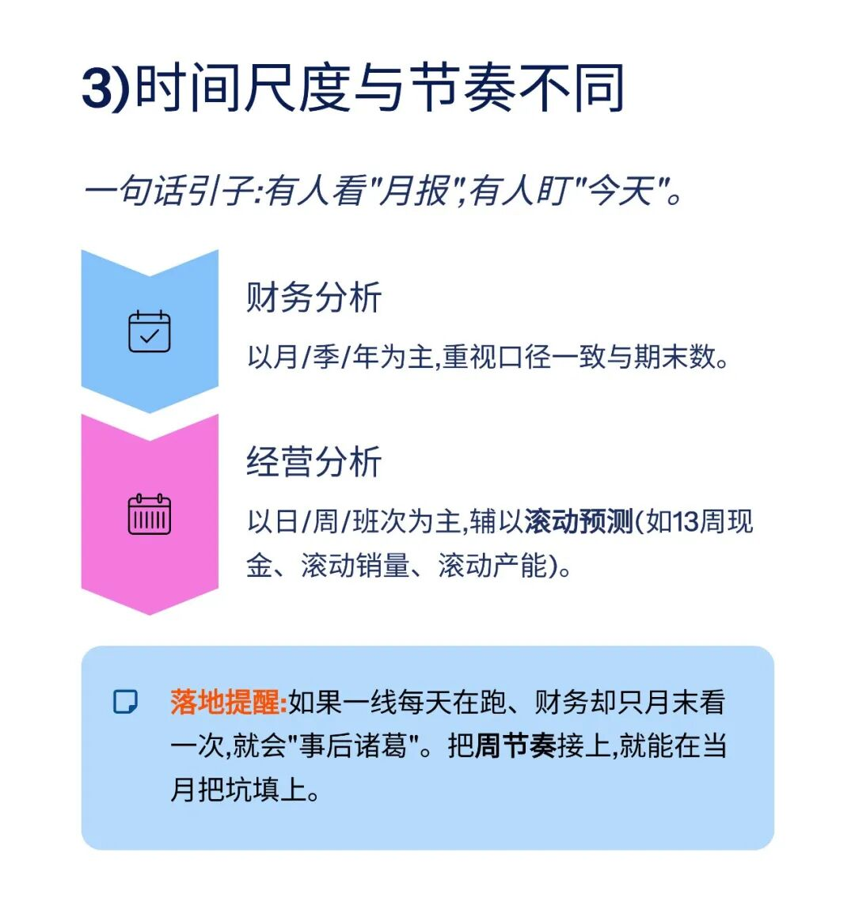
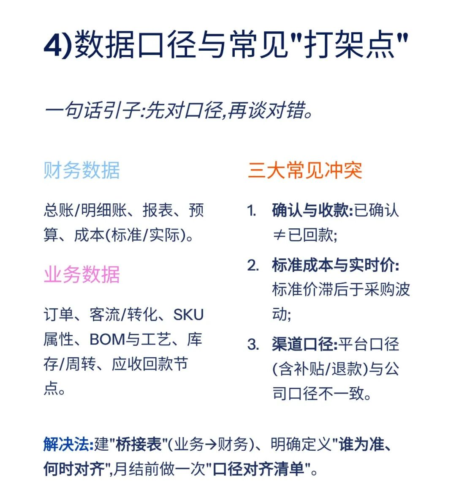
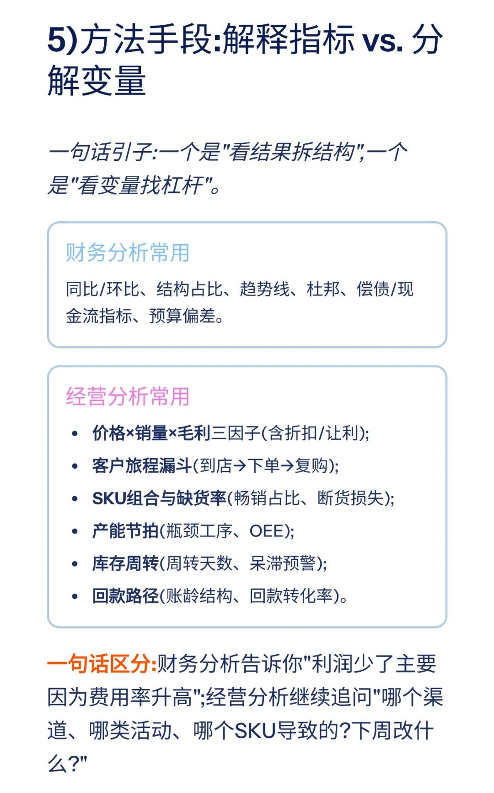
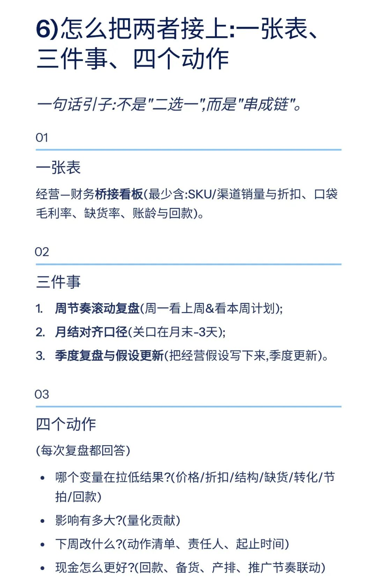
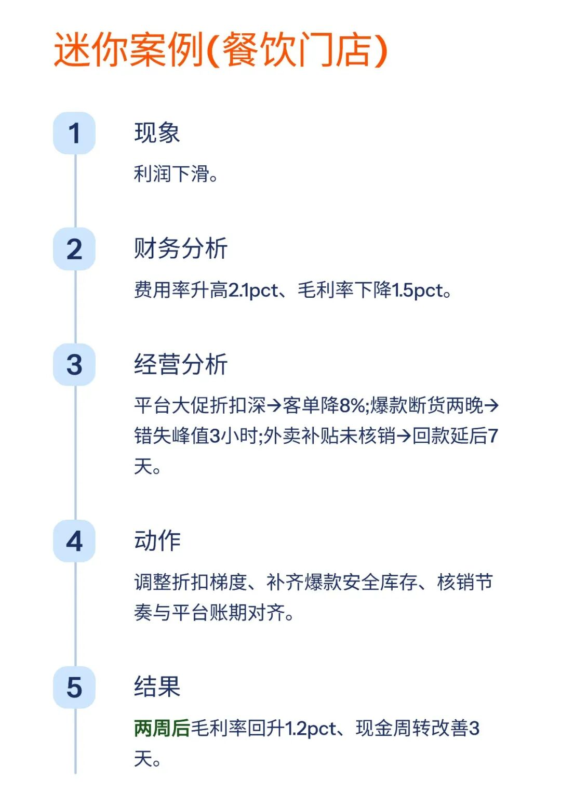
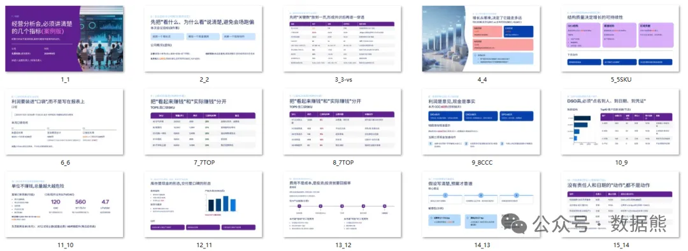

# 经营分析和财务分析的区别

> 来源：微信公众号「数据熊」 · 作者 宋岳清 · 发布于 2025-11-06 07:30  
> 原文链接：http://mp.weixin.qq.com/s?__biz=Mzg2MTg5OTgzNA==&mid=2247491196&idx=1&sn=bb5a90e6109b779e7fad7582c9e5eb8d&chksm=ce114329f966ca3fb05629665b6dc9bc16a1c76193fe995af16653ffce2101492b465138b7d7
> 摘要：\x26quot;经常有人问我:经营分析和财务分析到底有什么区别?是不是做了财务分析,就等于把经营分析也做了?\x26quot;

2025年10月经营分析PPT框架（可下载PPT模板）

2025年10月财务分析PPT框架（附可下载模板）

模板即思路，点击
阅读原文
获取完整版《

经营分析ppt模

板

》。

加入

数据熊的财务精进营

，与2500+财务精英共同成长。后台点击
「经典文章」阅读数据熊10W+爆文，
模板定制添加数据熊微信：

Daniel-songyq

点赞

和

转发

就是最大的支持，关注数据熊，工作更轻松。

