# 经营分析，三个核心维度及关键指标

> 来源：微信公众号「数据熊」 · 作者 宋岳清 · 发布于 2025-11-12 07:30
> 原文链接：http://mp.weixin.qq.com/s?__biz=Mzg2MTg5OTgzNA==&mid=2247491629&idx=1&sn=5302492c981214400d21d777461a13e8&chksm=ce12bd78f965346eaf02938ba212add8956247aedea00adb37a6ac9f0a52a80817c51f6206bd
> 摘要：报表越做越厚，会议却越开越长；营收在涨，利润和现金却跟不上；同一个指标三种口径，谁也说服不了谁。

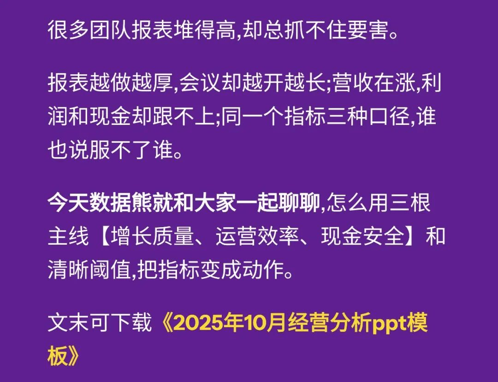

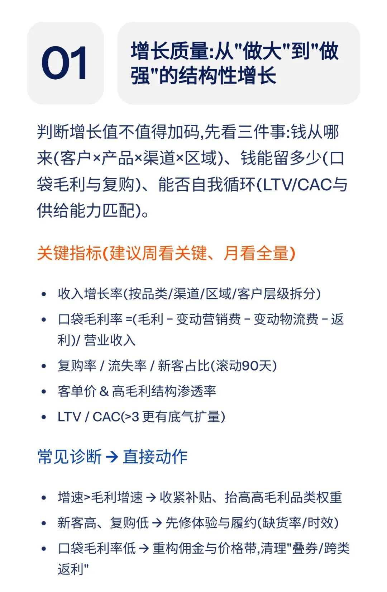

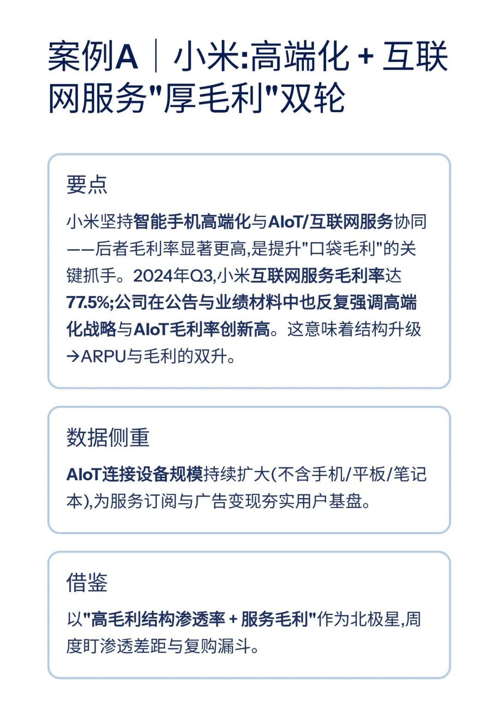

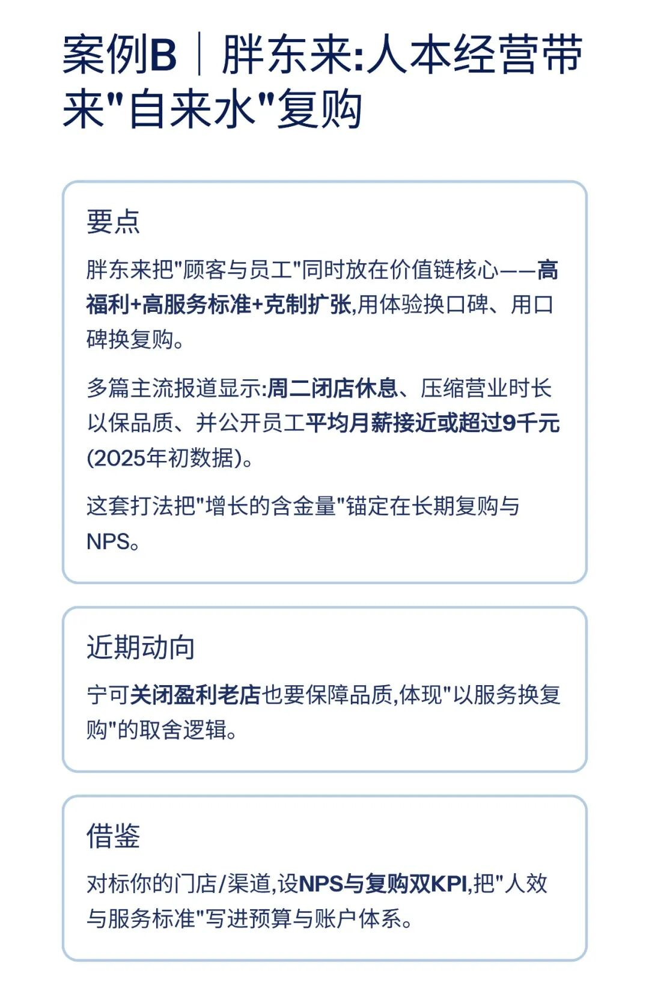

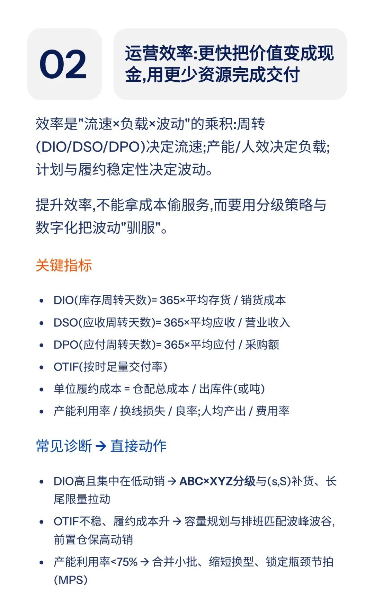

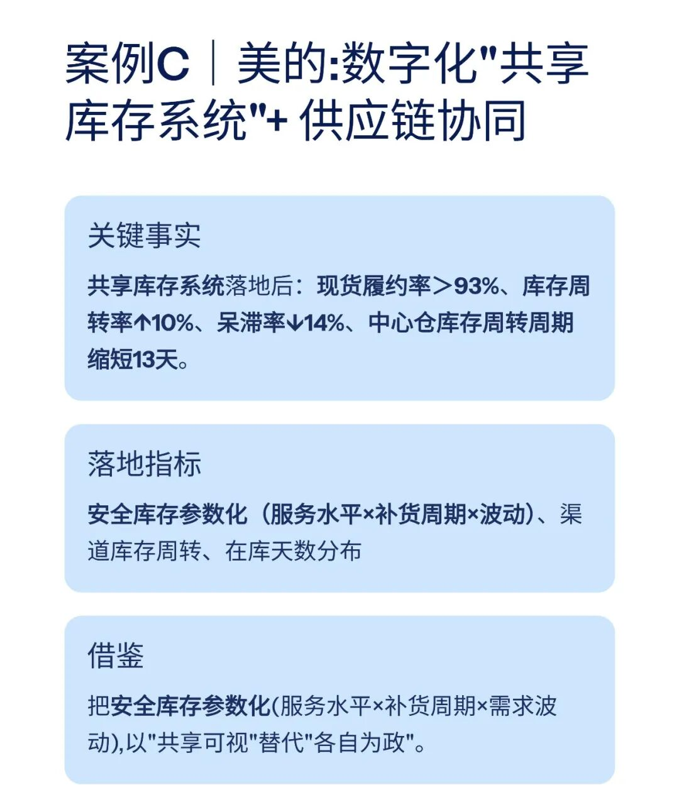

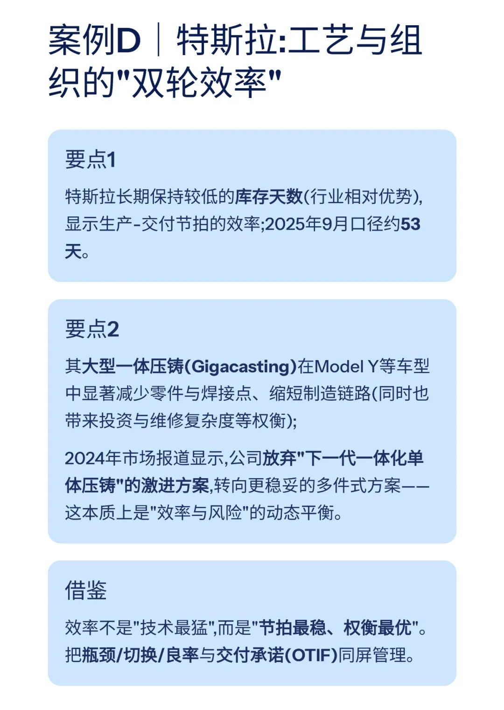

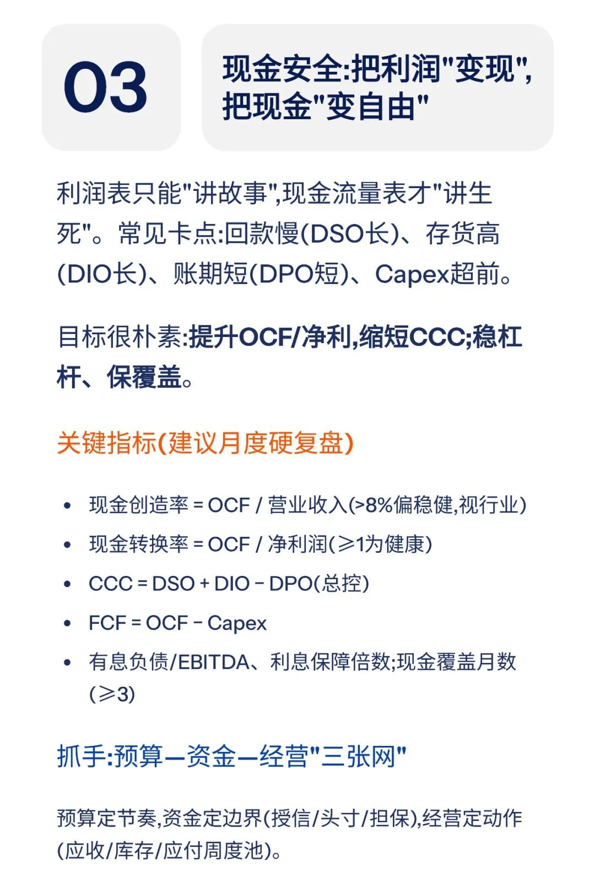

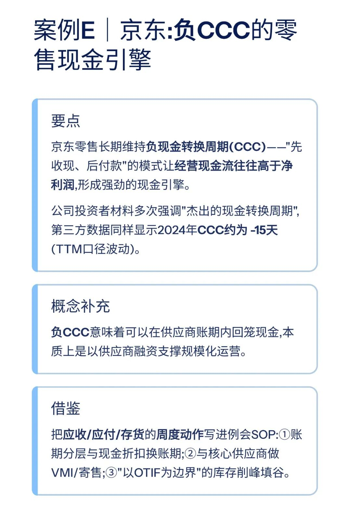

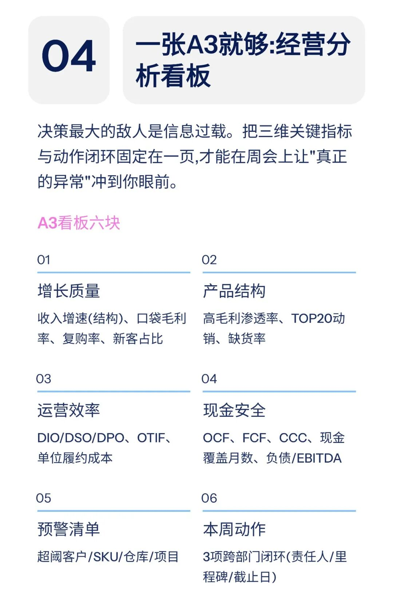

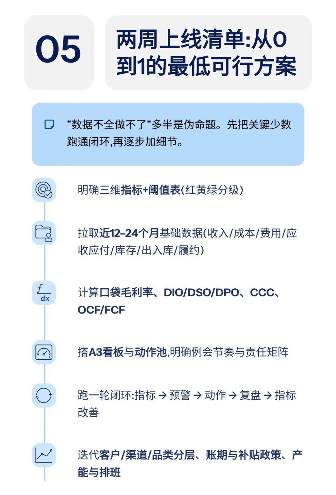

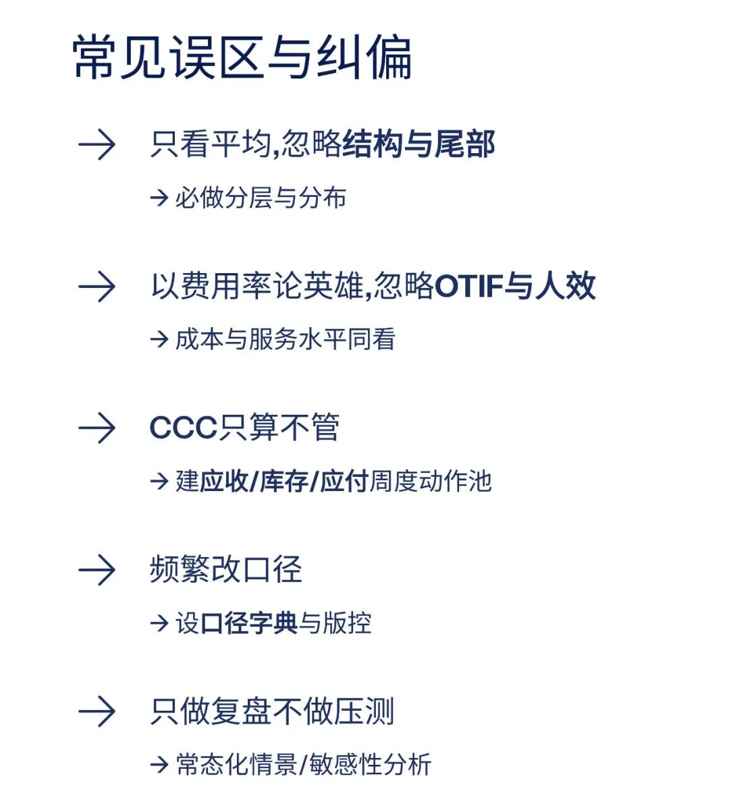

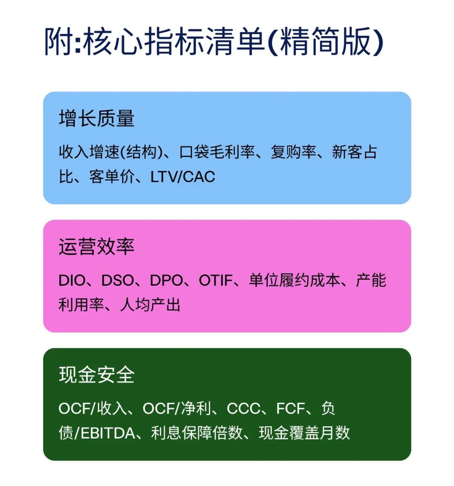

模板即思路，点击
阅读原文
获取完整版《

经营分析ppt模

板

》。

加入

数据熊的财务精进营

，与2700+财务精英共同成长。后台点击
「经典文章」阅读数据熊10W+爆文，
模板定制添加数据熊微信：

Daniel-songyq

点赞

和

转发

就是最大的支持，关注数据熊，工作更轻松。

