# 详解小米集团经营指标体系（附思维导图及Excel版）

> 来源：微信公众号「数据熊」 · 作者 宋岳清 · 发布于 2025-11-15 07:30  
> 原文链接：http://mp.weixin.qq.com/s?__biz=Mzg2MTg5OTgzNA==&mid=2247491819&idx=1&sn=7deba5a44fab4bcd3d0f995f98c6b39e&chksm=ce12bdbef96534a80443b2e0c6a8e12a88172142d1d3243de6a8727a814f4bdde44f8b13514c
> 摘要：模板即思路，点击阅读原文获取《小米集团经营指标体系.xlsx》工作没思路，困惑没人问？

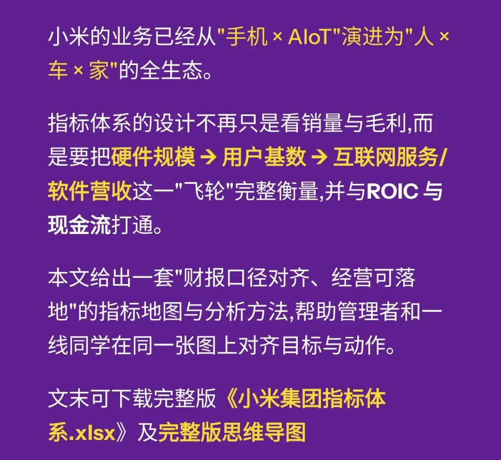

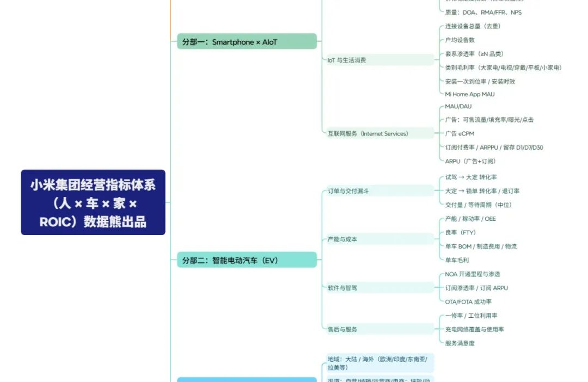

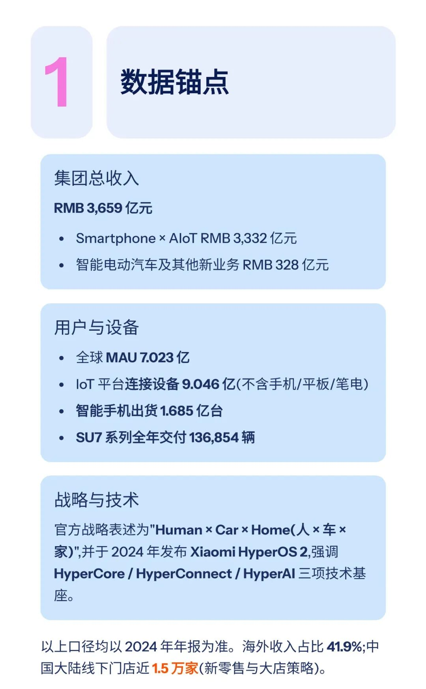

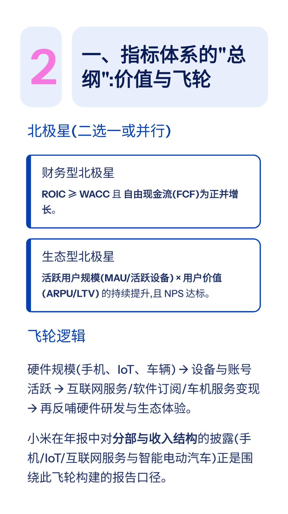

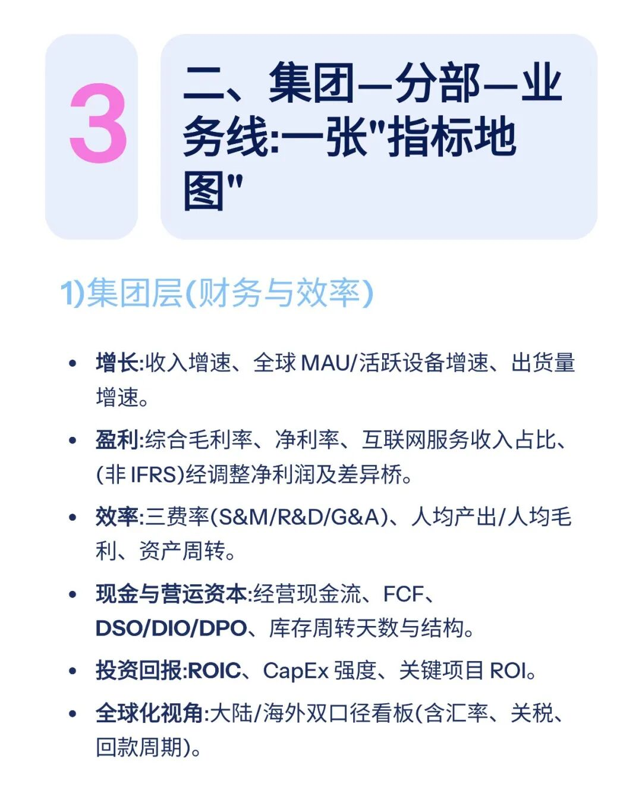

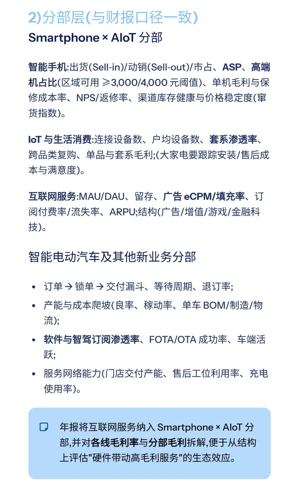

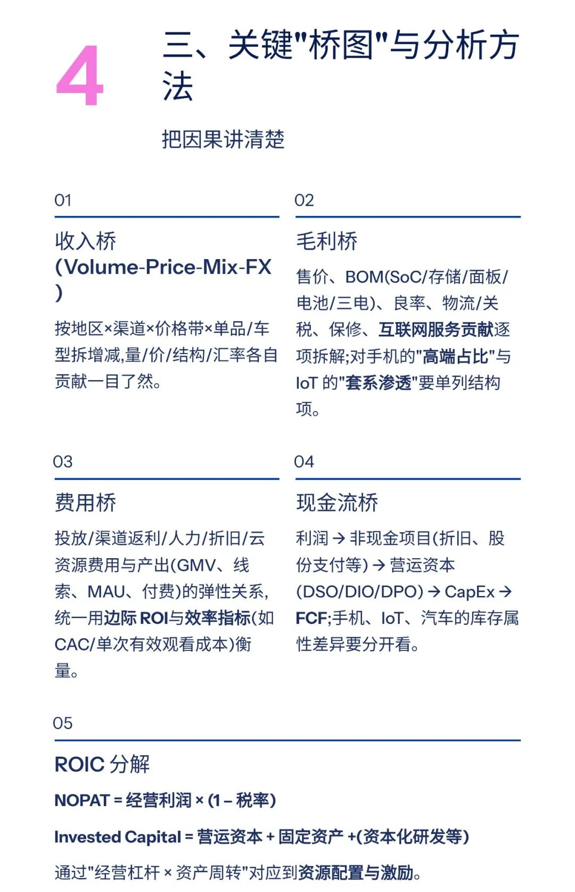

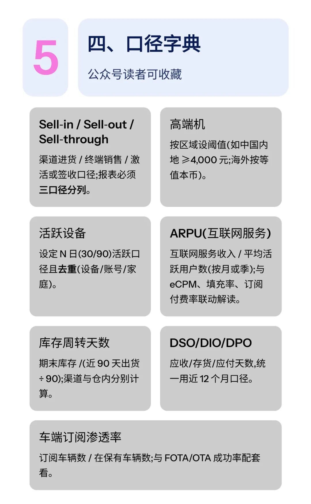

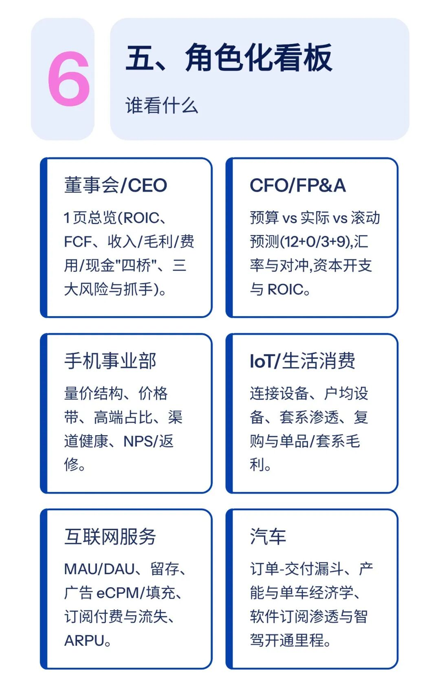

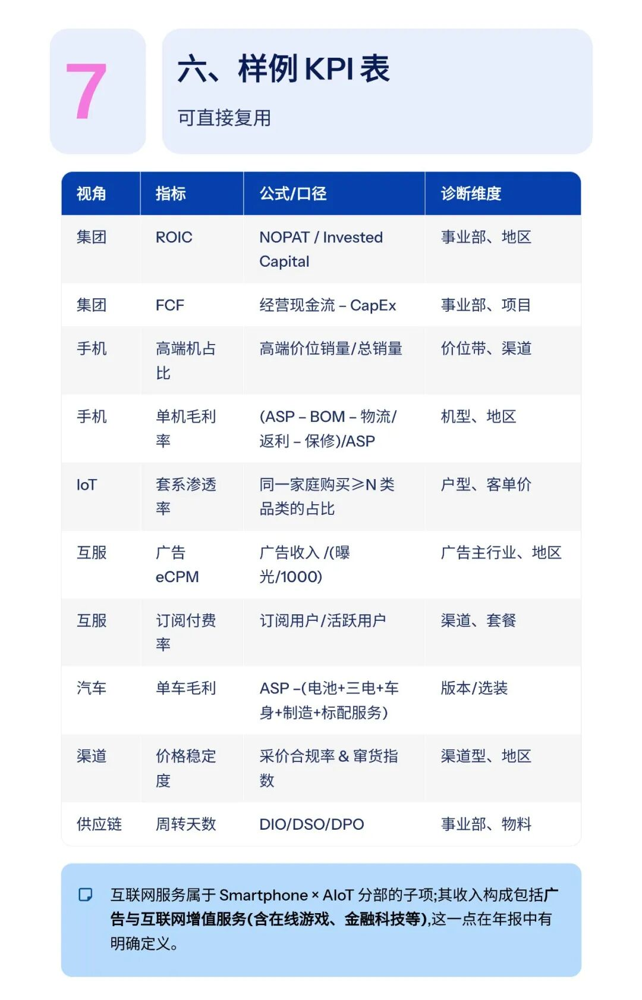

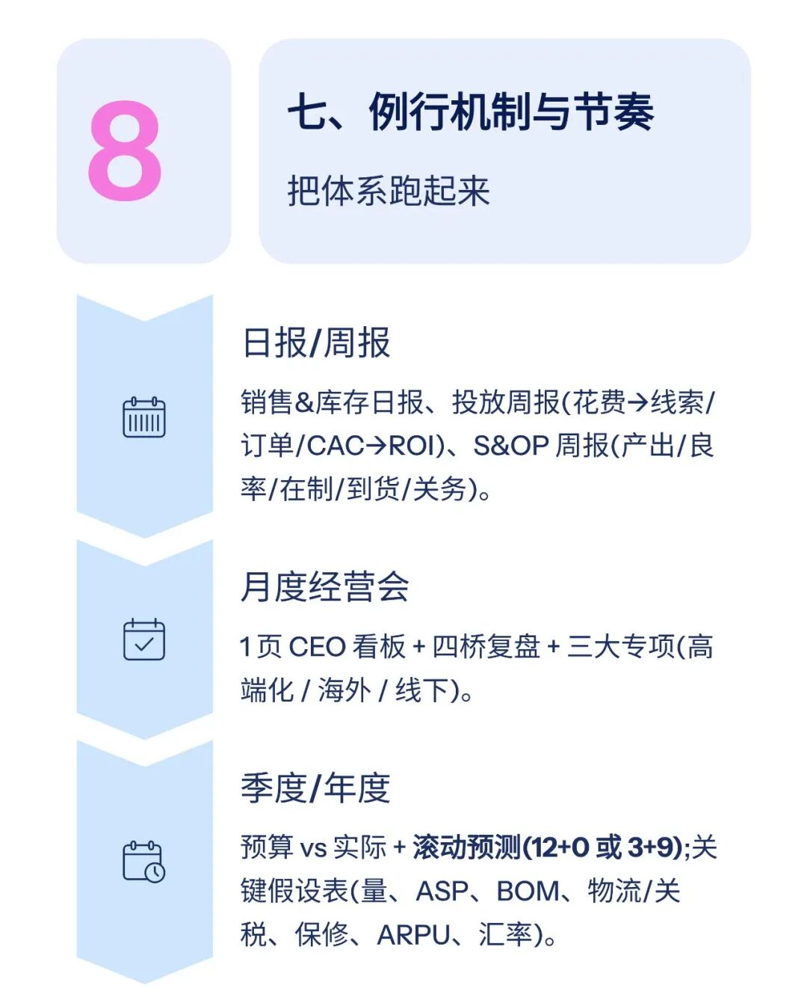

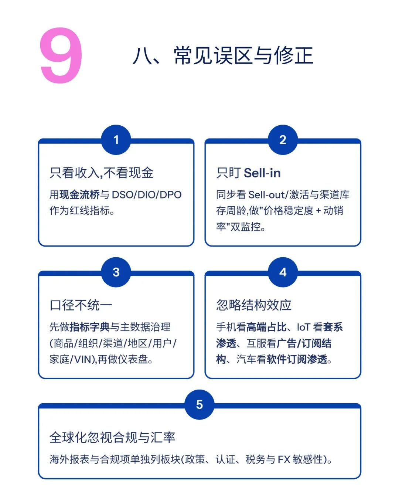

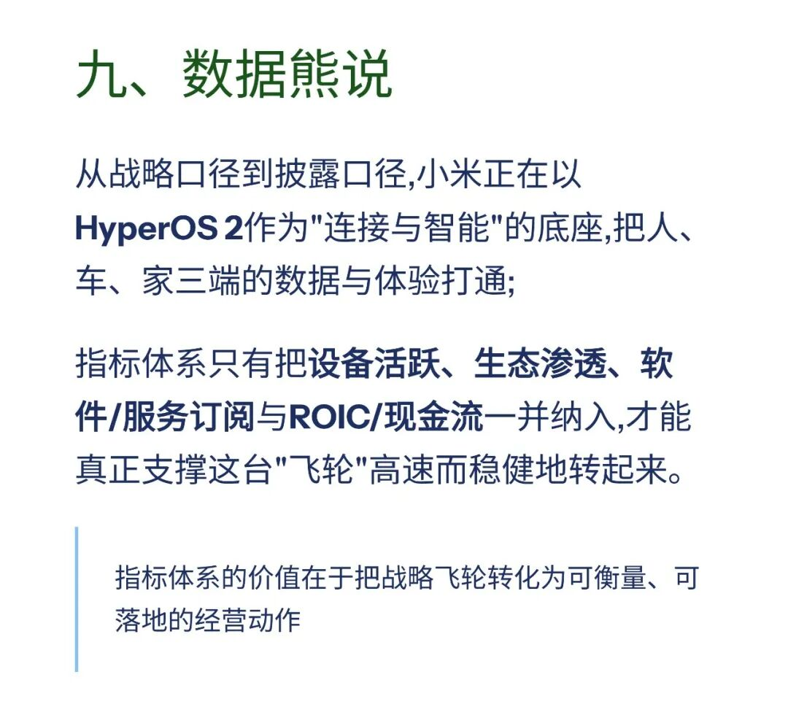

模板即思路，点击

阅读原文

获取

《小米集团经营指标体系

.xlsx》

工作没思路，困惑没人问？赶快加入

数据熊的粉丝群

，与2700+财务精英共同成长

。

PowerBI看板

定制添加数据熊微信：Daniel-songyq

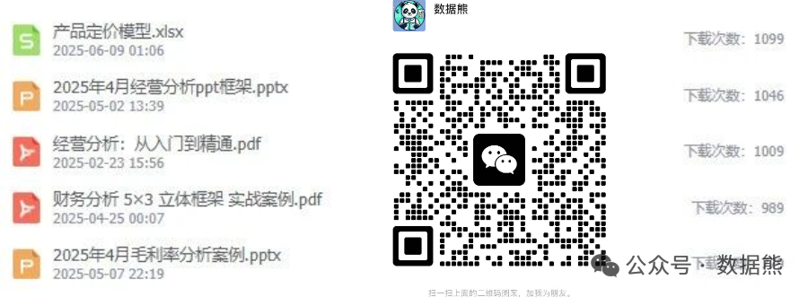
