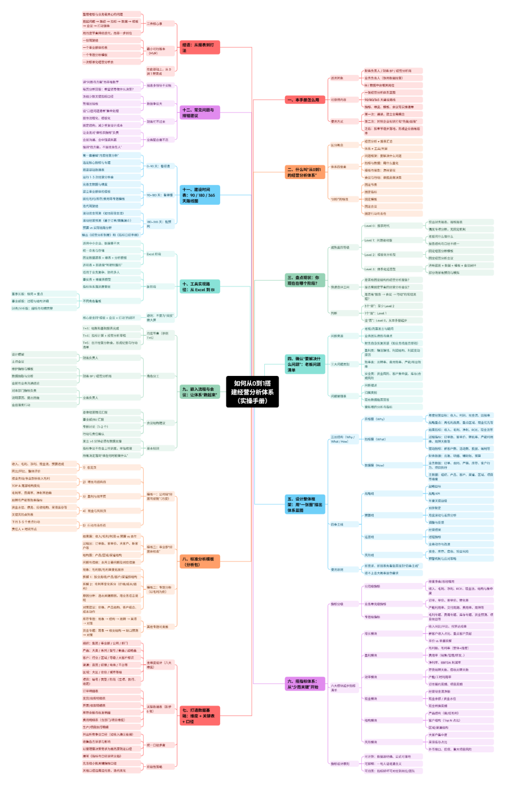
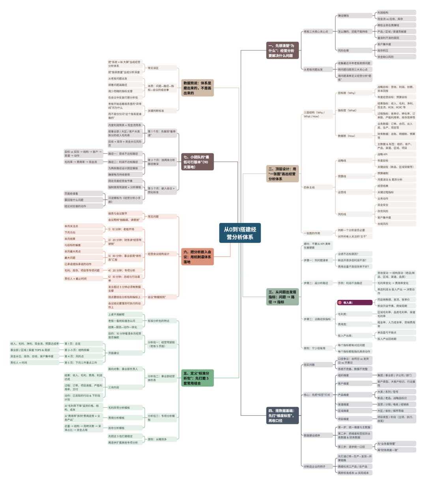
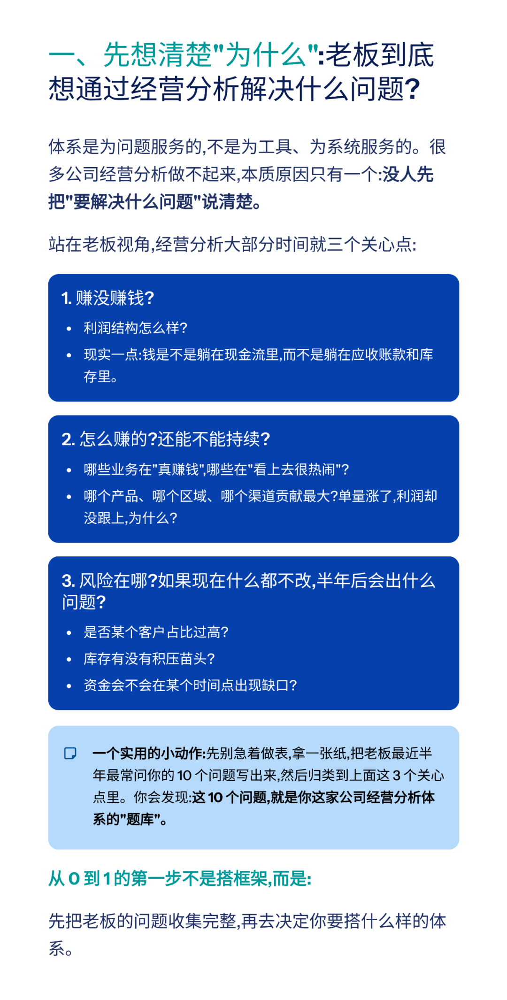
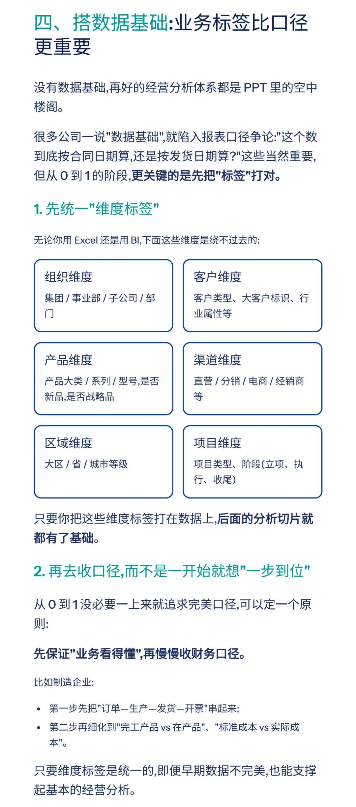
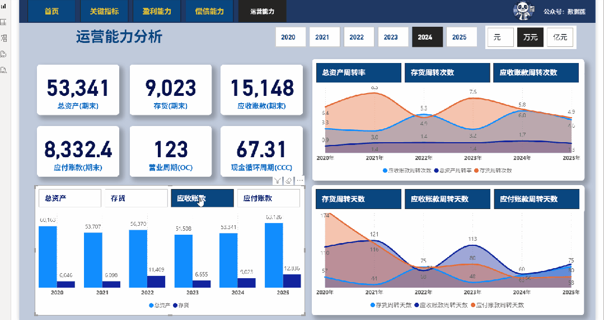

# 从 0 到 1 搭建经营分析体系（附实操手册）

> 来源：微信公众号「数据熊」 · 作者 宋岳清 · 发布于 2025-11-19 07:30  
> 原文链接：http://mp.weixin.qq.com/s?__biz=Mzg2MTg5OTgzNA==&mid=2247492121&idx=1&sn=f4b97e81fceb7922865f8ceef9340d86&chksm=ce12bf4cf965365a678c562704ce37f7837918d2d8154fe71de64dc3ab1814030f7d3afa2f95
> 摘要：月底熬夜赶完十几张经营分析报表,精心配了图表、趋势线,发到群里之后——老板既不@你,也不提报表,只是在会上问一句:\x26quot;我们现在最该干什么?\x26quot;那一刻你会突然发现:我们做了一堆\x26quot;数字说明书\x26quot;,但没有搭出一套\x26quot;帮助决策的经营分析体系\x26quot;。

模板即思路，点击

阅读原文

获取

《实操手册：从0到1搭建经营分析体系》

工作没思路，困惑没人问？赶快加入

数据熊的会员群

，与2700+财务精英共同成长

。

PowerBI看板

定制添加数据熊微信：Daniel-songyq

