# 经营分析：要从问题出发，而不是从数据出发

> 来源：微信公众号「数据熊」 · 作者 宋岳清 · 发布于 2025-11-26 11:00  
> 原文链接：http://mp.weixin.qq.com/s?__biz=Mzg2MTg5OTgzNA==&mid=2247492452&idx=1&sn=6b8b8b5ebb0e2359968ce766dc026581&chksm=ce12be31f96537270b9b980121e899d2938dc7b6b944b04f07563bda2615c372b4d879fd561a
> 摘要：多公司一说\x26quot;加强经营分析\x26quot;，第一反应就是：再建几个看板、再拉几张报表、给领导看更多\x26quot;数据图\x26quot;。结果忙了一圈，PPT 很精彩，决策依然靠拍脑袋——根本原因就是：分析是从\x26quot;有什么数据\x26quot;出发,而不是从\x26quot;要解决什么问题\x26quot;出发。

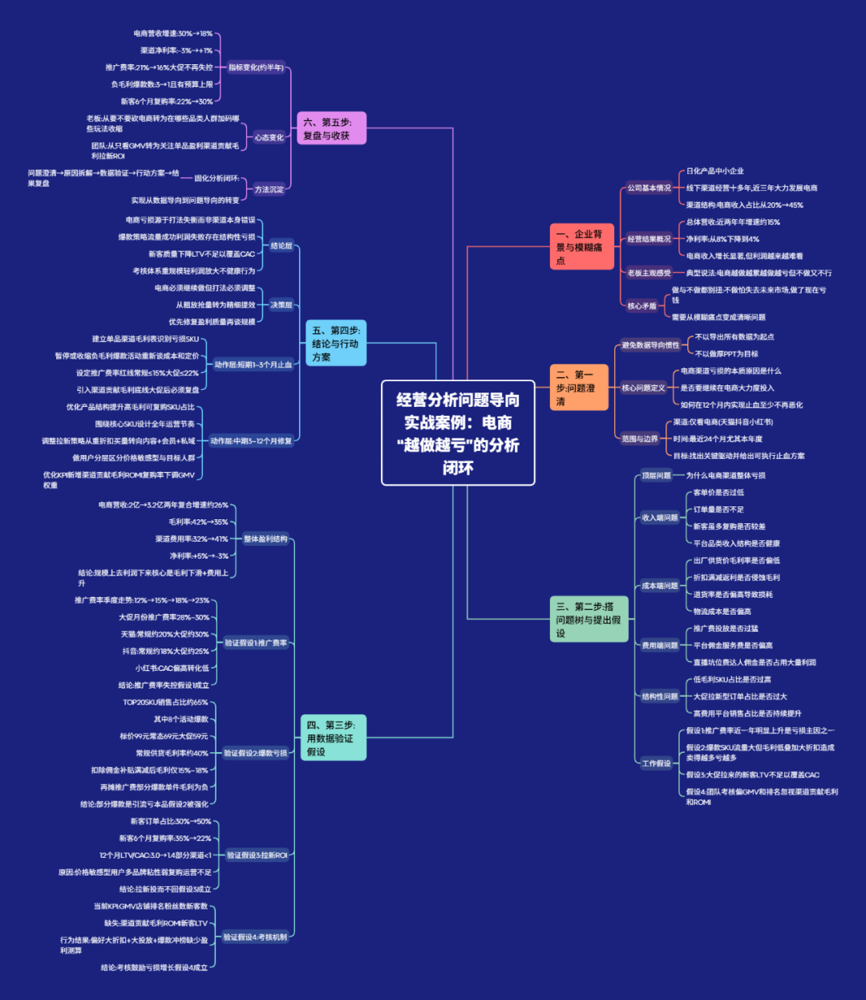

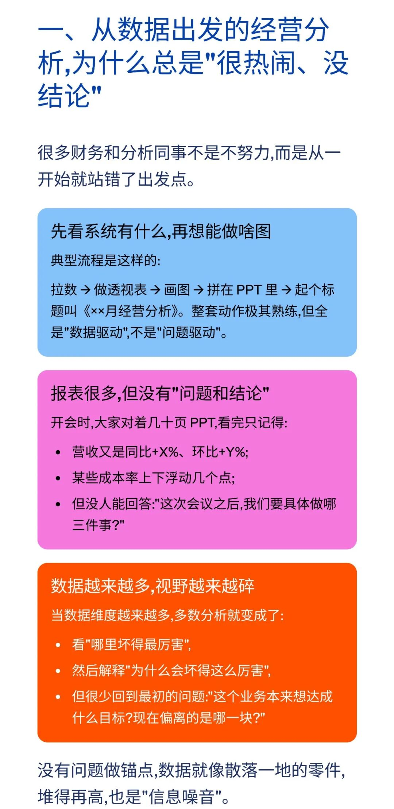

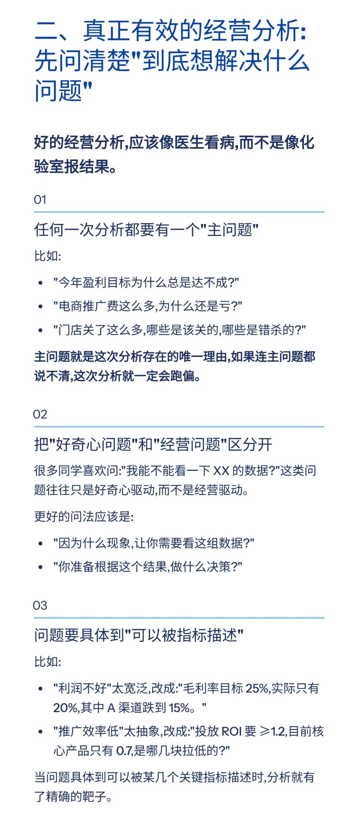

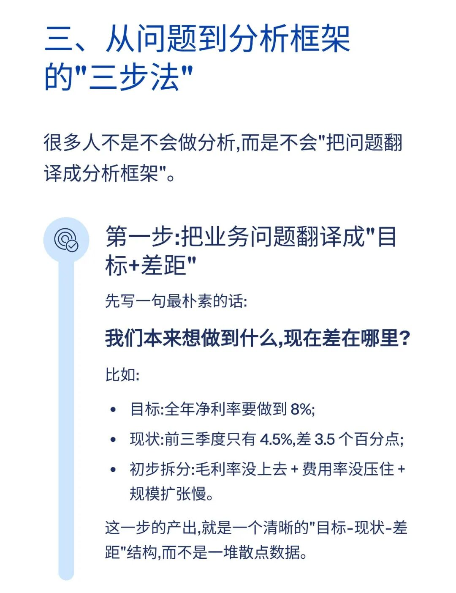

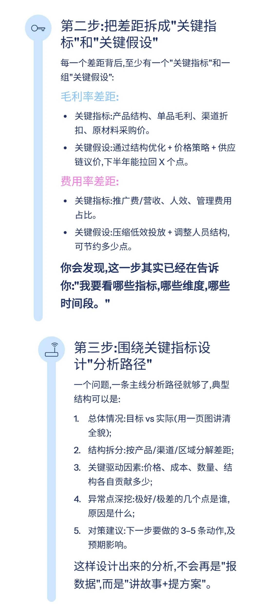

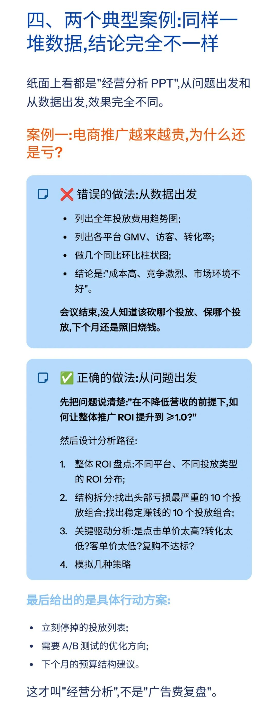

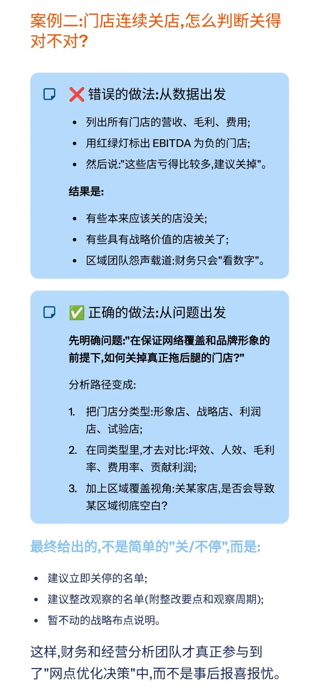

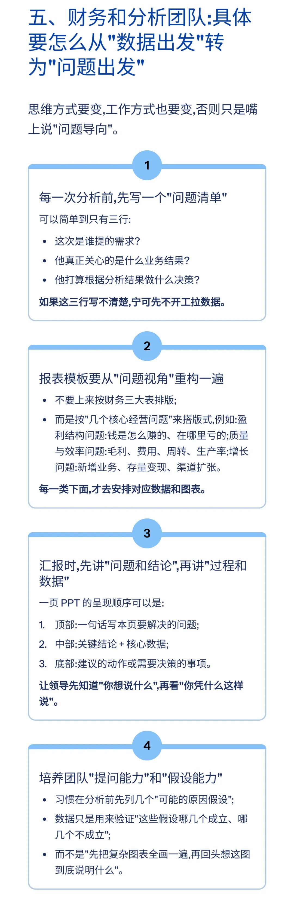

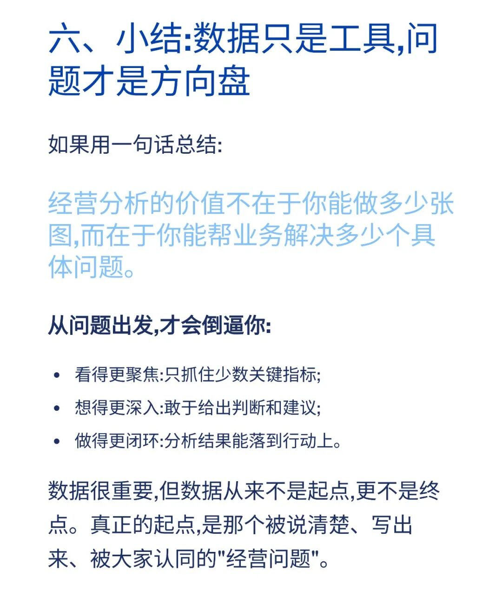

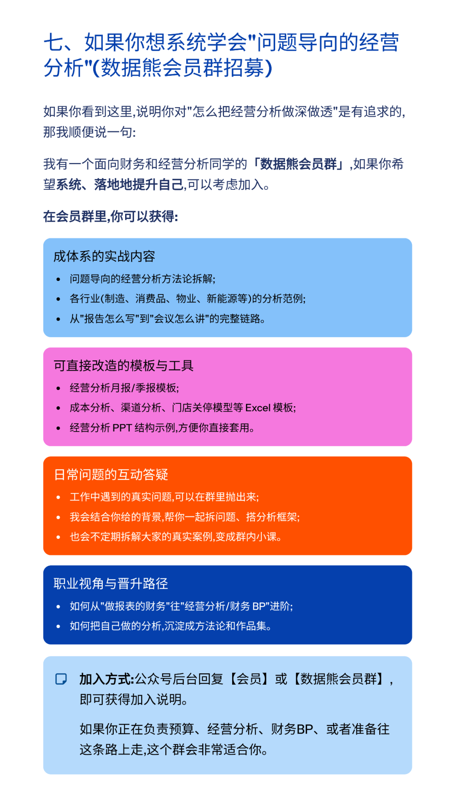

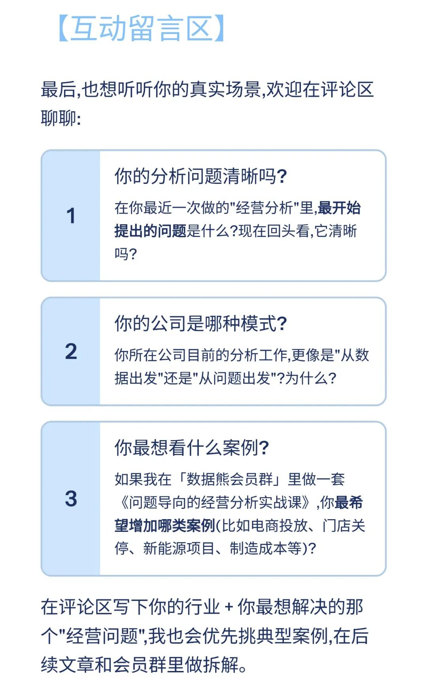

模板即思路，点击
阅读原文
查看完整版

《经营分析：应以问题为导向

》

。

加入

数据熊

会员群

，与2800+精英共同成长。后台点击
「经典文章」阅读数据熊10W+爆文，
模板定制添加数据熊微信：

Daniel-songyq

往期推荐

2025年总经理工作总结（可下载PPT）

2026年全面预算套表.xlsx

2025年10月经营分析PPT框架（可下载PPT模板）

本量利分析模型.xlsx

点赞

和

转发

就是最大的支持，关注数据熊，工作更轻松。

