# 经营分析：要敢于给出判断和建议

> 来源：微信公众号「数据熊」 · 作者 宋岳清 · 发布于 2025-11-27 11:00  
> 原文链接：http://mp.weixin.qq.com/s?__biz=Mzg2MTg5OTgzNA==&mid=2247492526&idx=1&sn=7cc103e2caae9501a80250e9045803de&chksm=ce12befbf96537edbf5c45744ff19893a59597cc98939c1adebc56c2e8a1fc7153bcb89cebae
> 摘要：真正有价值的经营分析报告，一定要敢于给出判断和建议。

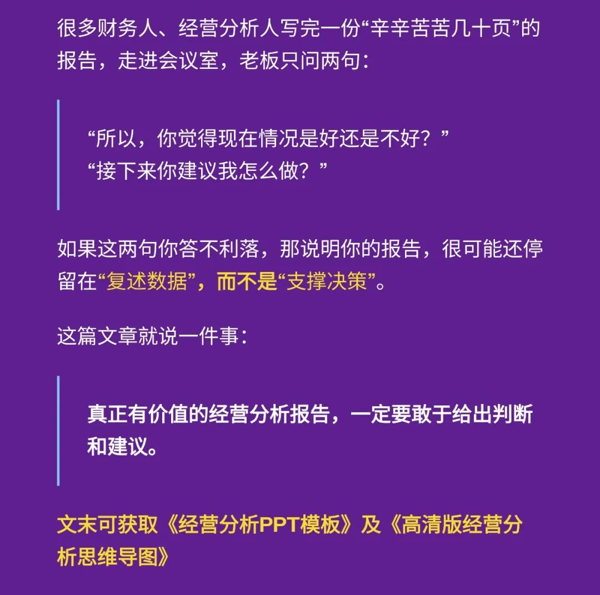

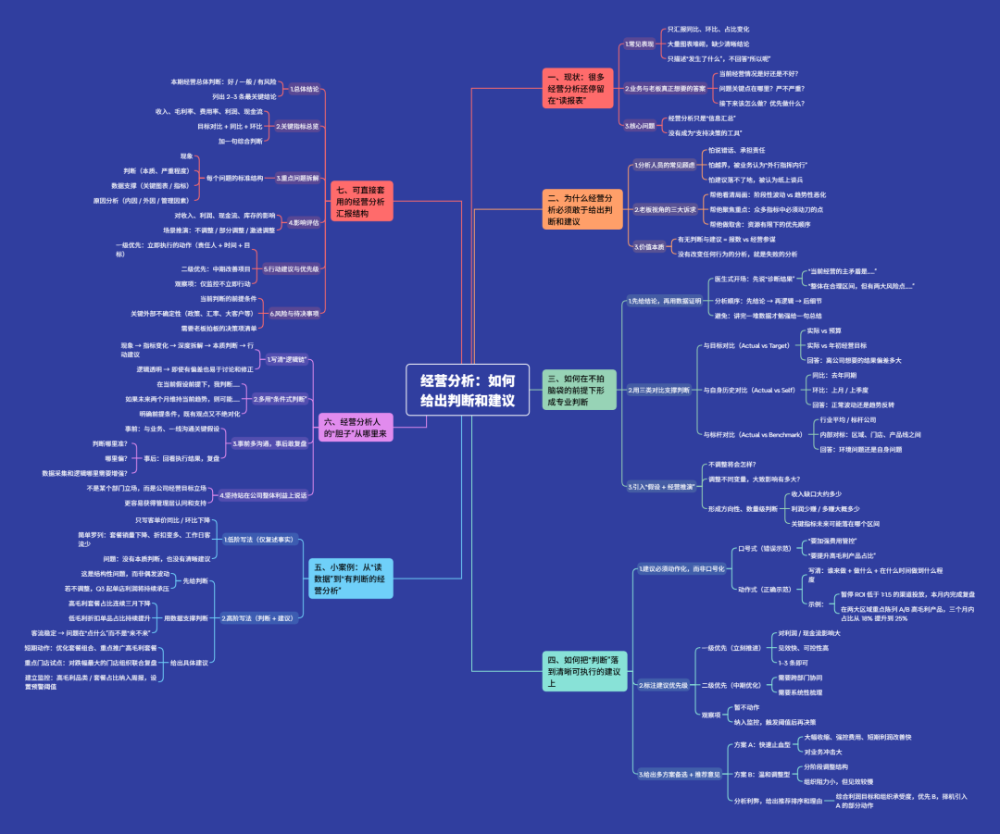

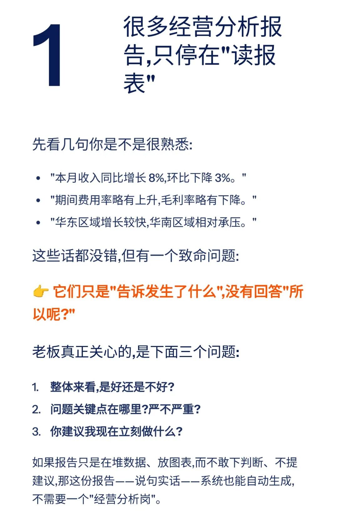

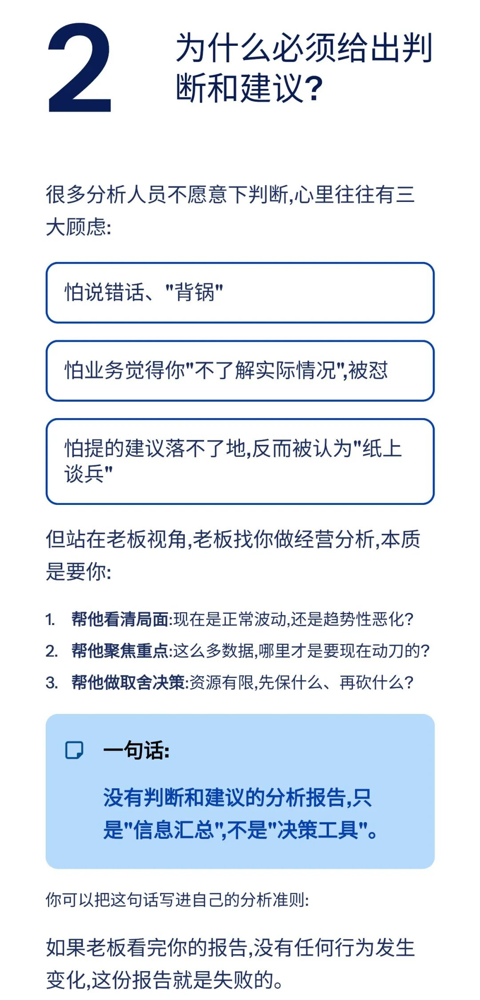

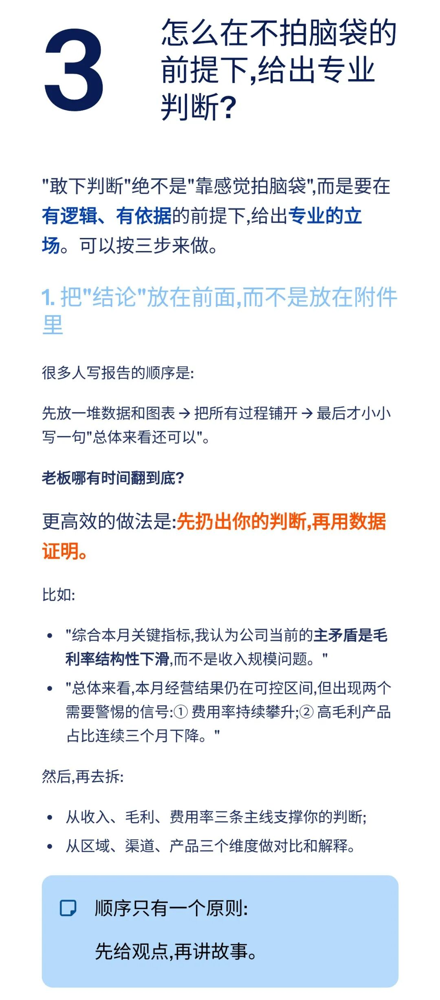

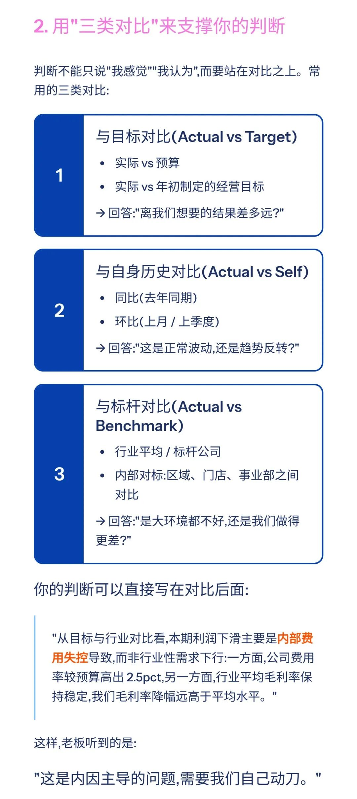

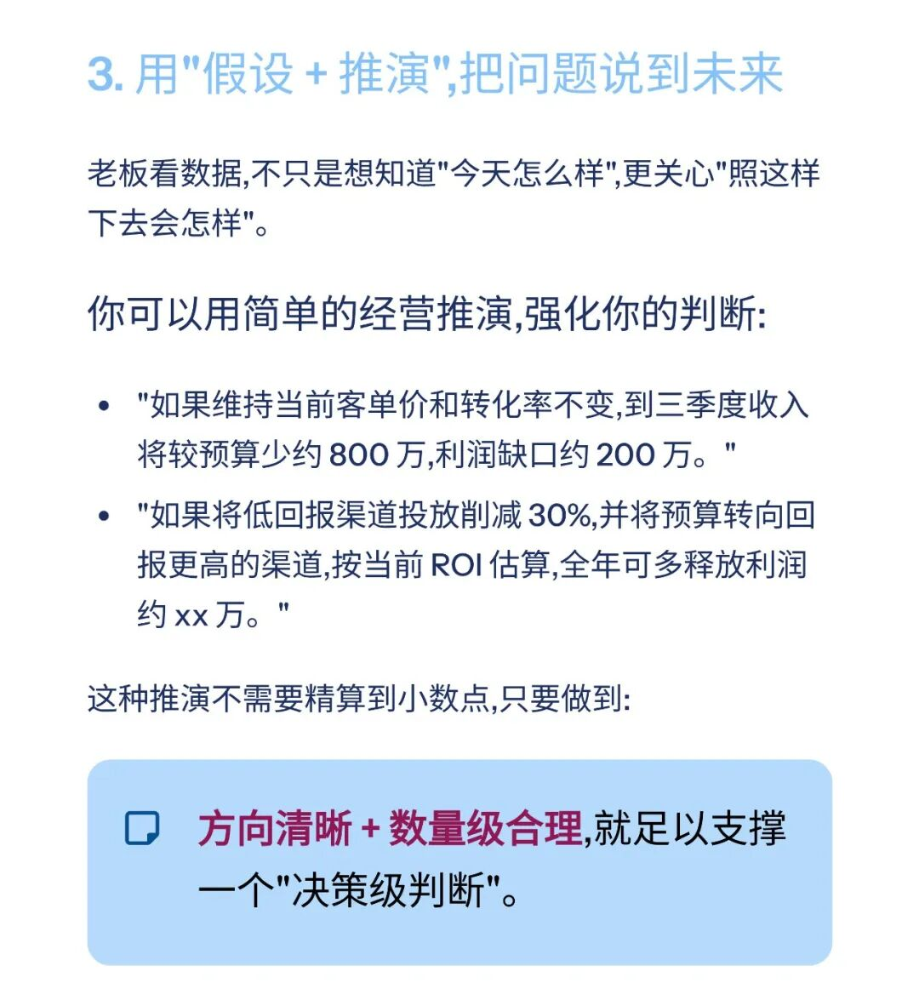

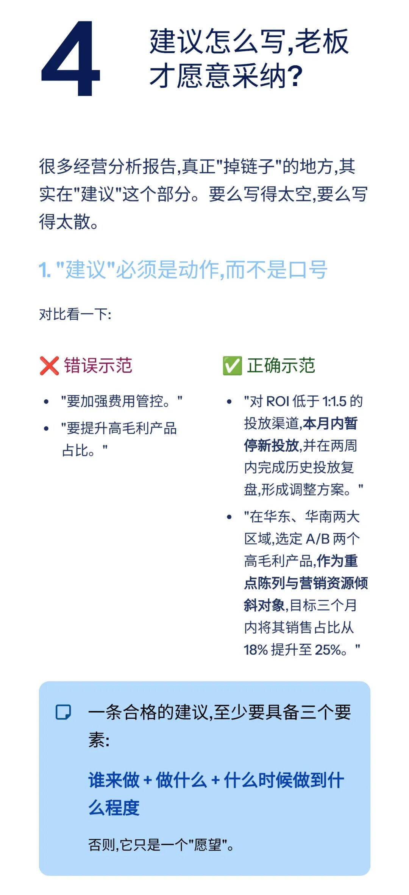

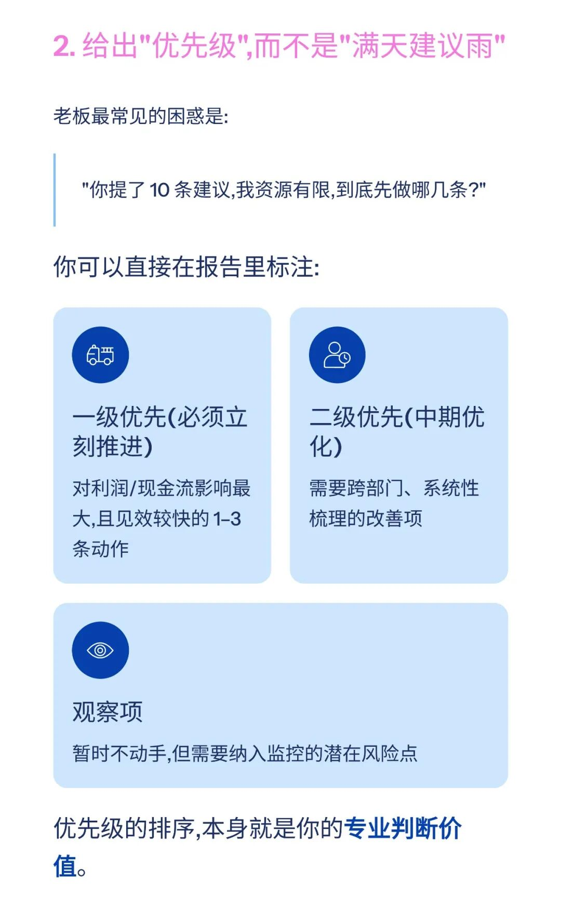

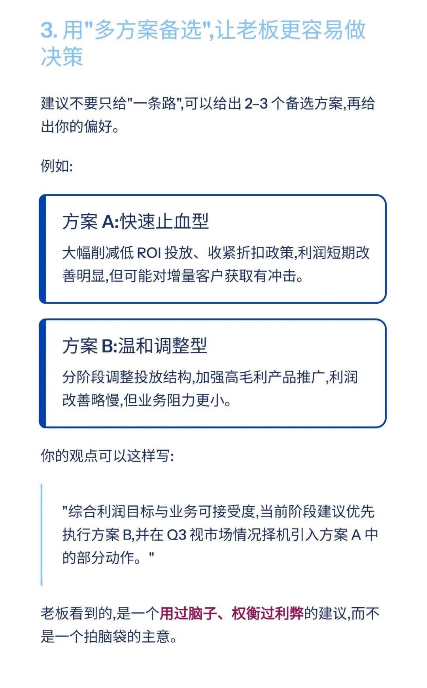

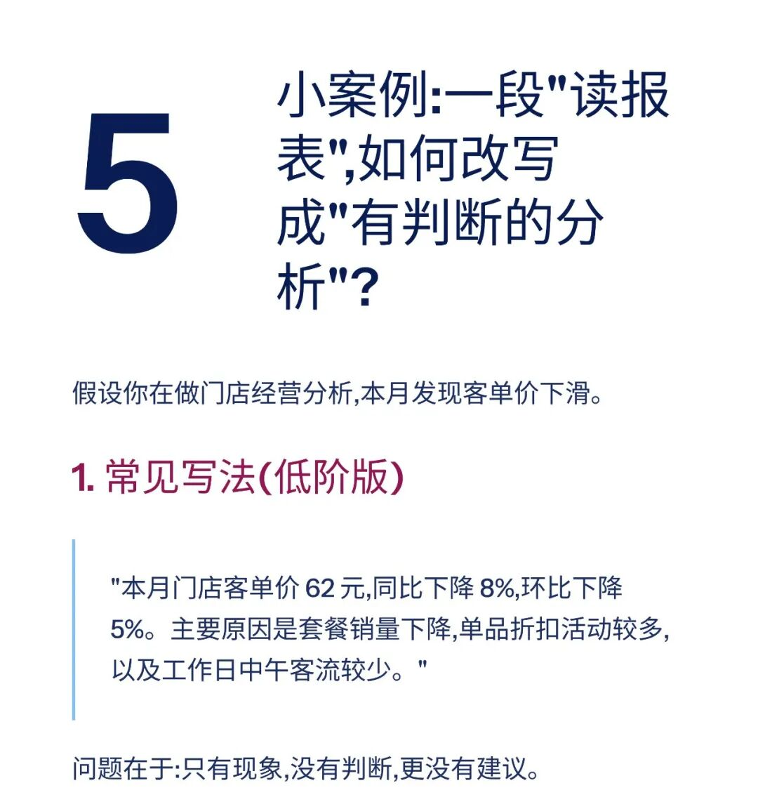

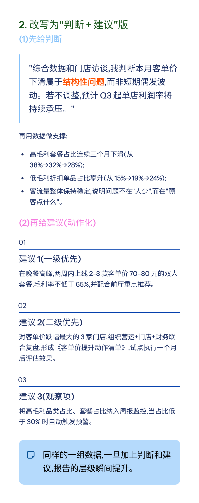

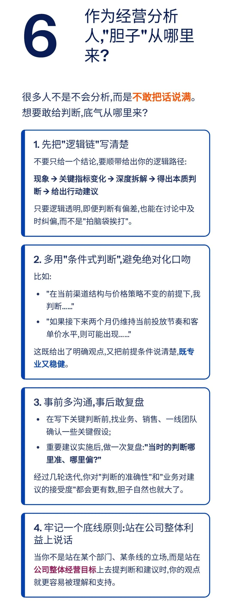

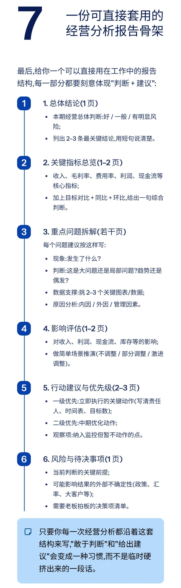

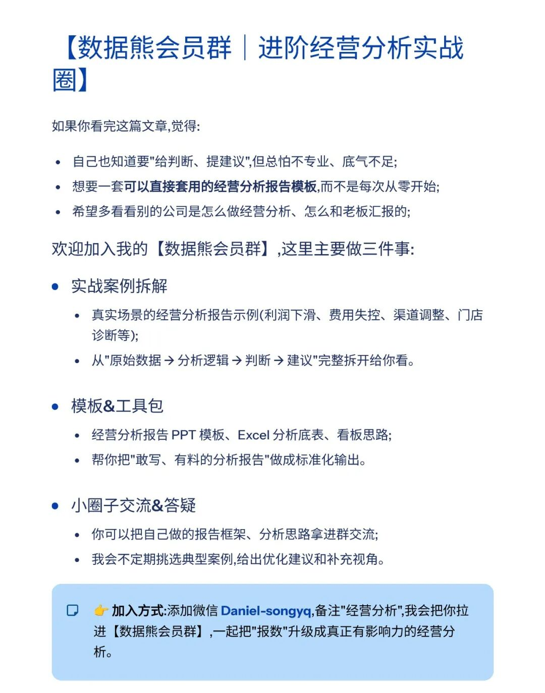

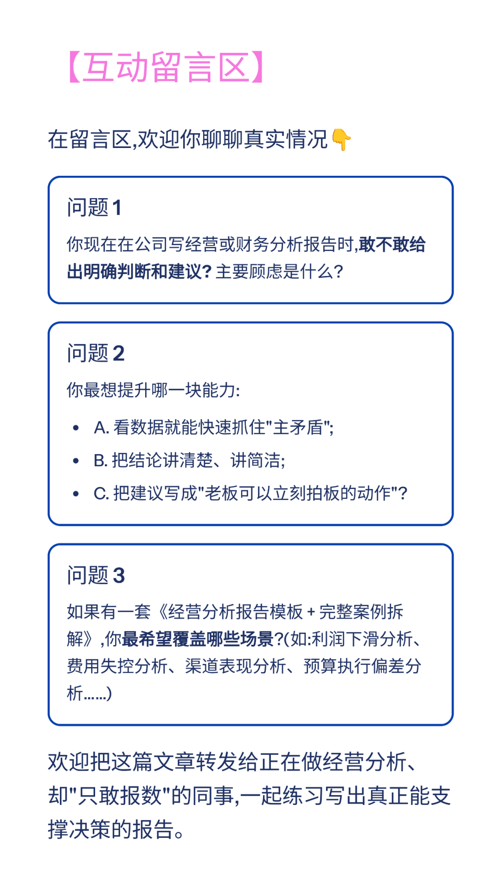

模板即思路，点击
阅读原文
获取

《经营分析ppt模板

》

。

加入

数据熊

会员群

，与2800+精英共同成长。后台点击
「经典文章」阅读数据熊10W+爆文，
模板定制添加数据熊微信：

Daniel-songyq

往期推荐

2025年总经理工作总结（可下载PPT）

2026年全面预算套表.xlsx

2025年10月经营分析PPT框架（可下载PPT模板）

本量利分析模型.xlsx

点赞

和

转发

就是最大的支持，关注数据熊，工作更轻松。

