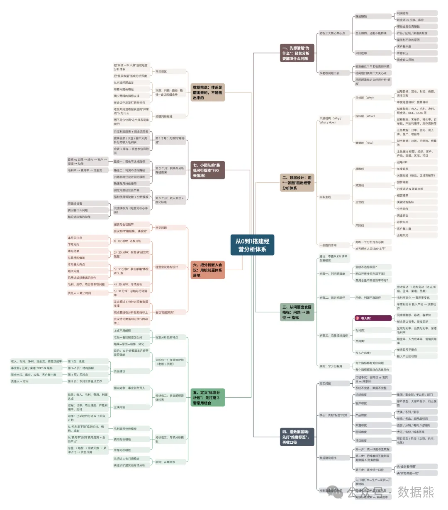
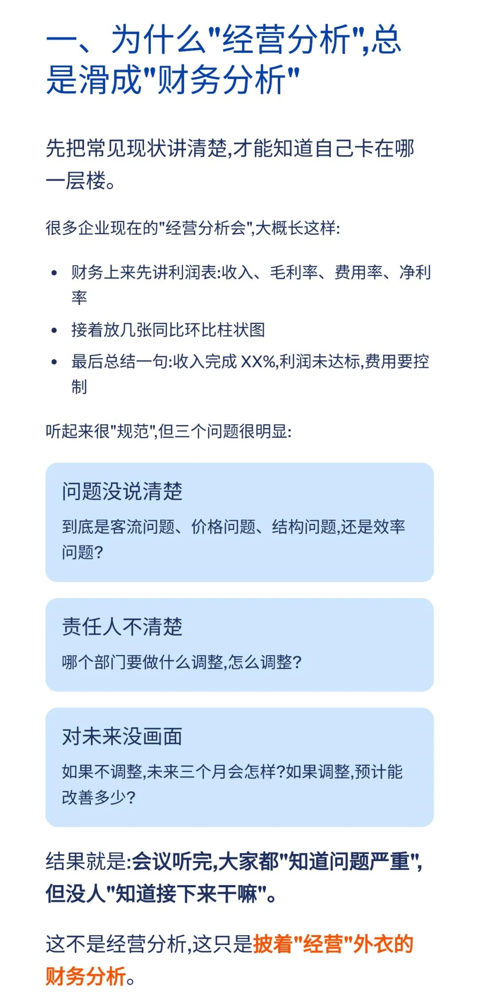
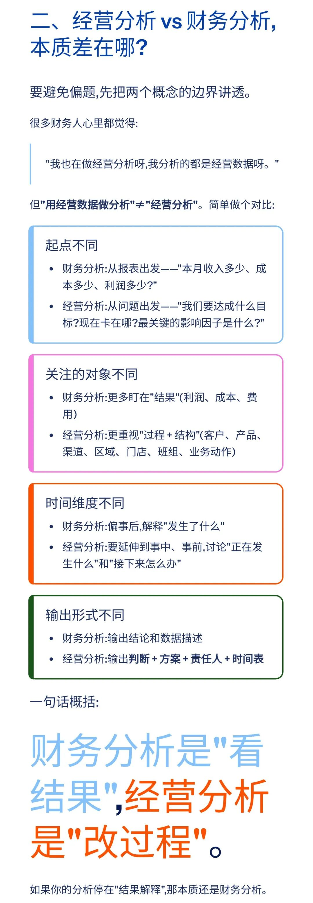
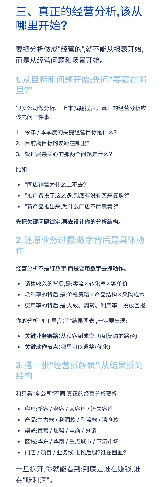
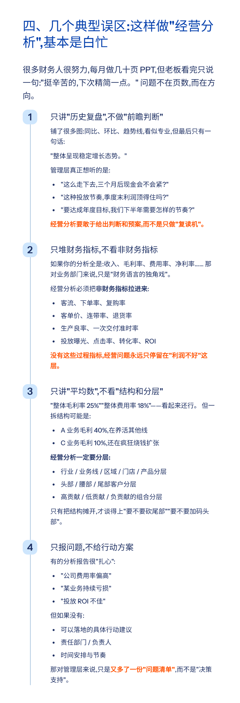
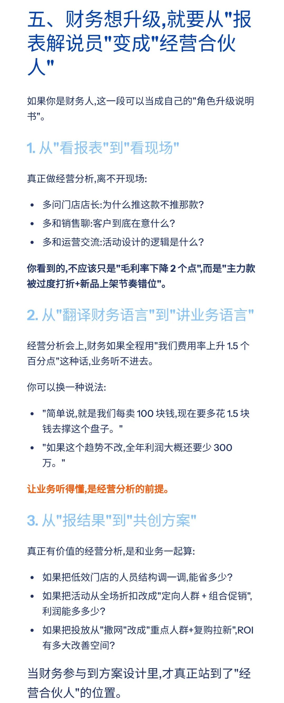
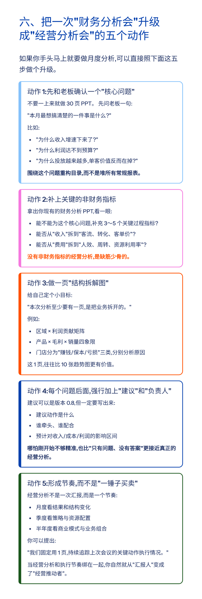
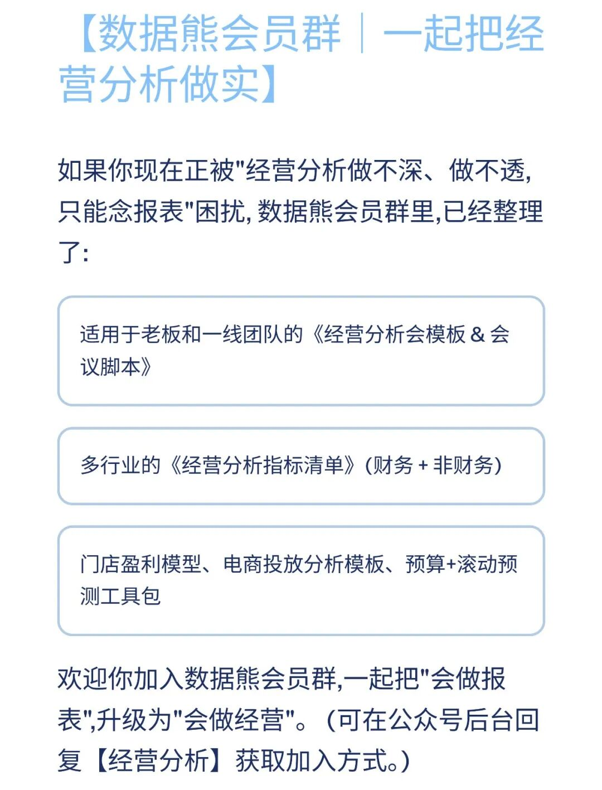
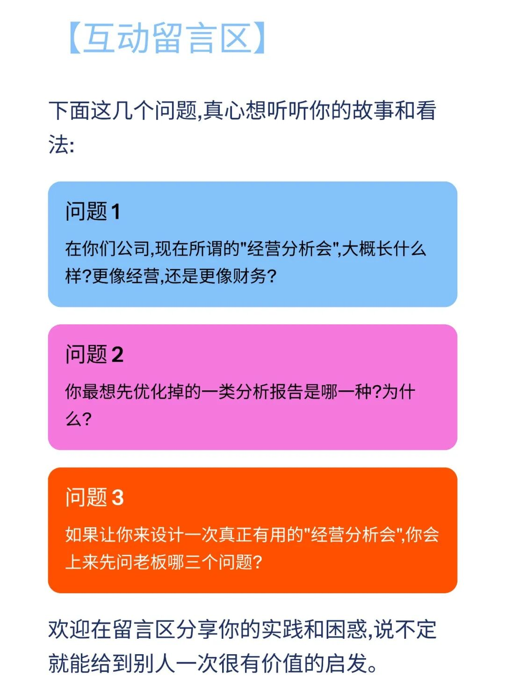

# 经营分析，别写做了财务分析

> 来源：微信公众号「数据熊」 · 作者 宋岳清 · 发布于 2025-11-28 11:00
> 原文链接：http://mp.weixin.qq.com/s?__biz=Mzg2MTg5OTgzNA==&mid=2247492564&idx=1&sn=b3bedc1443b25fc9e86df44116e70da1&chksm=ce12be81f96537978e4332c4022cbf6aee4803acdd8c3f27be5009f3f8aaebb0e56df7cfa83b
> 摘要：很多公司嘴上说\x26quot;我们要加强经营分析\x26quot;,结果一到月中,会议室大屏一亮——还是那几页损益表、费用占比、毛利率环比。形式变了,名字升级了,本质还是\x26quot;报表复读机\x26quot;。

模板即思路，点击
阅读原文
获取

《美的集团经营分析指标体系

》

。

加入

数据熊

会员群

，与2800+精英共同成长。后台点击
「经典文章」阅读数据熊10W+爆文，
模板定制添加数据熊微信：

Daniel-songyq

往期推荐

2025年总经理工作总结（可下载PPT）

2026年全面预算套表.xlsx

2025年10月经营分析PPT框架（可下载PPT模板）

本量利分析模型.xlsx

点赞

和

转发

就是最大的支持，关注数据熊，工作更轻松。

