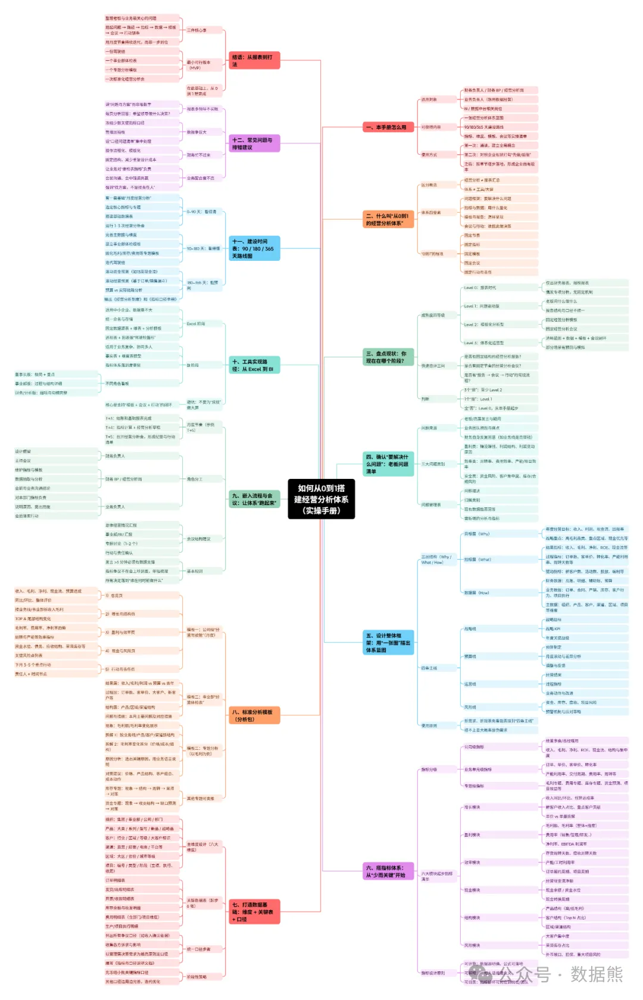
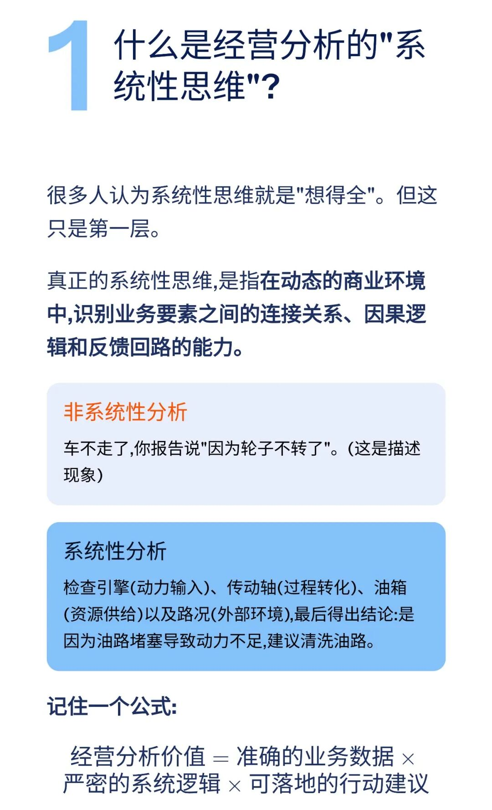
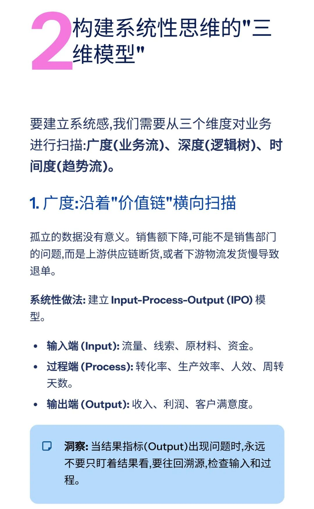
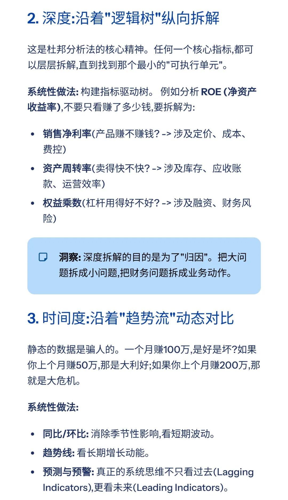
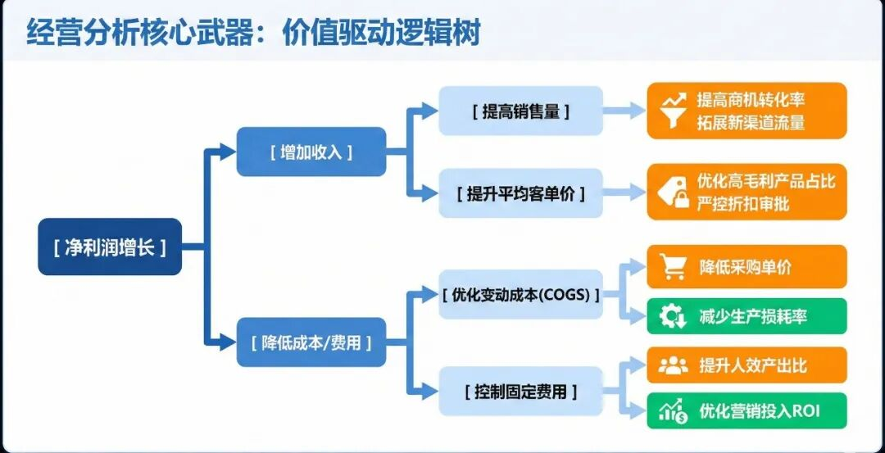
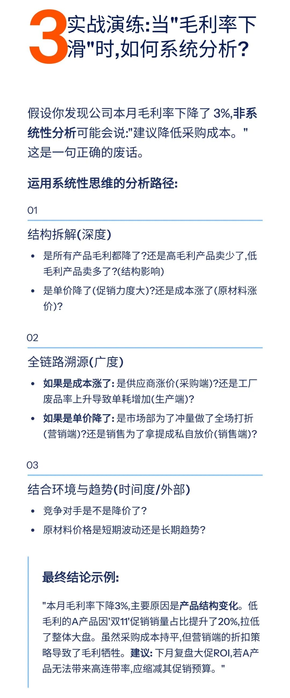
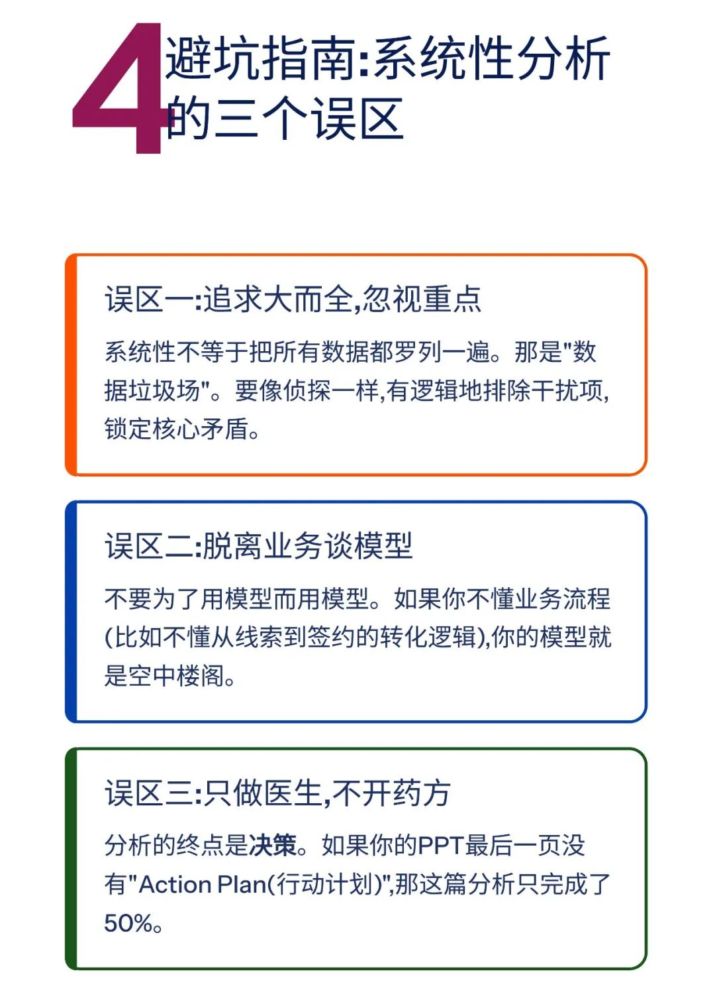
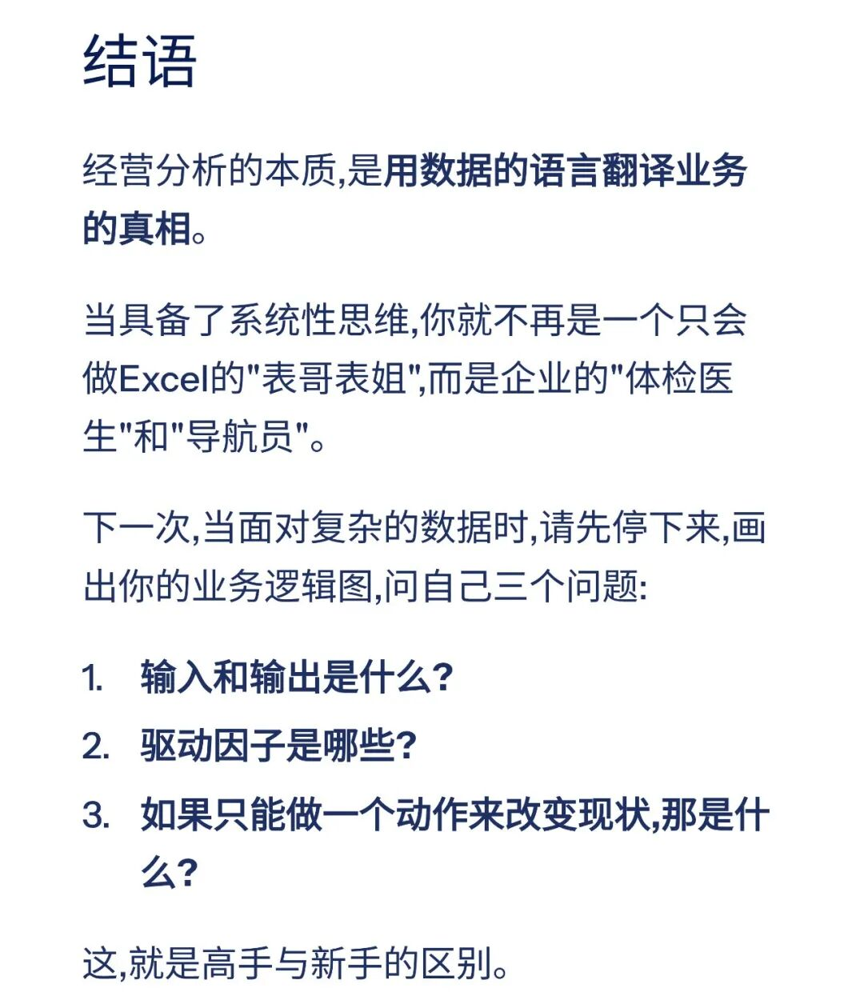
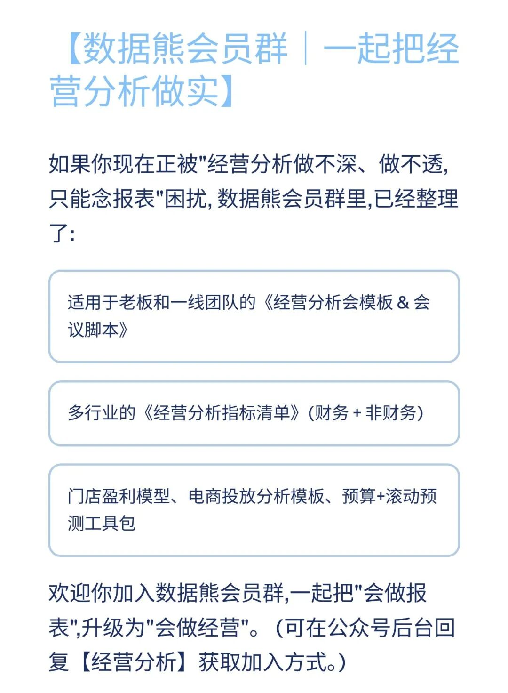

# 经营分析：要有系统性思维

> 来源：微信公众号「数据熊」 · 作者 宋岳清 · 发布于 2025-11-29 11:00  
> 原文链接：http://mp.weixin.qq.com/s?__biz=Mzg2MTg5OTgzNA==&mid=2247492633&idx=1&sn=0bd98dd834e16f9a415cb8d25b260150&chksm=ce12b94cf965305a44b513216fcc45bec626107fcfaadec5594ad8800278b192e43d25a680c4
> 摘要：\x26quot;利润下降了,我知道是因为成本高了。但我由于什么高了?是采购贵了,还是废品率高了?还是因为销售结构变了?下一步我们该怎么办?\x26quot;

模板即思路，点击
阅读原文
获取

《美的集团经营分析指标体系

》

。

加入

数据熊

会员群

，与2800+精英共同成长。后台点击
「经典文章」阅读数据熊10W+爆文，
模板定制添加数据熊微信：

Daniel-songyq

往期推荐

2025年总经理工作总结（可下载PPT）

2026年全面预算套表.xlsx

2025年10月经营分析PPT框架（可下载PPT模板）

本量利分析模型.xlsx

点赞

和

转发

就是最大的支持，关注数据熊，工作更轻松。

