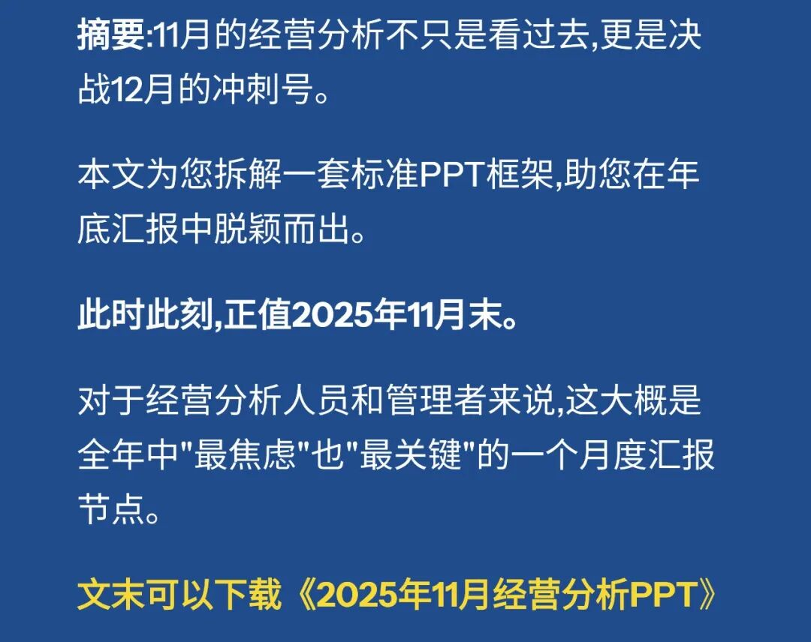
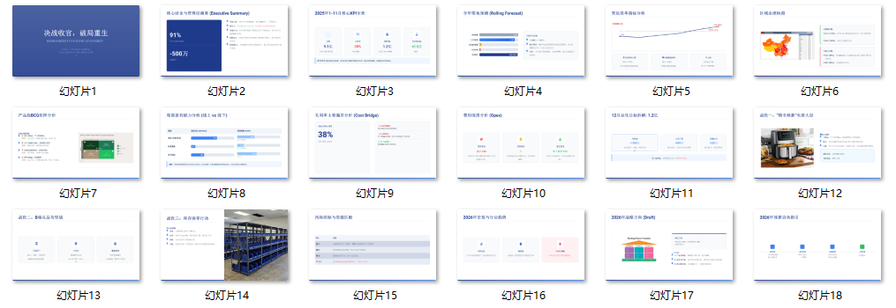
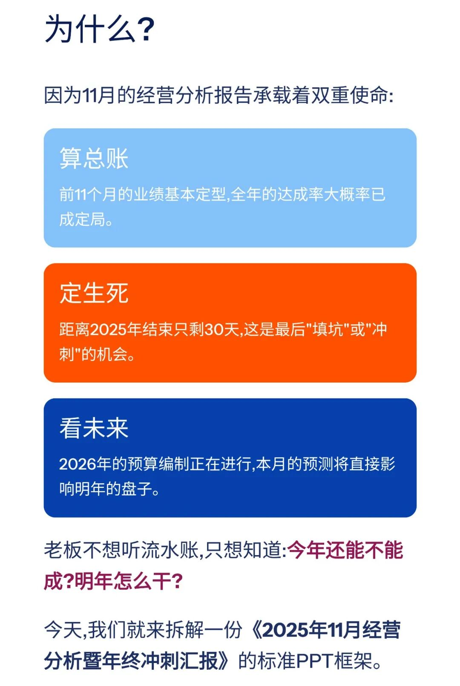
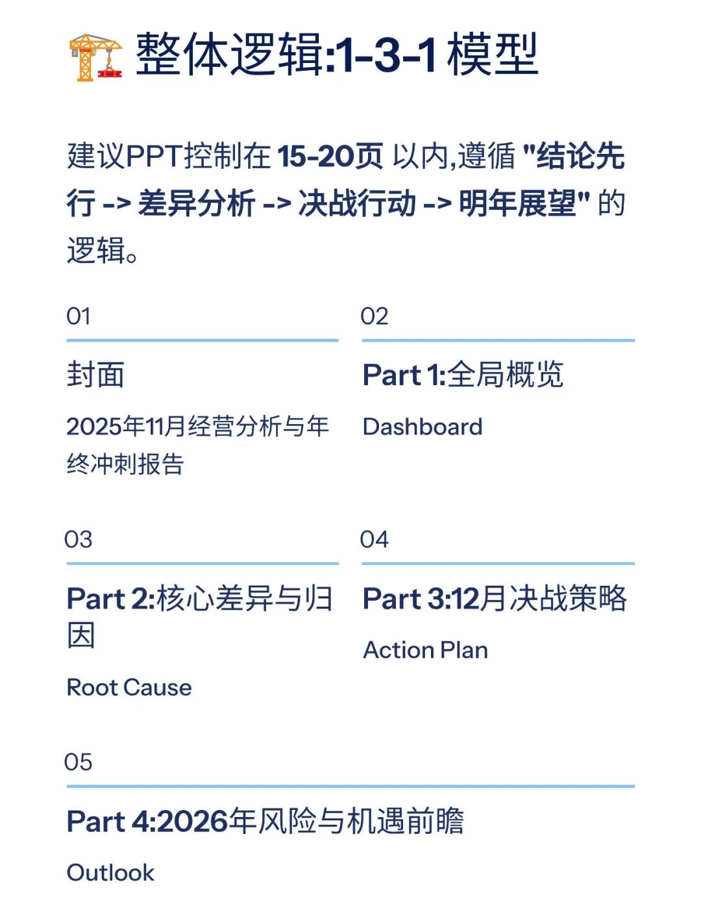
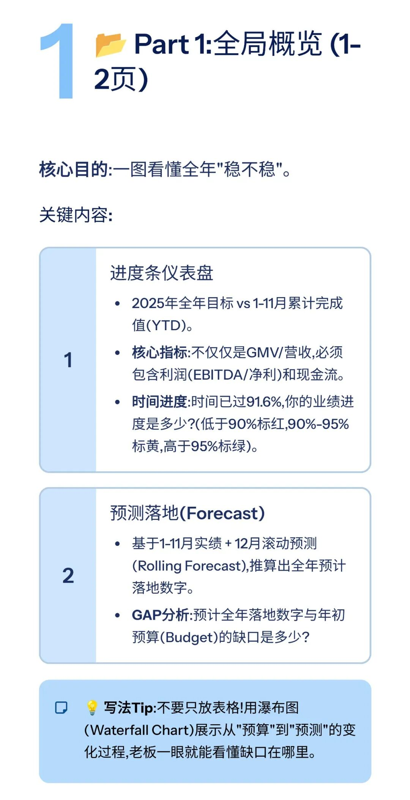
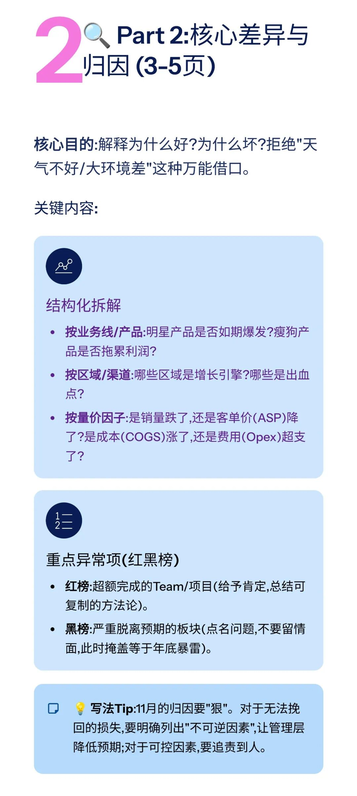
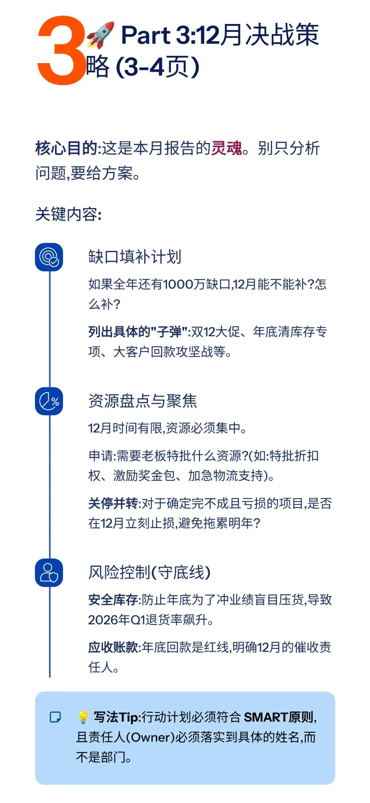
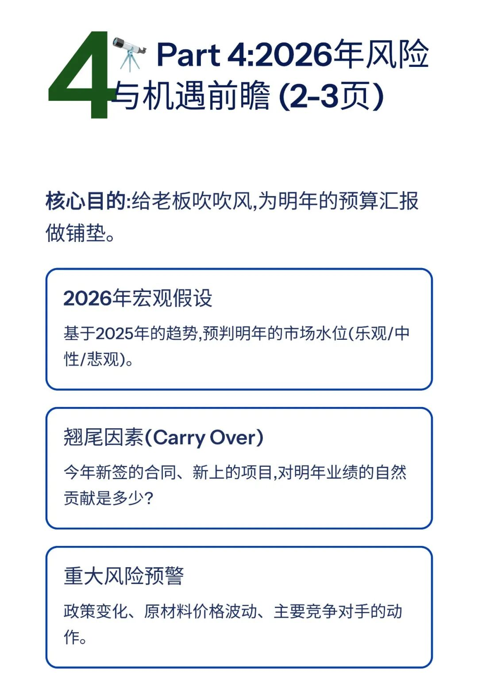
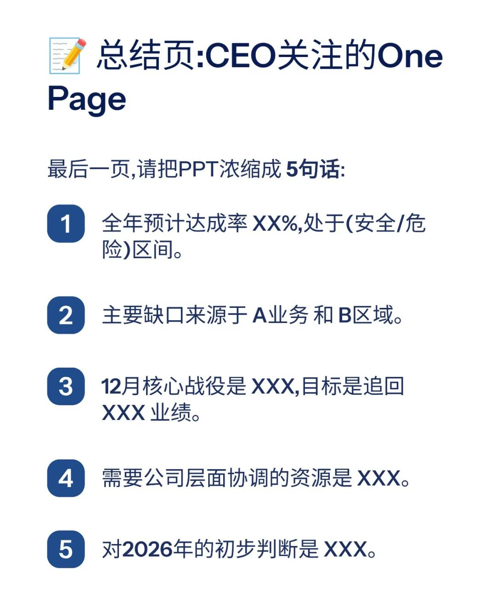
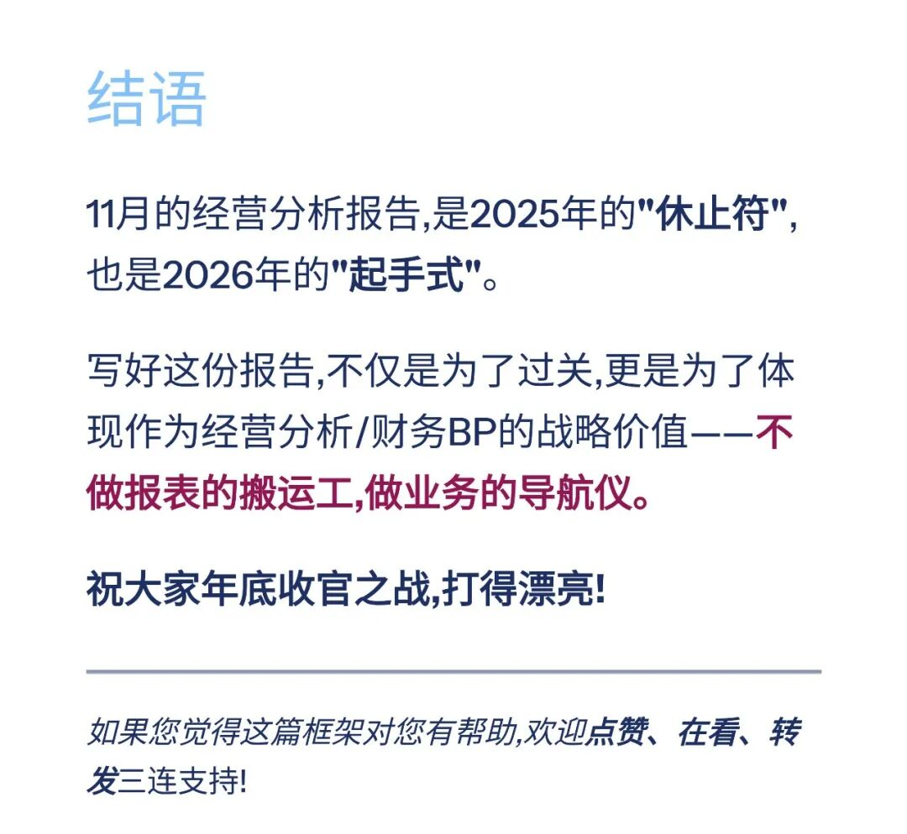

# 2025年11月经营分析PPT框架（附PPT模板）

> 来源：微信公众号「数据熊」 · 作者 宋岳清 · 发布于 2025-11-30 08:00
> 原文链接：http://mp.weixin.qq.com/s?__biz=Mzg2MTg5OTgzNA==&mid=2247492668&idx=1&sn=407196398ec932ae0863db2b2bf91034&chksm=ce12b969f965307f974e1c2de5d2ec9ea103965da52a9f37a444ac9fe5c8c8b4a84c60a34efb
> 摘要：11月的经营分析不只是看过去,更是决战12月的冲刺号。

模板即思路，点击
阅读原文
获取

《2025年11月经营分析PPT模板

》

。

加入

数据熊

会员群

，与2800+精英共同成长。后台点击
「经典文章」阅读数据熊10W+爆文，
模板定制添加数据熊微信：

Daniel-songyq

往期推荐

2025年总经理工作总结（可下载PPT）

2026年全面预算套表.xlsx

2025年10月经营分析PPT框架（可下载PPT模板）

本量利分析模型.xlsx

点赞

和

转发

就是最大的支持，关注数据熊，工作更轻松。

