# 经营分析，要先到一线，再回到数据

> 来源：微信公众号「数据熊」 · 作者 宋岳清 · 发布于 2025-12-03 11:04
> 原文链接：http://mp.weixin.qq.com/s?__biz=Mzg2MTg5OTgzNA==&mid=2247492873&idx=1&sn=29351f27f8a573cfaa6039946a888673&chksm=ce12b85cf965314a0db8583ac50035b6edff4a384adcaa7187f697d806675485bd3270bb67ed
> 摘要：这份 Excel 以美的集团的经营管理实践为参照，将“一个标准、一个节奏、一套方法、一个结果”落到可执行的指标

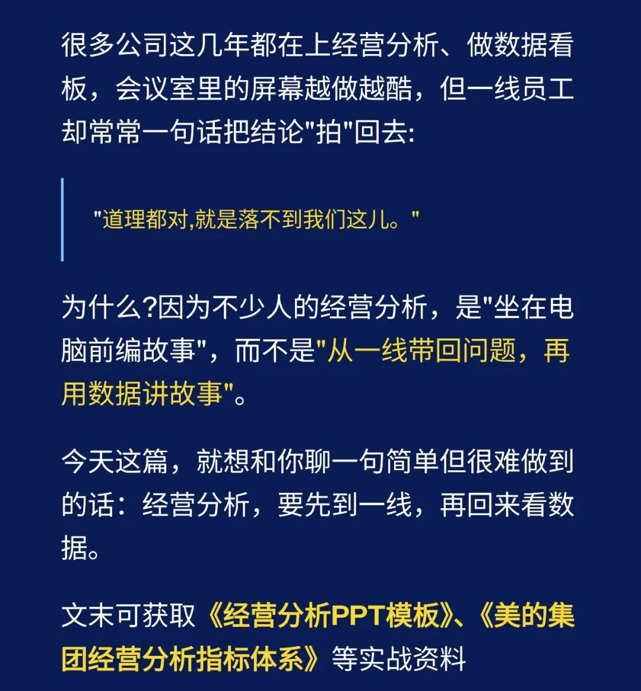

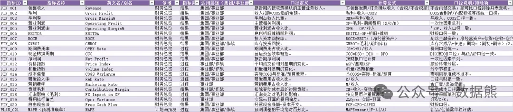

这份 Excel 以

美的集团

的经营管理实践为参照，将“一个标准、一个节奏、一套方法、一个结果”落到可执行的指标字典。涉及125个指标，拿去就可以用。

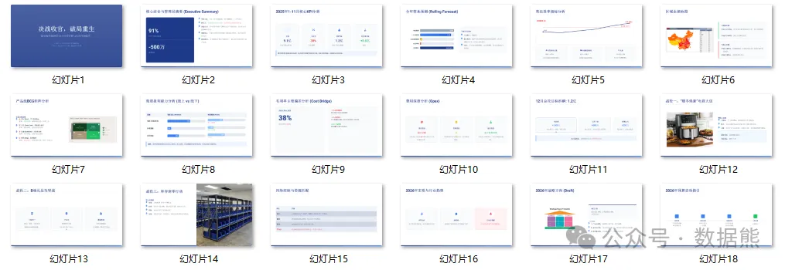

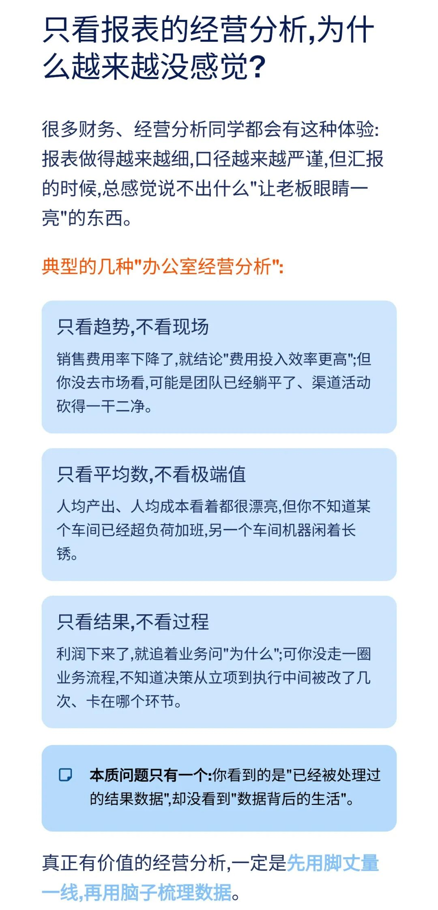

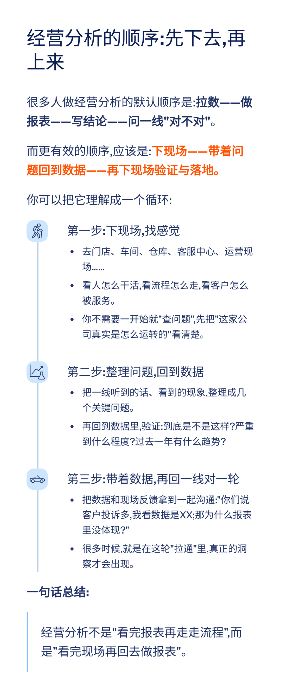

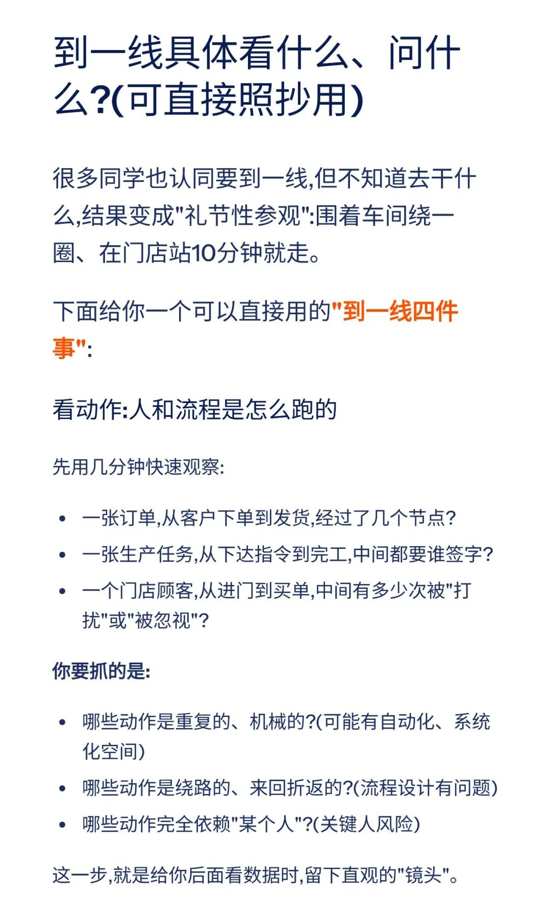

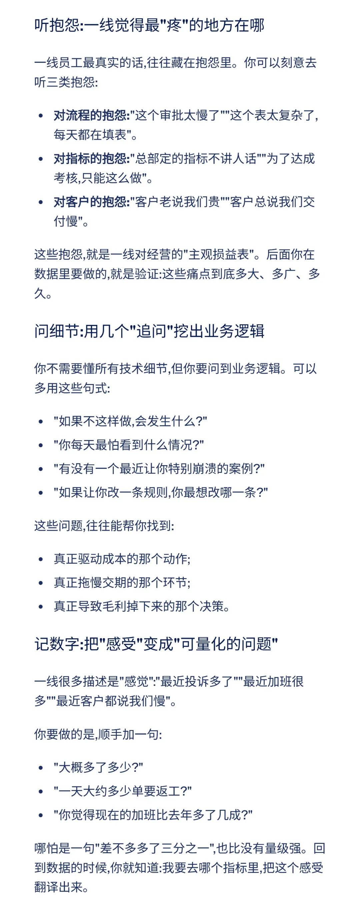

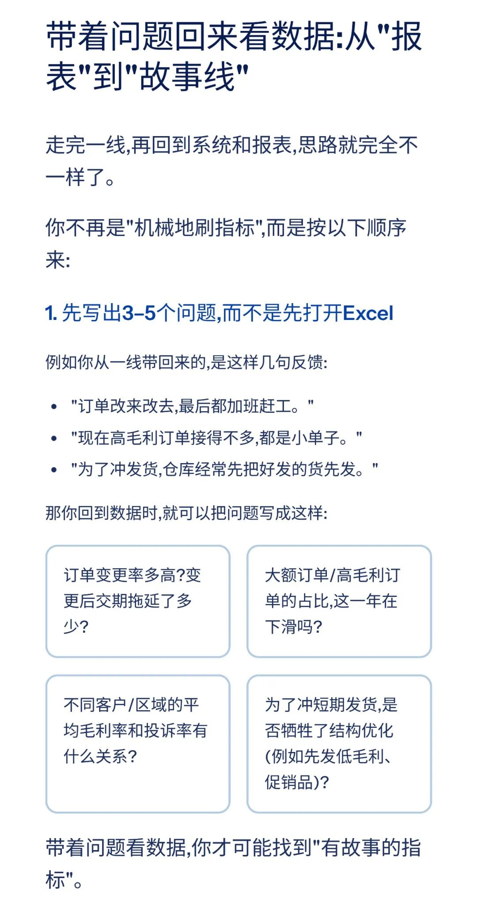

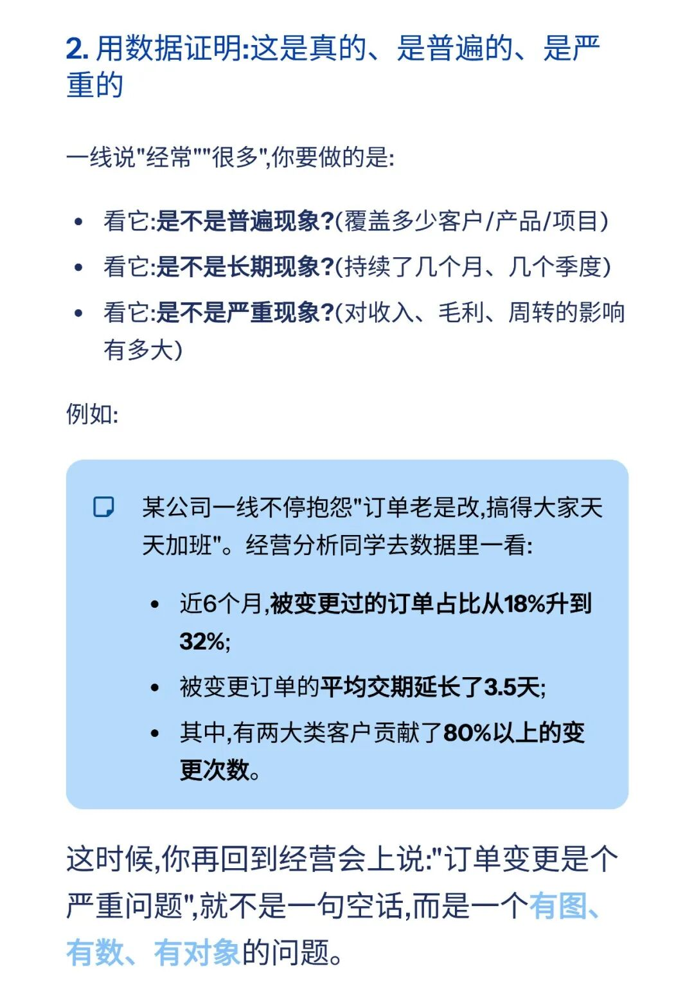

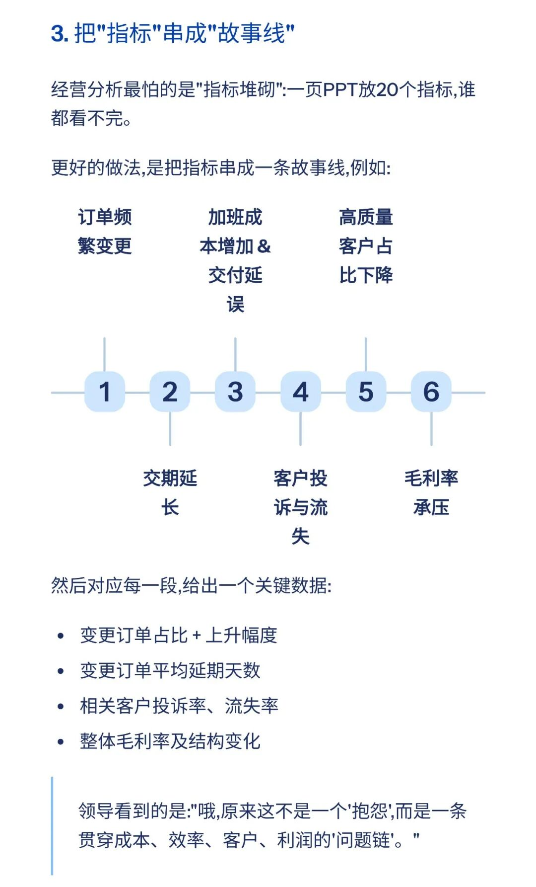

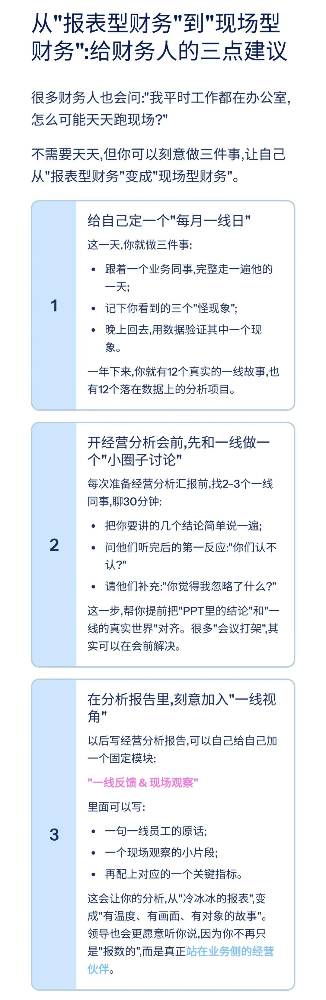

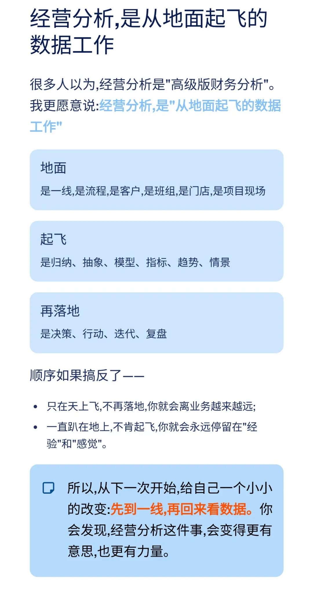

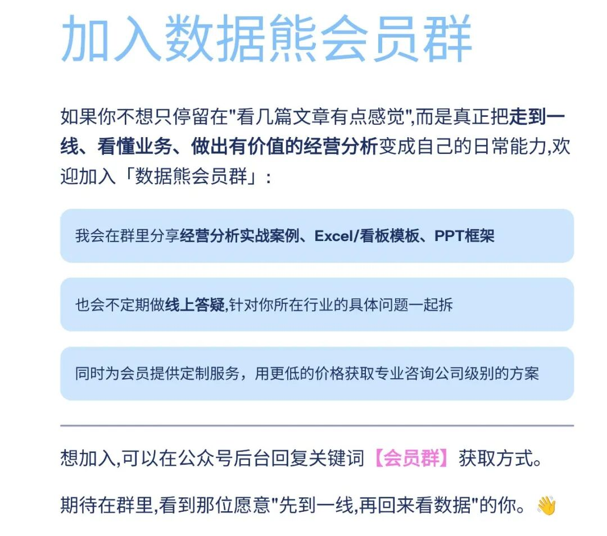

模板即思路，点击
阅读原文
获取

《2025年11月经营分析PPT模板

》

。

加入

数据熊

会员群

，与2900+精英共同成长。后台点击
「经典文章」阅读数据熊10W+爆文，
模板定制添加数据熊微信：

Daniel-songyq

往期推荐

2025年总经理工作总结（可下载PPT）

2026年全面预算套表.xlsx

2025年10月经营分析PPT框架（可下载PPT模板）

本量利分析模型.xlsx

点赞

和

转发

就是最大的支持，关注数据熊，工作更轻松。

