# 经营分析黄金指标组合：现金流+毛利率（附PPT模板）

> 来源：微信公众号「数据熊」 · 作者 宋岳清 · 发布于 2025-12-04 11:00
> 原文链接：http://mp.weixin.qq.com/s?__biz=Mzg2MTg5OTgzNA==&mid=2247492912&idx=1&sn=72753804dc5f27a711d3e0e89a1f9af4&chksm=ce12b865f96531733ae4d138ad4eafb604413f57999699e156c741fe296529228bbf6978b522
> 摘要：很多老板看报表，嘴上说\x26quot;都看看\x26quot;，心里只关心两件事：有钱没?赚得多不多?如果把这两句话翻译成指标，其实就是:\x26quot;有钱没\x26quot; —— 看 现金流\x26quot;赚得多不多\x26quot; —— 看 毛利率

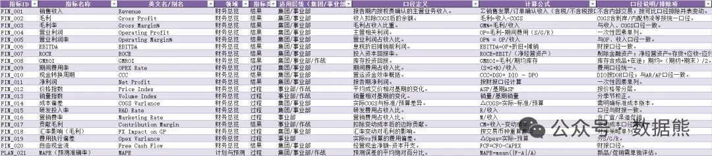

这份 Excel 以

美的集团

的经营管理实践为参照，将“一个标准、一个节奏、一套方法、一个结果”落到可执行的指标字典。涉及125个指标，拿去就可以用。

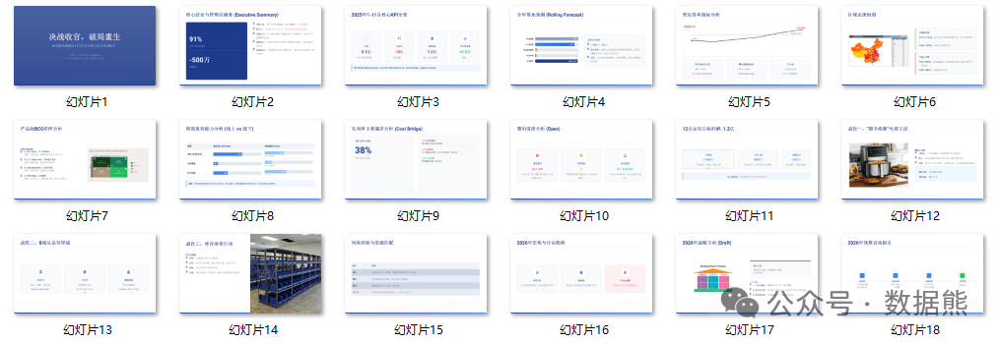

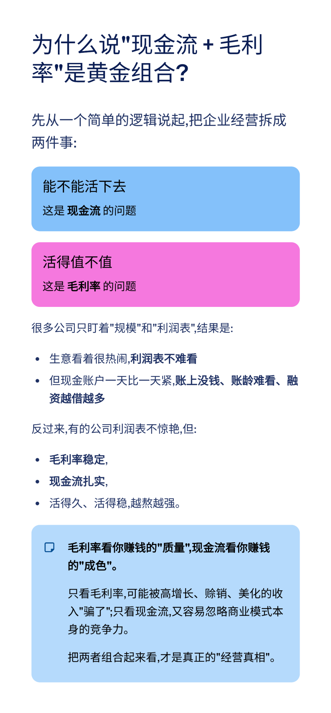

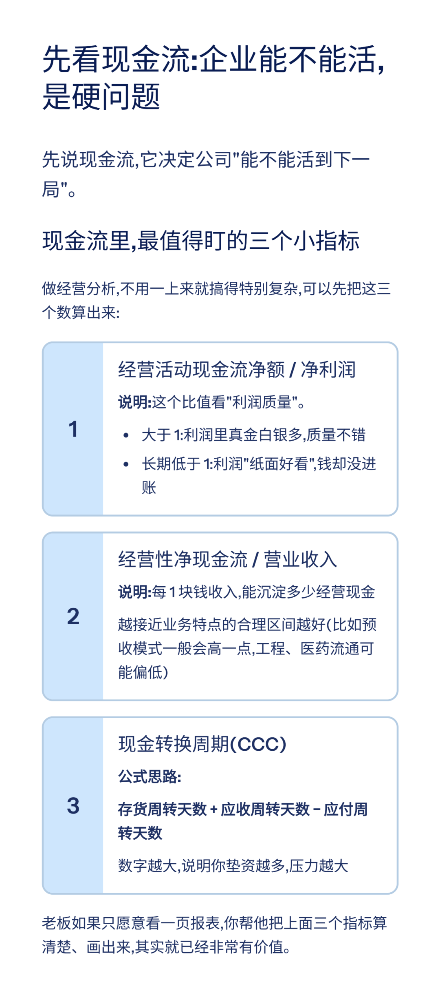

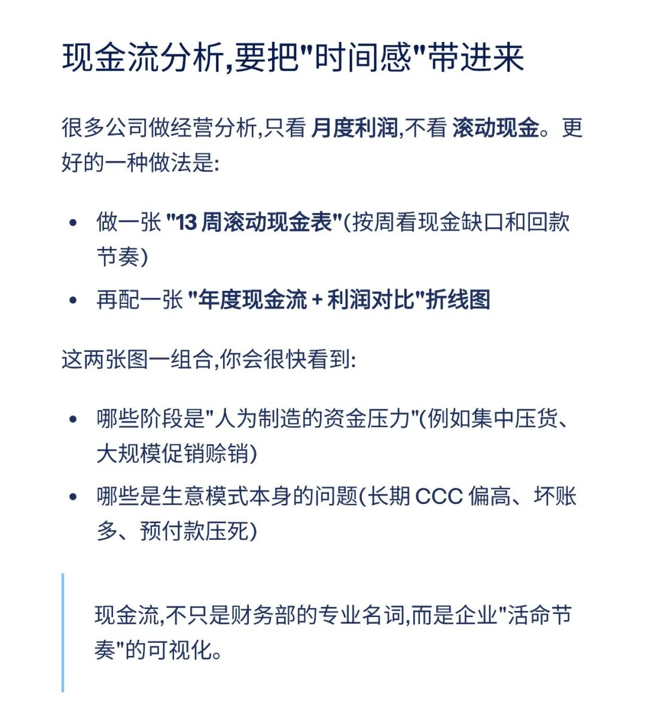

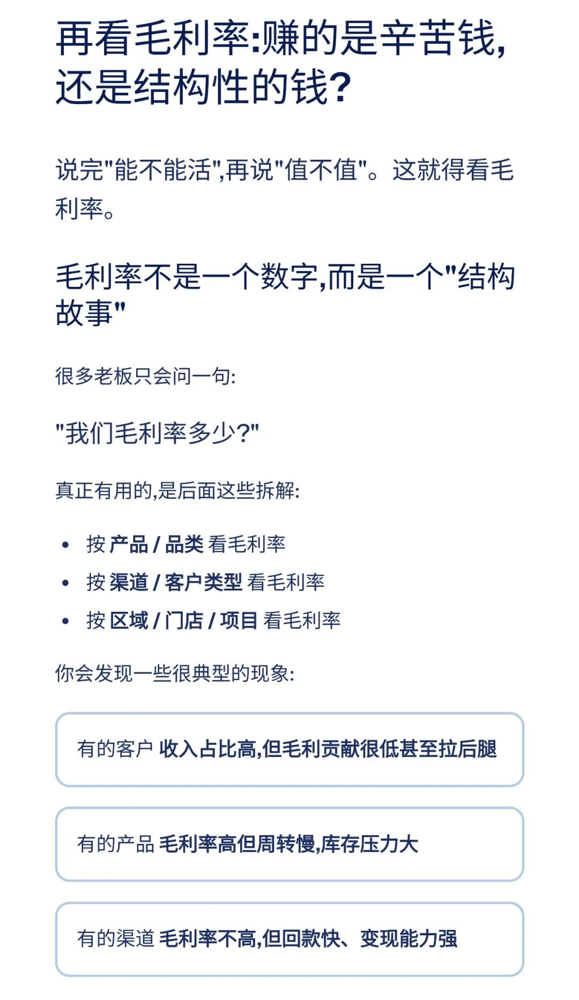

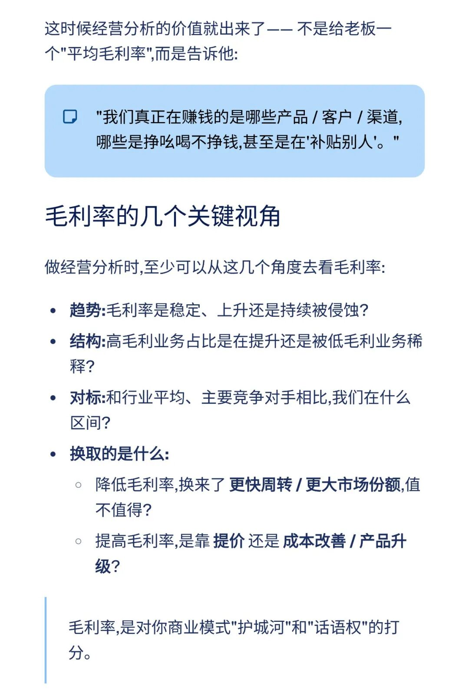

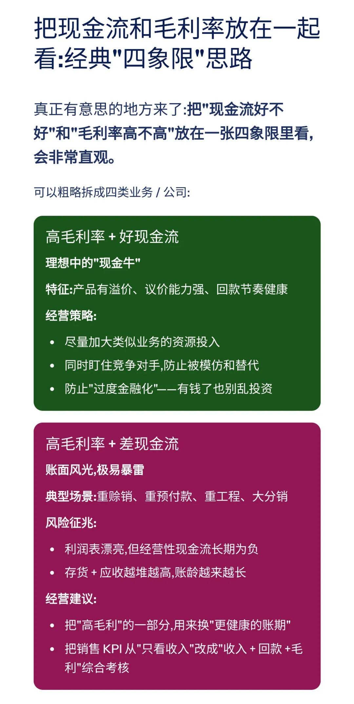

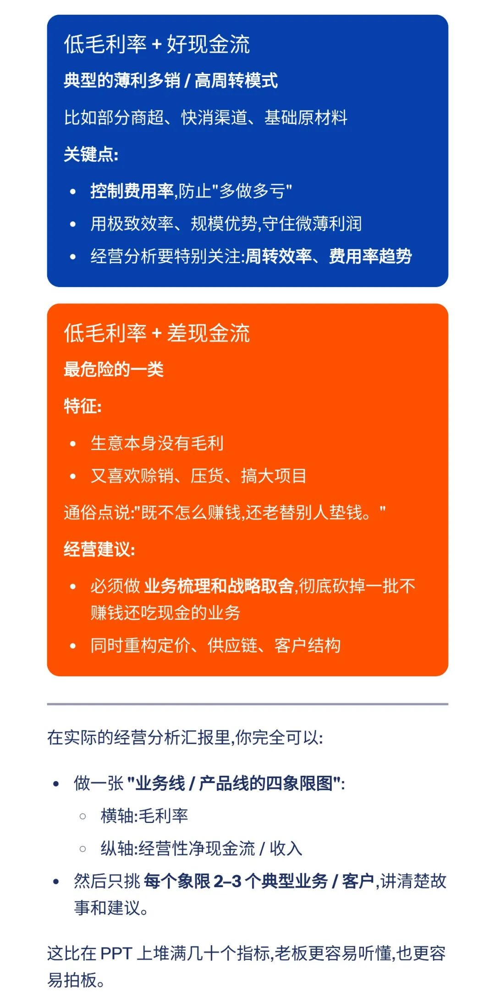

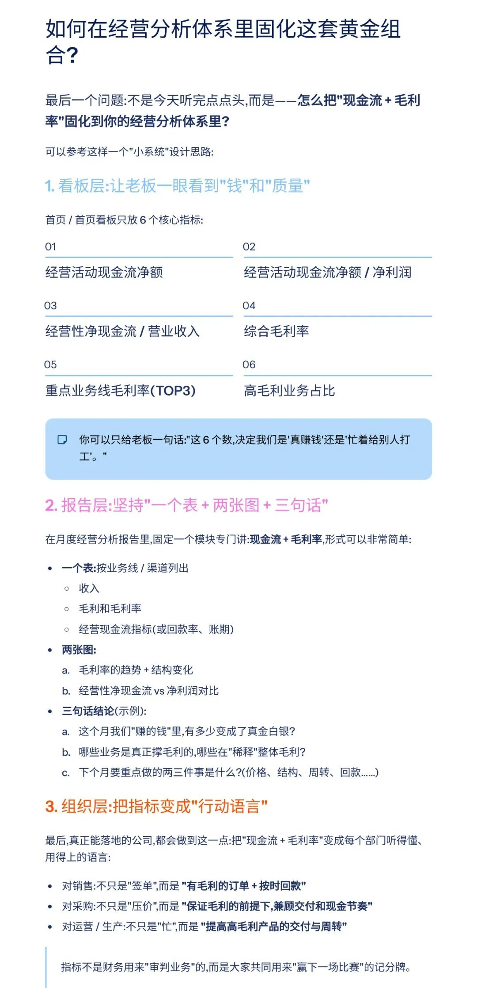

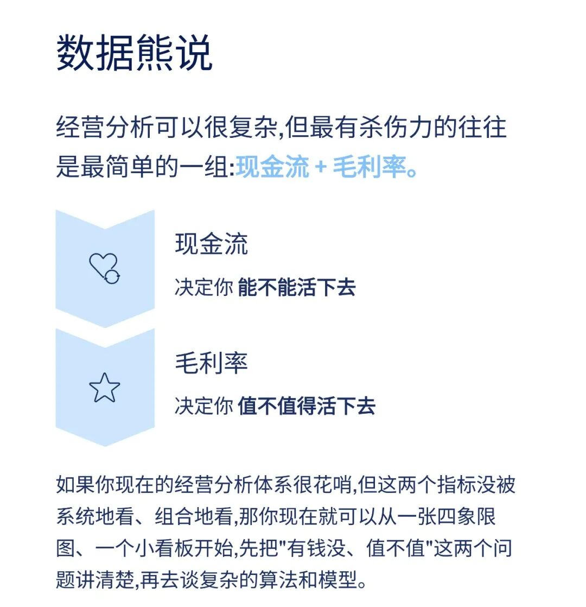

模板即思路，点击
阅读原文
获取

《2025年11月经营分析PPT模板

》

。

加入

数据熊

会员群

，与2900+精英共同成长。后台点击
「经典文章」阅读数据熊10W+爆文，
模板定制添加数据熊微信：

Daniel-songyq

往期推荐

2025年总经理工作总结（可下载PPT）

2026年全面预算套表.xlsx

2025年10月经营分析PPT框架（可下载PPT模板）

本量利分析模型.xlsx

点赞

和

转发

就是最大的支持，关注数据熊，工作更轻松。

