# 做好经营分析，先要看懂三大财务报表

> 来源：微信公众号「数据熊」 · 作者 宋岳清 · 发布于 2025-12-05 11:03
> 原文链接：http://mp.weixin.qq.com/s?__biz=Mzg2MTg5OTgzNA==&mid=2247492971&idx=1&sn=1e8a1b2604fc1f2f755612163e1b625b&chksm=ce12b83ef9653128fb418def6d487edda5d599041dbd749ede3a0bf88119ce01efb1f421ead3
> 摘要：模板即思路，点击阅读原文获取《制造业经营分析套表.xlsx》。加入数据熊会员群，与2900+精英共同成长。

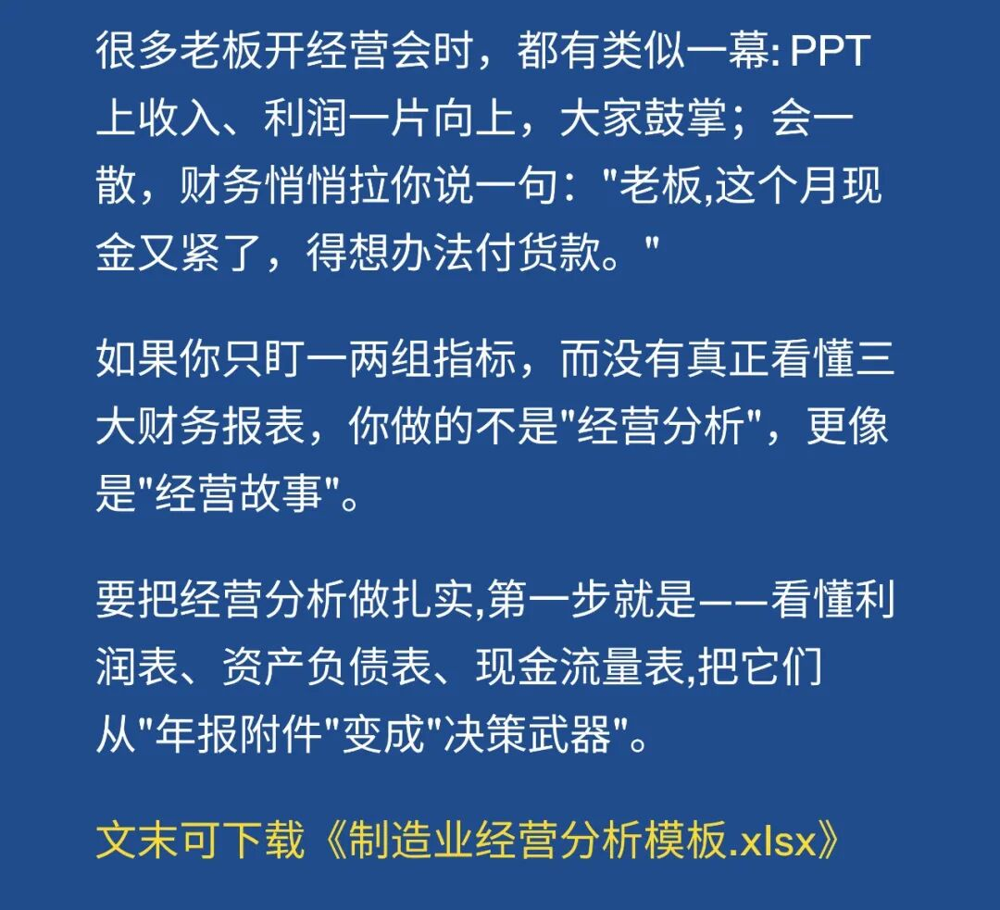

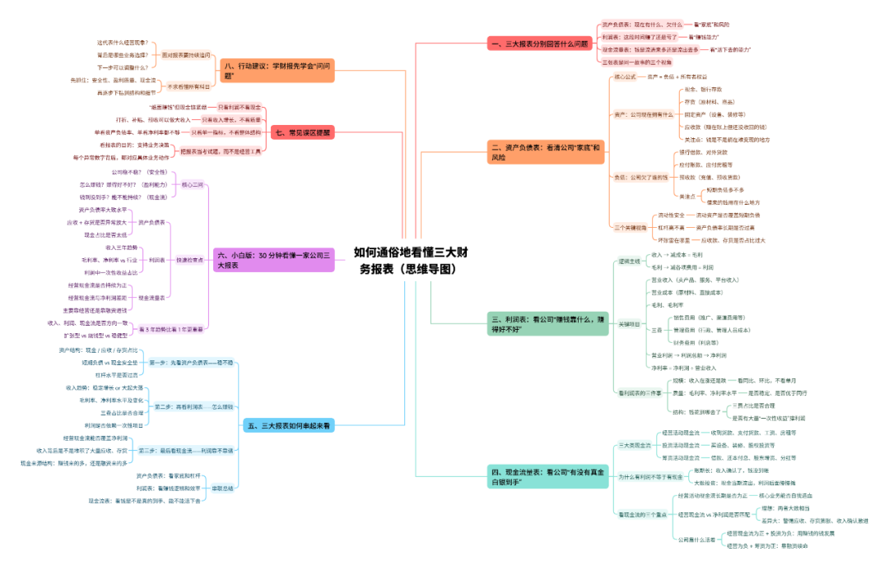

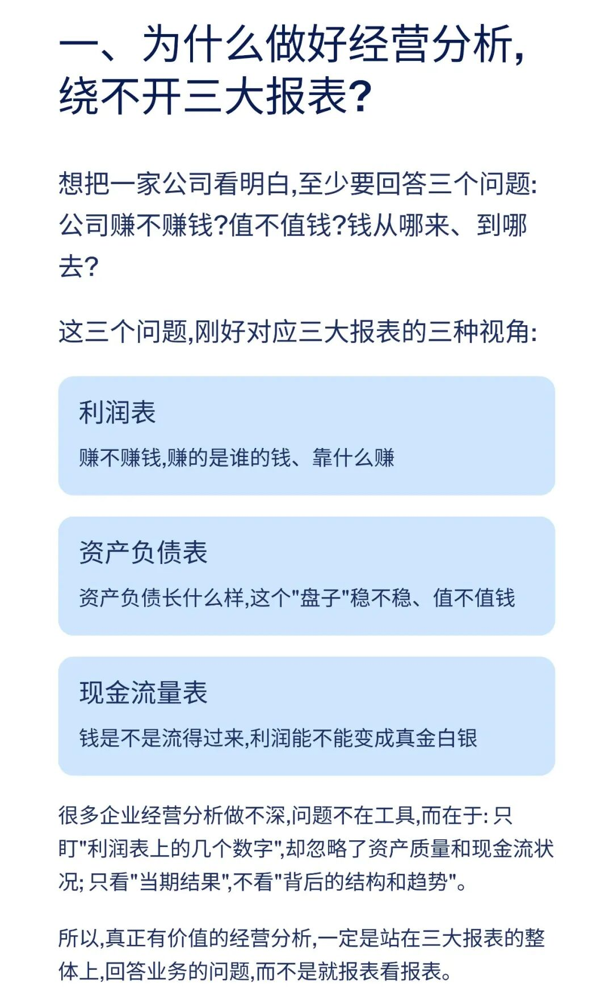

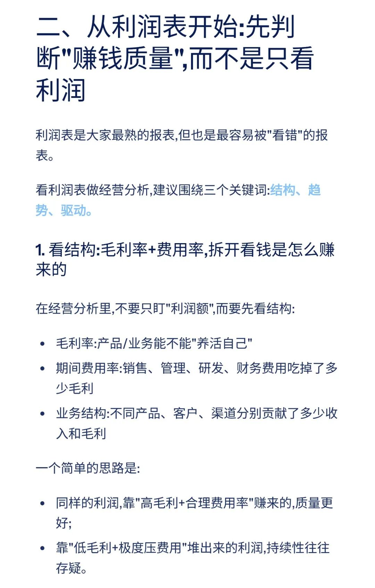

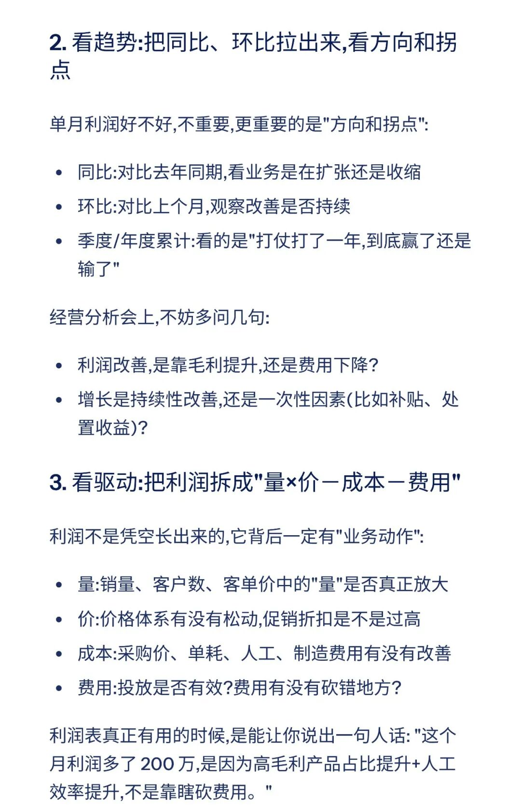

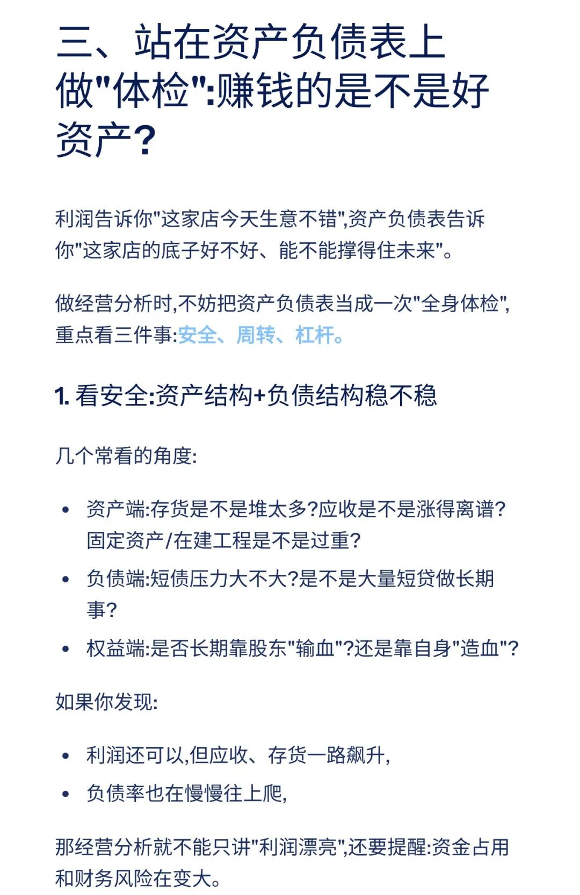

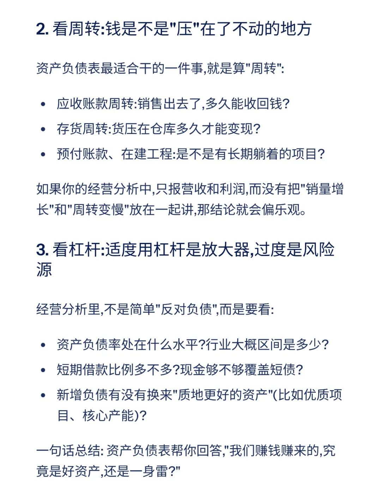

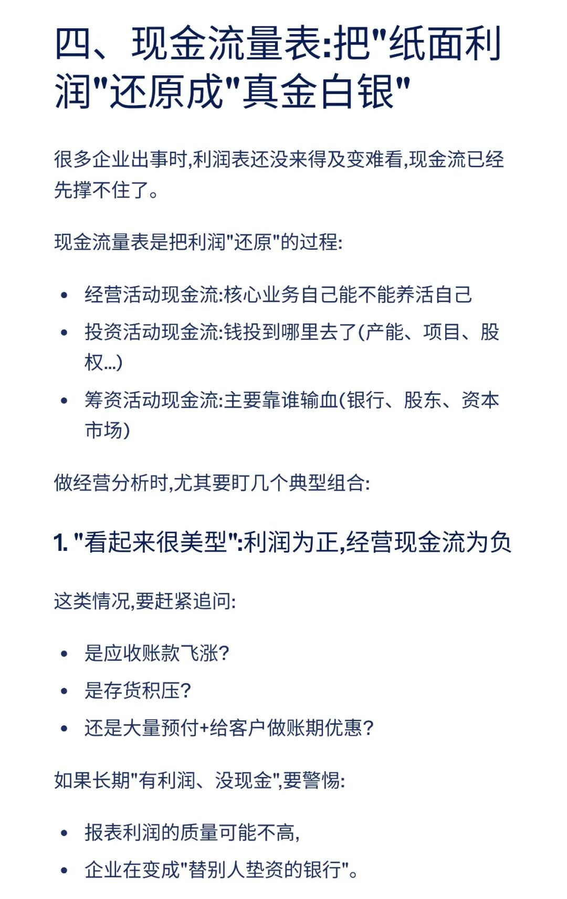

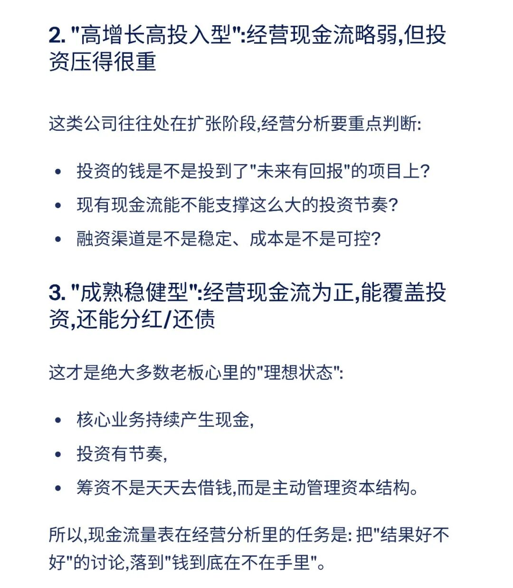

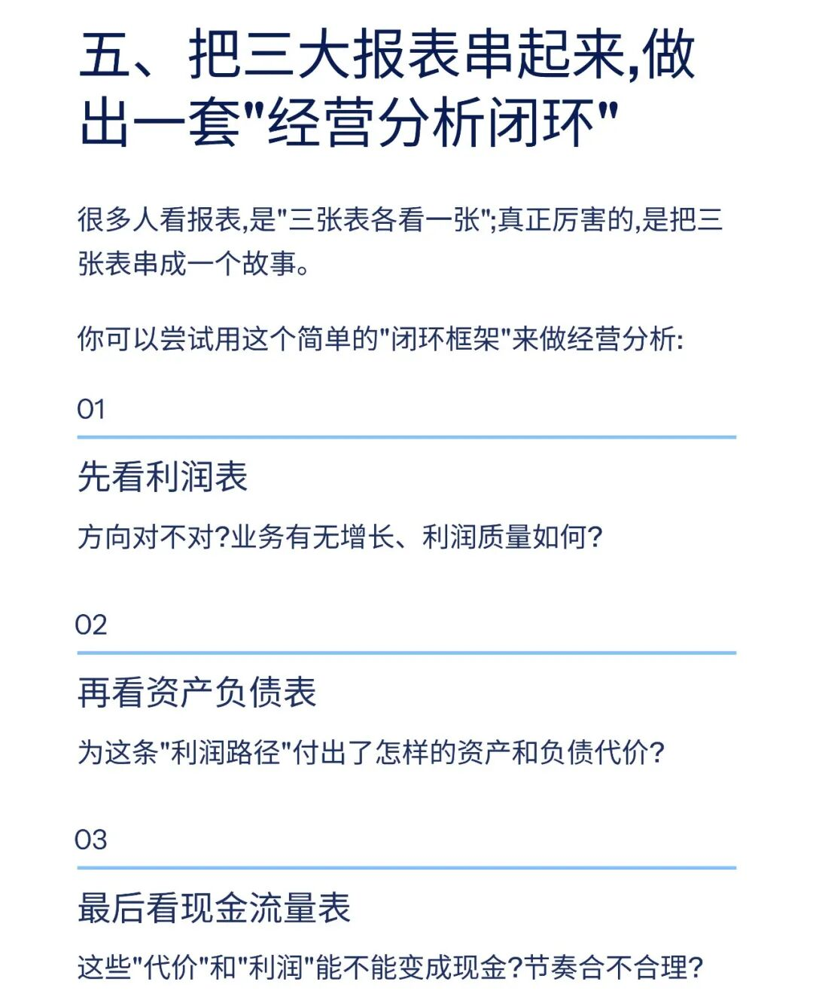

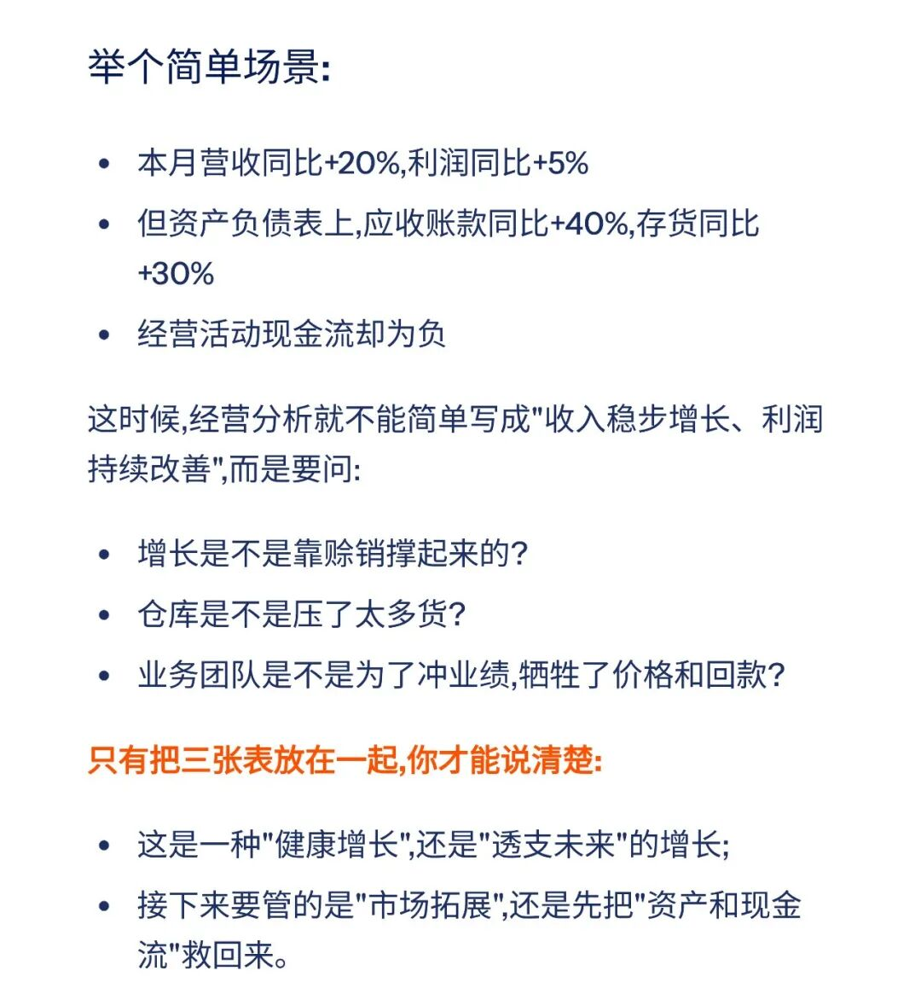

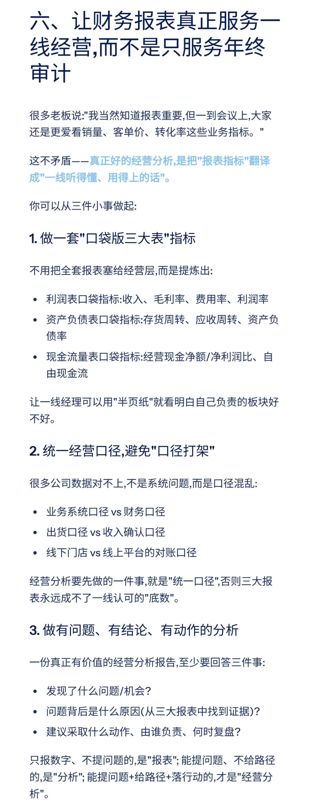

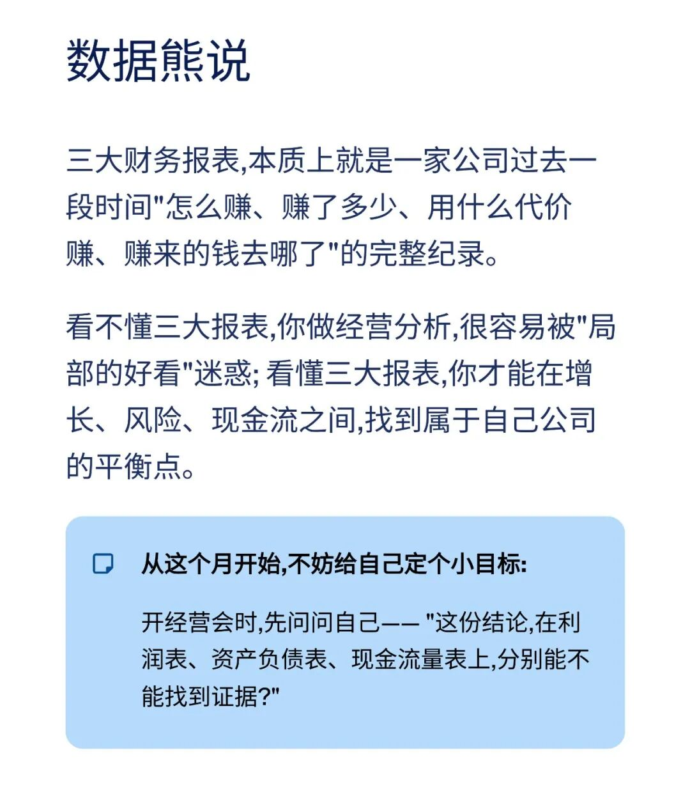

模板即思路，点击
阅读原文
获取

《

制造业经营分析套表.xlsx

》

。

加入

数据熊

会员群

，与2900+精英共同成长。后台点击
「经典文章」阅读数据熊10W+爆文，
模板定制添加数据熊微信：

Daniel-songyq

往期推荐

2025年总经理工作总结（可下载PPT）

2026年全面预算套表.xlsx

2025年10月经营分析PPT框架（可下载PPT模板）

本量利分析模型.xlsx

点赞

和

转发

就是最大的支持，关注数据熊，工作更轻松。

