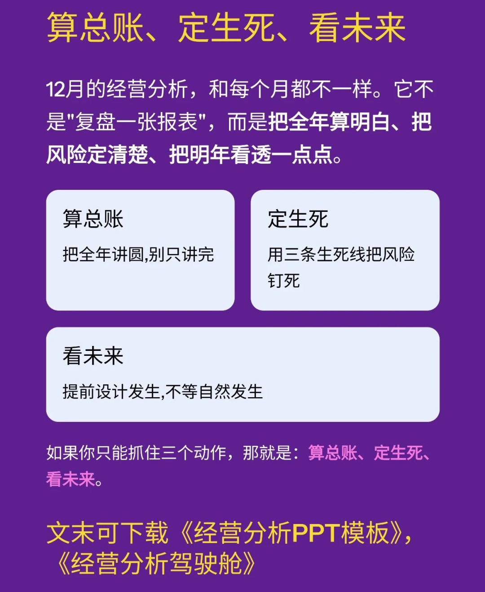
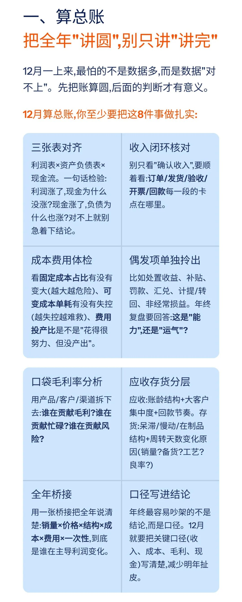
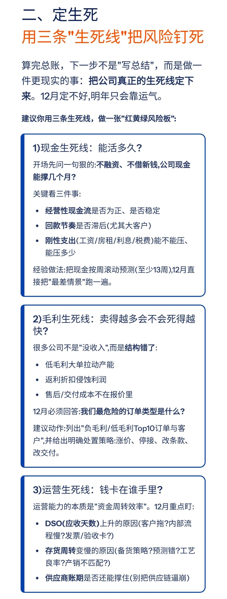
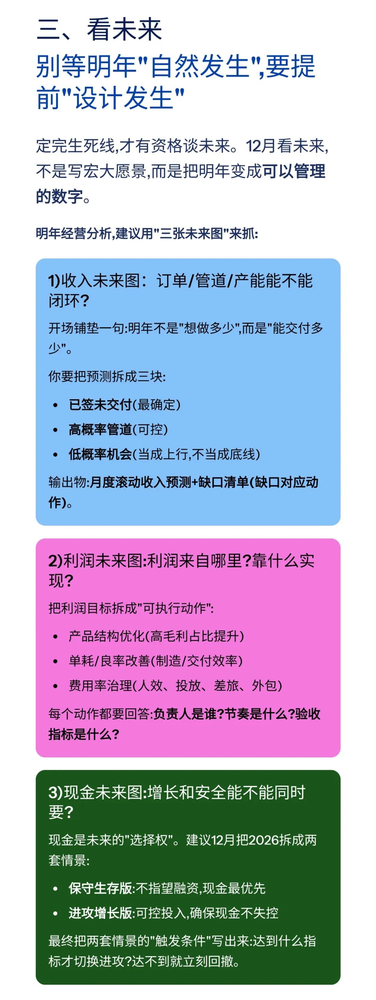
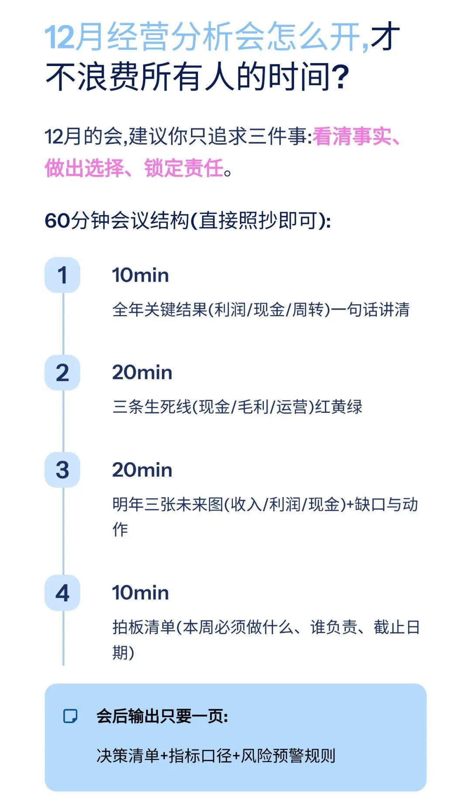

# 2025年12月经营分析要点：算总账、定生死、看未来

> 来源：微信公众号「数据熊」 · 作者 宋岳清 · 发布于 2025-12-14 18:39
> 原文链接：http://mp.weixin.qq.com/s?__biz=Mzg2MTg5OTgzNA==&mid=2247493280&idx=1&sn=54366713a59d2c20ac6cd0aa36c65b68&chksm=ce12bbf5f96532e38b9ace56dc13b21cf25cc6672786d5758eb620db391a29f2cf78be456022
> 摘要：12月的经营分析，和每个月都不一样。它不是\x26quot;复盘一张报表\x26quot;，而是把全年算明白、把风险定清楚、把明年看透一点点。

如果你希望系统性搭建：

- 经营分析体系、

- 成本核算与定价模型、
- 预算&资金测算工具、
- 各类可视化分析模板，

加入

数据熊

会员群

，与3000+精英共同成长。后台点击
「经典文章」阅读数据熊10W+爆文，
模板定制添加数据熊微信：Daniel-songyq

往期推荐

数据熊丨应收账款分析模型

「经营分析驾驶舱」终于做好了：一场会议看清收入、利润和现金流

现金流预测模型.xlsx

盈亏平衡点的六个应用场景（附Excel模板）

数据熊 | 产品定价模型：成本倒推、竞品锚定、动态调价

数据熊 | 2025版个税筹划智能计算器pro 正式发布

点击阅读原文，下载《经营分析驾驶舱》。点赞

和

转发

就是最大的支持，关注数据熊，工作更轻松。

