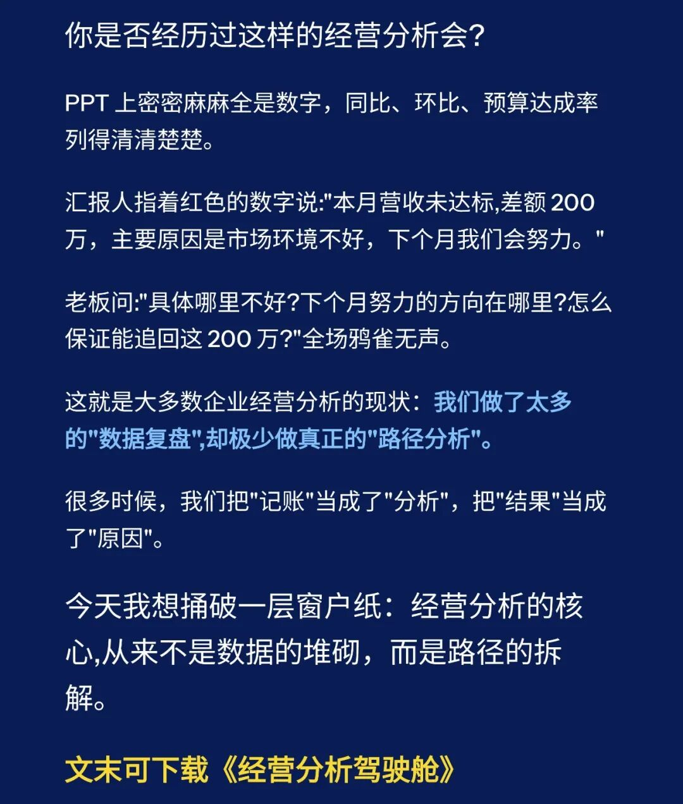
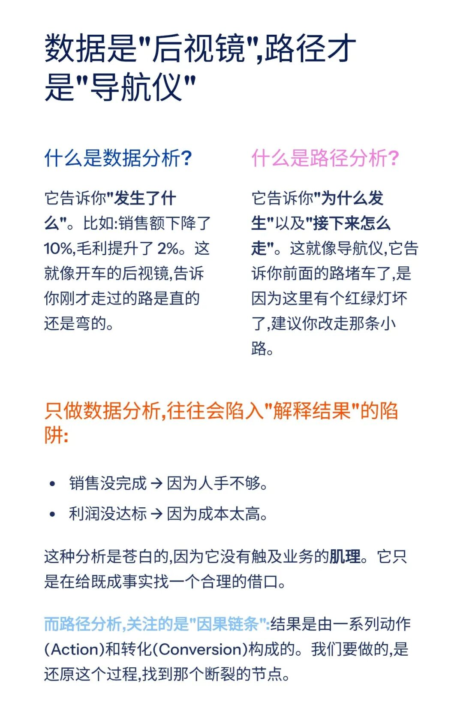
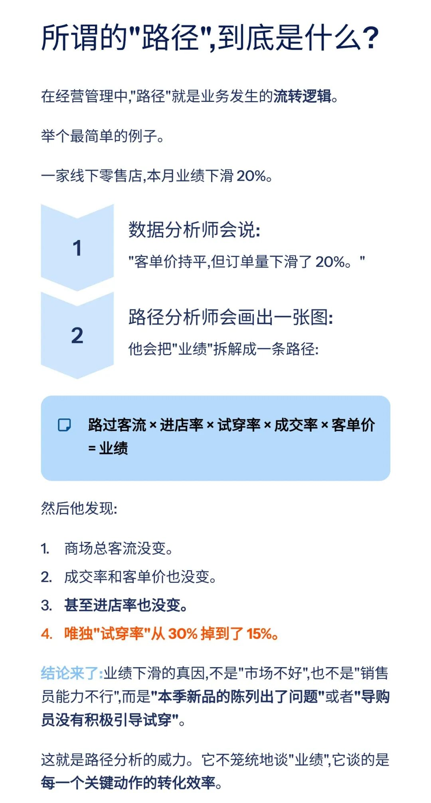
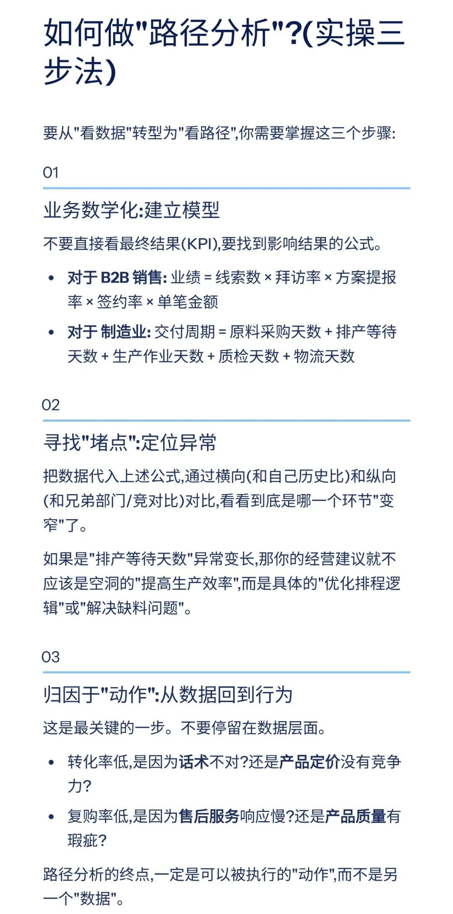
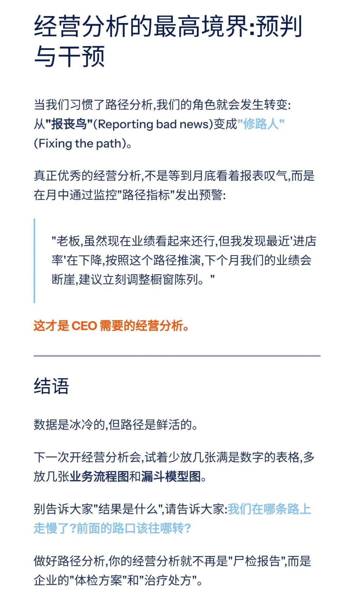
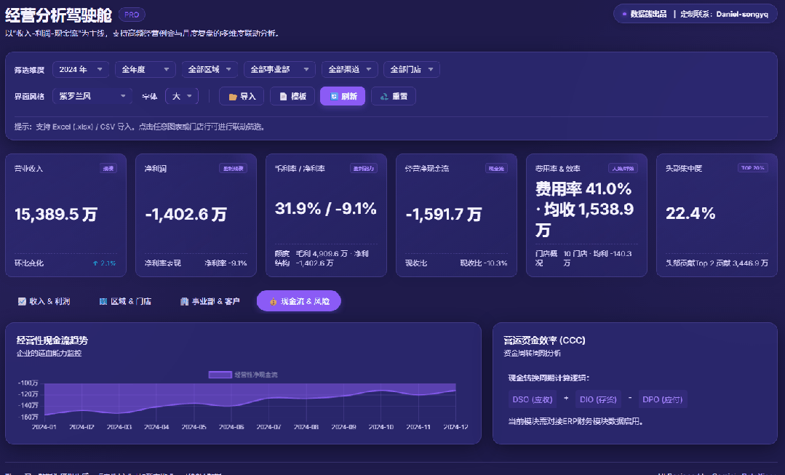
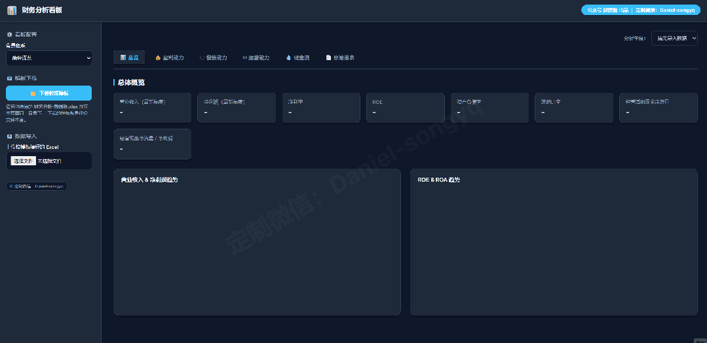
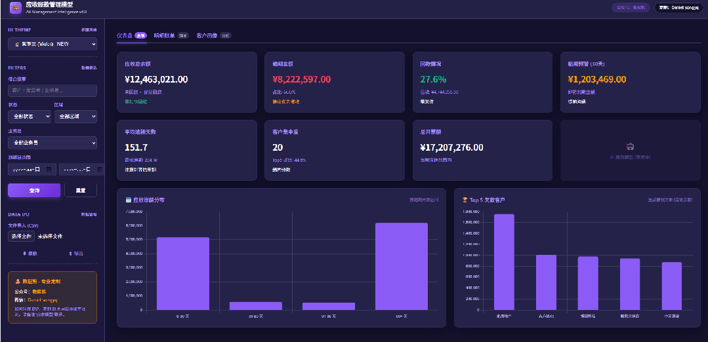

# 经营分析的核心，从来不是"数据的堆砌"，而是“路径的拆解”

> 来源：微信公众号「数据熊」 · 作者 宋岳清 · 发布于 2025-12-15 11:00
> 原文链接：http://mp.weixin.qq.com/s?__biz=Mzg2MTg5OTgzNA==&mid=2247493314&idx=1&sn=530bcf668d991d31c755d022d42a015f&chksm=ce12bb97f965328180ef95b0afa0deeb3d4de0b73d8f488a01f601f8794e7a5341eac80d37c3
> 摘要：很多时候，我们把\x26quot;记账\x26quot;当成了\x26quot;分析\x26quot;，把\x26quot;结果\x26quot;当成了\x26quot;原因\x26quot;。今天我想捅破一层窗户纸：经营分析的核心,从来不是数据的堆砌，而是路径的拆解。

如果你希望系统性搭建：

- 经营分析体系、

- 成本核算与定价模型、
- 财务分析模型

- 预算&资金测算工具、
- 各类可视化分析模板，

往期推荐

数据熊丨应收账款分析模型

「经营分析驾驶舱」终于做好了：一场会议看清收入、利润和现金流

现金流预测模型.xlsx

盈亏平衡点的六个应用场景（附Excel模板）

数据熊 | 产品定价模型：成本倒推、竞品锚定、动态调价

数据熊 | 2025版个税筹划智能计算器pro 正式发布

文末点击阅读原文，下载《经营分析驾驶舱》。

加入

数据熊

会员群

，与3000+精英共同成长。

后台点击
「经典文章」阅读数据熊10W+爆文

模板定制添加数据熊微信：Daniel-songyq
