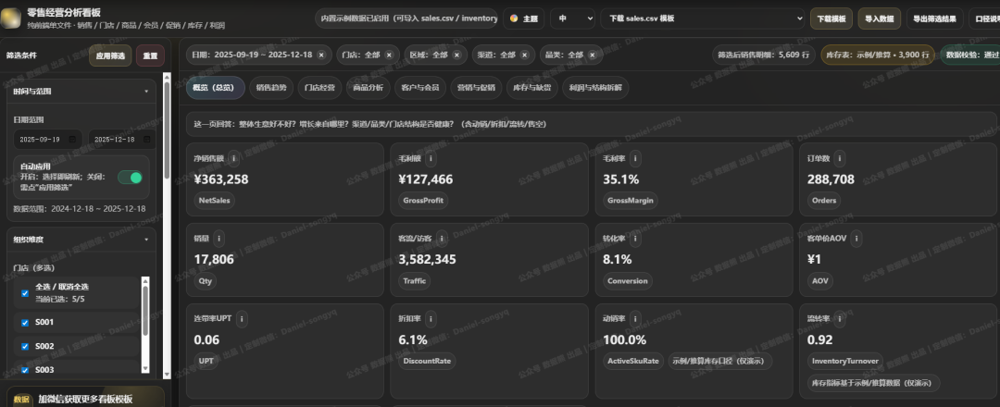
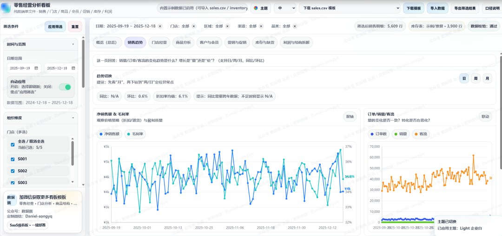
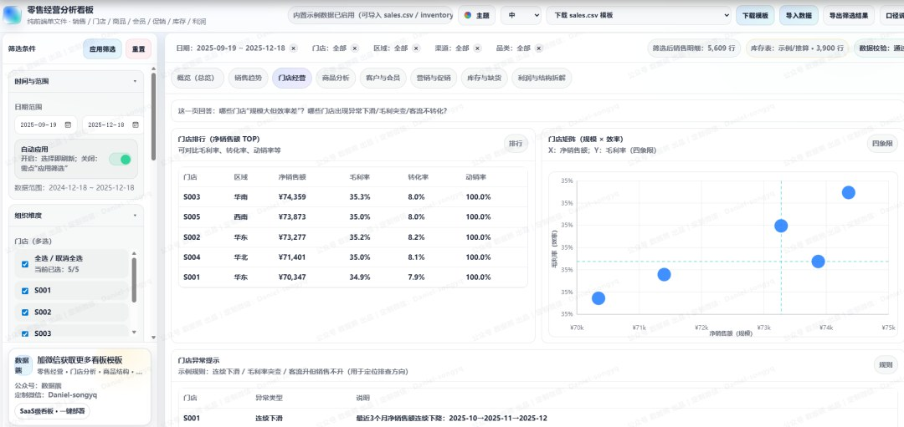
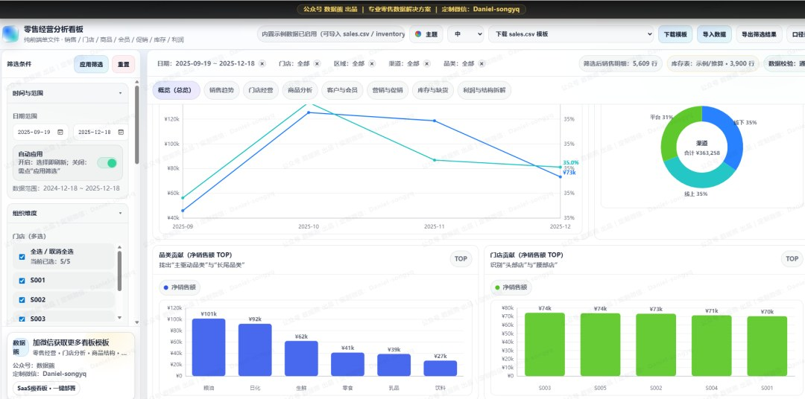

# 一张看板搞定零售经营分析：动销率、流转率、售空率、售罄SKU占比

> 来源：微信公众号「数据熊」 · 作者 宋岳清 · 发布于 2025-12-19 07:30  
> 原文链接：http://mp.weixin.qq.com/s?__biz=Mzg2MTg5OTgzNA==&mid=2247493572&idx=1&sn=a624138a477e176ca2441937fc1bd670&chksm=ce12ba91f965338745b03f780ae1c976cc8f0f19155783d1382198189f5a7724832f15cc8220

## 你的经营数据，可能一直在“分散”和“滞后”

做零售经营，最常见的状态是：

- 销售额在看，但

   净销售/毛利/折扣/退货

   并没有统一口径；
- 门店排行能出，但不知道“规模大”是否意味着“效率高”；
- 商品能卖，但

   动销、长尾、折扣敏感

   难以量化；
- 库存和缺货在另一个表里，

   周转、售空、售罄

   更难串起来；
- 每次复盘都在“拼表+复制粘贴”，很难形成可持续的分析习惯。

我们做了一个更轻量、更贴近业务使用场景的工具：

零售经营分析看板（单文件版）

——打开浏览器即可运行，把经营复盘从“堆表格”升级成“看结构、找原因、可追溯”。

文末可下载《零售分析看板》

---

## 这是什么：一份「纯前端单文件」零售经营驾驶舱

它的特点很直接：

- 一个HTML文件

   ，无需后端、无需部署复杂系统；
- 支持导入你的数据：

   sales.csv / inventory.csv

   ；
- 也自带示例数据，打开就能体验；
- 面向零售经营常用场景，把分析拆成

   8大模块

   ：

   概览、趋势、门店、商品、客户与会员、营销促销、库存缺货、利润拆解

   。

---

## 为什么它好用：把“经营问题”翻译成“可落地的指标与页面”

### 1）先给你结论的总览页：规模、效率、结构一起看

在「概览」里，你能一次看到：

- 净销售额、毛利额、毛利率

   （盈利质量）
- 订单、销量、客流、转化率、客单价AOV、连带率UPT

   （效率链路）
- 折扣率、退货率

   （价格策略与风险）
- 动销率、流转率、售空率、售罄SKU占比

   （商品与库存健康度）

并且配套趋势与结构图：

- 净销售额 & 毛利率双轴趋势
- 渠道占比、品类贡献、门店贡献TOP

   让“生意好不好、好在哪里、问题在哪”更快有答案。

### 2）趋势不是“看曲线”，而是“定位异常”

在「销售趋势」页，你可以按

日/周/月

切换粒度：

- 先看月，判断阶段性趋势；
- 再下钻到周/日，定位异常点； 并给出同比/环比的基础判断（数据不足会提示N/A）。

### 3）门店经营：用“规模×效率”四象限找对动作

在「门店经营」页：

- 门店排行不仅看净销售额，还能对比

   毛利率、转化率、动销率

   ；
- 用散点矩阵把门店放进四象限：

### 4）商品分析：把SKU从“卖得多”拆到“卖得值”

在「商品分析」页：

- TOP SKU会同步展示

   毛利率、折扣率、退货率

   ，避免“卖得多但不赚钱”；
- 尾部SKU帮助识别“低效/滞销”对象；
- 支持ABC分级（按净销售贡献累计划分），让优化更有抓手。

### 5）营销促销：促销到底是在“拉规模”还是“吃利润”？

在「营销与促销」页：

- 直接对比

   促销 vs 非促销

    的净销售、毛利率、折扣率、退货率；
- 给出进一步做ROI的字段扩展建议（如营销费用字段）。

### 6）库存缺货：把“感觉缺货”变成“可量化预警”

导入 inventory.csv 后，可启用库存相关指标：

- 流转率（数量口径）
- 售空率（Sell-through）
- 售罄SKU占比
- 缺货率与缺货TOP SKU

   并提供“畅销缺货预警”的示例规则，帮助你把缺货管理变成可追踪的动作清单。

### 7）利润拆解：用毛利桥讲清“利润被谁吃掉”

在「利润与结构拆解」页，通过毛利桥（Waterfall）展示：

GrossSales → 折扣 → 退货 → NetSales → 成本 → 毛利额

让团队讨论从“感受”回到“结构”。

---

## 使用方式（3步上手）

1. 打开看板文件

    ：浏览器直接打开单文件即可使用（自带示例数据）。
2. 下载模板并准备数据

    ：右上角可下载

    sales.csv / inventory.csv

     模板。
3. 导入数据并开始筛选

    ：支持日期范围、门店/区域/渠道/品类多选，会员/促销筛选与SKU搜索；筛选可选择自动应用或手动应用。

额外加分项：

- 可一键

   导出当前筛选后的 sales_filtered.csv

   ，方便进一步深挖；
- 内置“

   指标口径说明（含降级策略）

   ”，字段不全会提示原因，避免误读。

---

## 数据准备建议（你可以按“先跑起来，再逐步完善”）

### 必备：销售数据（sales.csv）

核心字段覆盖：日期、门店、区域、渠道、品类、SKU、销量、销售额、折扣、退货、成本、订单、客流、会员相关、促销标记等。

### 推荐：库存数据（inventory.csv）

用于启用周转、售空、缺货等库存指标；并支持可选字段（入库/出库/缺货标记等）。

### 进阶：想做更完整会员/复购/RFM

可扩展 user_id / order_id / 订单时间等字段，后续可升级到更精细的用户分层与运营策略。

---

## 适合谁用

- 零售老板/经营负责人：要快速掌握经营全局与利润结构
- 运营/商品/渠道负责人：要做结构复盘与动作拆解
- 店长/区域经理：要做门店对标、异常排查
- 数据分析/BI同学：要一个轻量可复用的经营分析框架

---

## 文末：获取与定制

如果你希望：

- 按你们行业（快消/生鲜/服饰/母婴等）定制指标口径
- 增加费用项，升级到经营利润/贡献毛利
- 增加会员ID后做更完整复购与分层运营 都可以在现有框架上继续扩展。

点击

阅读原文

，下载

《

零售经营分析看板

》。点赞

和

转发

就是最大的支持，关注数据熊，工作更轻松。

PPT定制添加数据熊微信：

Daniel-songyq

往期推荐

「经营分析驾驶舱」终于做好了：一场会议看清收入、利润和现金流

数据熊 | 2025版个税筹划智能计算器pro 正式发布

数据熊 | 成本分析模型：一键导入、自动分析、参数可调

「销售分析看板」正式发布：导入即用、老板一眼看懂、还能一键换主题

