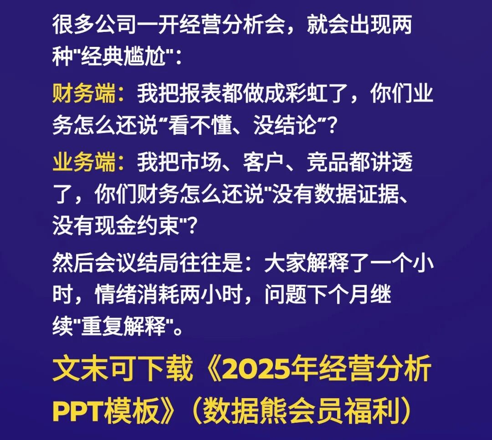
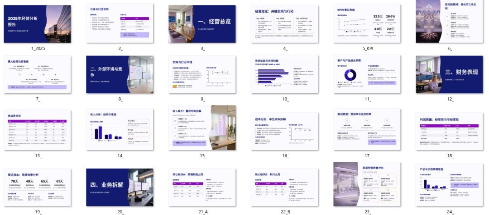
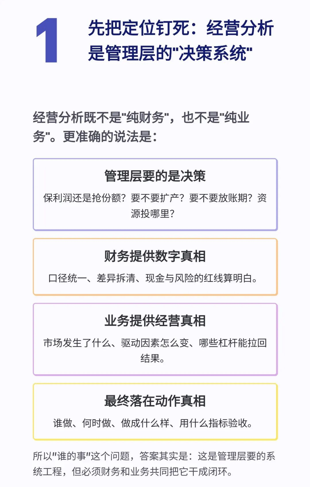
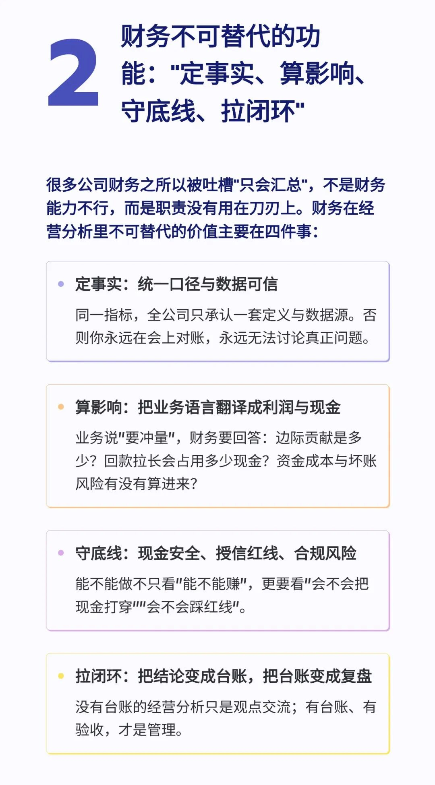
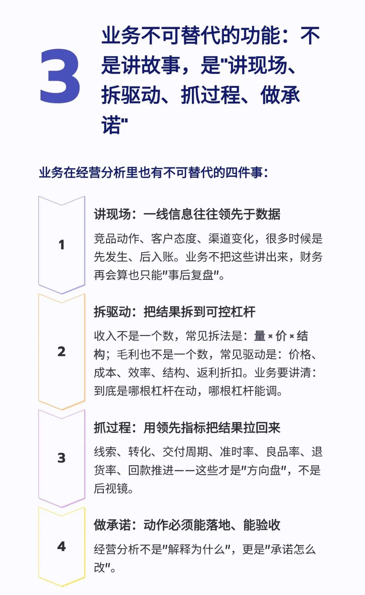
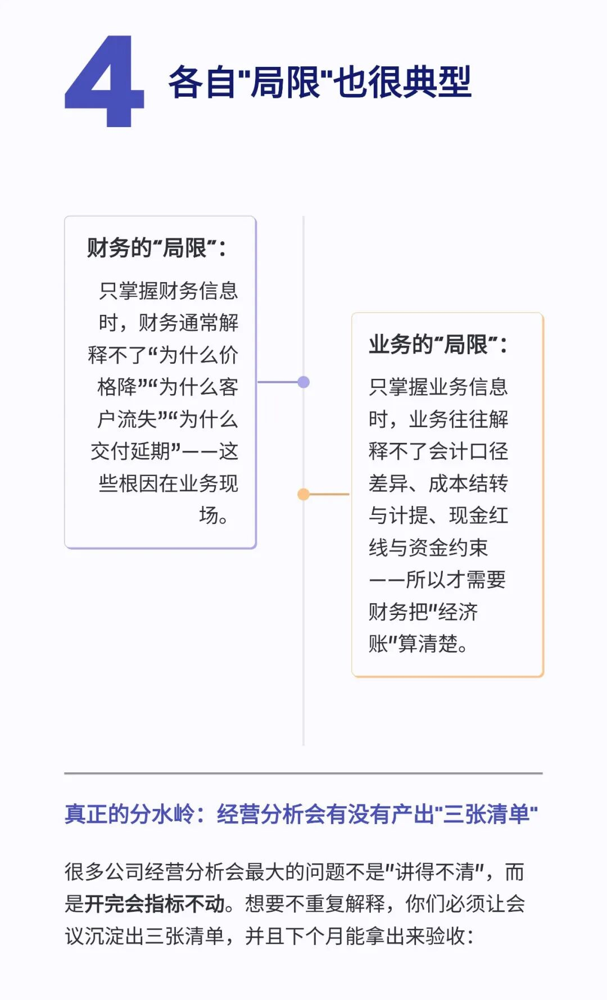
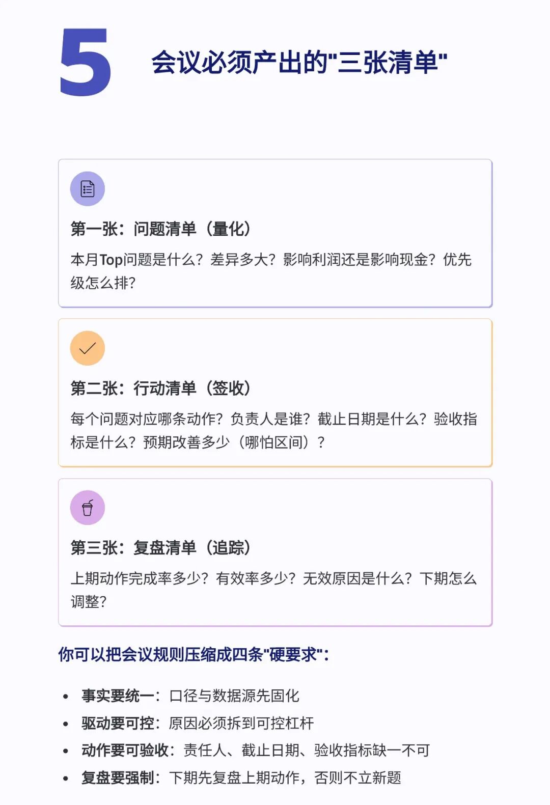
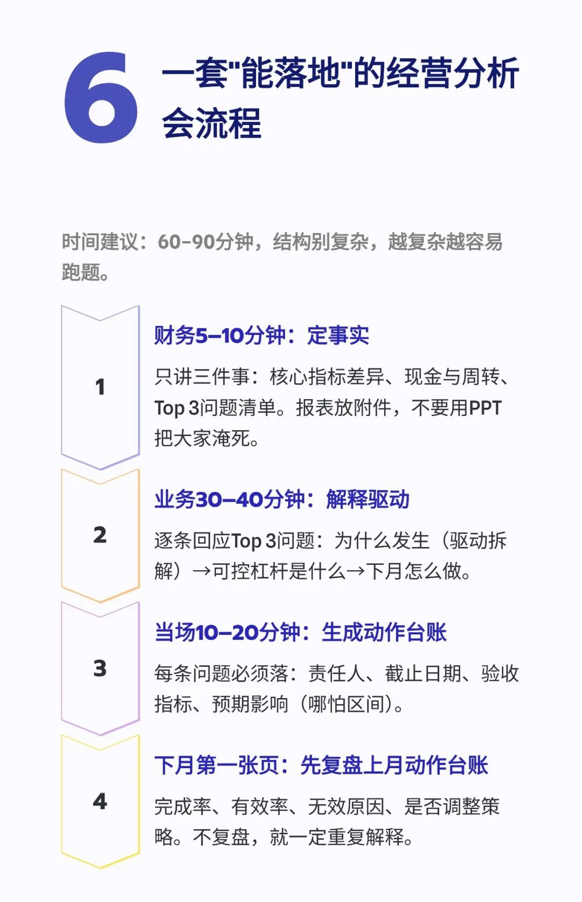

# 经营分析，到底是财务的事还是业务的？

> 来源：微信公众号「数据熊」 · 作者 运营兔 · 发布于 2025-12-21 07:30  
> 原文链接：http://mp.weixin.qq.com/s?__biz=Mzg2MTg5OTgzNA==&mid=2247493668&idx=1&sn=6358b8b3b500ed47795cbc5a34102f55&chksm=ce12b571f9653c67d00ac3f497a3969f583465a83c98c33a9ed32cc73bce360c98fc60ac7c49
> 摘要：财务端：我把报表都做成彩虹了，你们业务怎么还说“看不懂、没结论”？\x0d\x0a业务端：我把市场、客户、竞品都讲透了，你们财务怎么还说\x26quot;没有数据证据、没有现金约束\x26quot;？

不论是谁的事，年初总无法避免写PPT，模板即思路文末点击
阅读原文

《2025年经营分析PPT模板》（会员专享）

点赞

和

转发

就是最大的支持，关注数据熊，工作更轻松。

PPT定制添加数据熊微信：

Daniel-songyq

