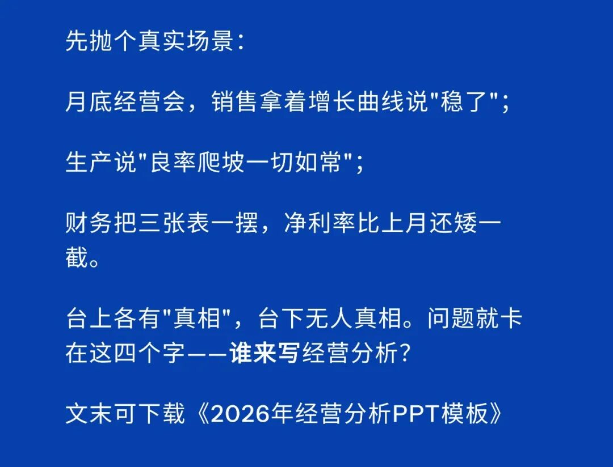
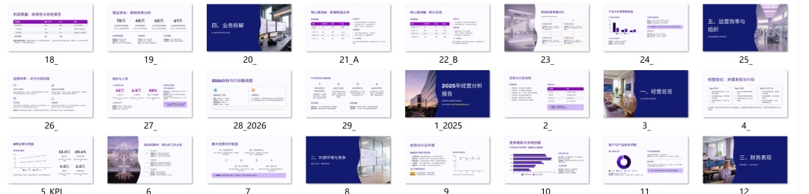
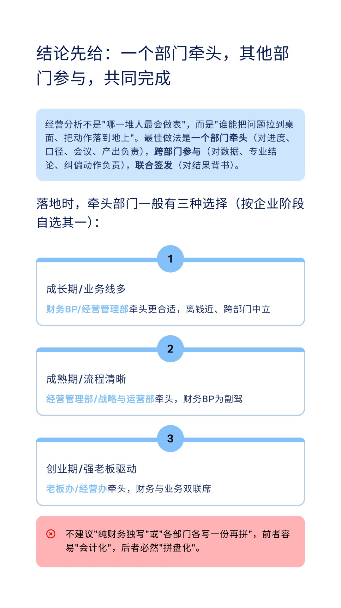
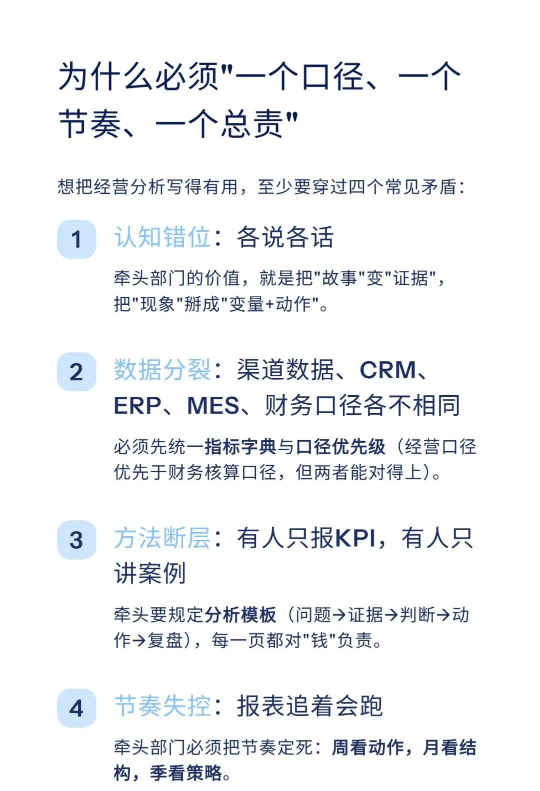
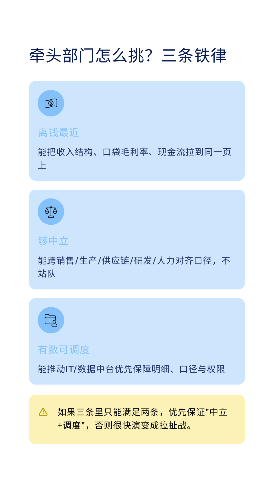
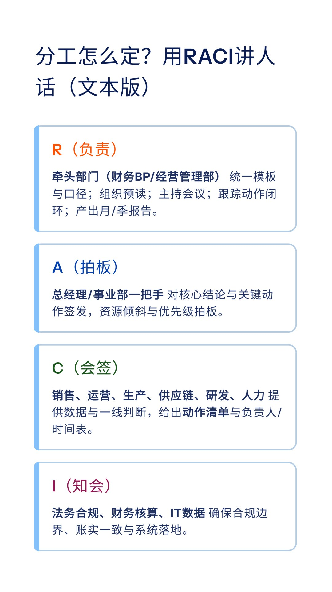
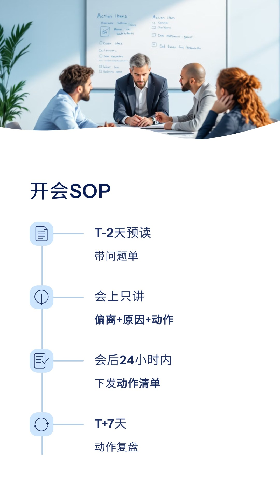
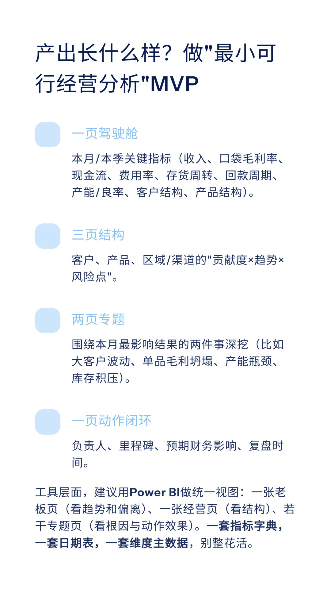
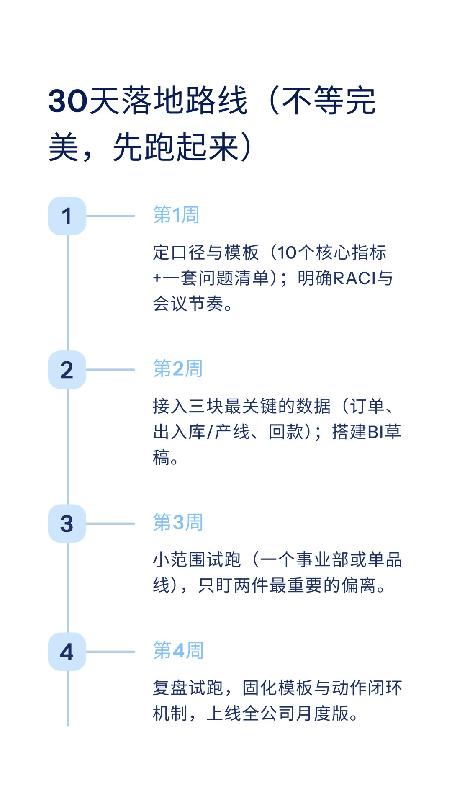
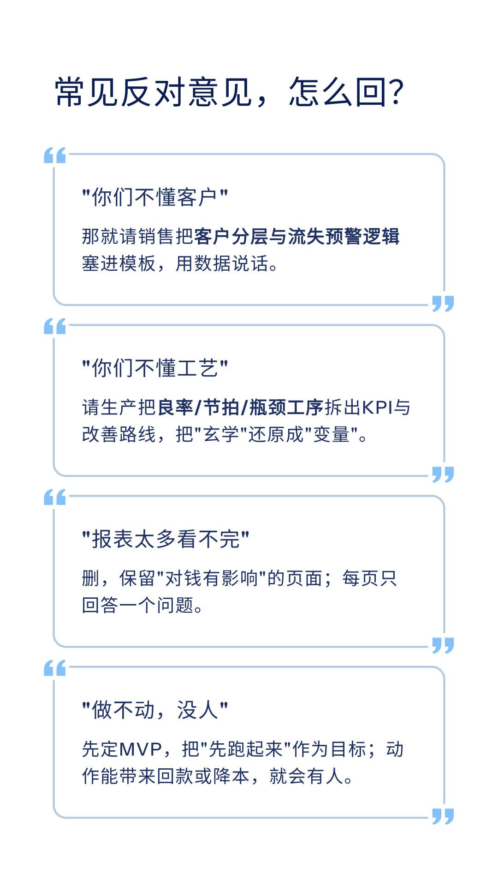

# 经营分析，到底应该由谁来写

> 来源：微信公众号「数据熊」 · 作者 宋岳清 · 发布于 2025-12-27 13:46  
> 原文链接：http://mp.weixin.qq.com/s?__biz=Mzg2MTg5OTgzNA==&mid=2247494118&idx=1&sn=3ec0599ac9b6cfb21e4af63d3d08b38c&chksm=ce12b4b3f9653da504f541667eafd0223406136c1b23bda39ceb072d67c6cf48f259d6829532
> 摘要：点击阅读原文，下载《2025年经营分析报告.pptx》。

点击

阅读原文

，下载

《

2025年经营分析报告.pptx

》。

PPT定制添加数据熊微信：

Daniel-songyq   更多模板加入

会员群

获取

往期推荐

2025年财务BP年终工作总结.pptx

2025年财务总监工作总结（PPT模板）

数据熊 | 财务分析模型：一键导入、自动计算、自动画图

数据熊丨应收账款分析模型

现金流预测模型.xlsx

