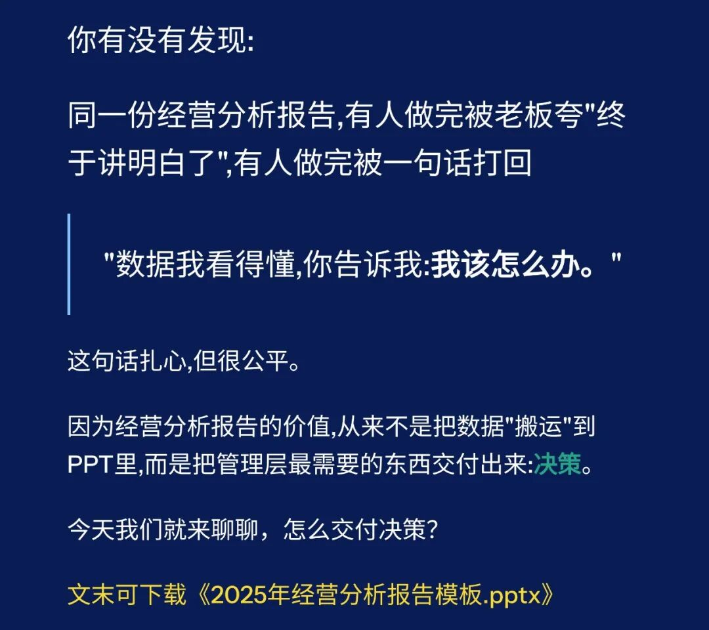
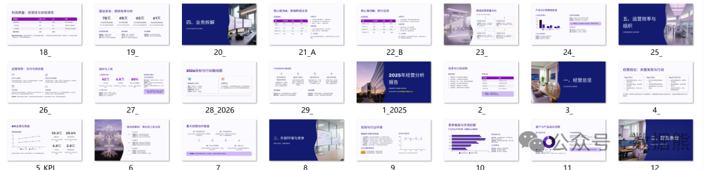
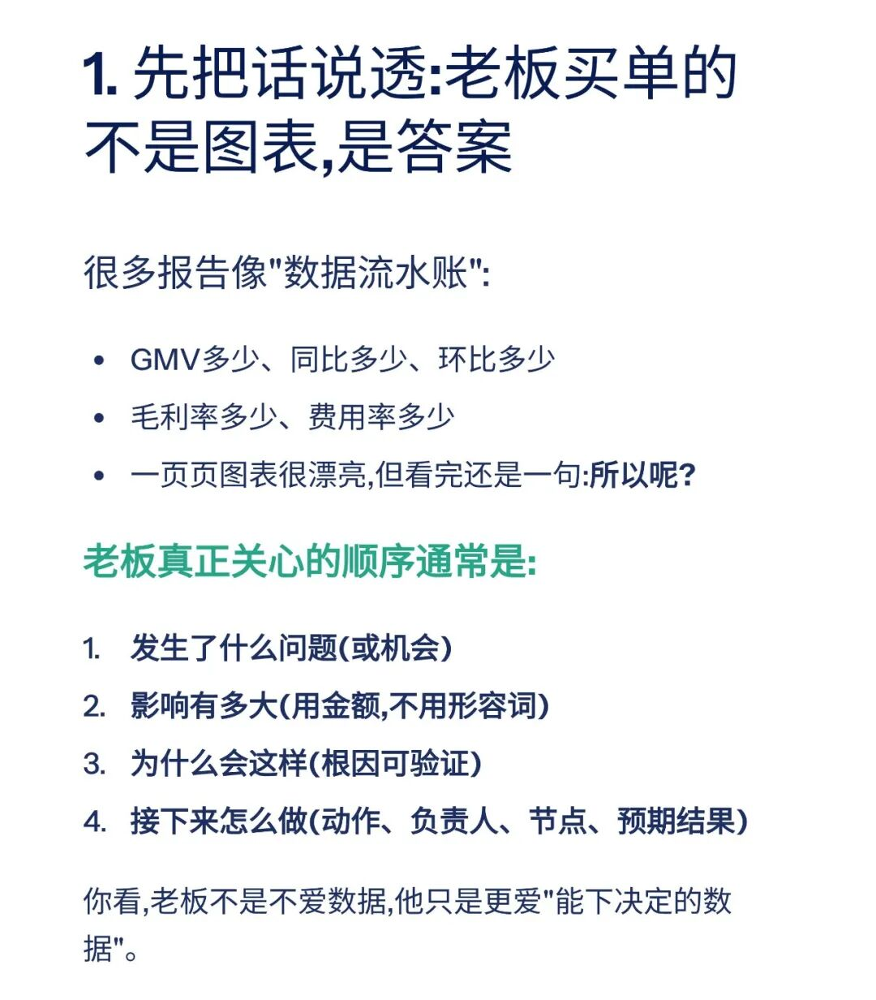
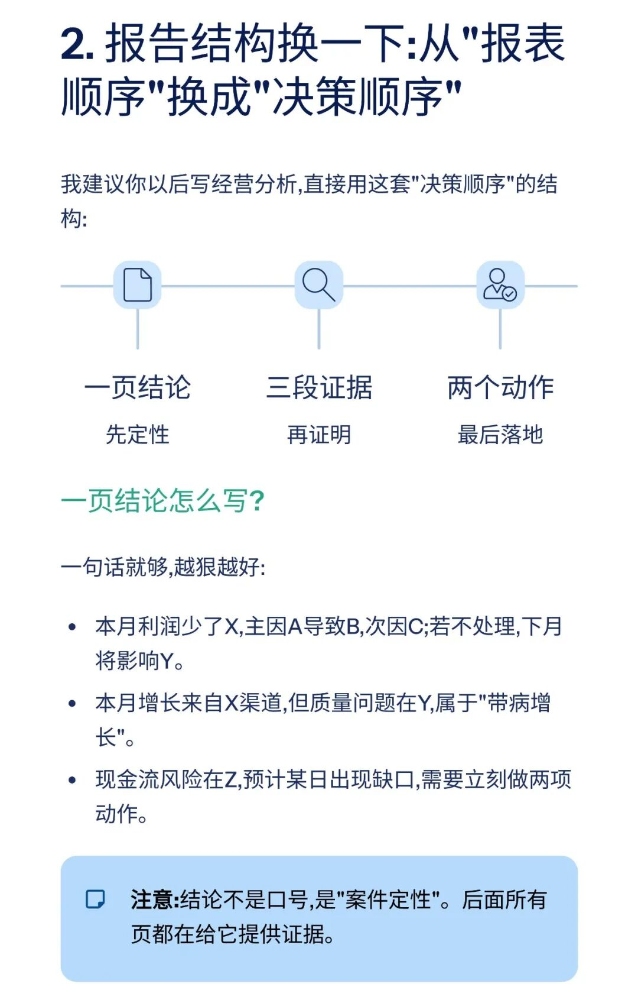
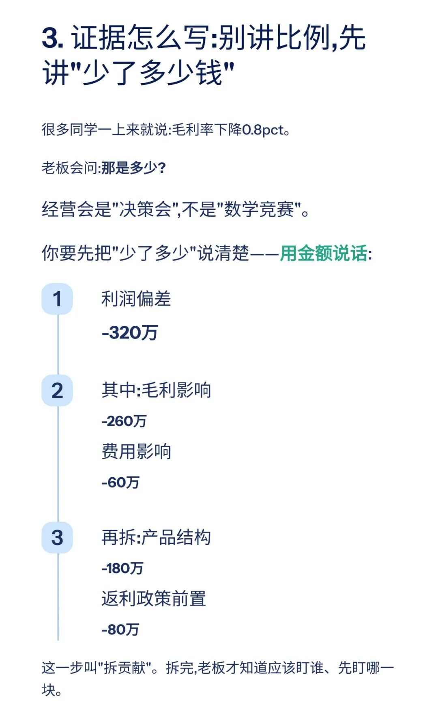
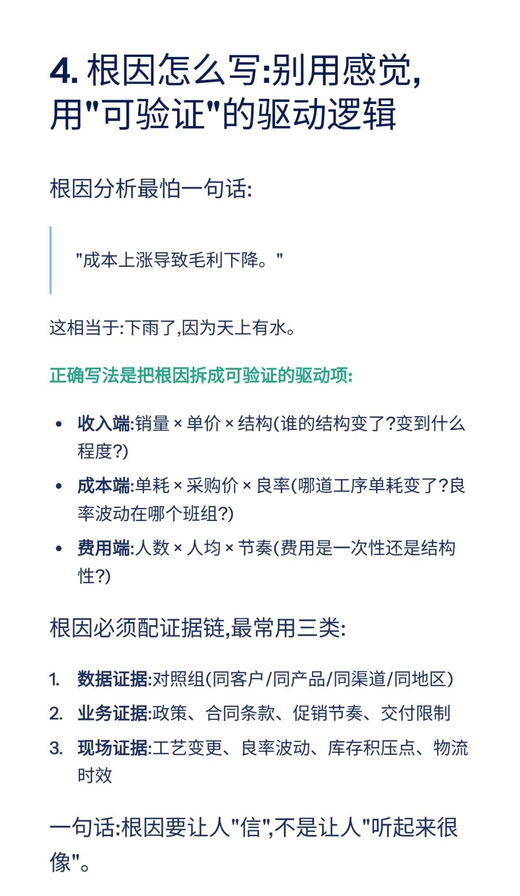
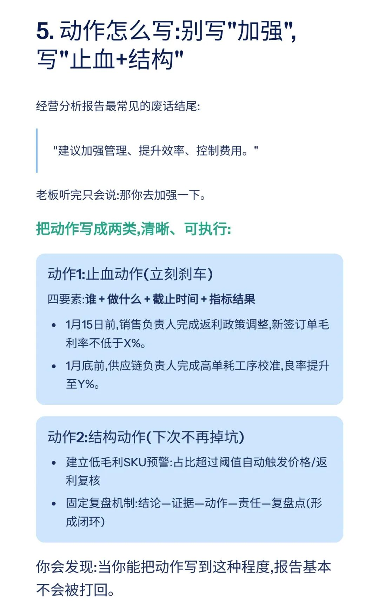
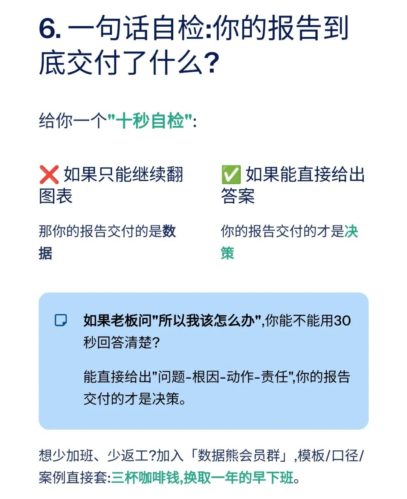
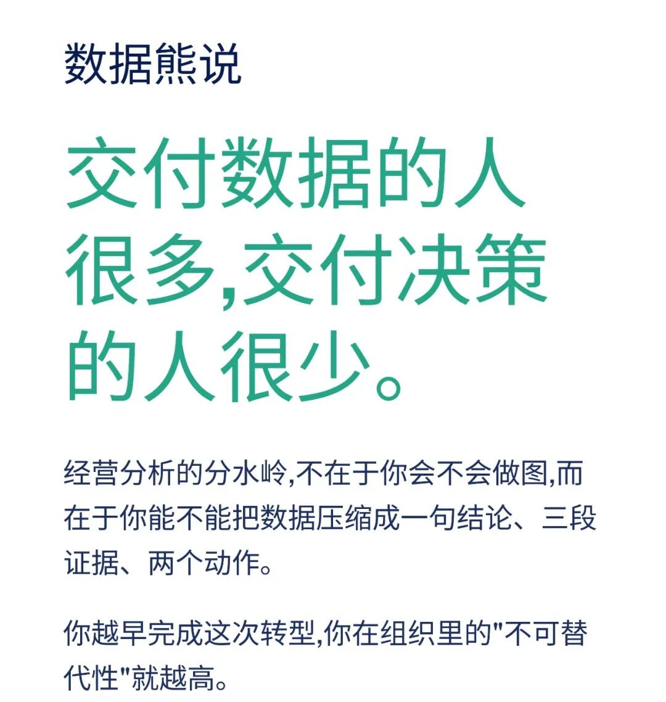

# 经营分析报告，要交付的不是数据，而是决策

> 来源：微信公众号「数据熊」 · 作者 宋岳清 · 发布于 2025-12-28 07:41  
> 原文链接：http://mp.weixin.qq.com/s?__biz=Mzg2MTg5OTgzNA==&mid=2247494154&idx=1&sn=1b98d351269a11af72d5520e7eca53e8&chksm=ce12b75ff9653e4916c9a02b9585fa6c7b0159daf4f000e0ef979628ceb052762d67e25d982f
> 摘要：点击阅读原文，下载《2025年经营分析报告.pptx》。

点击

阅读原文

，下载

《

2025年经营分析报告.pptx

》。

PPT定制添加数据熊微信：

Daniel-songyq   更多模板加入

会员群

获取

往期推荐

2025年财务BP年终工作总结.pptx

2025年财务总监工作总结（PPT模板）

数据熊 | 财务分析模型：一键导入、自动计算、自动画图

数据熊丨应收账款分析模型

现金流预测模型.xlsx

