# 美的集团经营指标体系（附excel）

> 来源：微信公众号「数据熊」 · 作者 宋岳清 · 发布于 2026-01-22 11:00  
> 原文链接：http://mp.weixin.qq.com/s?__biz=Mzg2MTg5OTgzNA==&mid=2247495749&idx=1&sn=1822cca78ec2816442190a5ff8dec2a5&chksm=ce12ad10f965240628161eca11994227299642d891fbb6c8c89ff05da192670b68242941e73d

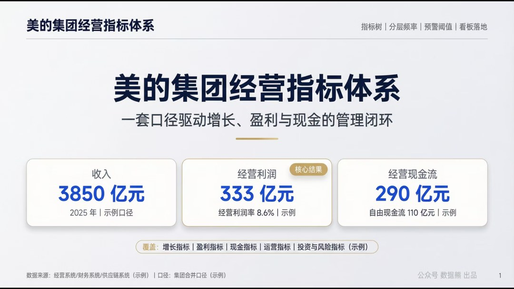

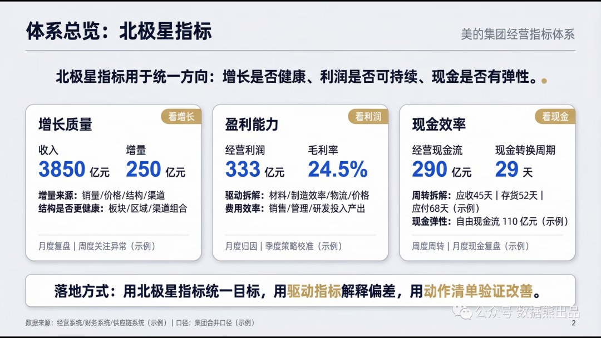

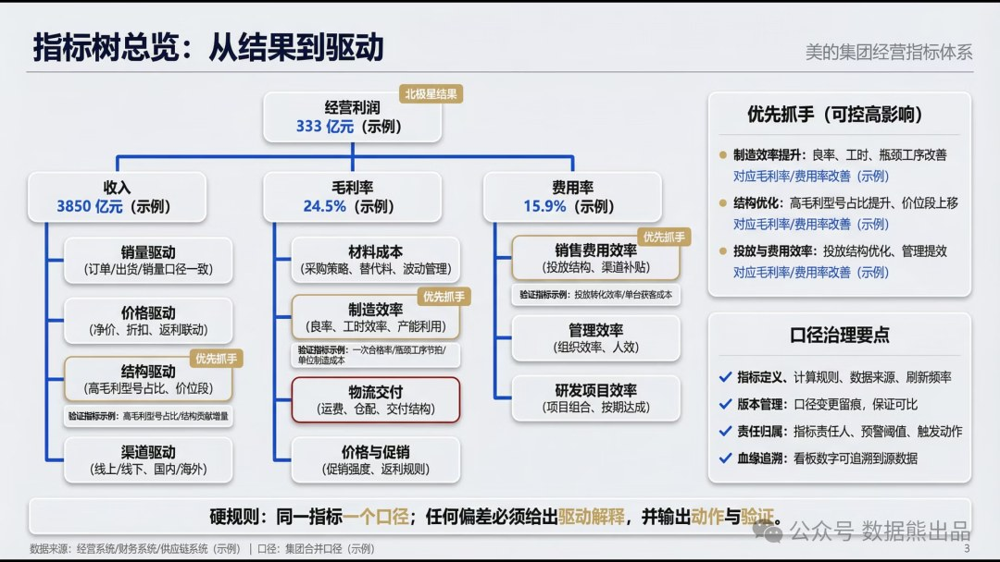

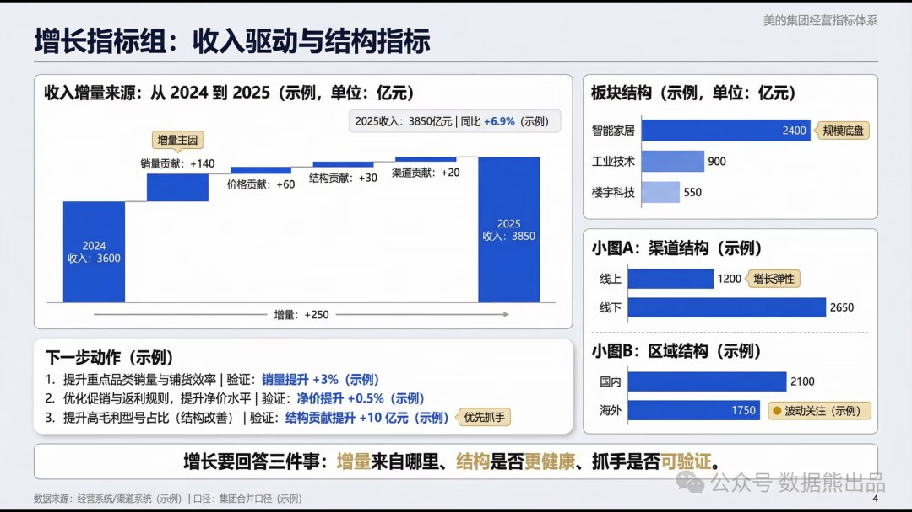

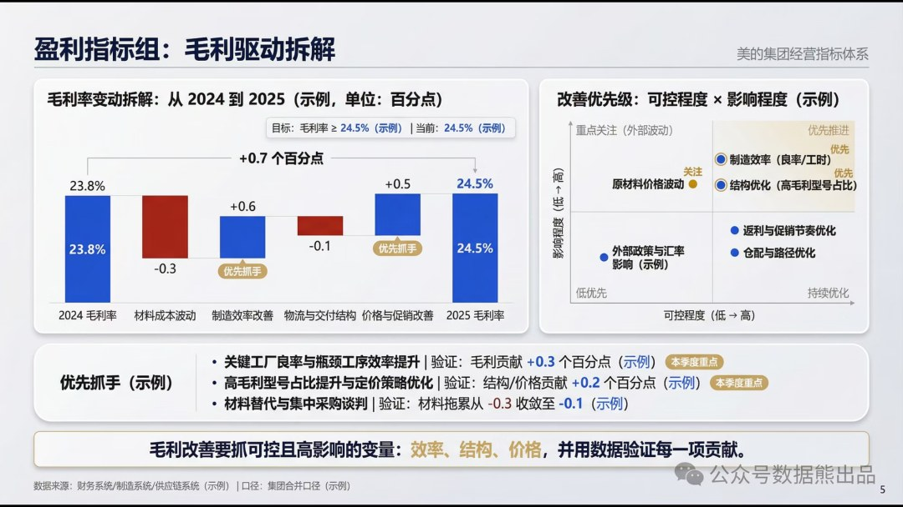

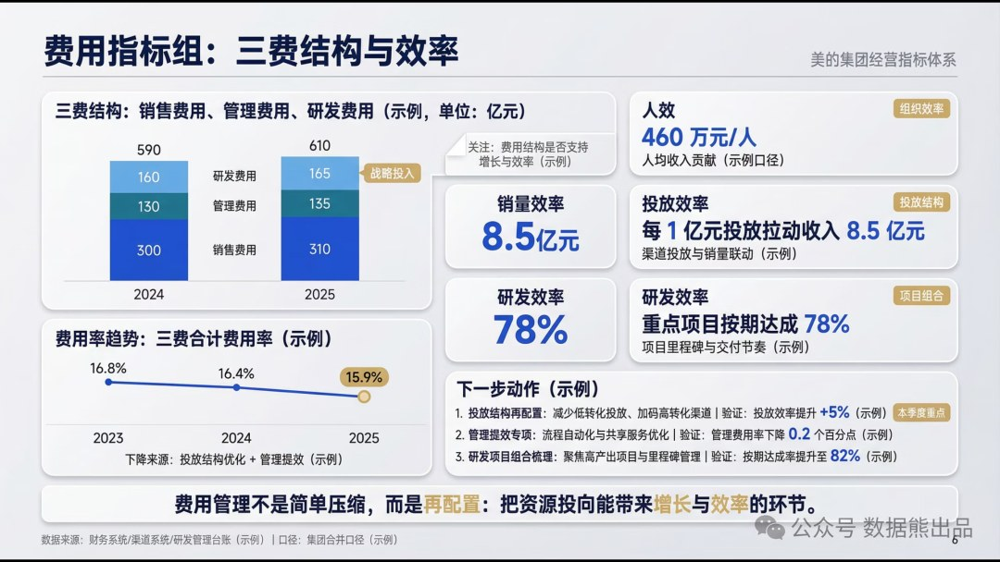

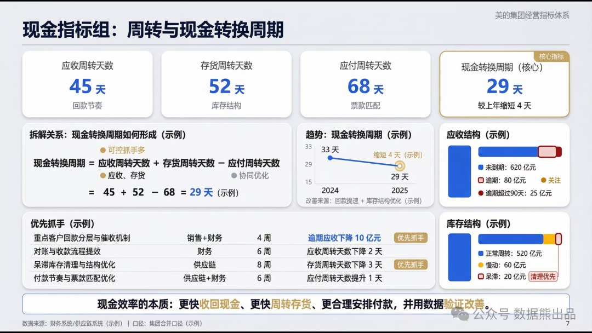

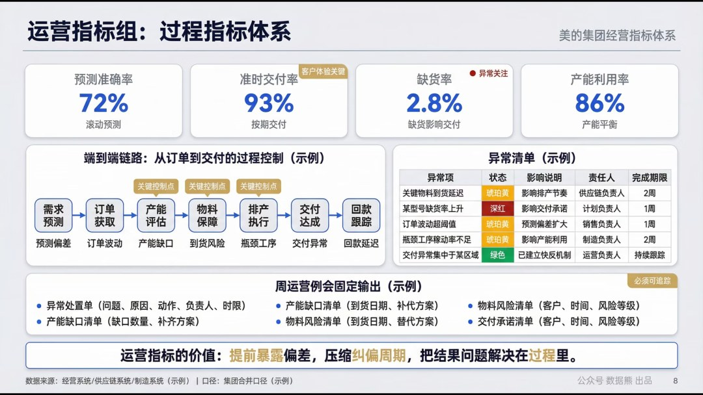

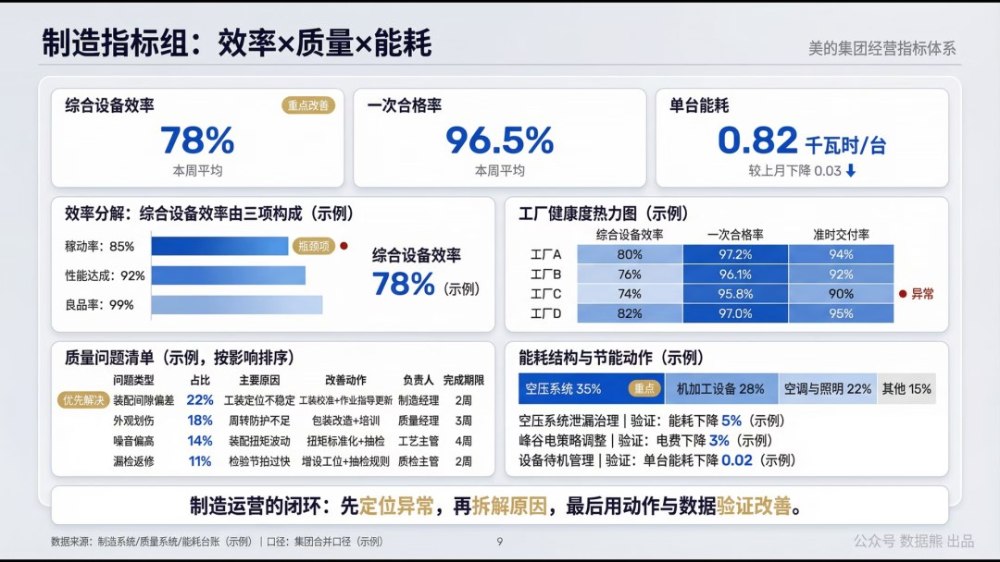

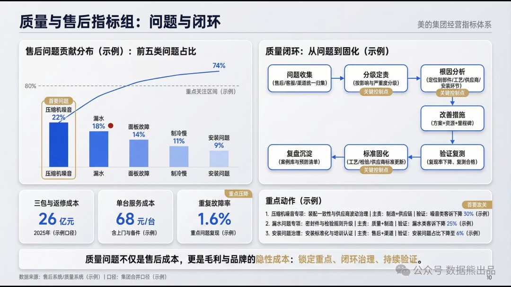

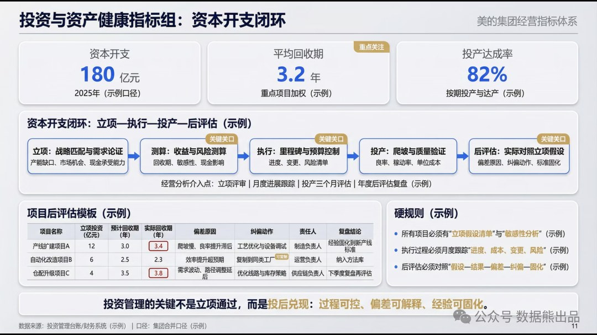

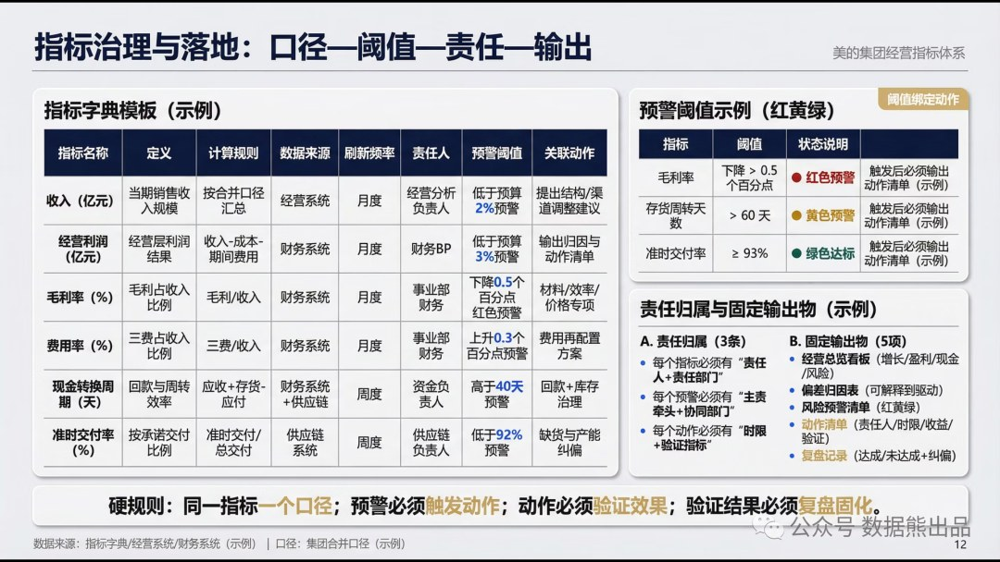

点击

阅读原文

，下载

《

美的集团经营分析体系

》及excel底表。

PPT定制添加数据熊微信：

Daniel-songyq   更多模板加入

会员群

获取

往期推荐

2025年经营分析报告

2025年成本分析报告

2025年资金与现金流分析报告及2026年资金计划

2025年财务部工作总结及2026年工作计划.pptx

2026年全面预算套表.xlsx（可下载）

