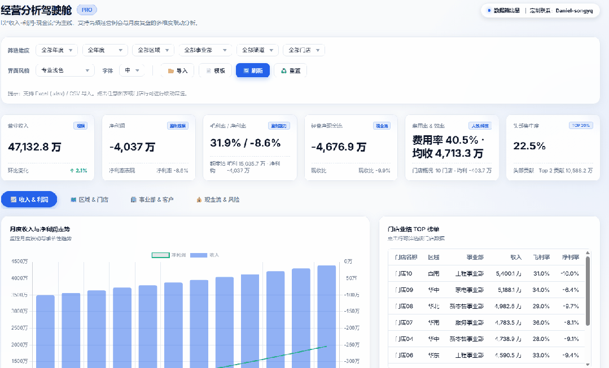
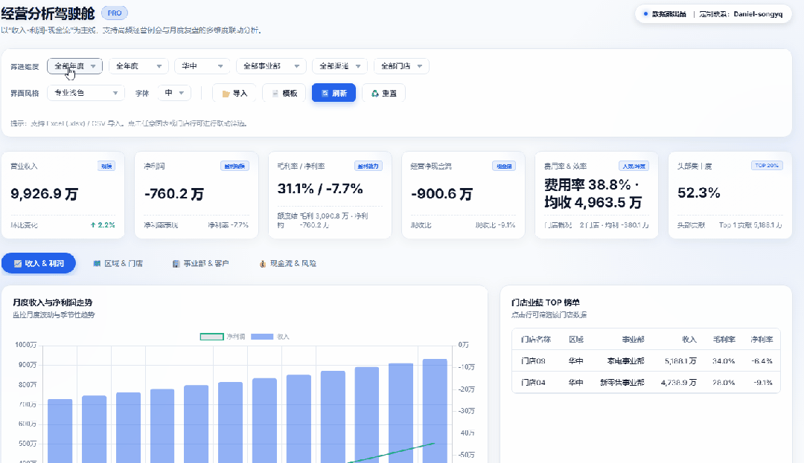
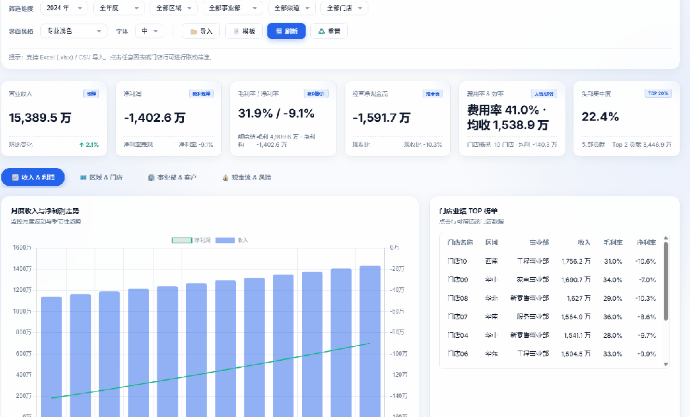
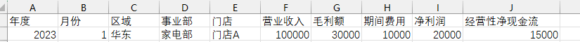

# 「经营分析驾驶舱」终于做好了：一场会议看清收入、利润和现金流

> 来源：微信公众号「数据熊」 · 作者 宋岳清 · 发布于 2026-02-02 11:41
> 原文链接：http://mp.weixin.qq.com/s?__biz=Mzg2MTg5OTgzNA==&mid=2247496128&idx=1&sn=970c7a013a5e0cc6042d47d4051b2f1c&chksm=ce12ac95f9652583c0cc7d75a493893f9ff1f68570939415f0349bdd06a41b6fbd79ff4384b9
> 摘要：让模型更简单，让商业更智能

---

### 一、为什么要再做一套「经营分析驾驶舱」？

做经营分析这么多年，我越来越有一个强烈的直觉：

管理层要的不是更多报表，而是一眼看懂的“驾驶舱”。

传统的做法是：财务导出几张 Excel，运营拿着 PPT 堆图表，开会时大家在不同文件之间来回切换—— 结果是：

- 说收入：一张表
- 说毛利：另一张表
- 说现金流：再翻一张表
- 说门店、区域、事业部：更是散落在不同明细里

这次我做的这套 「经营分析驾驶舱」，就是想把这些

分散的信息，收回来，装进一个可以交互的看板里

。

---

### 二、这套驾驶舱到底长什么样？

简单说，它是一个可以直接本地打开的网页，打开就是完整的经营分析界面：

1. 顶部管理层筛选区

1. 中间 6 张核心指标卡
2. 下方 4 个分析标签页

你完全可以把它理解为：

> “一页搞定经营例会的导航页”
>
> ——从这里出发，往下再深入具体问题。

---

### 三、数据从哪里来？——支持 Excel / CSV 一键导入

考虑到大部分企业的数据，短期内还是落在 Excel 或一些导出文件里，所以这套驾驶舱的设计是：

1. 页面右上角有两个按钮：
2. 导入模板字段已经定义好：
3. 你只需要把自己的数据按这个口径贴进去，保存为

    .xlsx

     或

    .csv

    ，回到看板点「导入数据」，

    整套 KPI 和图表就会自动重算

    。

这样有几个好处：

- 不用连数据库，也不用搭 BI 平台，本地文件直接用；
- 财务 / 运营可以先在 Excel 做口径清洗，再导入；
- 对于不方便联网的环境（内网网段、生产机房），也能照样使用。

---

### 四、支持主题色 & 字体一键切换：真的是给「人」用的看板

这次我刻意多做了两件事，都是从「人」的体验出发：

1. 主题色一键切换 + 自定义主色

    对你意味着什么？
2. 字体大小 三档可调：小 / 中 / 大

这些看起来是「细节」，但真正落到实战里，它会明显提升会议的舒适感和专注度。

---

### 五、适合谁用？可以怎么用？

简单列几类典型的使用场景，你可以对照看自己属于哪一类：

1. 老板 / 总经理 / 事业部负责人
2. 财务 BP / 经营分析岗
3. 连锁门店 / 区域运营负责人

---

### 六、如果你想用这套驾驶舱，可以怎么获取？

目前这套 「经营分析驾驶舱」主要玩法是

1. 标准版看板 + 导入模板

> 有需要可以在公众号
>
> 「数据熊」
>
>  后台回复【驾驶舱】或直接加微信
>
> Daniel-songyq
>
> ，备注「经营驾驶舱」，我会单独跟你沟通企业版本的定制方案。
>
> 数据熊，让模型更简单，让商业更智能

---

模板即思路，点击
阅读原文
获取

《经营分析驾驶舱模型

》

。

加入

数据熊

会员群

，与2900+精英共同成长。后台点击
「经典文章」阅读数据熊10W+爆文，
模板定制添加数据熊微信：

Daniel-songyq

往期推荐

2025年总经理工作总结（可下载PPT）

2026年全面预算套表.xlsx

2025年10月经营分析PPT框架（可下载PPT模板）

本量利分析模型.xlsx

点赞

和

转发

就是最大的支持，关注数据熊，工作更轻松。

