# 从数据到动作：详解经营分析全流程

> 来源：微信公众号「数据熊」 · 作者 宋岳清 · 发布于 2026-02-09 07:30
> 原文链接：http://mp.weixin.qq.com/s?__biz=Mzg2MTg5OTgzNA==&mid=2247496255&idx=1&sn=5c8b0e23e2c96877add603d12ede7b33&chksm=ce12af6af965267c4c5ce57af8a2a3cc3a4d4689ab7a40793b0b97b9b73e121d21c64f1fb901

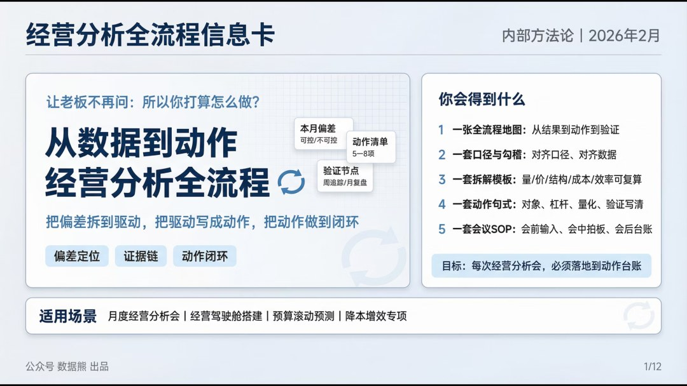

文末左下角，点击
阅读原文
，可下载此报告

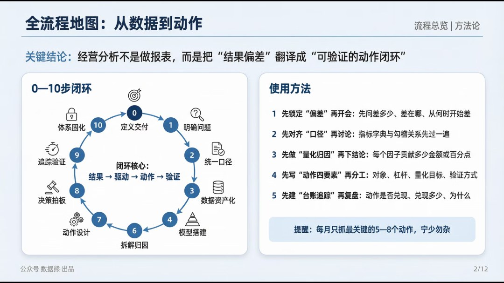

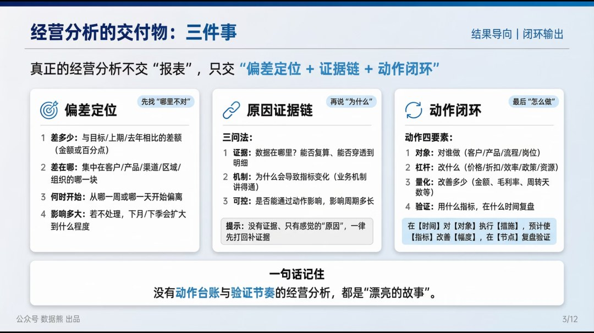

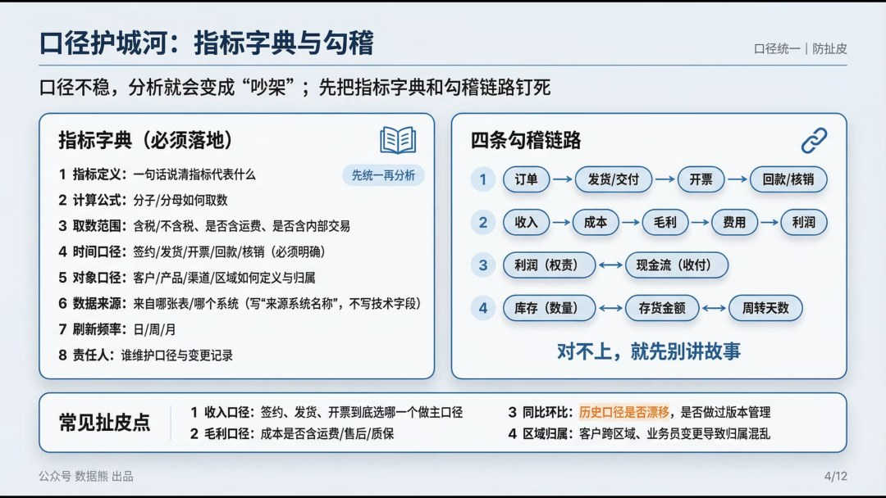

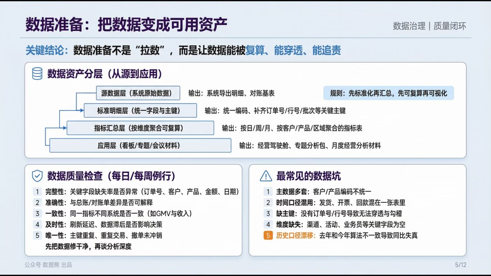

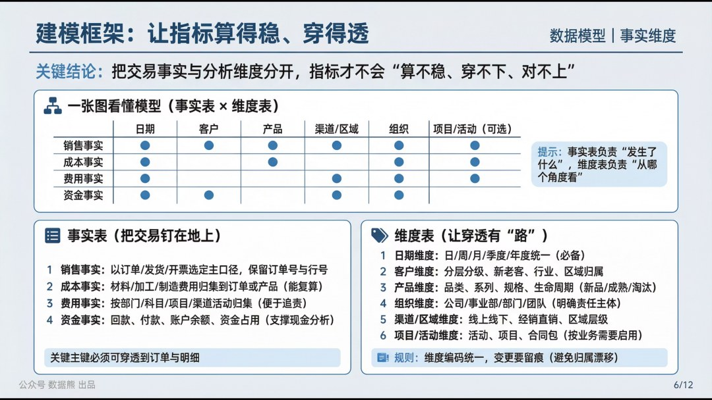

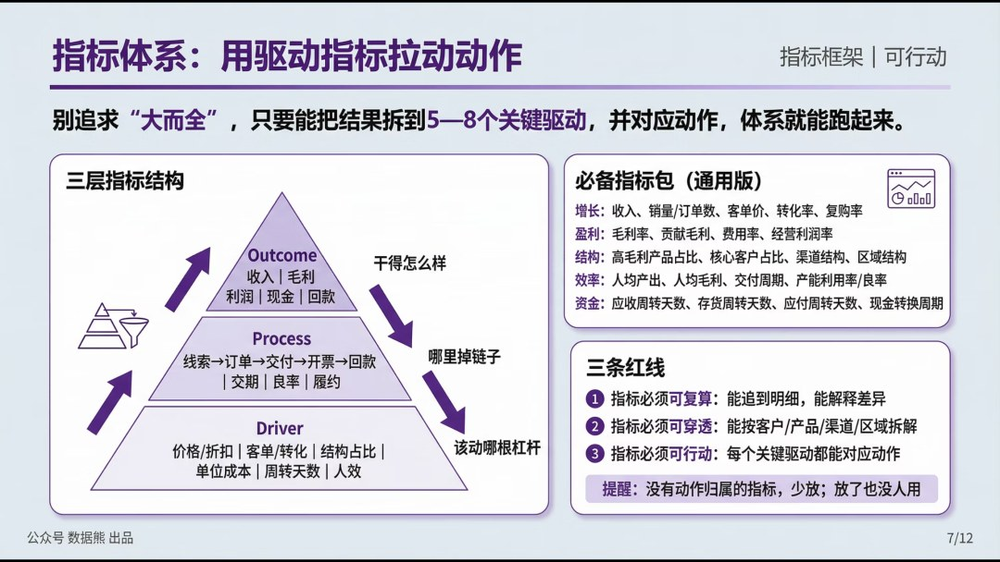

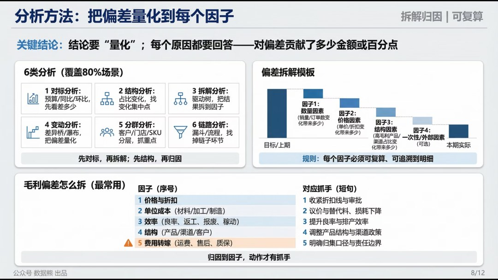

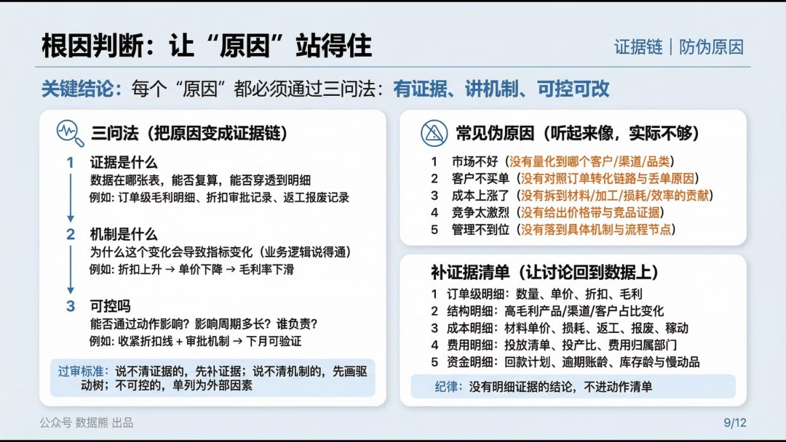

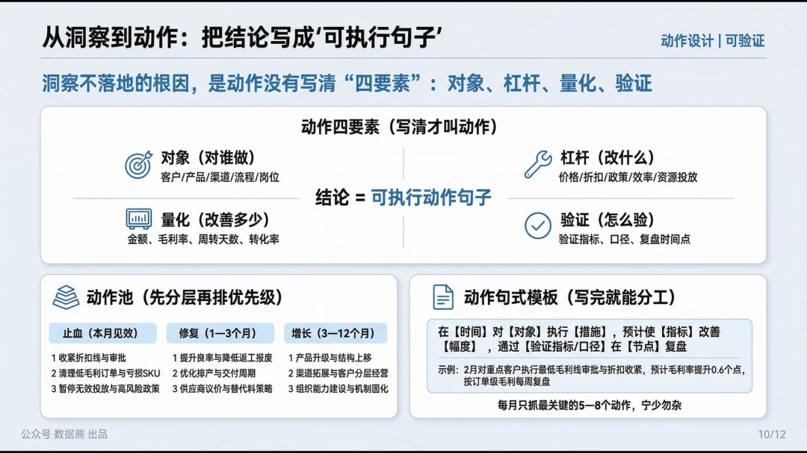

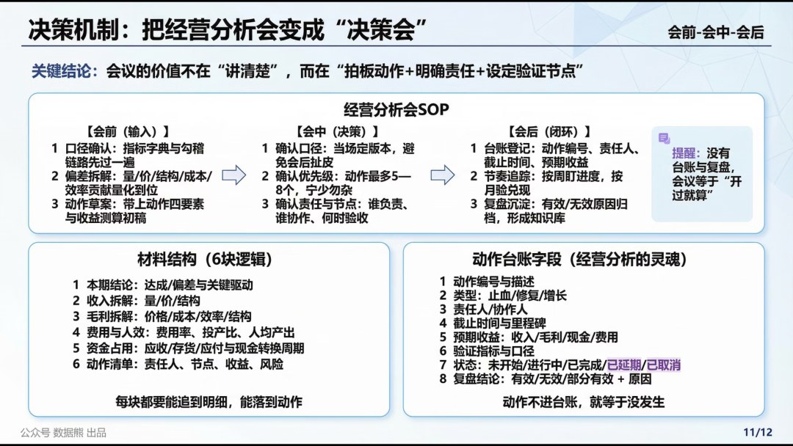

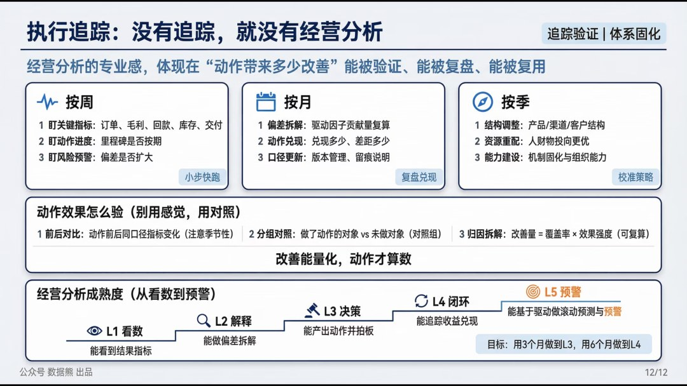

点击

阅读原文

，下载完整版

《详解经营分析全流程

》。

PPT定制添加数据熊微信：

Daniel-songyq   更多模板加入

会员群

获取

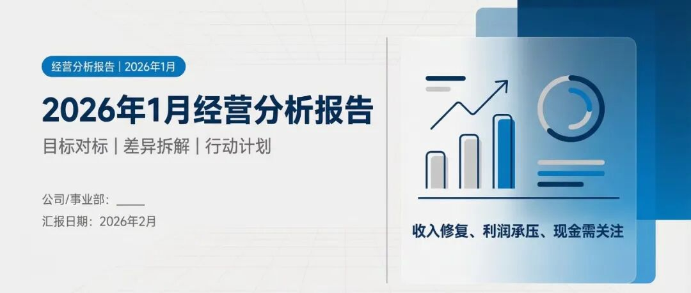

2026年1月经营分析报告（案例）

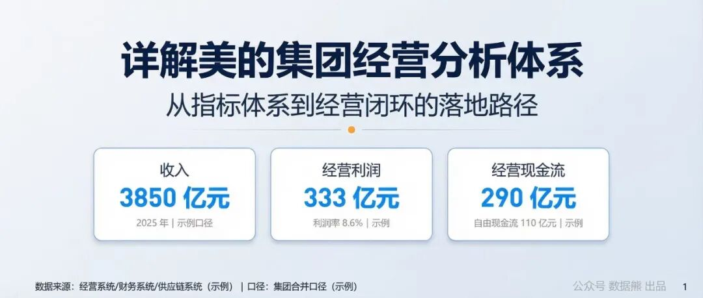

详解美的集团经营分析体系

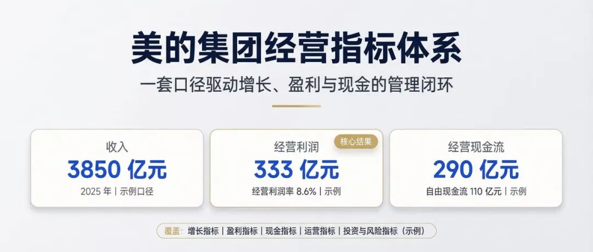

美的集团经营指标体系（附excel）

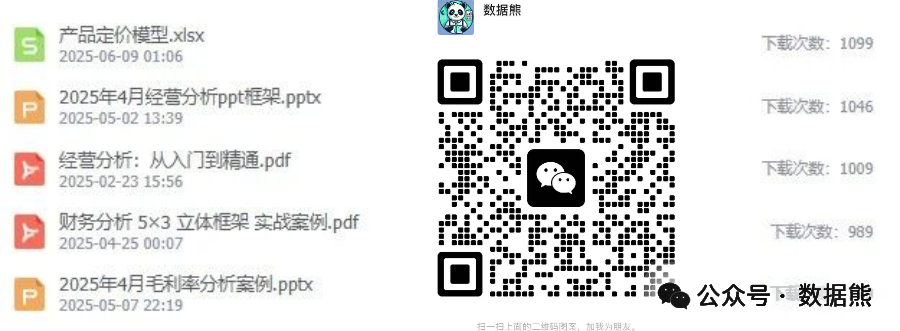
