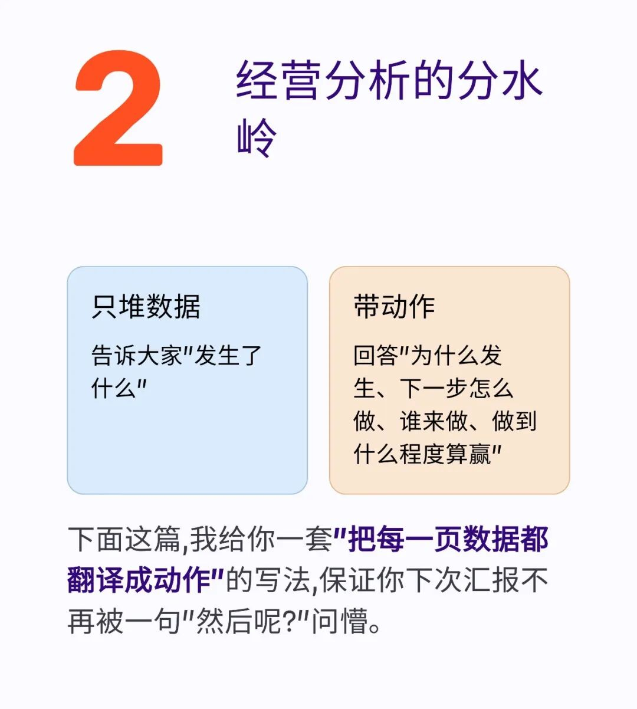
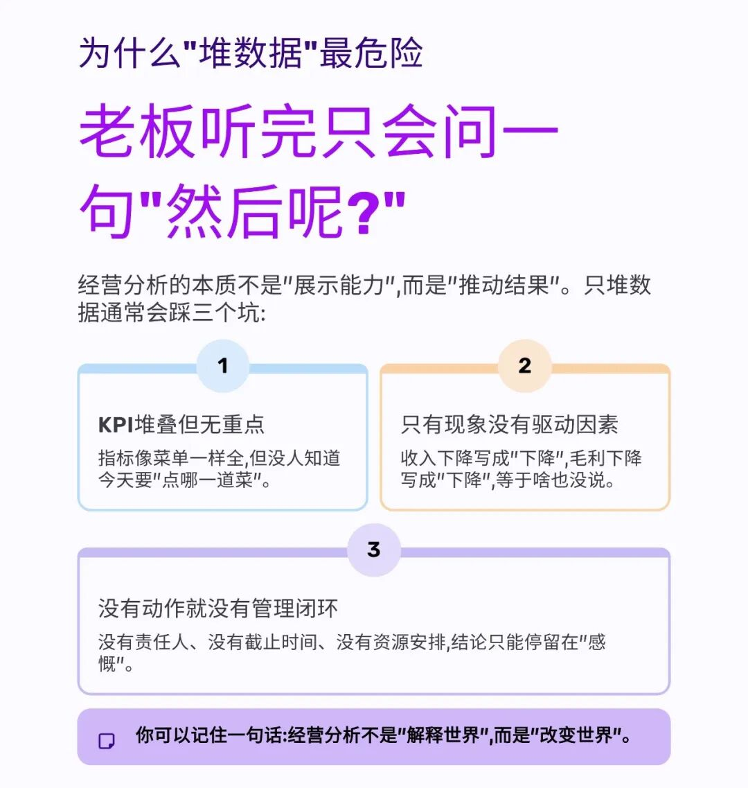
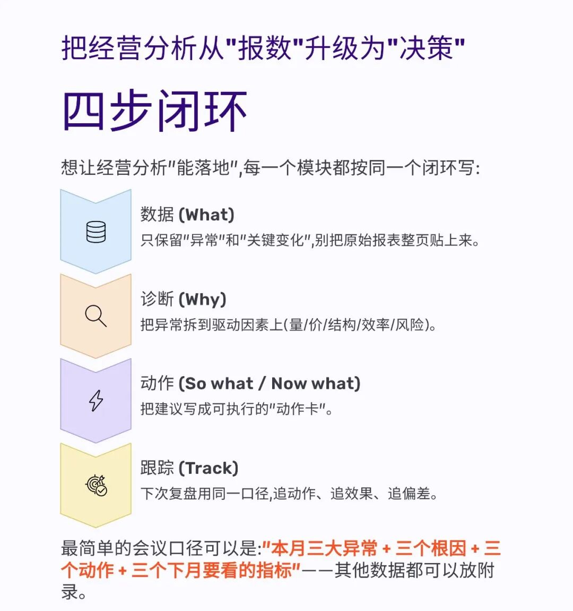
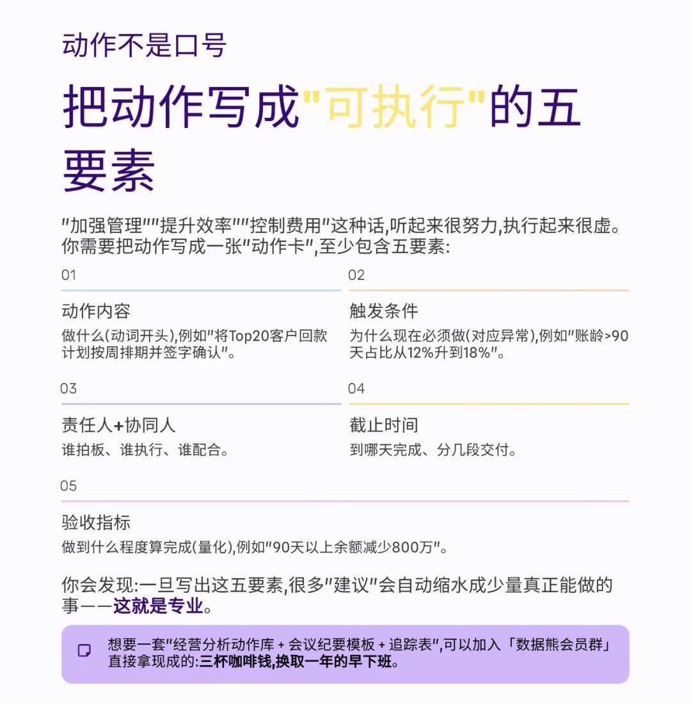
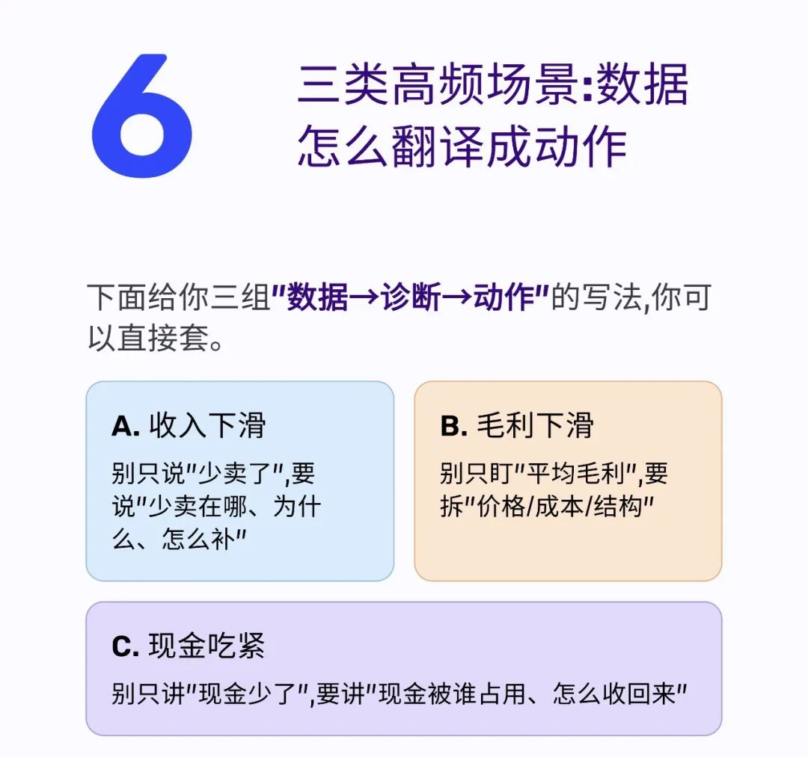
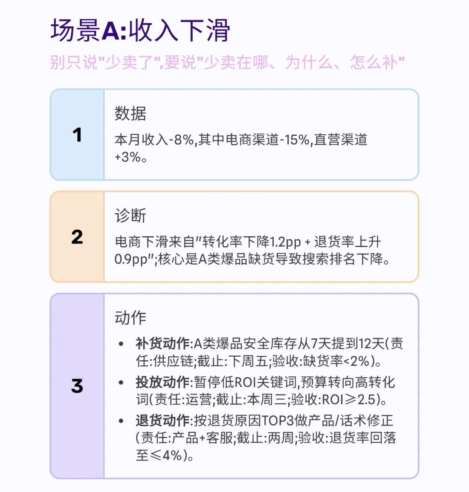
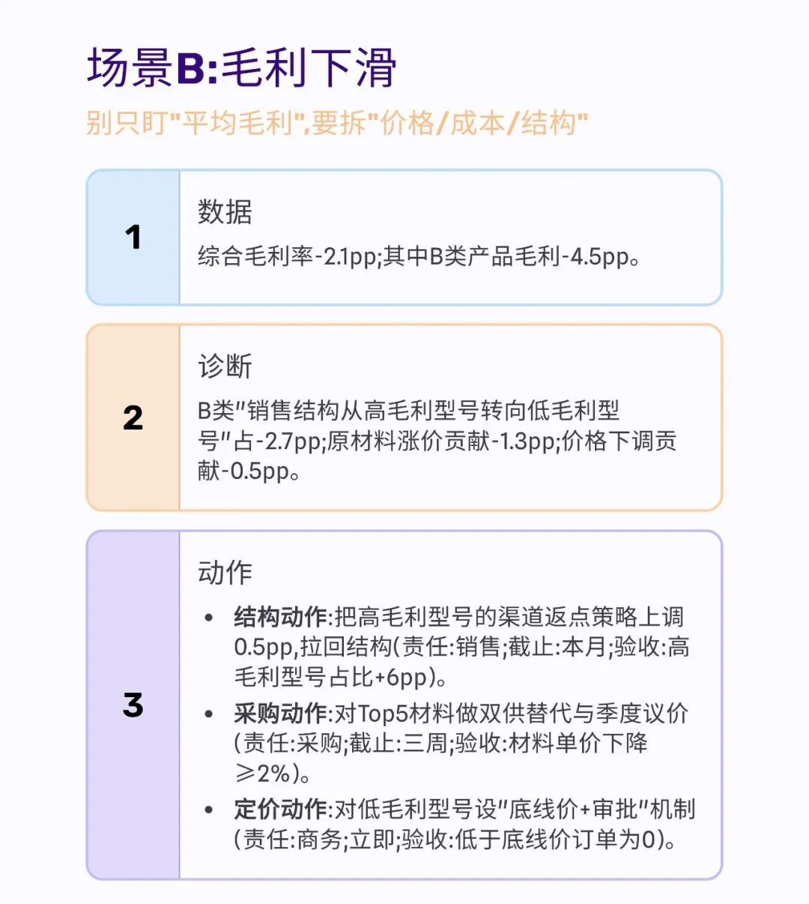
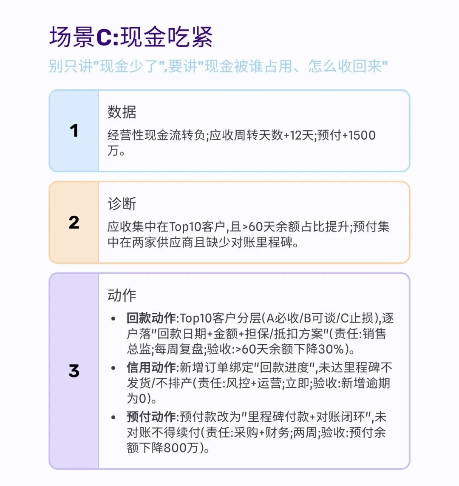
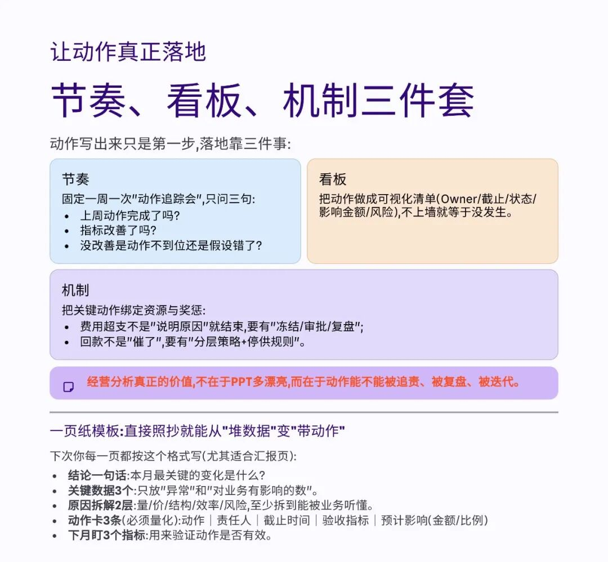

# 经营分析，不能只堆数据，不提动作

> 来源：微信公众号「数据熊」 · 作者 宋岳清 · 发布于 2026-02-13 07:30
> 原文链接：http://mp.weixin.qq.com/s?__biz=Mzg2MTg5OTgzNA==&mid=2247496482&idx=1&sn=1d1a270974470af8d78b0a7cb016f8a1&chksm=ce12ae77f9652761726610e8d278aa0b4756373f57fbd6c2b33ce15a9af2dcc1116c6b8630cb
> 摘要：模板即思路，文末左下角点击阅读原文，下载《2026年1月经营分析报告》点击文末左下角阅读原文，下载完整版《20

模板即思路，文末左下角点击
阅读原文
，下载
《2026年1月经营分析报告》

点击文末左下角

阅读原文

，下载完整版

《2026年1月

经营分析报告

》。

PPT定制添加数据熊微信：

Daniel-songyq   更多模板加入

会员群

获取，一天不到一块钱，换取一年的早下班

往期推荐

2025年财务BP年终工作总结.pptx

2025年财务总监工作总结（PPT模板）

数据熊 | 财务分析模型：一键导入、自动计算、自动画图

数据熊丨应收账款分析模型

现金流预测模型.xlsx

