# 2026年1月产品分析报告

> 来源：微信公众号「数据熊」 · 作者 宋岳清 · 发布于 2026-02-21 08:00
> 原文链接：http://mp.weixin.qq.com/s?__biz=Mzg2MTg5OTgzNA==&mid=2247496620&idx=1&sn=3ce2c899150914a6a0c15bb78e8844a5&chksm=ce12aef9f96527ef3a4e0fe2b3f0bd1f2d2fb0f8938711a87492f55dc8af142e133bffd9020c

文末左下角点击阅读原文，可下载此报告

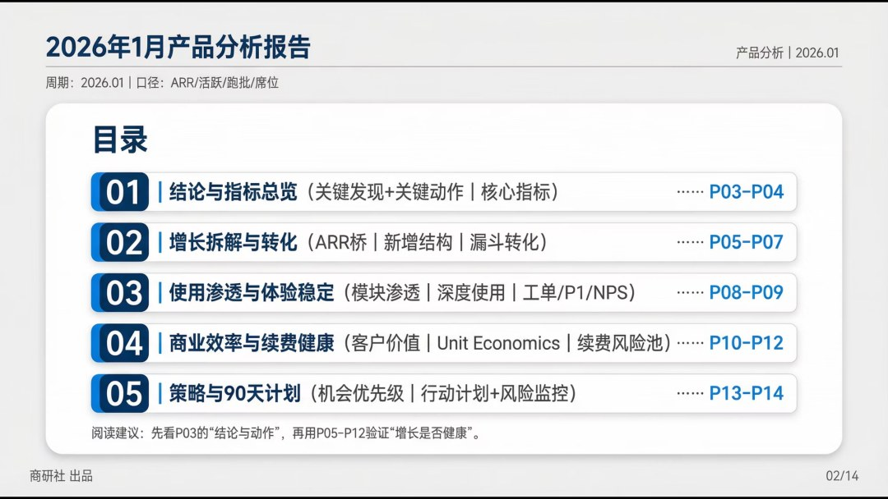

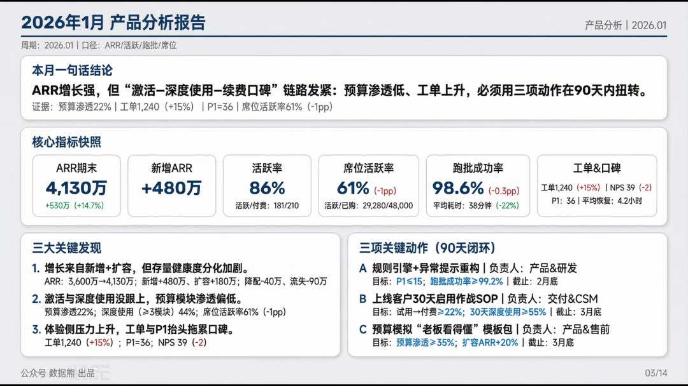

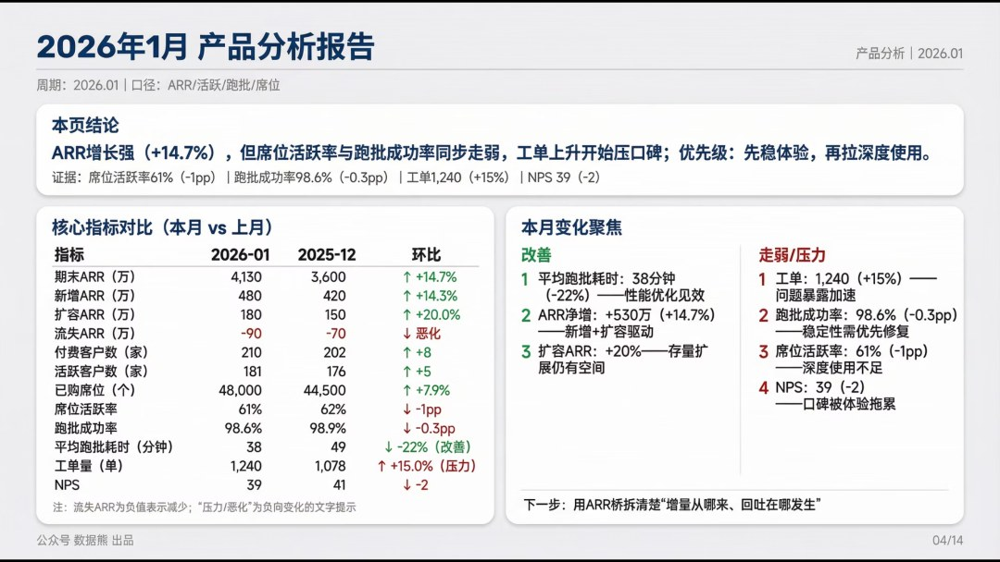

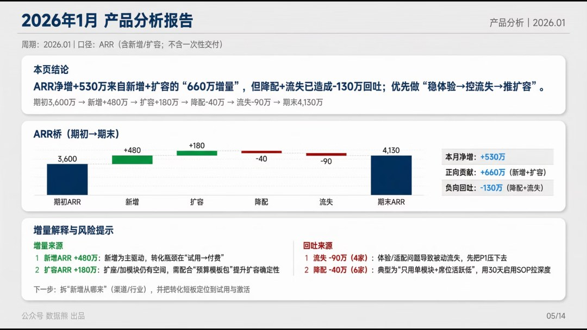

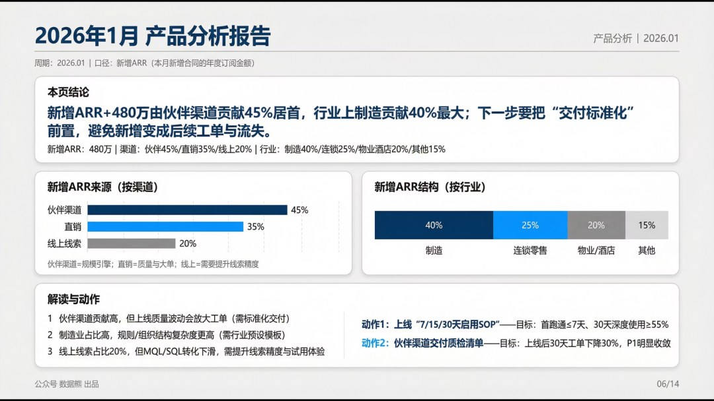

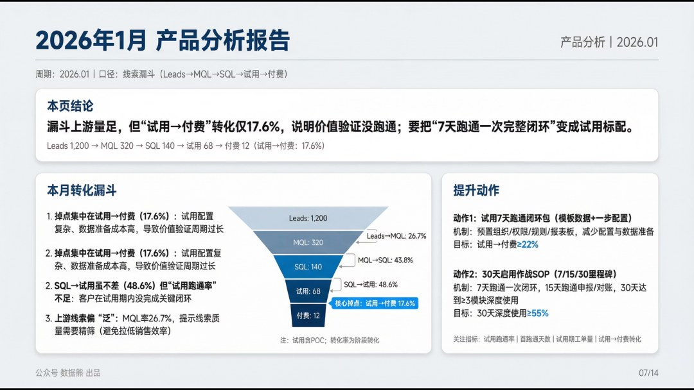

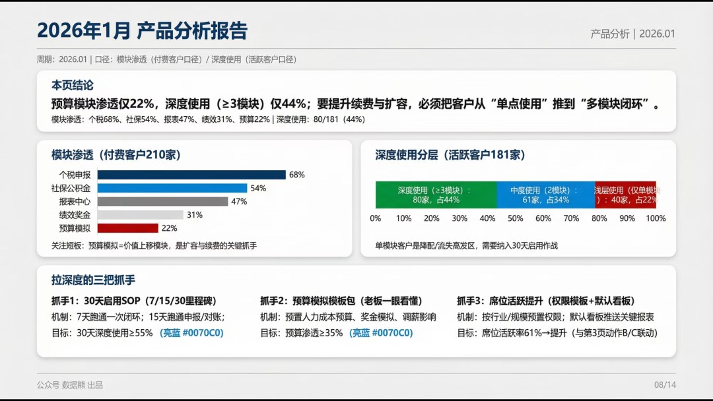

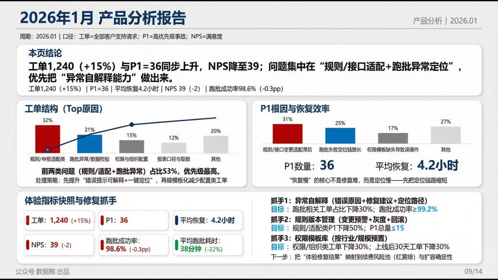

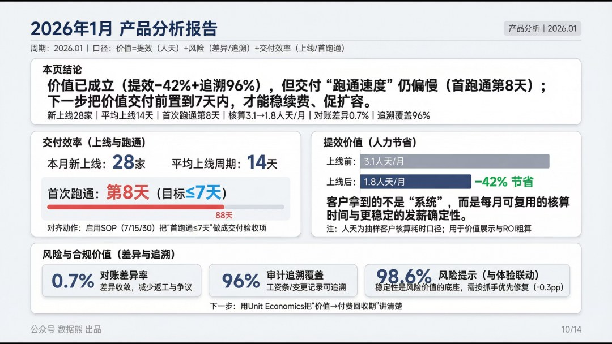

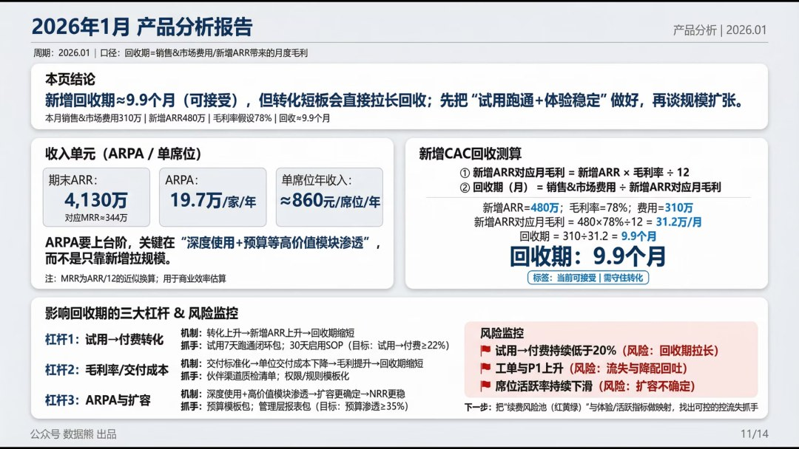

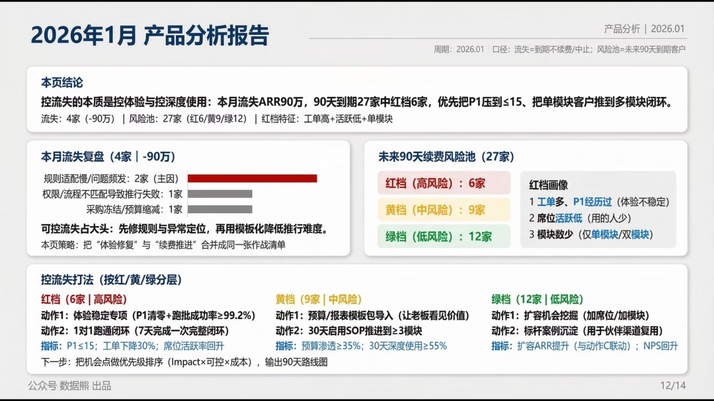

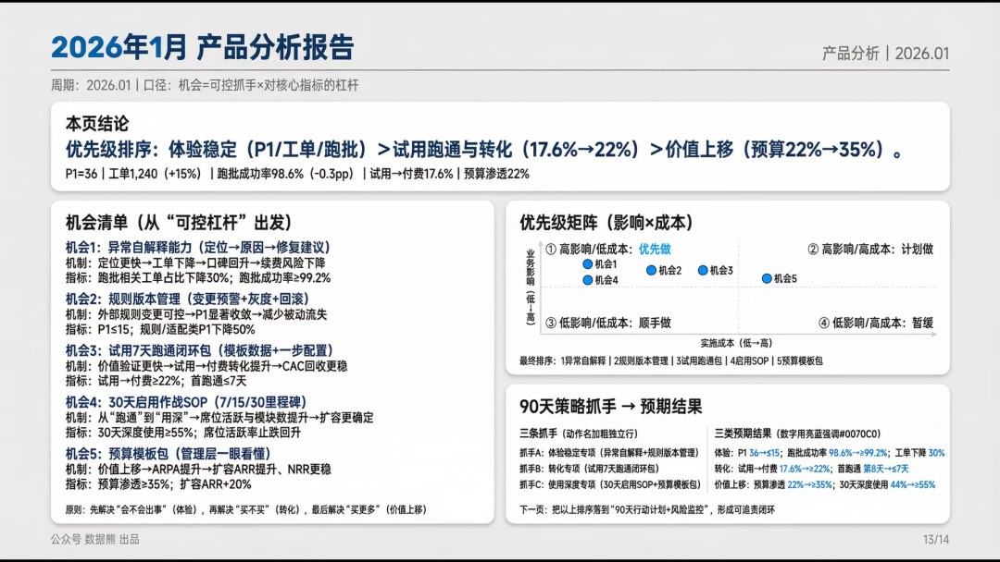

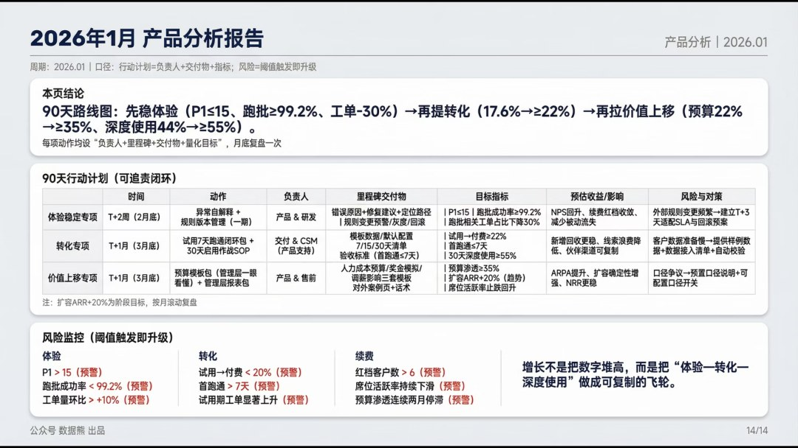

点击

阅读原文

，获取完整版

《

2026年1月产品分析报告

》及excel底表。

PPT定制添加数据熊微信：

Daniel-songyq   更多模板加入

数据熊会员群

往期推荐

2025年财务BP年终工作总结.pptx

2025年财务总监工作总结（PPT模板）

数据熊 | 财务分析模型：一键导入、自动计算、自动画图

数据熊丨应收账款分析模型

现金流预测模型.xlsx

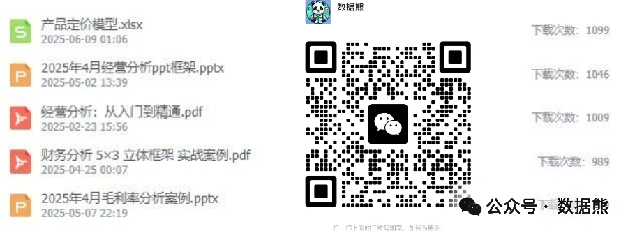
