# 经营分析会，必须要吵清楚的几个问题

> 来源：微信公众号「数据熊」 · 作者 宋岳清 · 发布于 2026-03-11 10:24  
> 原文链接：http://mp.weixin.qq.com/s?__biz=Mzg2MTg5OTgzNA==&mid=2247497329&idx=1&sn=7086a43054fe2d7be0ca0a263b07377f&chksm=ce12ab24f9652232313d9bed3c64bacfe40cc980f2bde275490b2e9a0f94c2e8129563ef7e8c

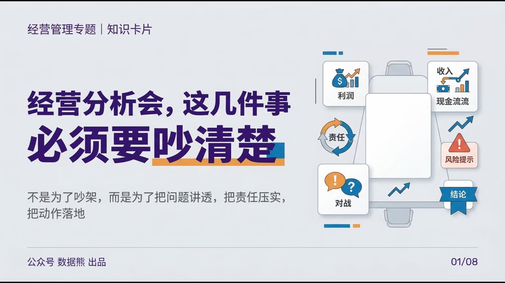

模板即思路，文末左下角点击
阅读原文
可下载
《2026年2月经营分析报告》

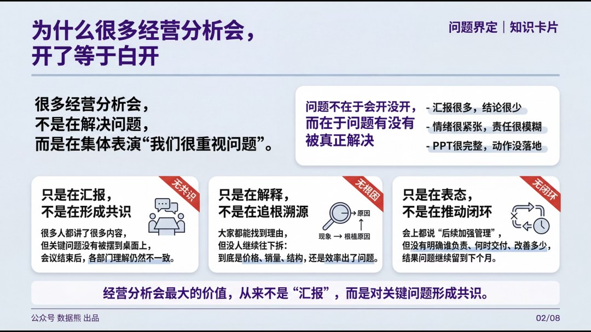

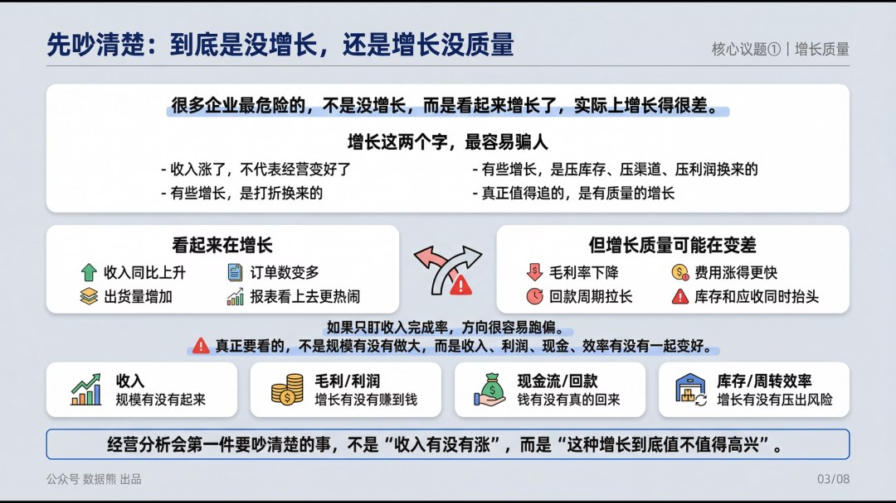

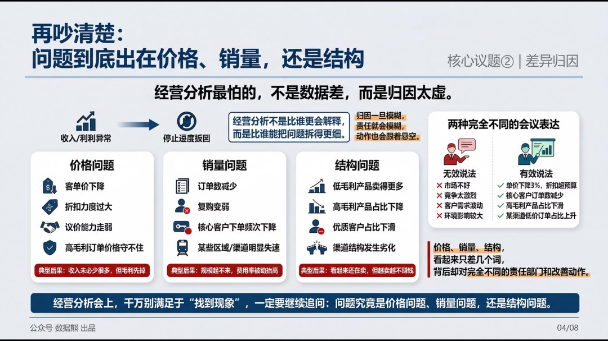

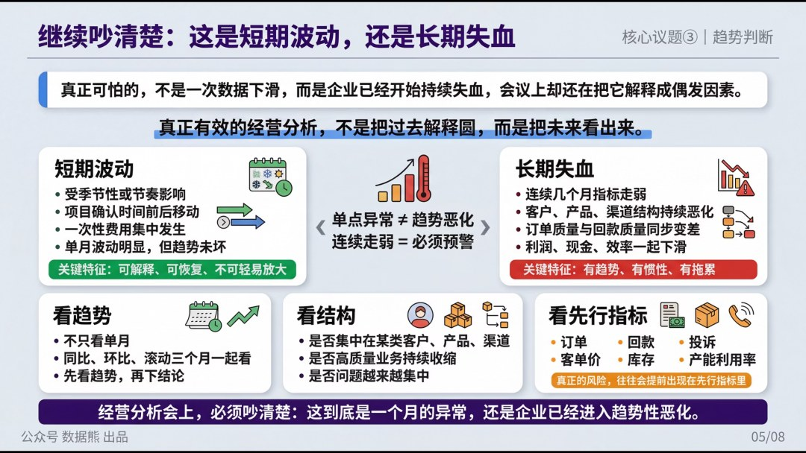

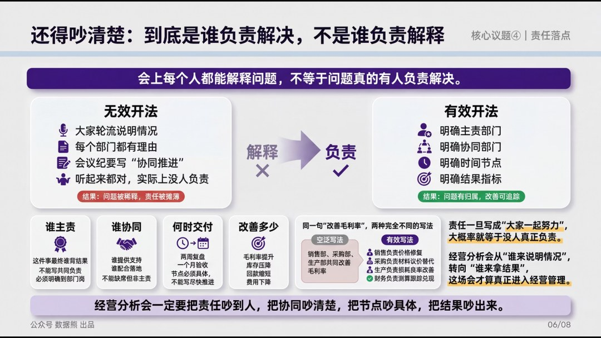

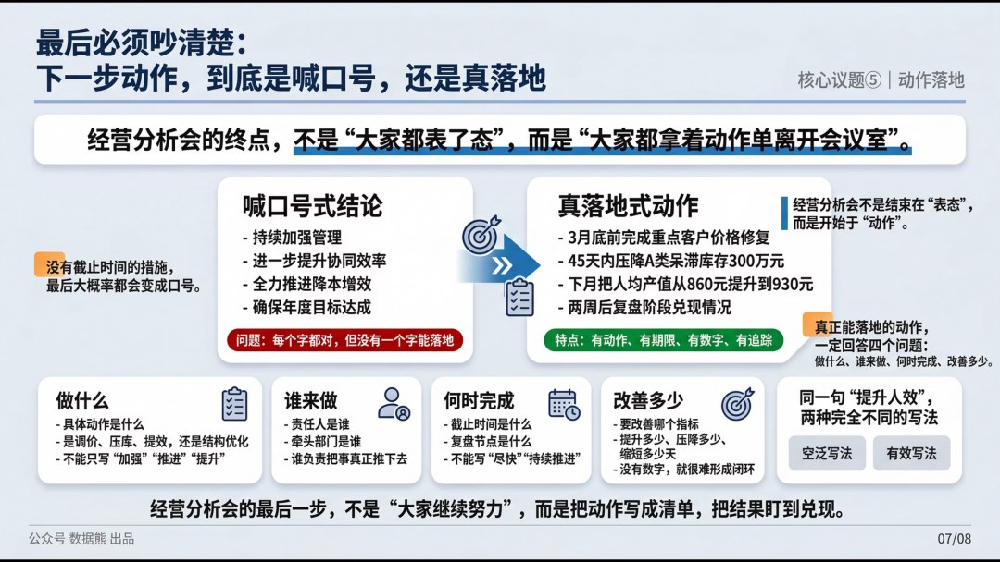

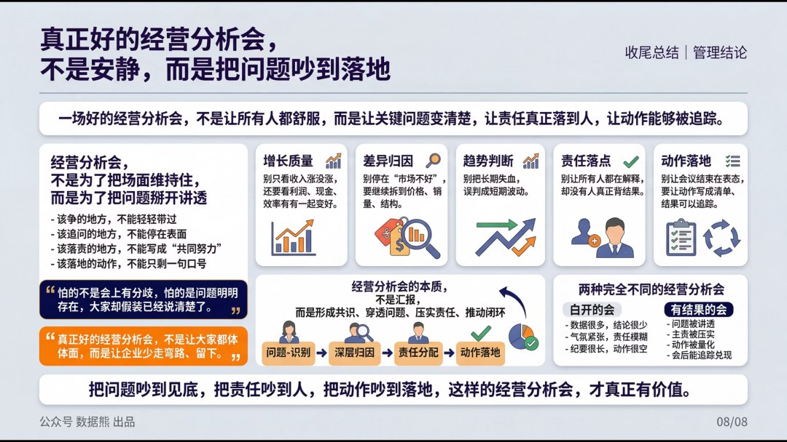

模板即思路，文末左下角点击
阅读原文
可下载
《2026年2月经营分析报告》

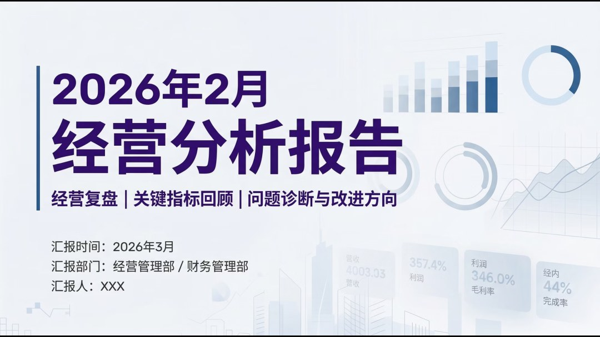

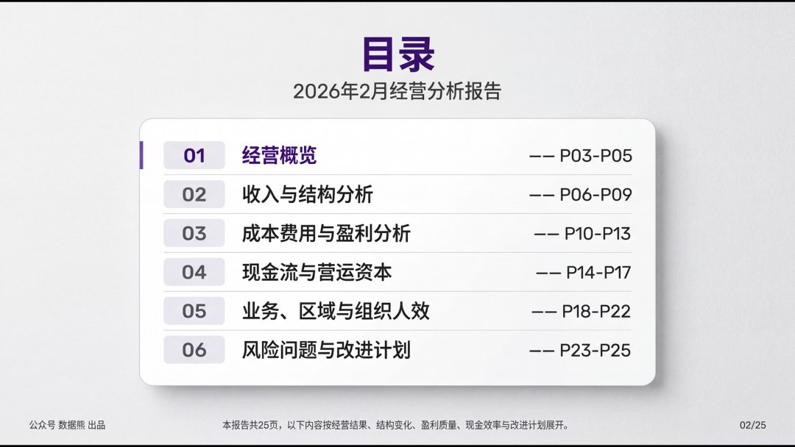

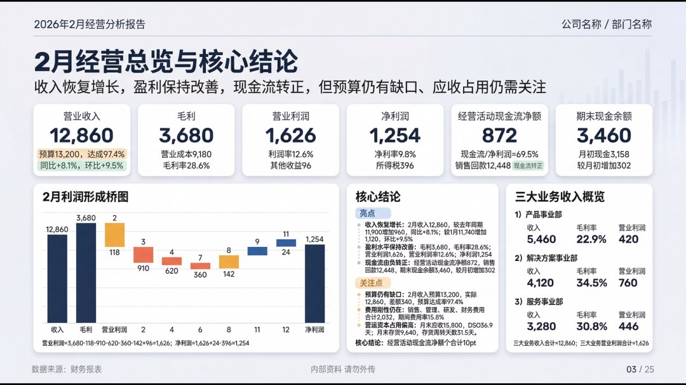

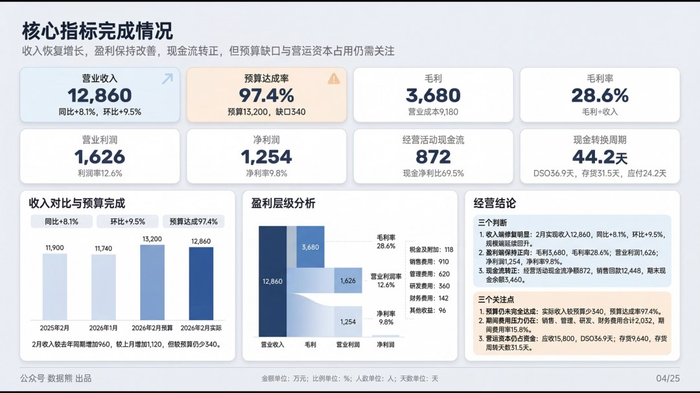

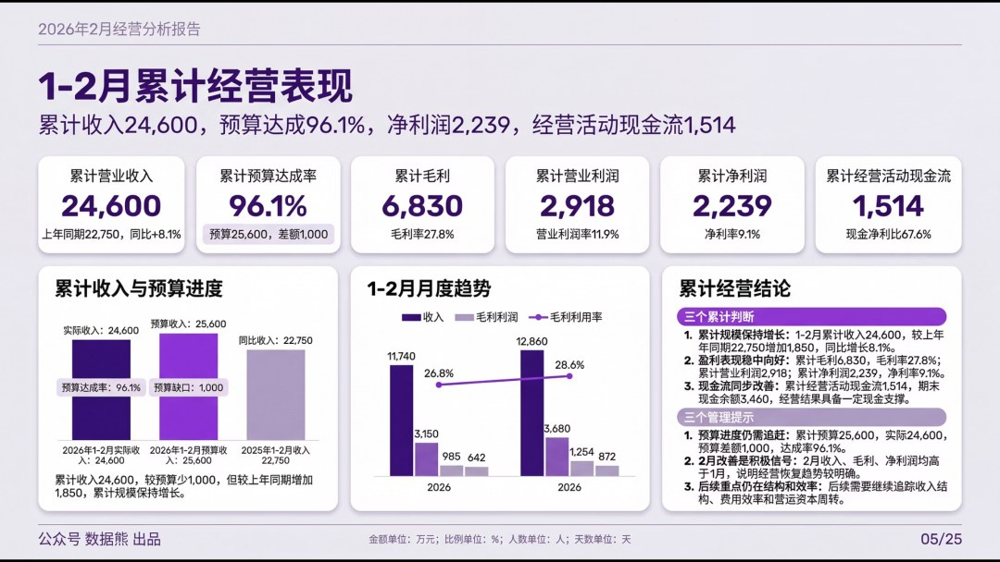

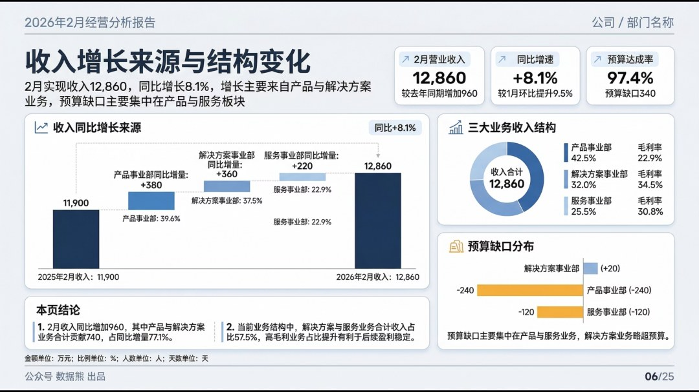

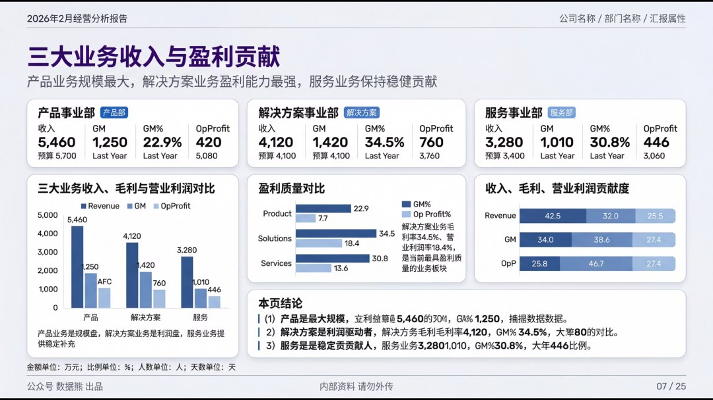

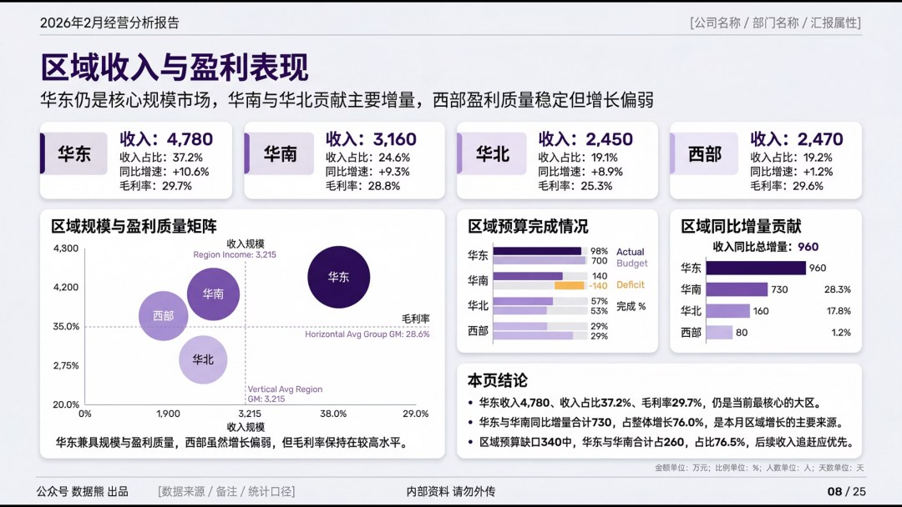

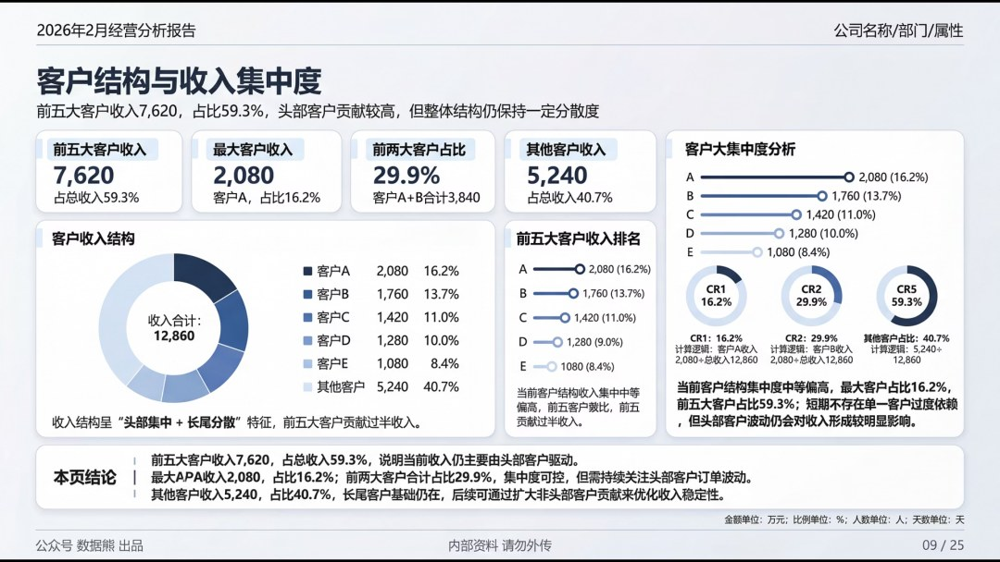

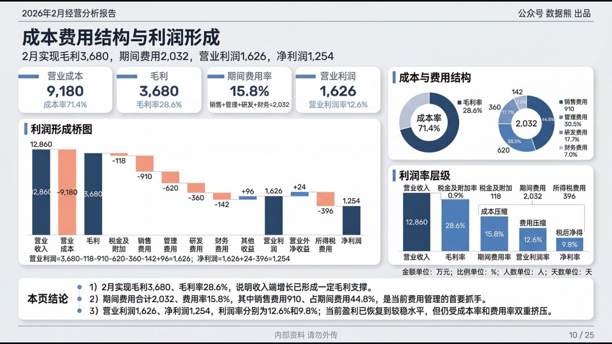

点击文末左下角

阅读原文

，下载完整版

《

2026年2月经营分析报告

》。

数据熊团队提供经营分析系统搭建服务详情咨询数据熊微信：

Daniel-songyq   更多模板加入

会员群

获取

往期推荐

2025年财务BP年终工作总结.pptx

2025年财务总监工作总结（PPT模板）

数据熊 | 财务分析模型：一键导入、自动计算、自动画图

数据熊丨应收账款分析模型

现金流预测模型.xlsx

