# 2026年经营计划模板

> 来源：微信公众号「数据熊」 · 作者 宋岳清 · 发布于 2026-03-18 09:32
> 原文链接：http://mp.weixin.qq.com/s?__biz=Mzg2MTg5OTgzNA==&mid=2247497578&idx=1&sn=e8c32b6247fbcf02a651524b85e04c67&chksm=ce12aa3ff9652329a7702b81c2445a9e77478528e20fd93d35193dd45f8125c78fb4e599fd27

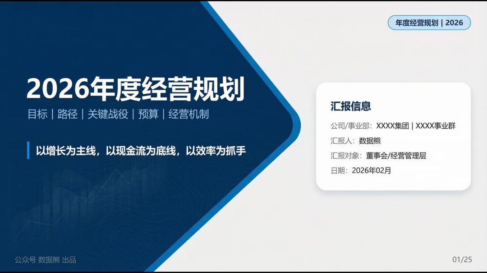

文末左下角点击
阅读原文
，可下载此报告

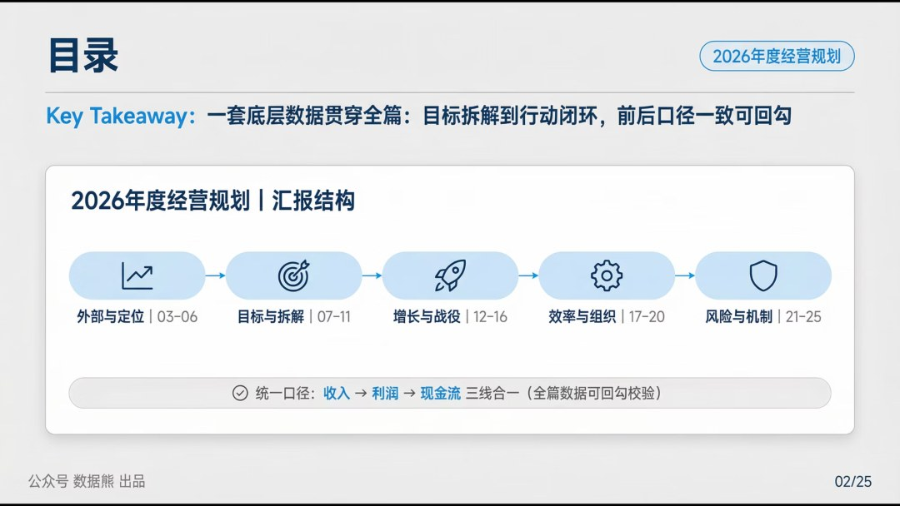

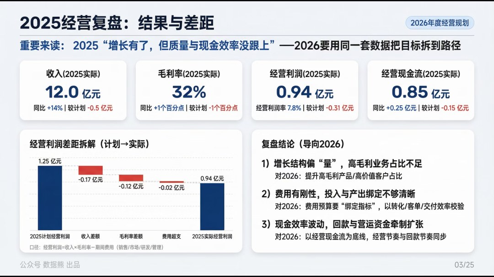

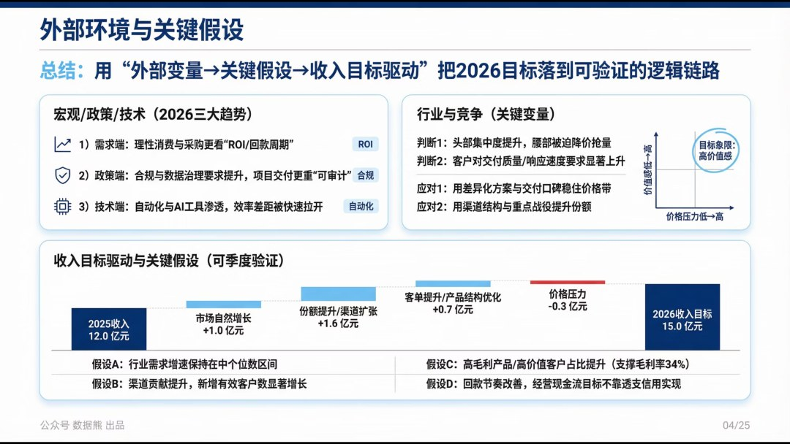

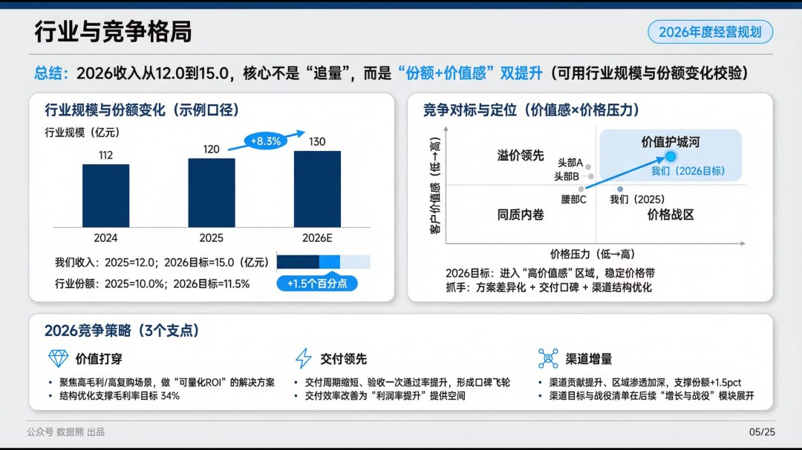

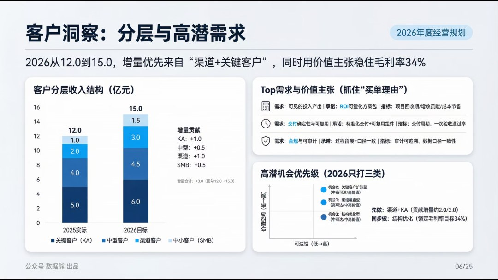

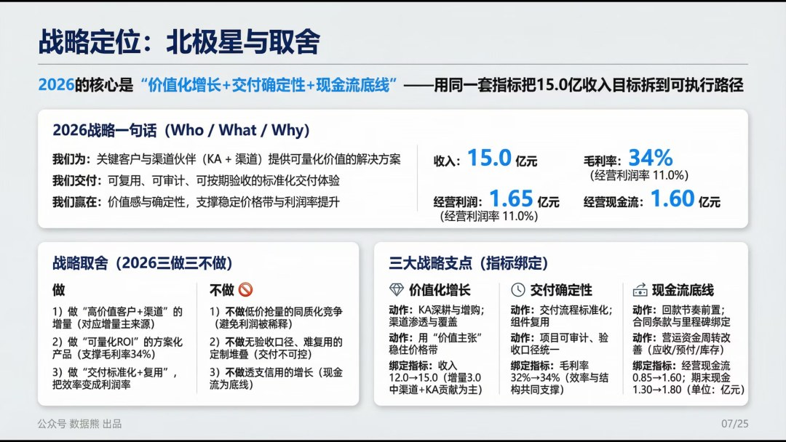

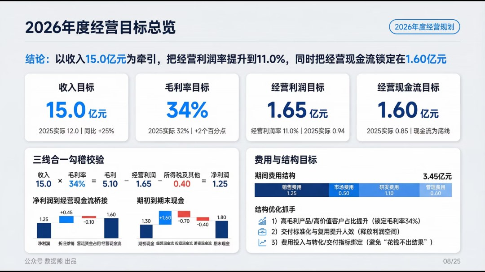

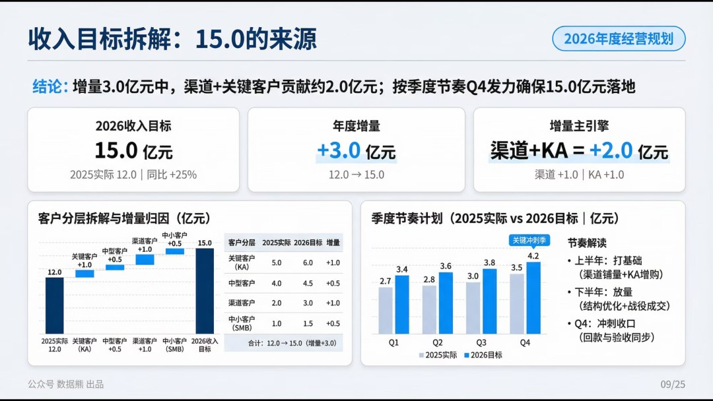

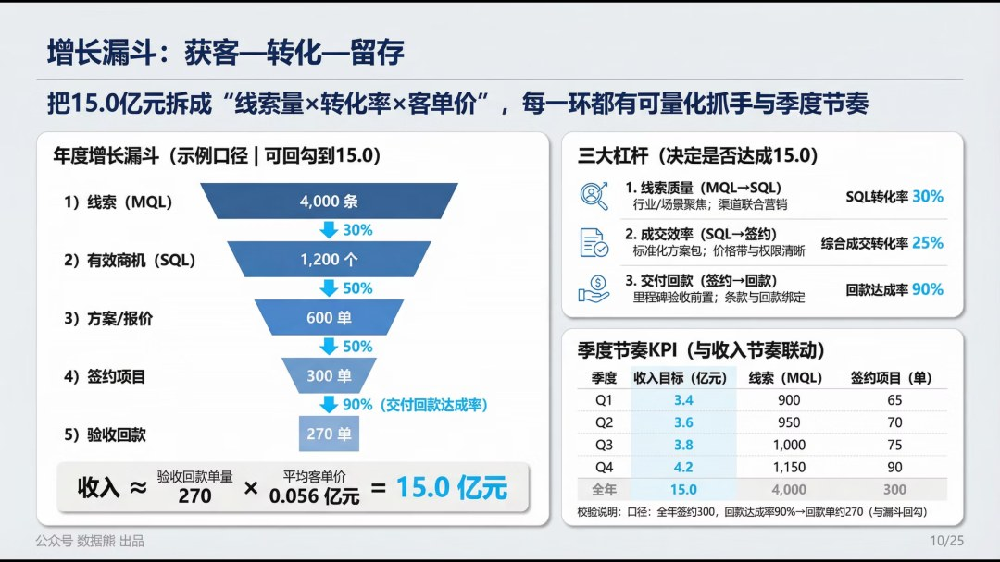

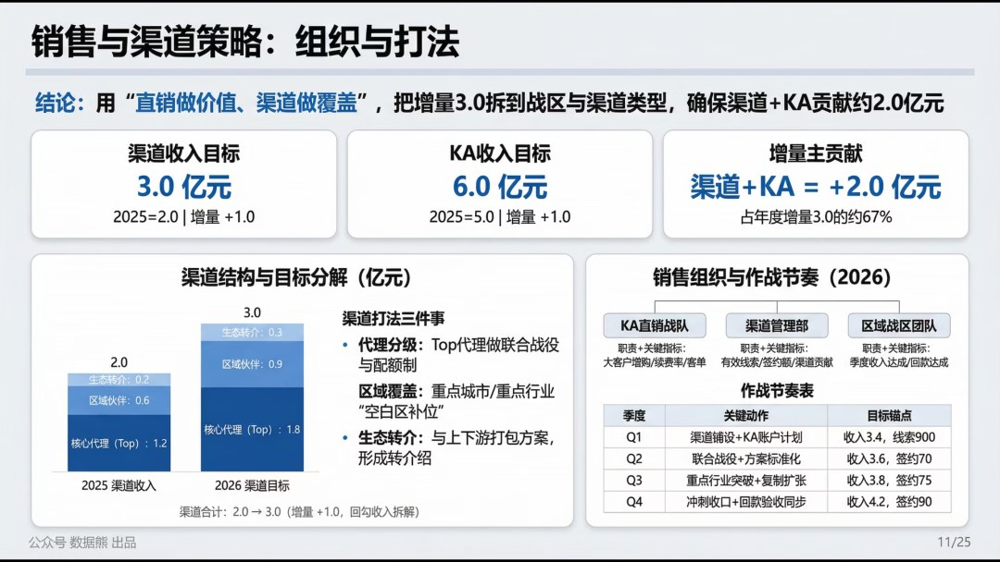

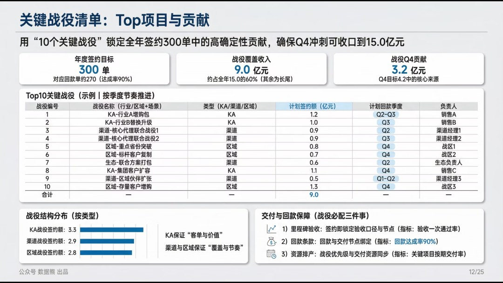

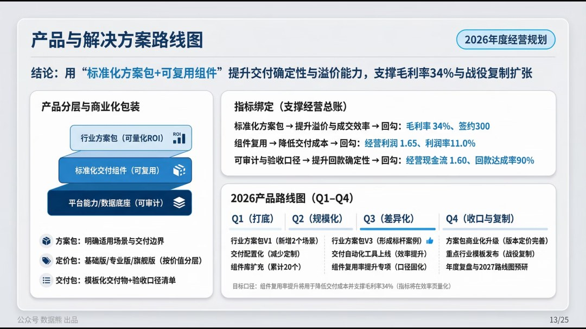

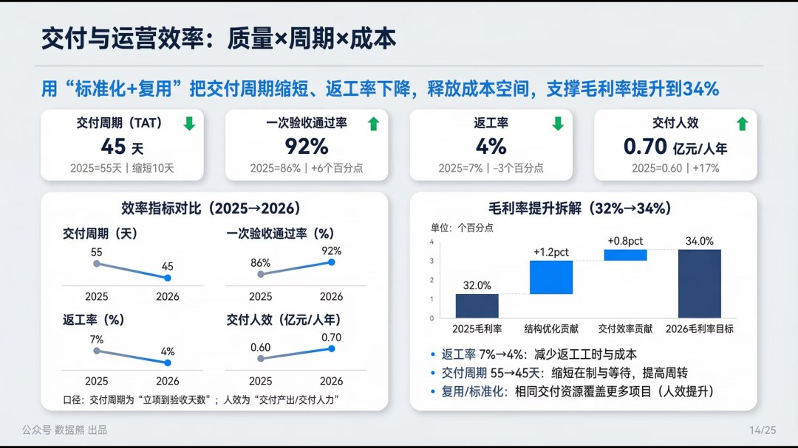

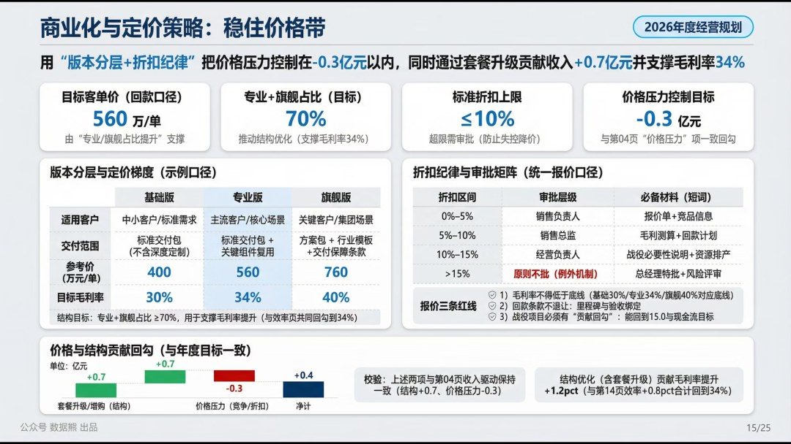

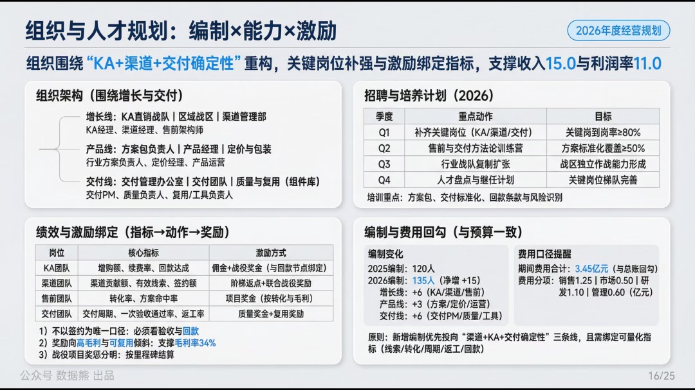

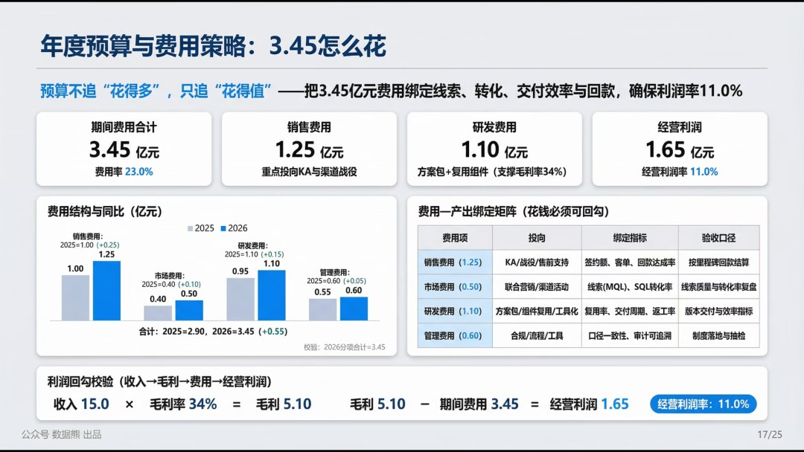

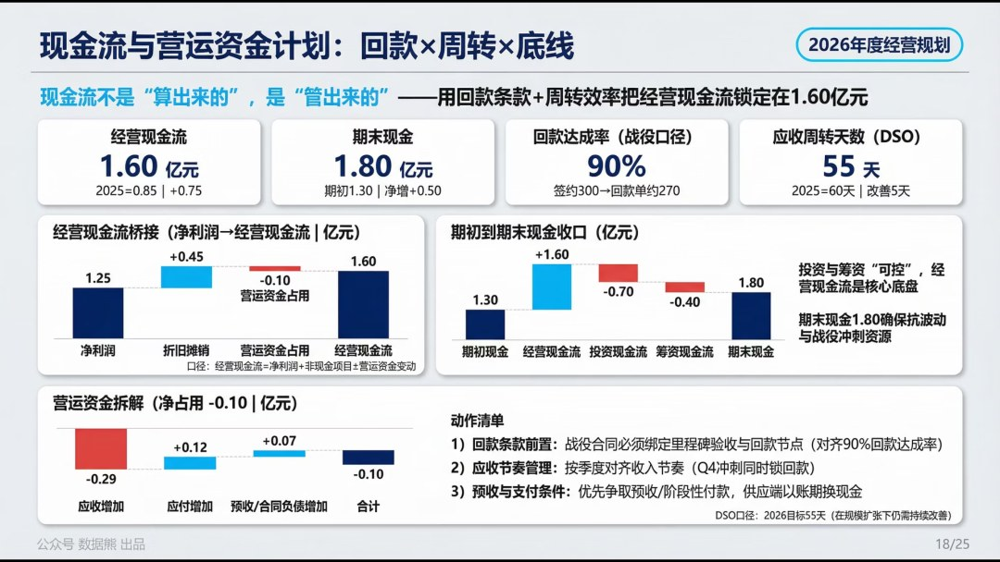

点击

阅读原文

，下载完整版

《2026年

年度经营计划

》。

PPT定制添加数据熊微信：

Daniel-songyq   更多模板加入

会员群

获取

往期推荐

美的集团经营指标体系（附excel）

2026年1月经营分析报告（案例）

从0到1搭建经营分析体系

财务总监2025年工作总结及2026年工作计划

「经营分析驾驶舱」终于做好了：一场会议看清收入、利润和现金流

