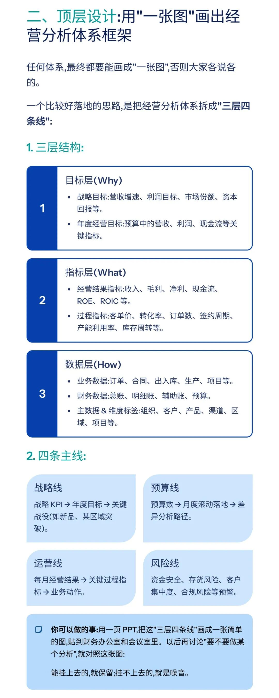
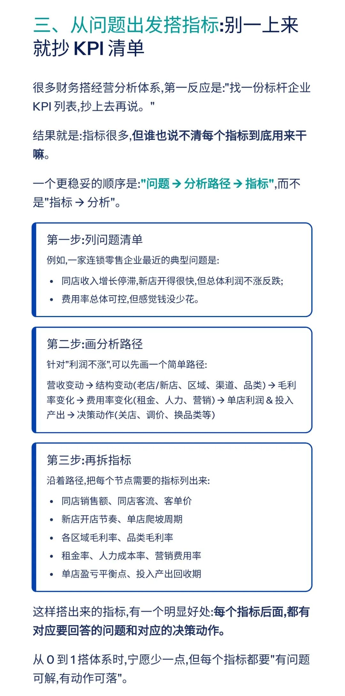
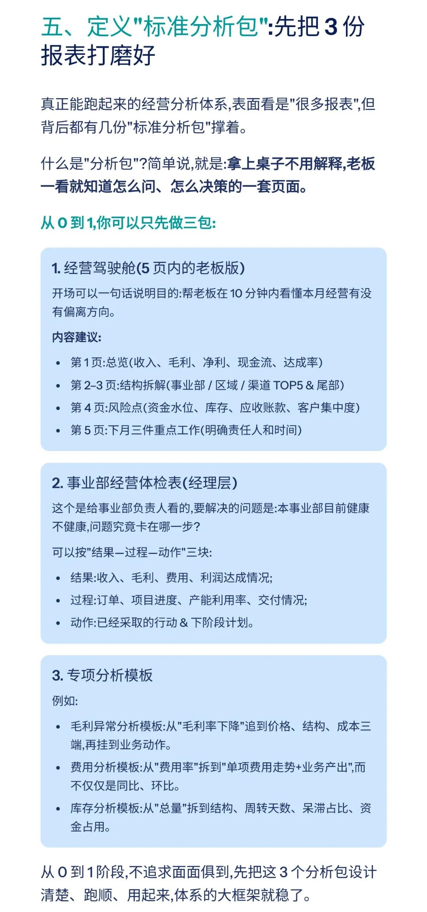
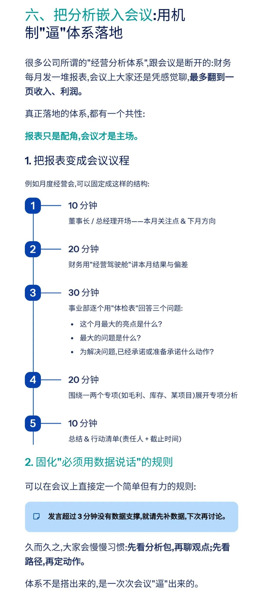
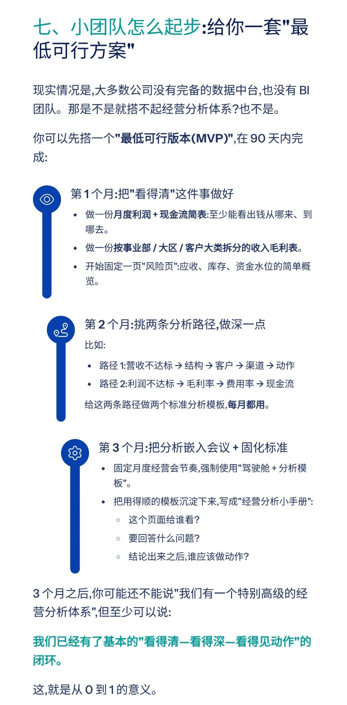
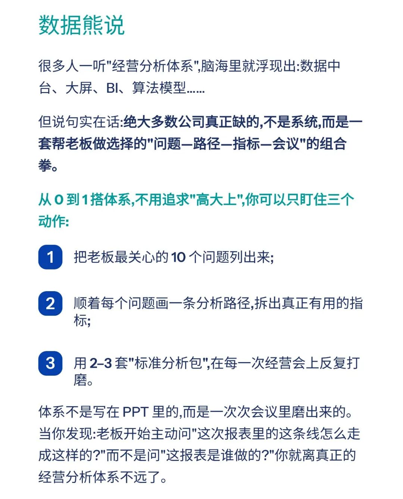

# 从 0 到 1 搭建经营分析体系（附实操手册）

> 来源：微信公众号「数据熊」 · 作者 宋岳清 · 发布于 2026-03-21 14:12  
> 原文链接：http://mp.weixin.qq.com/s?__biz=Mzg2MTg5OTgzNA==&mid=2247497621&idx=1&sn=b4f09a54577ef38b20ed1409fb7c3b14&chksm=ce12aac0f96523d643da7c45b6564b69557997bfca82670c044a880f6243983d2df28512891a

模板即思路，点击

阅读原文

获取

《实操手册：从0到1搭建经营分析体系》

工作没思路，困惑没人问？赶快加入

数据熊的会员群

，与2700+财务精英共同成长

。

PowerBI看板

定制添加数据熊微信：Daniel-songyq

