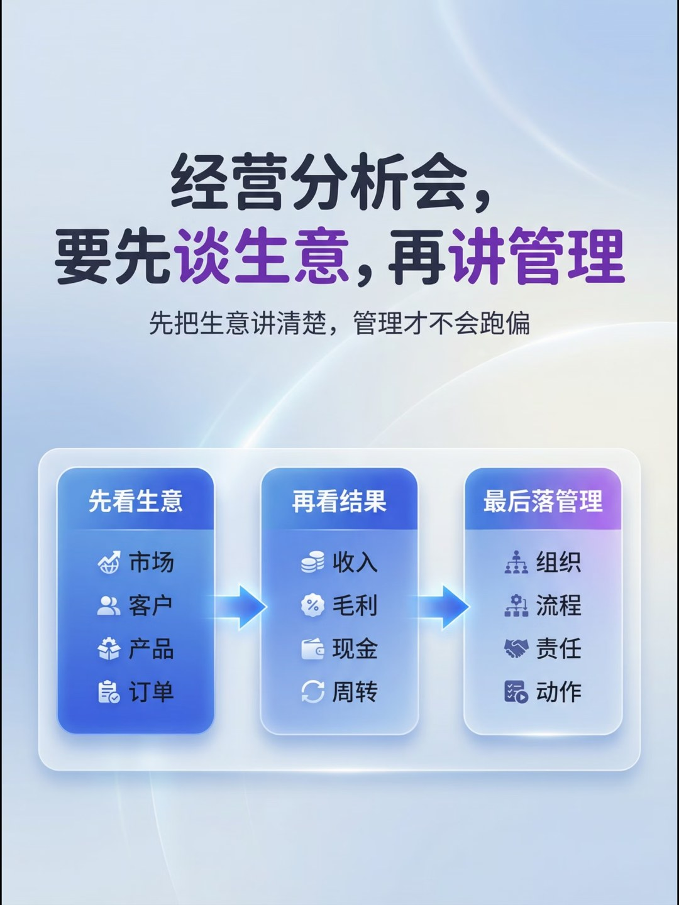
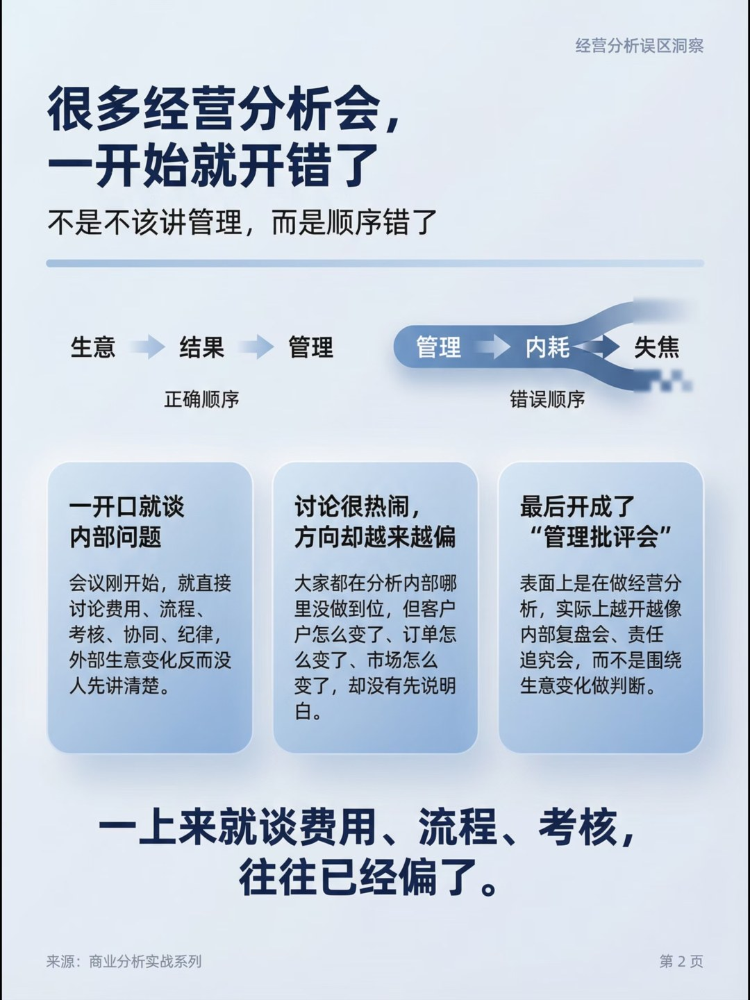
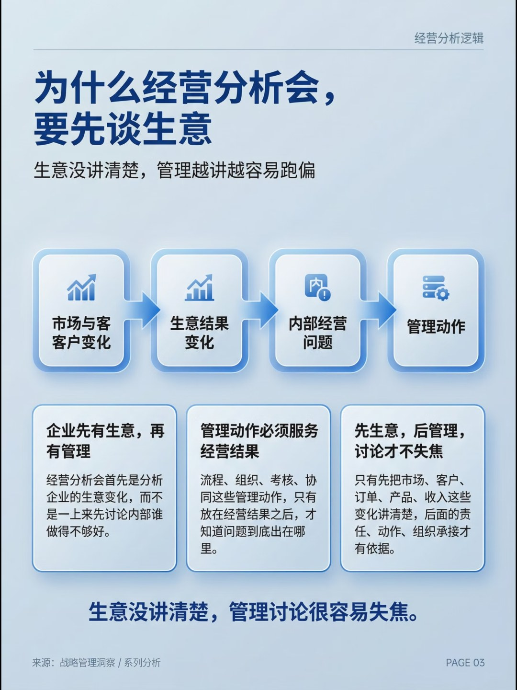
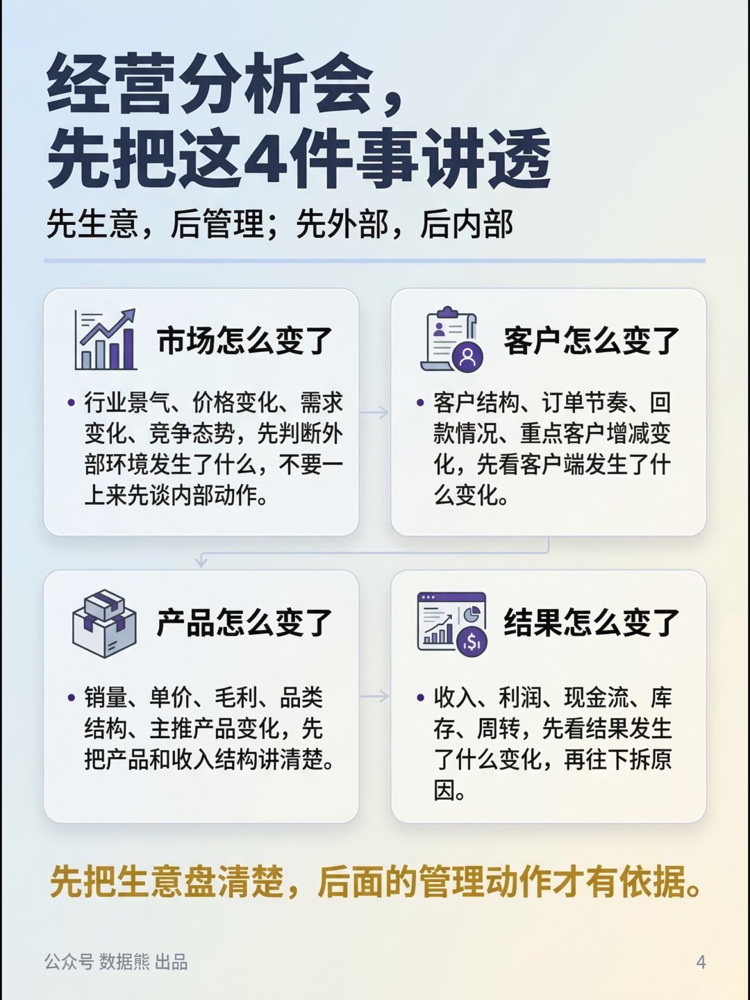
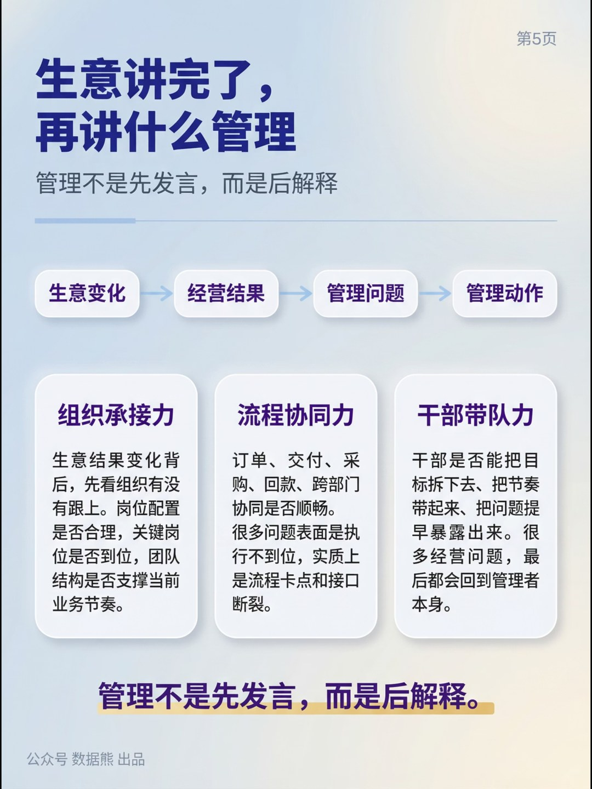
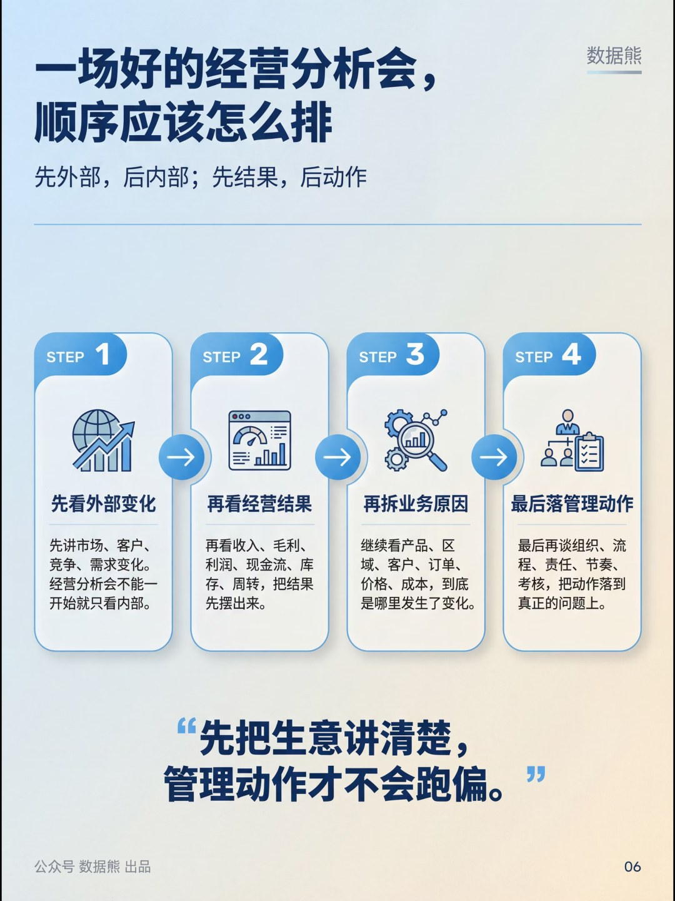
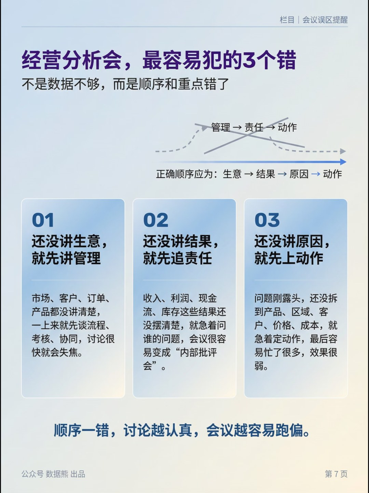
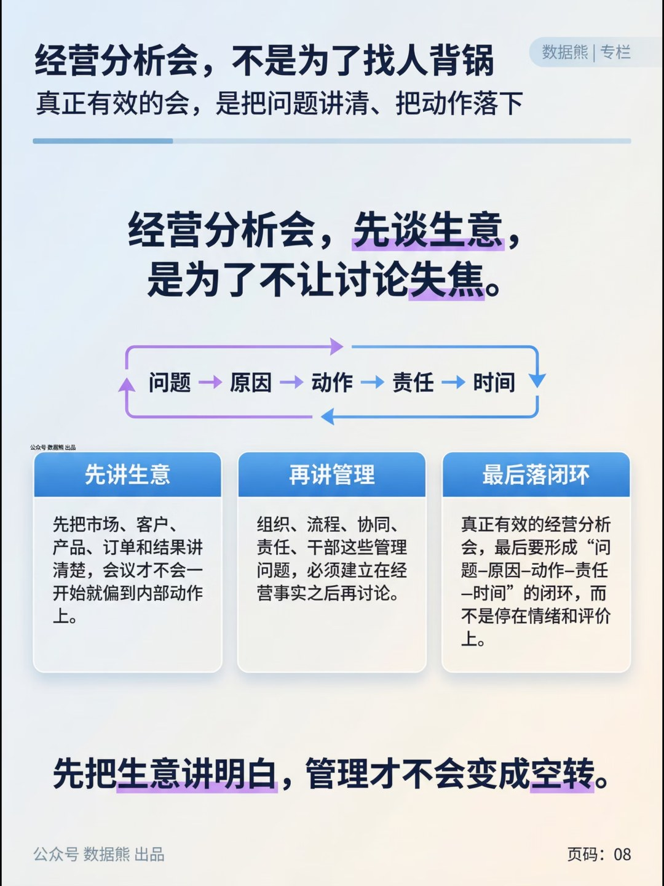

# 经营分析会，要先谈生意，再讲管理

> 来源：微信公众号「数据熊」 · 作者 宋岳清 · 发布于 2026-03-22 14:10
> 原文链接：http://mp.weixin.qq.com/s?__biz=Mzg2MTg5OTgzNA==&mid=2247497672&idx=1&sn=cdaa394f5007cd1fcbb6c8b2e7cf3e05&chksm=ce12aa9df965238bdddc893c273c6923f052a6b4adffc779bf6cf5156a2d50620c6720a50093

模板即思路，文末左下角点击
阅读原文
，获取
《经营分析报告.pptx》

点击文末左下角

阅读原文

，下载

《

经营分析报告模板.pptx

》及excel底表。加入

数据熊的会员群

，与4800+精英交流成长。

PPT定制添加数据熊微信：

Daniel-songyq   更多模板加入

会员群

获取

往期推荐

经营分析报告模板.pptx

财务总监述职报告

财务总监2025年工作总结及2026年工作计划

详解美的集团成本体系

详解美的集团经营分析体系

2026年2月经营分析报告

