# 经营分析报告，别写成了数据流水账

> 来源：微信公众号「数据熊」 · 作者 宋岳清 · 发布于 2026-03-23 11:35
> 原文链接：http://mp.weixin.qq.com/s?__biz=Mzg2MTg5OTgzNA==&mid=2247497688&idx=1&sn=5b43d5be6982685f1f108dda1d1391c7&chksm=ce12aa8df965239ba4da2cfeeaa79150304e4de01c535ebd43d5400c4b5ab31aa7abbcb95174

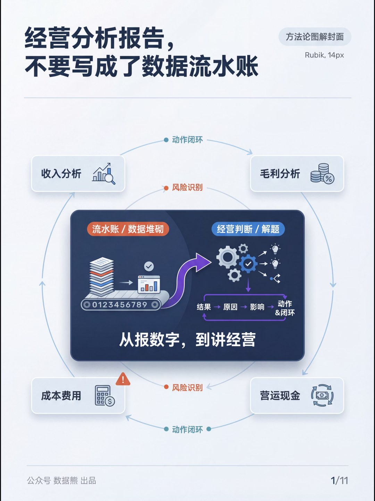

文末左下角点击
阅读原文

，下载
《经营分析报告模板.pptx》

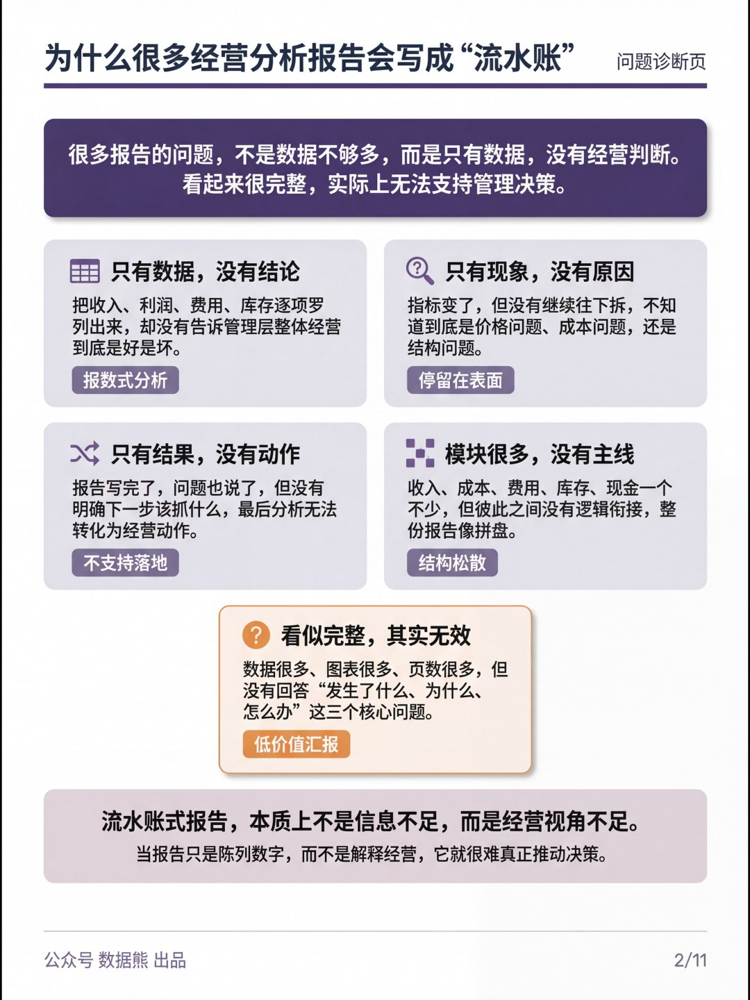

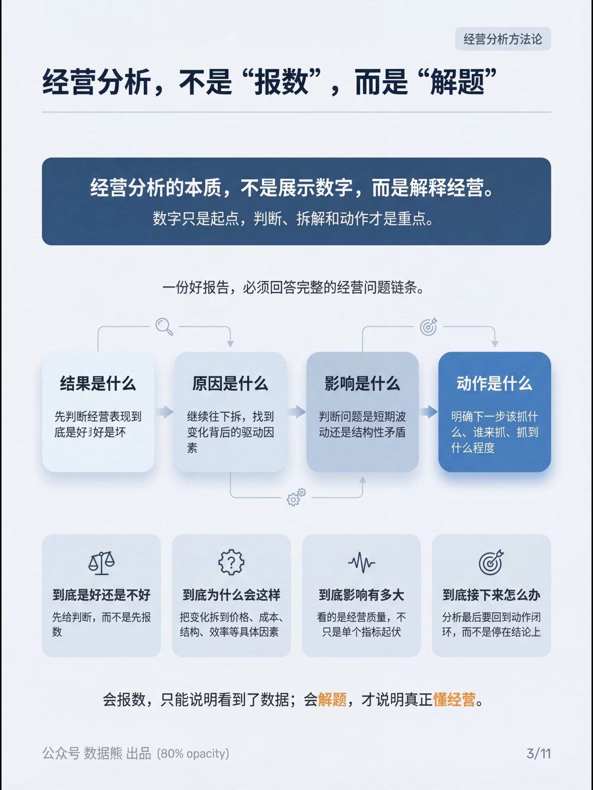

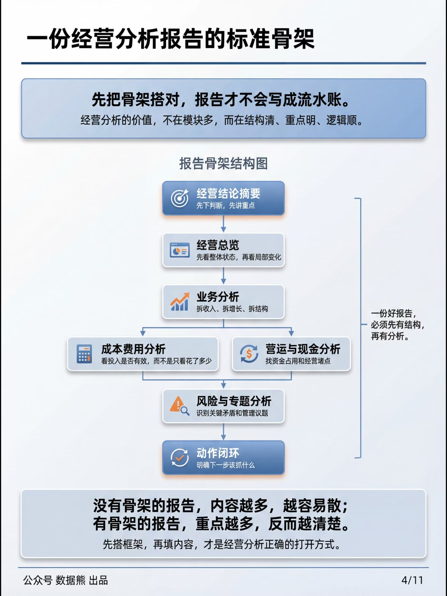

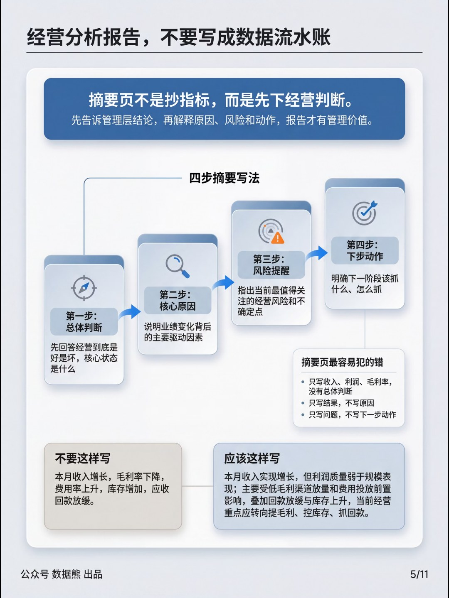

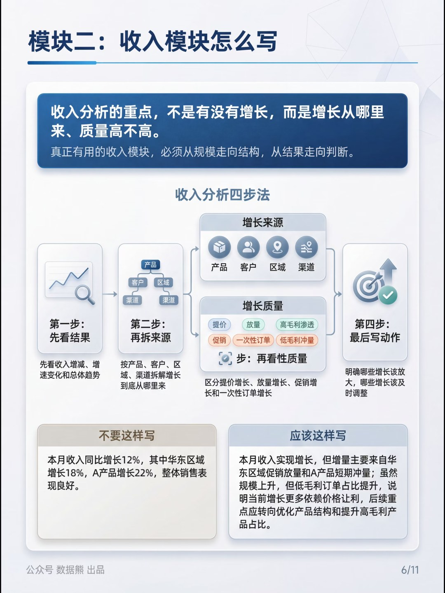

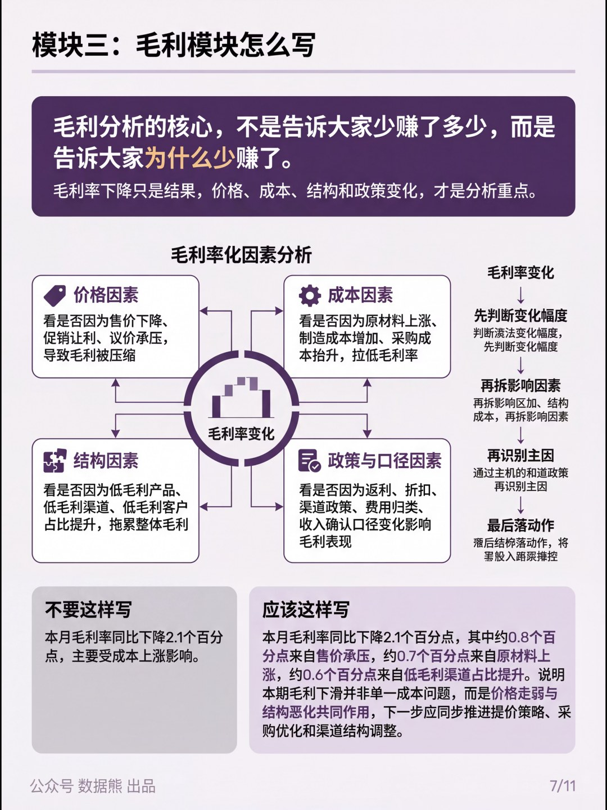

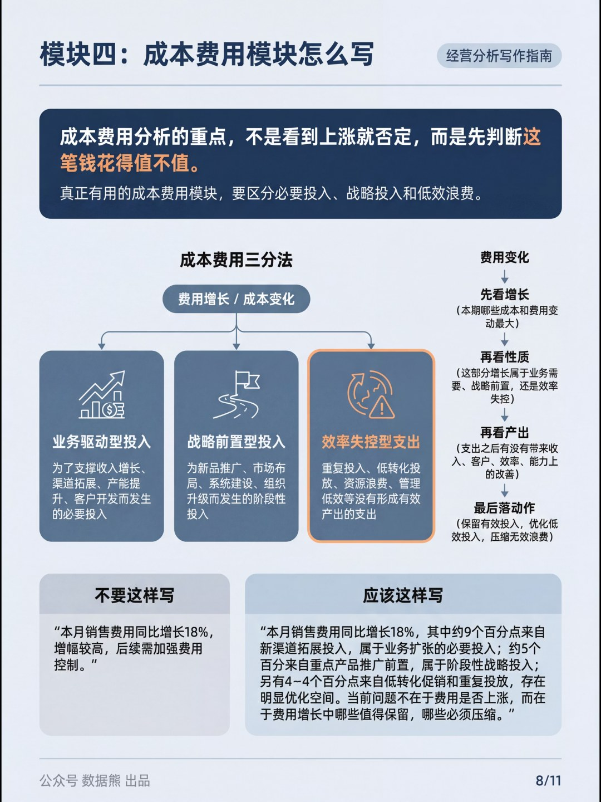

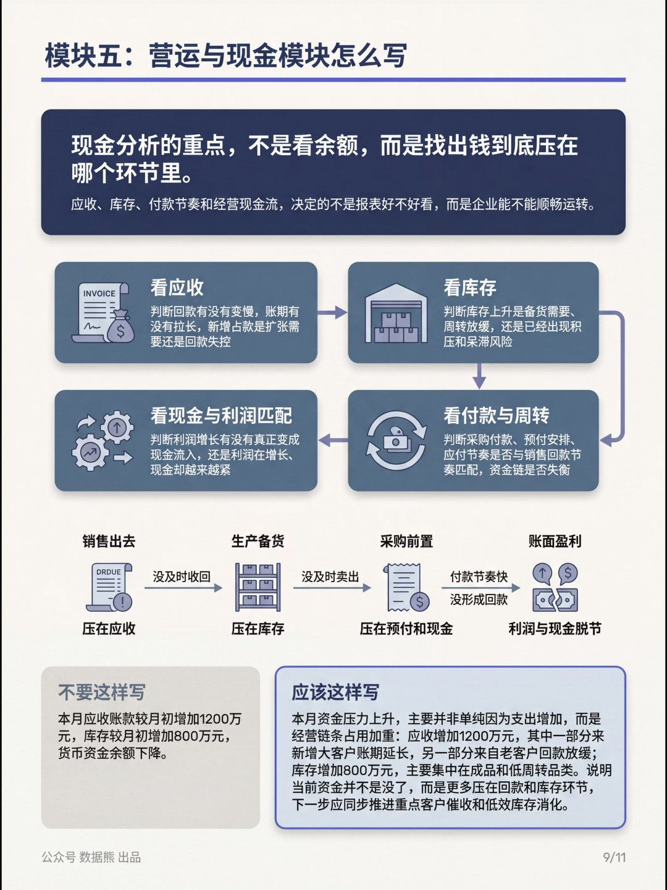

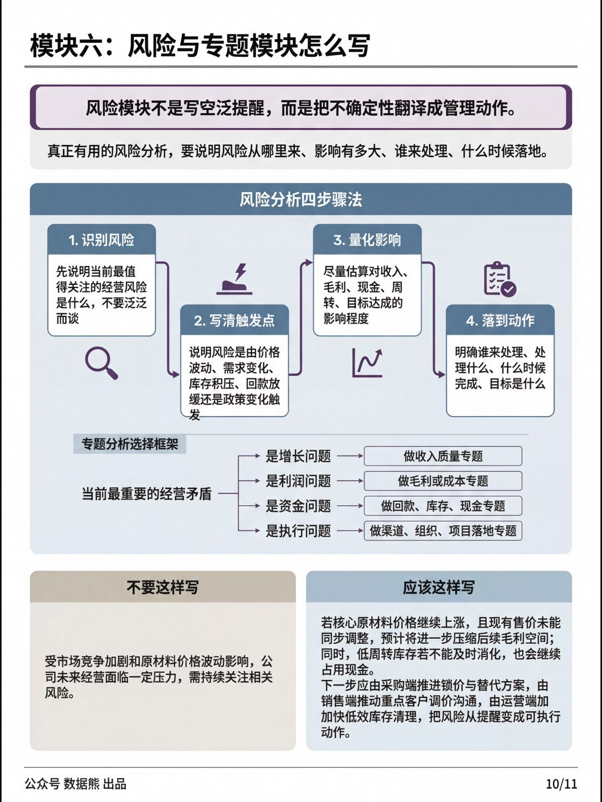

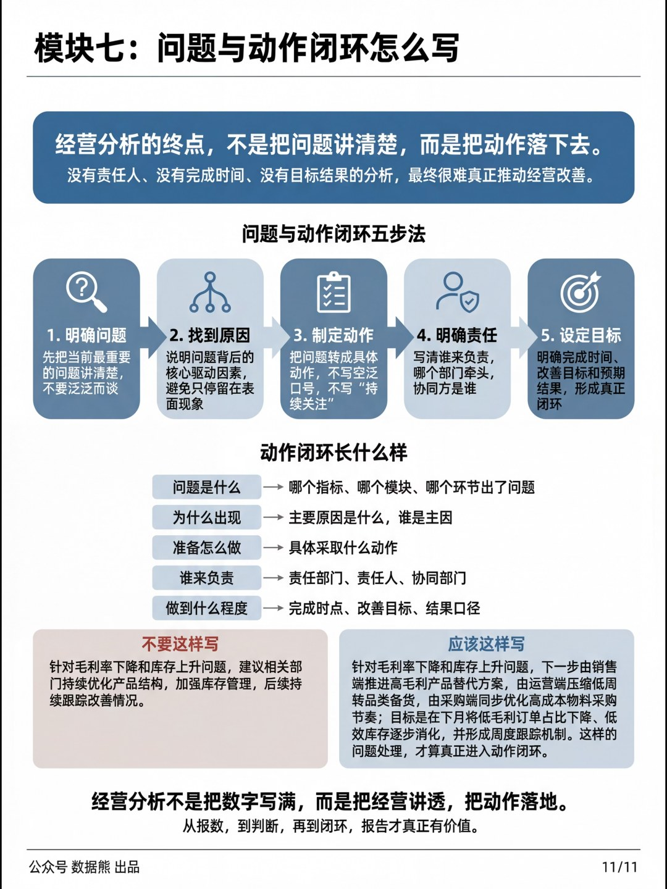

文末左下角点击

阅读原文

，下载

《

经营分析报告模板.pptx

》及excel底表。

PPT定制添加数据熊微信：

Daniel-songyq   更多模板加入

会员群

获取

往期推荐

2025年财务BP年终工作总结.pptx

2025年财务总监工作总结（PPT模板）

经营分析报告模板.pptx

2026年2月经营分析报告

财务部各岗位工作流程详解

2025年经营分析报告（简约版）

