# 2026年1季度经营分析报告

> 来源：微信公众号「数据熊」 · 作者 宋岳清 · 发布于 2026-03-27 09:30
> 原文链接：http://mp.weixin.qq.com/s?__biz=Mzg2MTg5OTgzNA==&mid=2247497803&idx=1&sn=ea054352b0879bceb18c76fb17d0bf0d&chksm=ce12a51ef9652c08cfdb830acea1acb24a31e0113d999a7877a549e3018b16789281eb4f4e75

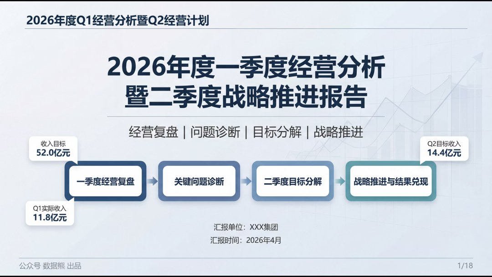

模板即思路，文末左下角点击

阅读原文

，下载《2026年1季度经营分析报告》

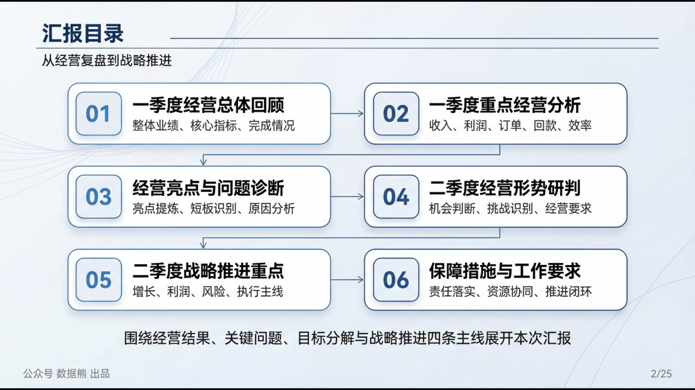

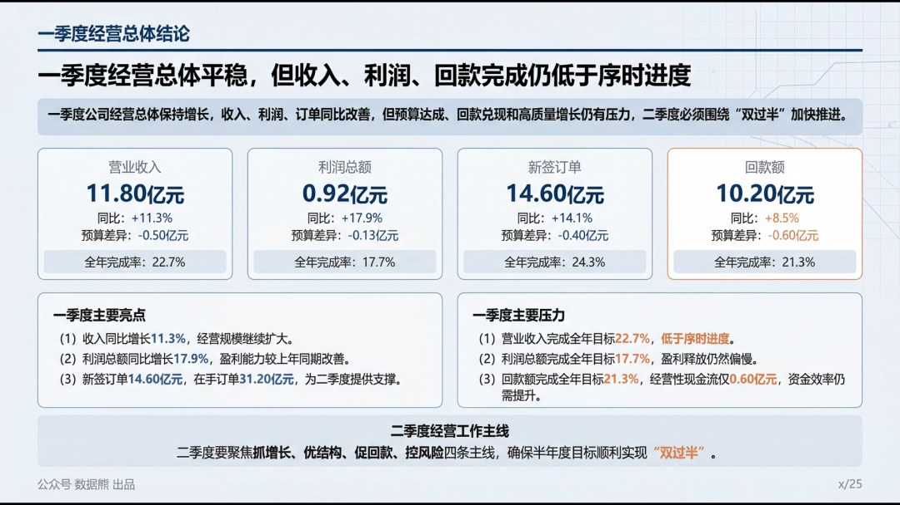

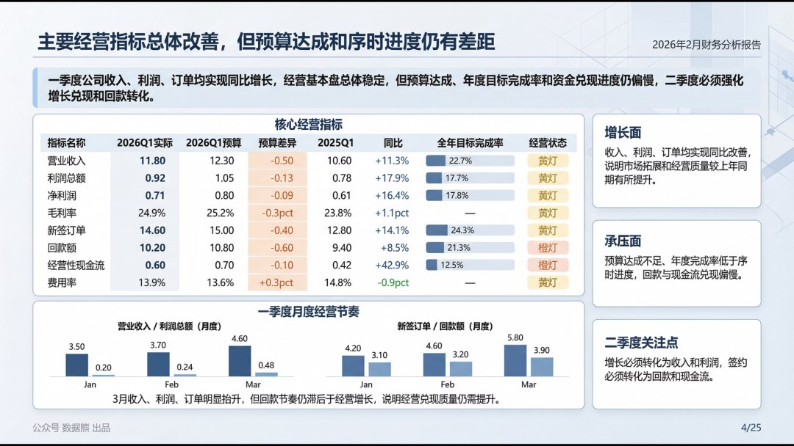

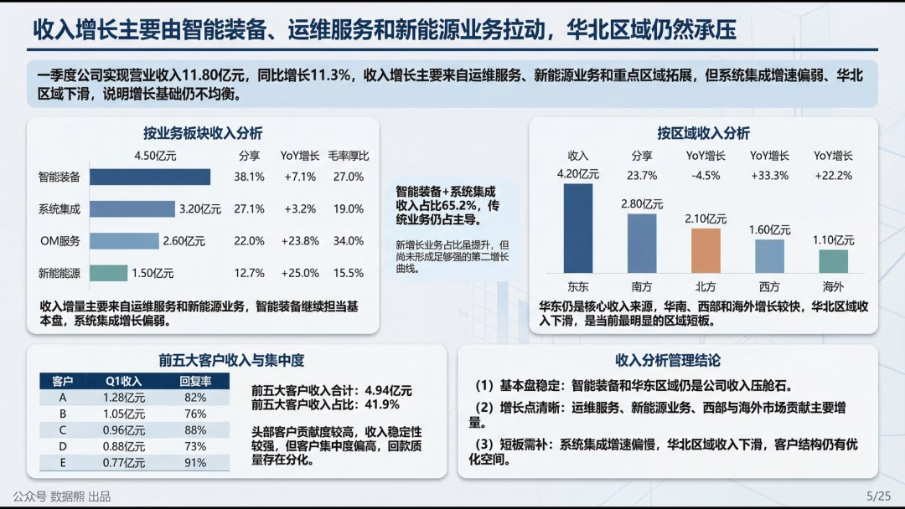

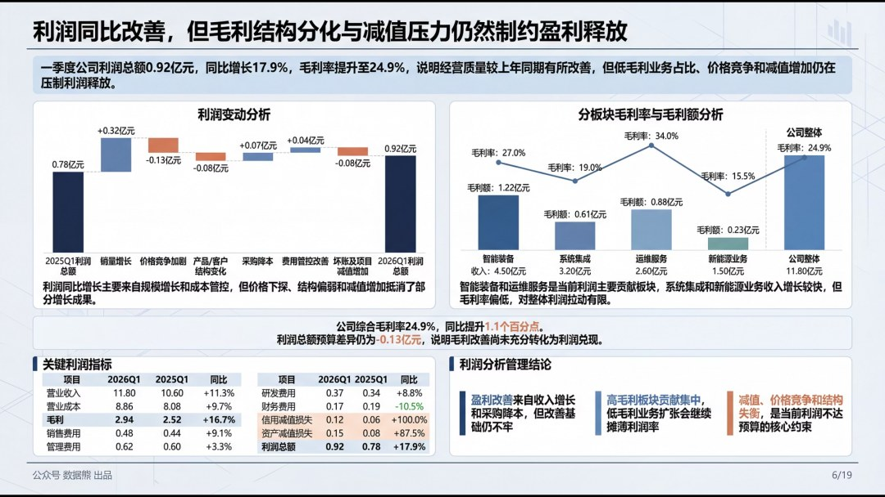

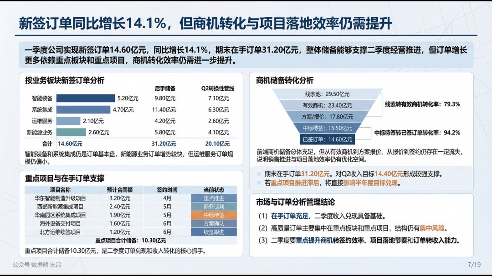

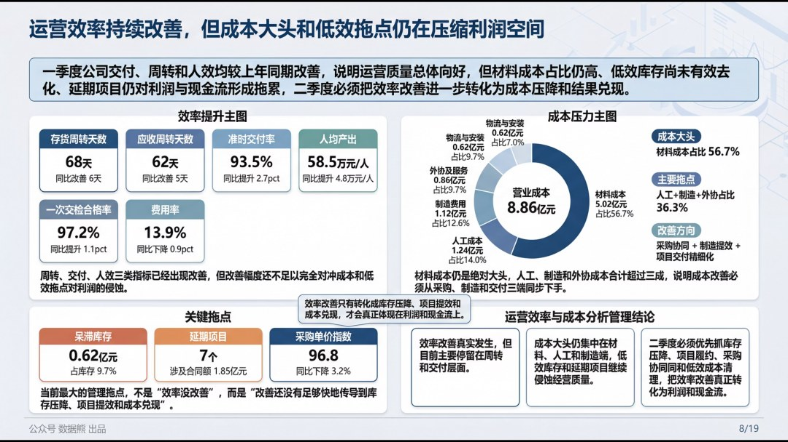

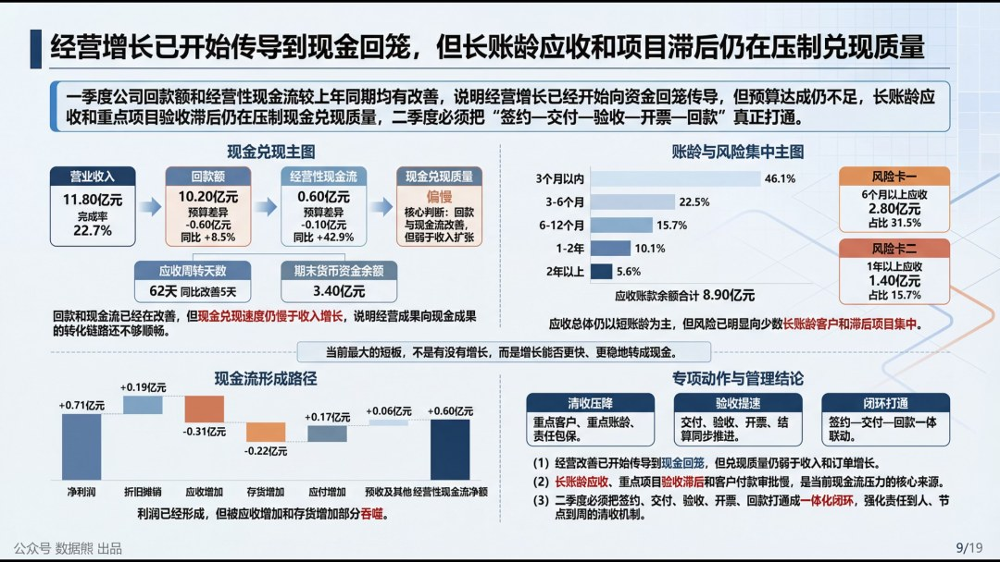

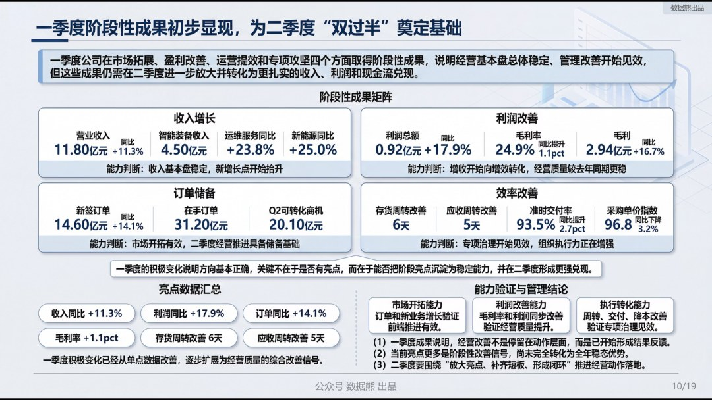

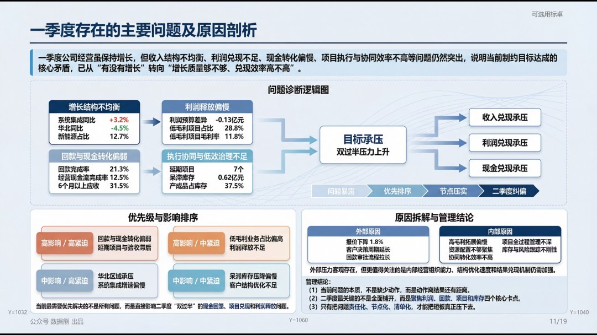

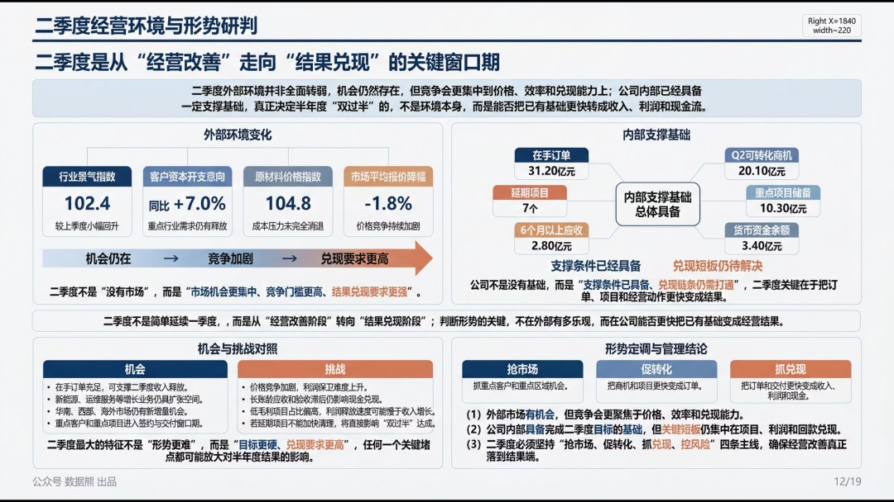

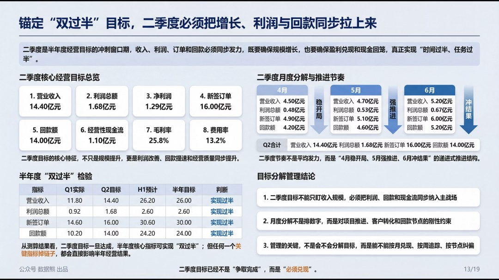

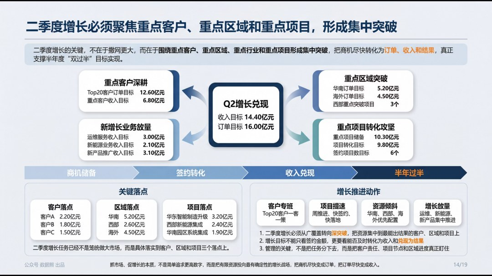

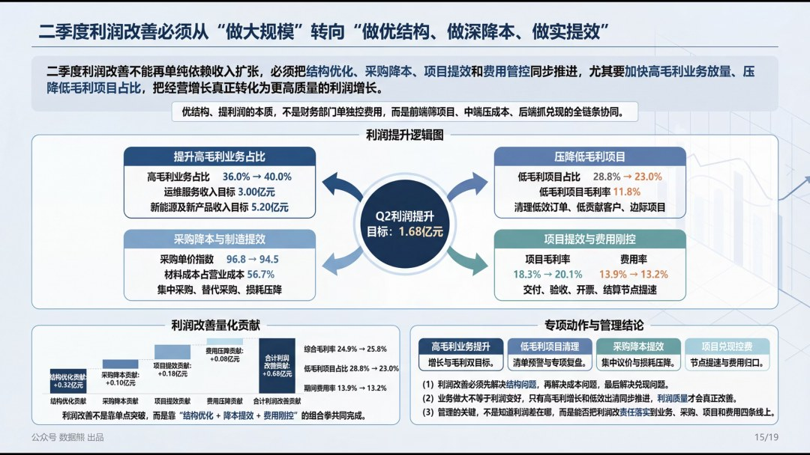

点击

阅读原文

，下载

《

2026年1季度经营分析报告

》。

经营分析框架搭建添加数据熊微信：

Daniel-songyq   更多模板加入

会员群

获取

往期推荐

2026年2月应收账款分析报告

2026年经营计划模板

经营分析报告模板.pptx

财务总监述职报告

2026年2月经营分析报告

详解美的集团经营分析体系

