# 经营分析，全流程sop

> 来源：微信公众号「数据熊」 · 作者 宋岳清 · 发布于 2026-04-14 09:15  
> 原文链接：http://mp.weixin.qq.com/s?__biz=Mzg2MTg5OTgzNA==&mid=2247498363&idx=1&sn=b3a11c08faffe3be1dfee54da7c900c6&chksm=ce12a72ef9652e3890834e74ab93628048b326a96c7166b6f88436c1e5a799693f850fe0d3c4

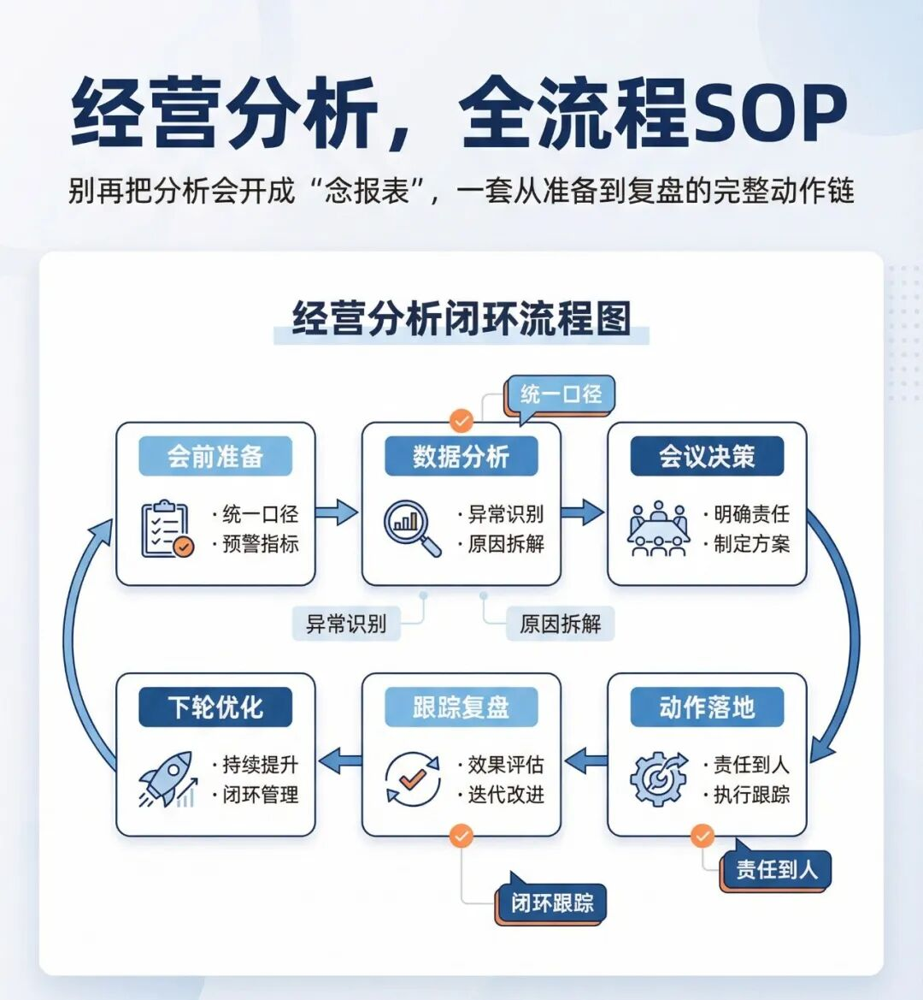

汇报能力才是职场的顶级能力，文末左下角点击
阅读原文

，下载完整版《2026年1季度财务分析报告.pptx》

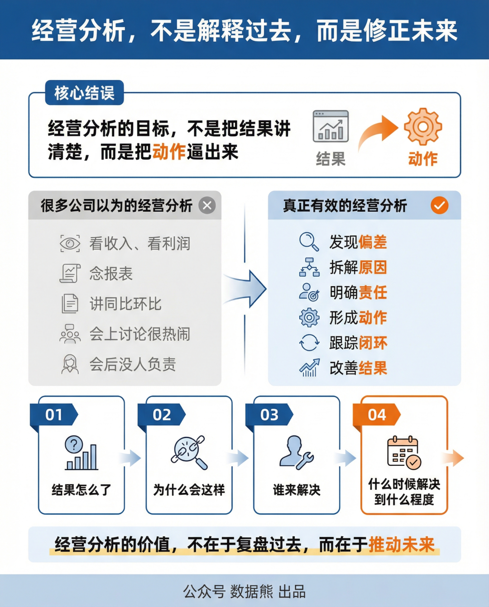

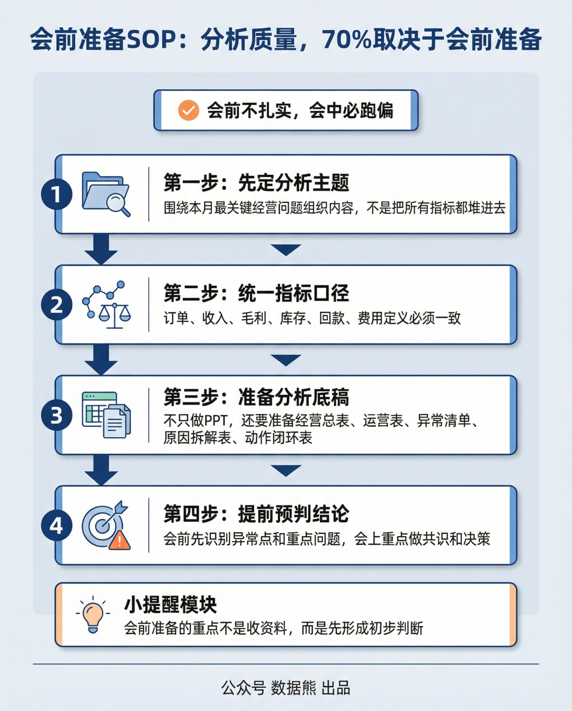

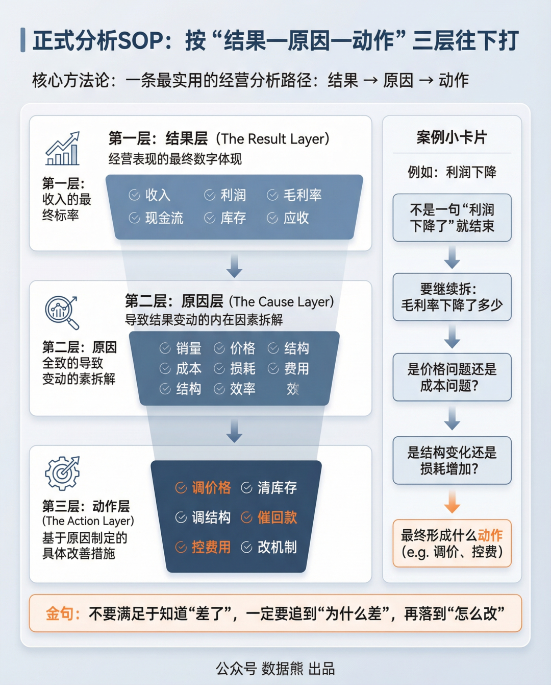

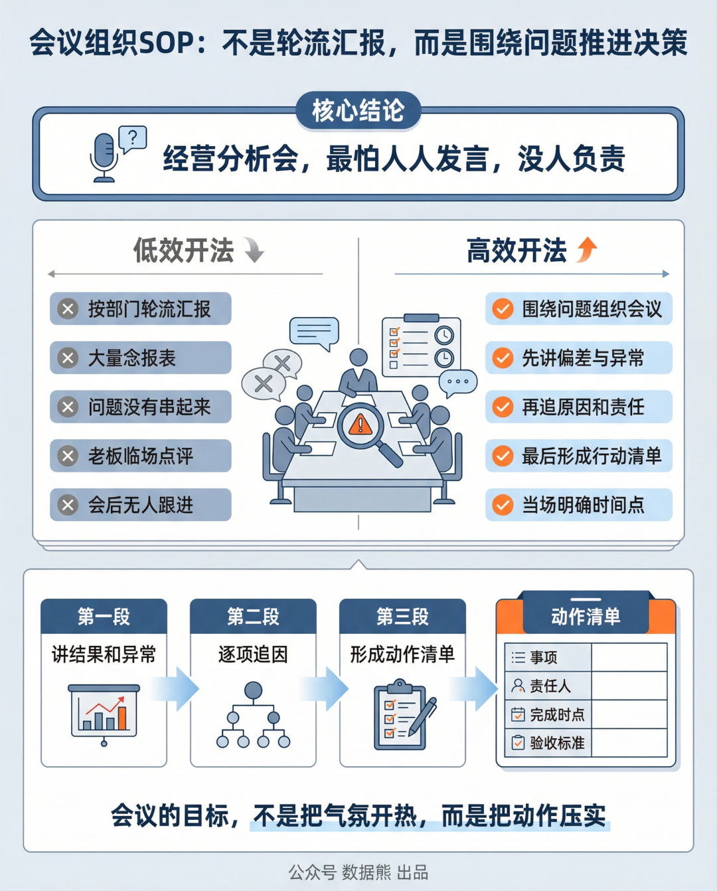

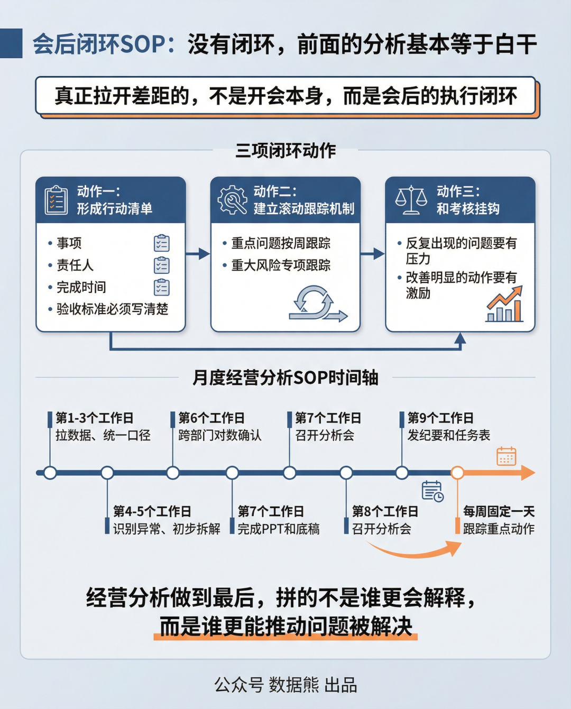

汇报能力才是职场的顶级能力，文末左下角点击
阅读原文

，下载完整版
《2026年1季度财务分析报告.pptx》

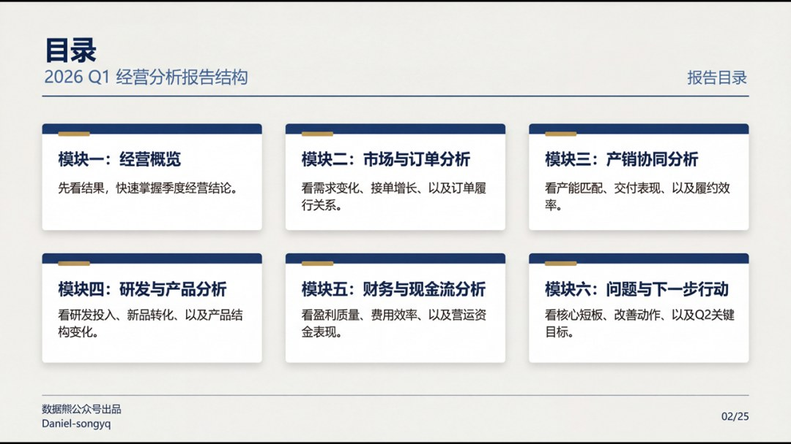

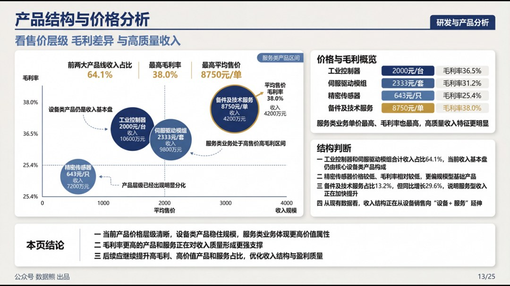

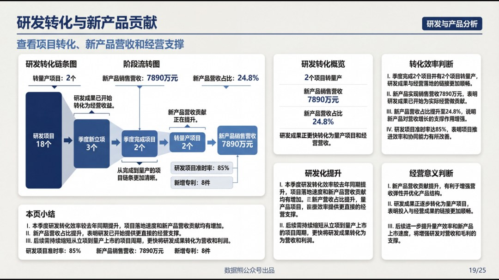

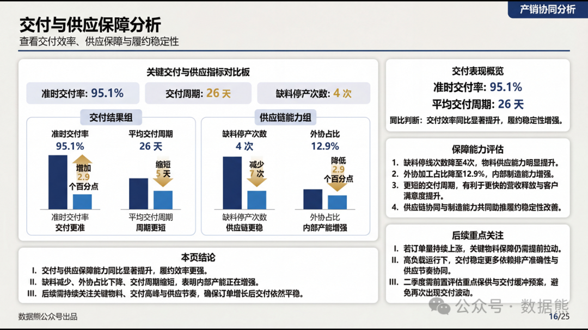

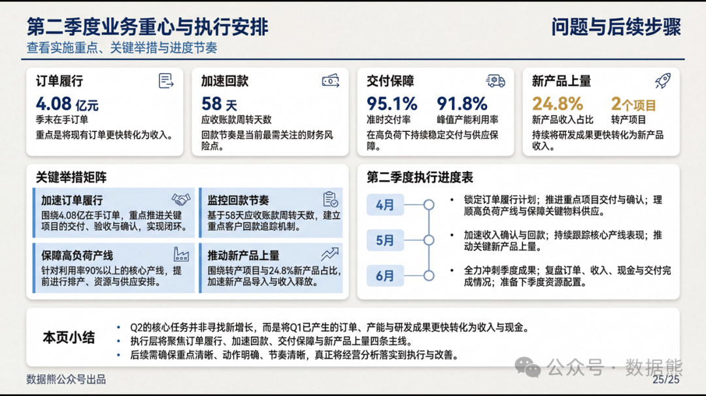

往期推荐

2026年经营计划模板

经营分析报告模板.pptx

财务总监述职报告

2026年2月经营分析报告

详解美的集团经营分析体系

2026年1季度财务工作总结.pptx

2026年1季度经营分析报告

