# 经营分析，视野比技巧更重要

> 来源：微信公众号「数据熊」 · 作者 宋岳清 · 发布于 2026-04-19 08:10  
> 原文链接：http://mp.weixin.qq.com/s?__biz=Mzg2MTg5OTgzNA==&mid=2247498427&idx=1&sn=b6528ac812f02f7182db34c438f68356&chksm=ce12a7eef9652ef85764015a577da8b3159cd91191309a0929e7d1fa0661a085d0542b400e1f

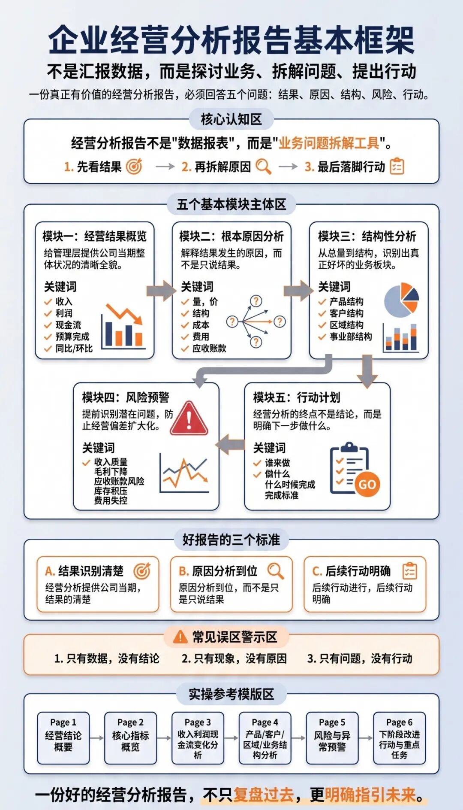

汇报能力才是职场的顶级能力，文末左下角点击
阅读原文

，下载完整版
《2026年1季度财务分析报告.pptx》

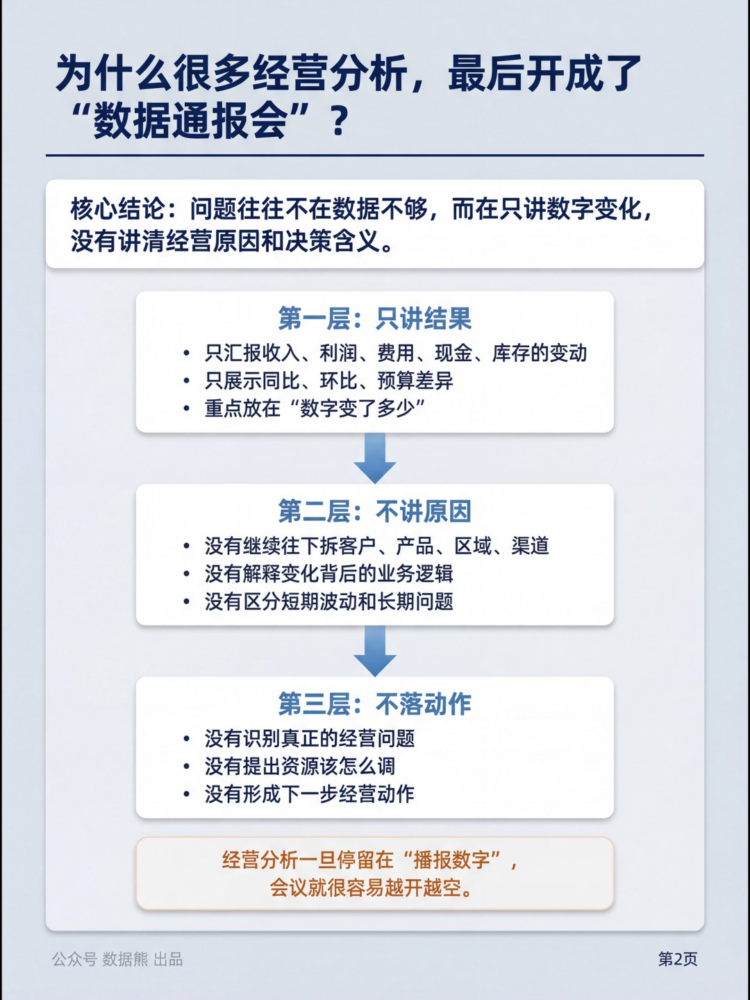

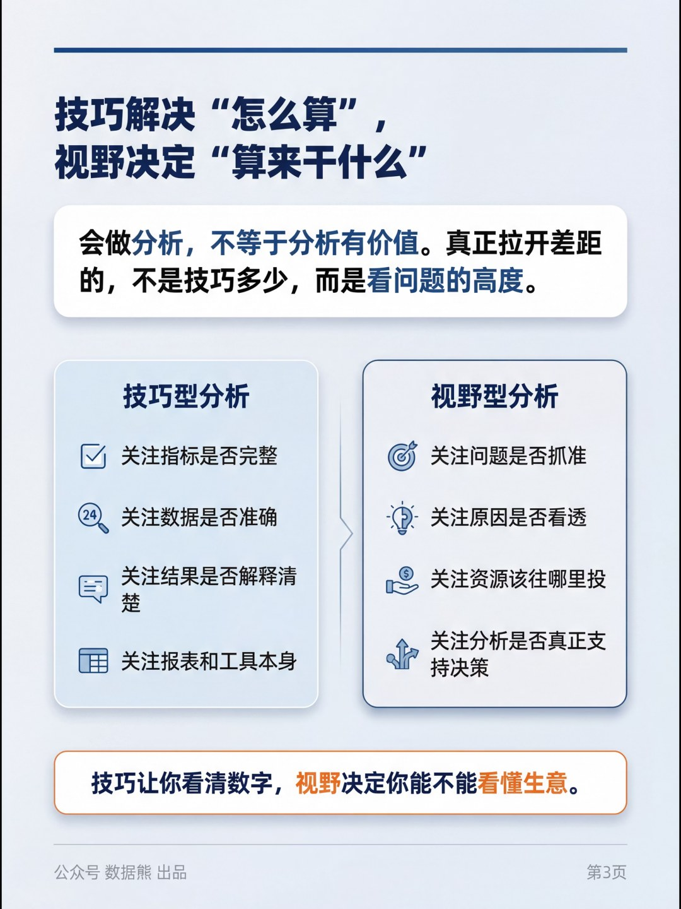

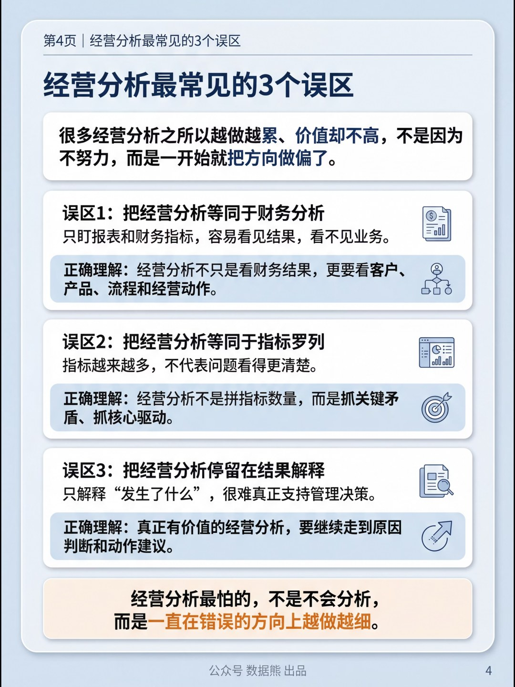

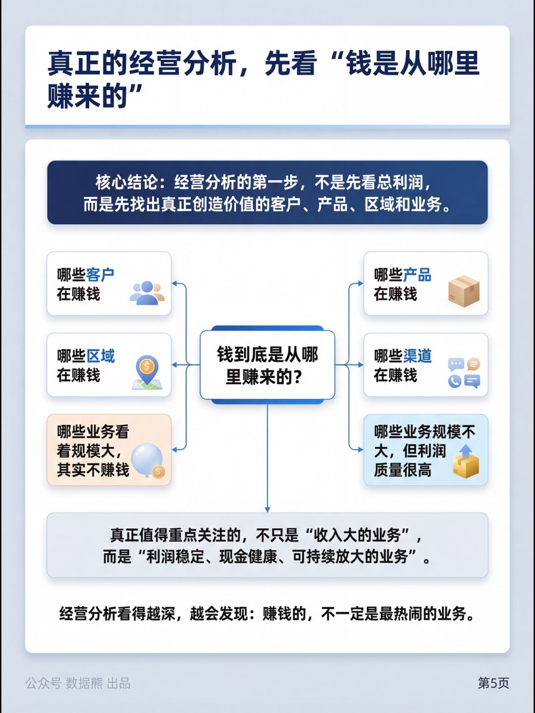

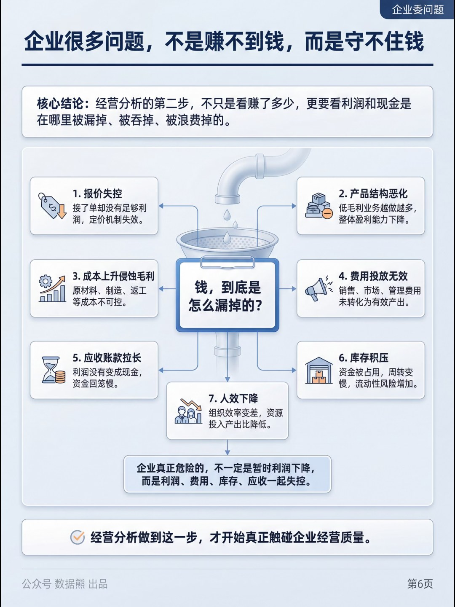

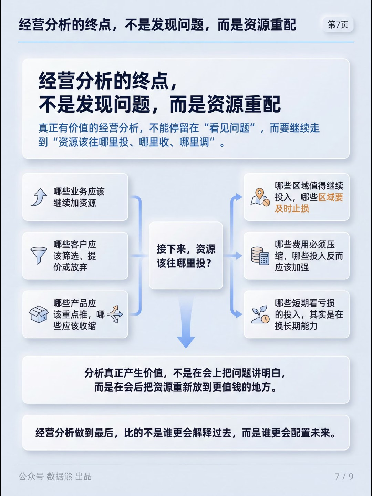

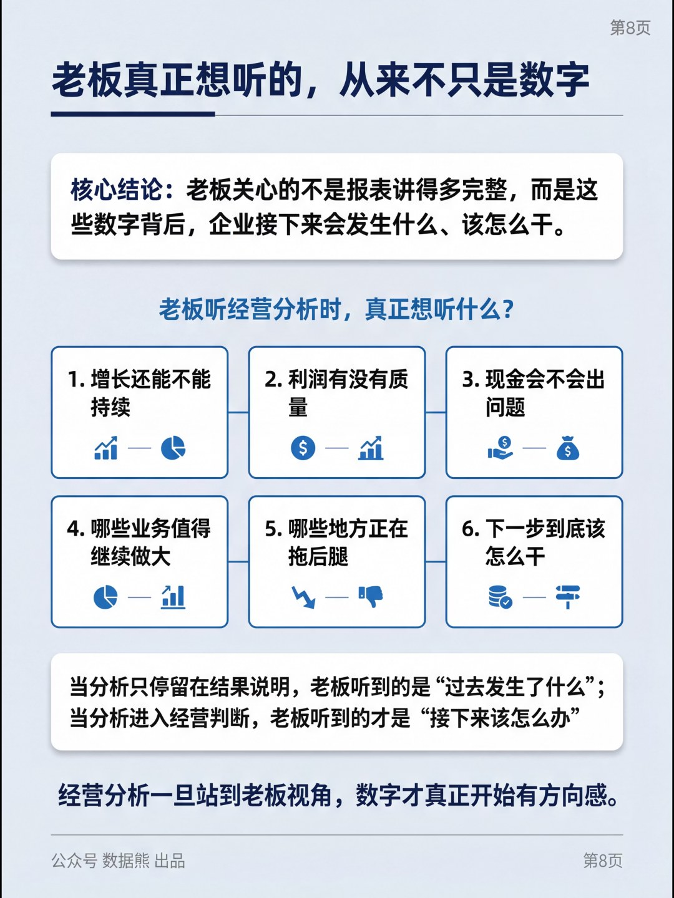

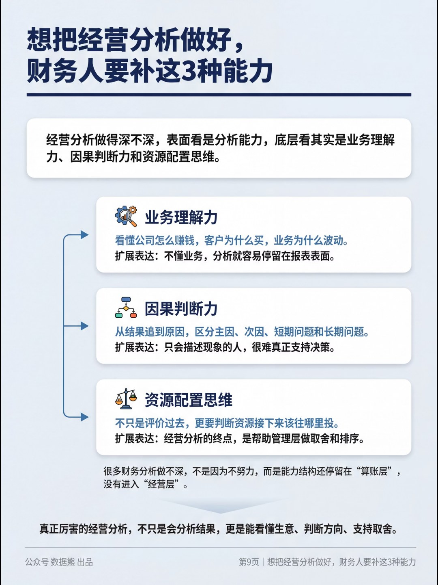

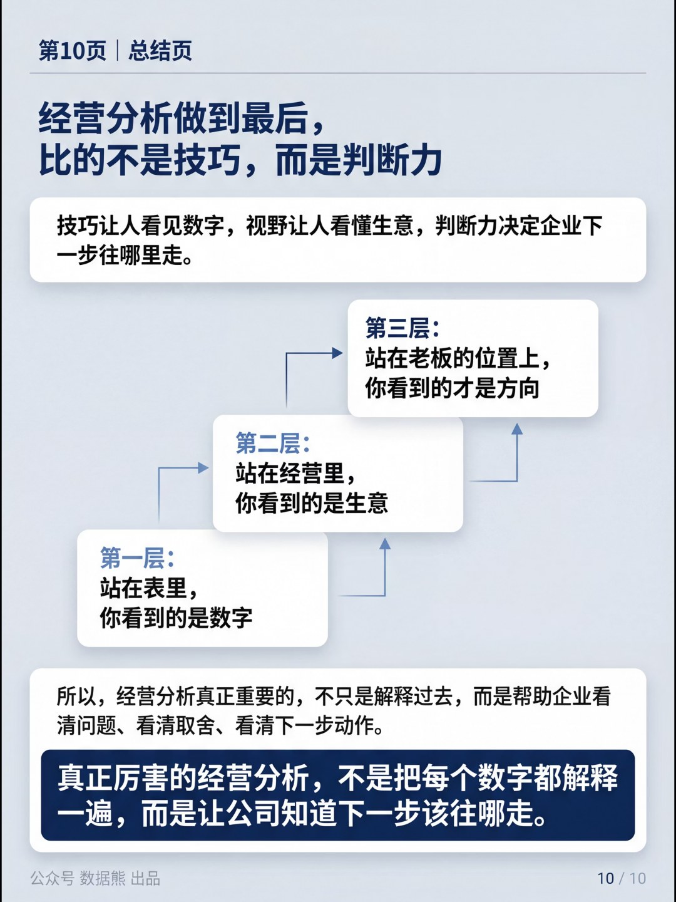

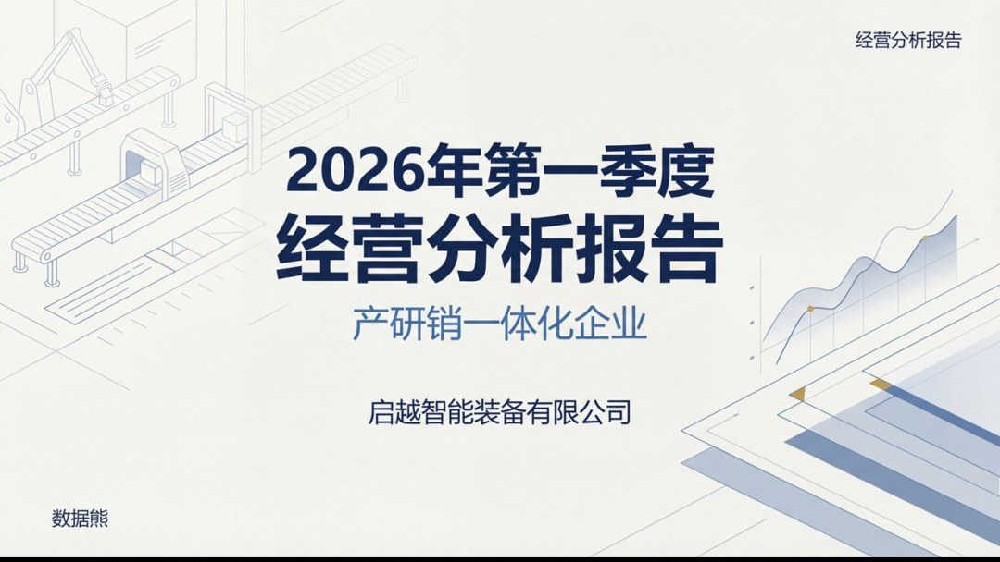

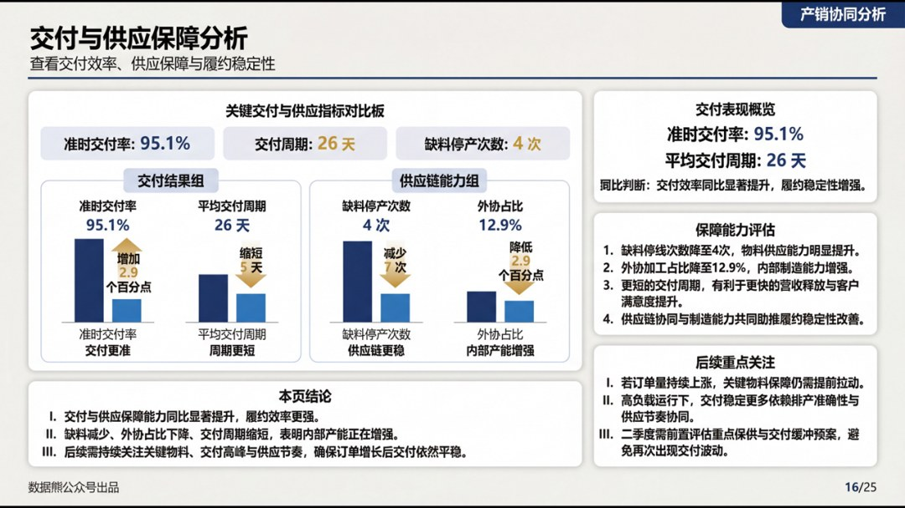

往期推荐

2026年1季度经营分析报告.pptx

经营分析报告模板.pptx

2026年1季度应收账款分析报告.pptx

美的集团经营指标体系（附excel）

详解美的集团经营分析体系

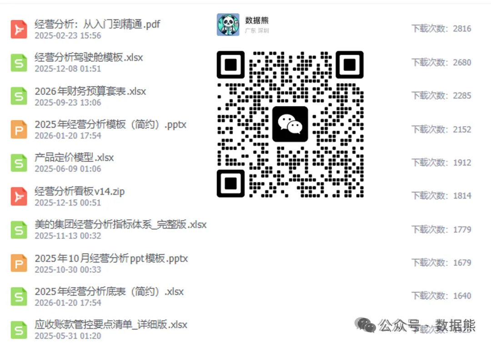
