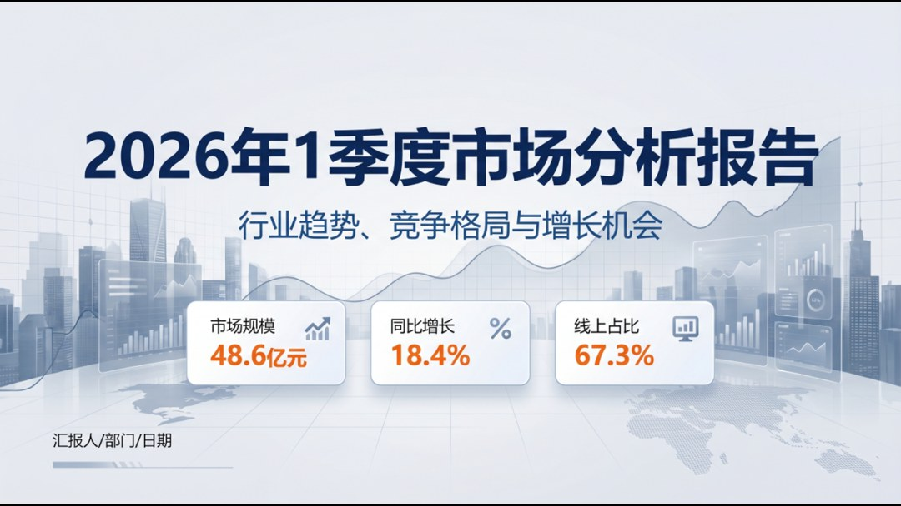
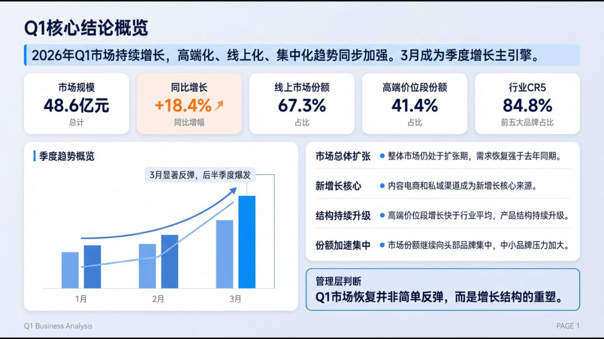
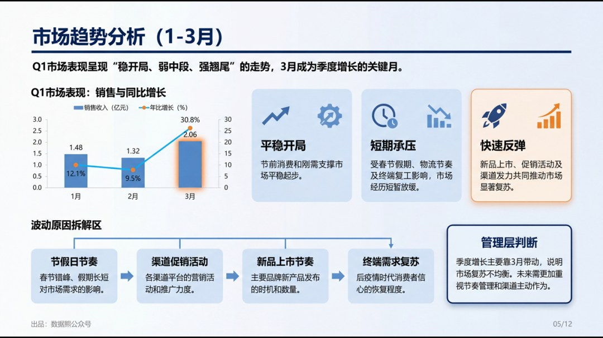
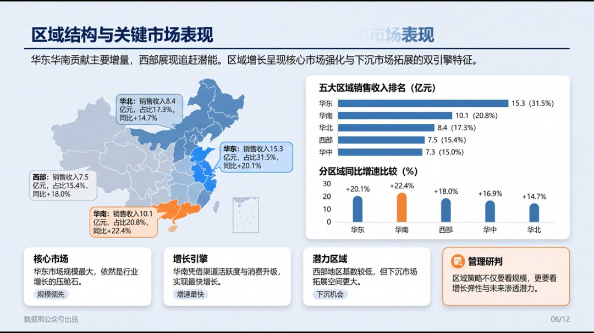
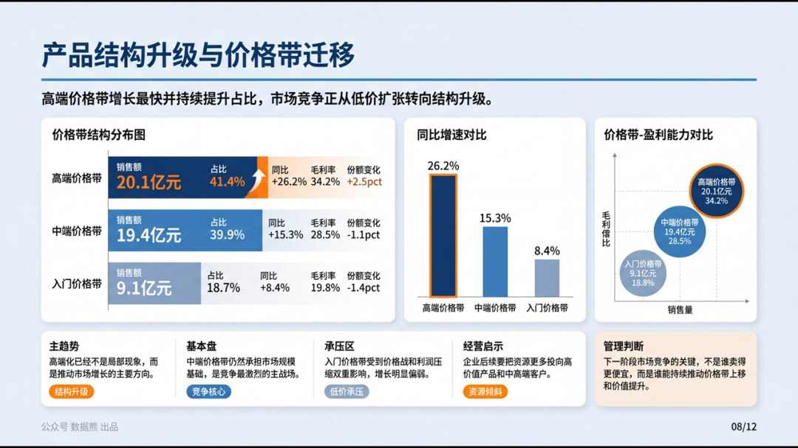
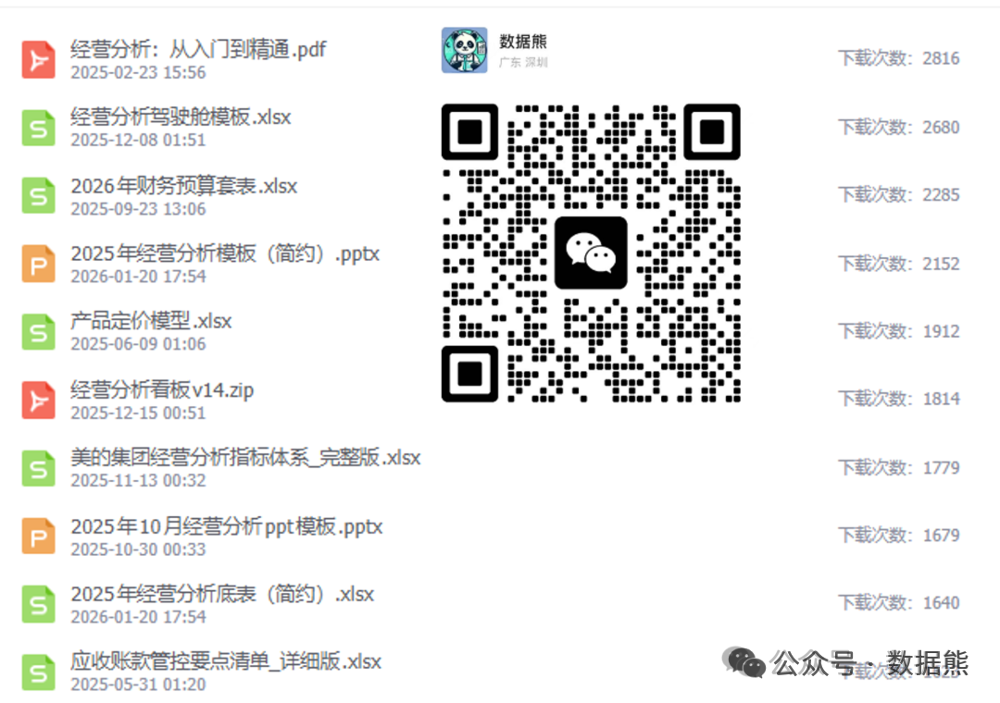

# 2026年1季度市场分析报告

> 来源：微信公众号「数据熊」 · 作者 宋岳清 · 发布于 2026-04-20 09:15  
> 原文链接：http://mp.weixin.qq.com/s?__biz=Mzg2MTg5OTgzNA==&mid=2247498476&idx=1&sn=64031c43b14c382002d5b836e3302564&chksm=ce12a7b9f9652eafc35daa4ac3f5959f922d795b077e01b7676ce621e808453dae73eae7aac3

汇报能力才是职场的顶级能力，文末左下角点击
阅读原文
，下载完整版《2026年1季度市场分析报告》

往期推荐

2026年1季度存货分析报告.pptx

2026年1季度应收账款分析报告.pptx

2026年1季度经营分析报告.pptx

经营分析报告模板.pptx

2026年1季度财务分析报告.pptx

