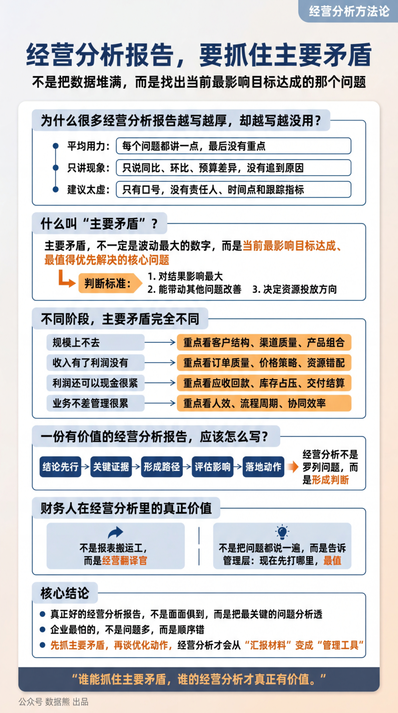
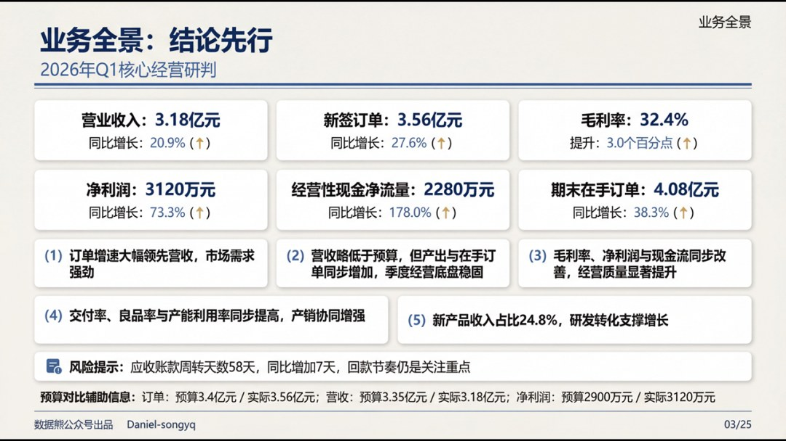
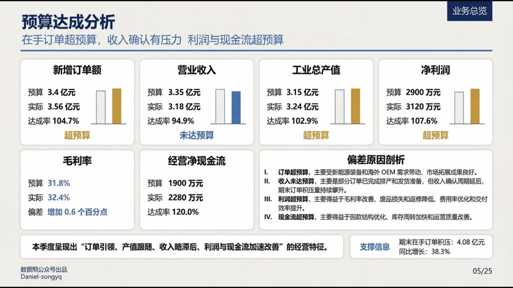
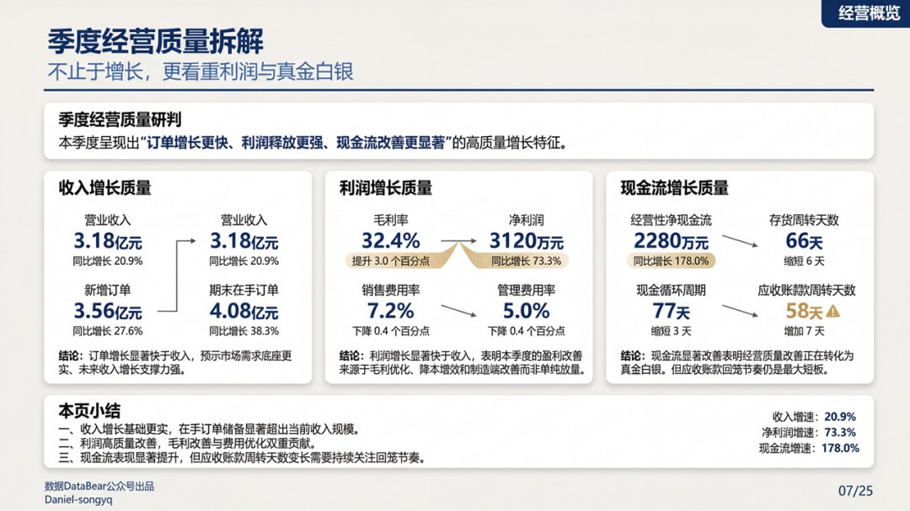
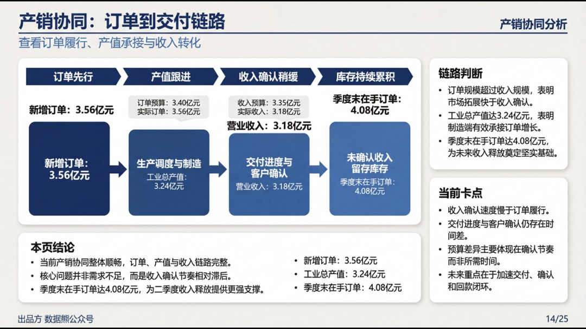
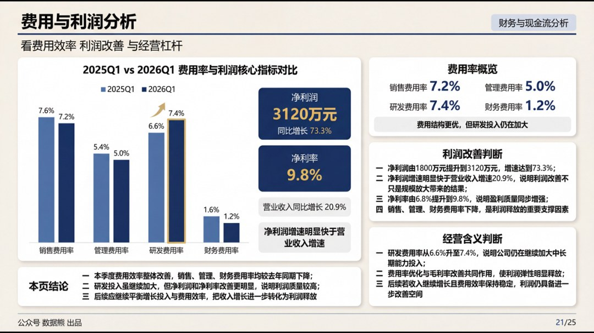
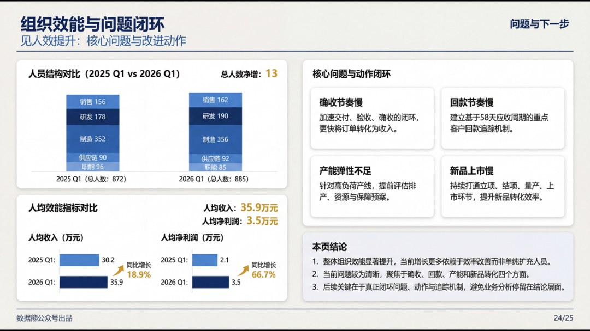
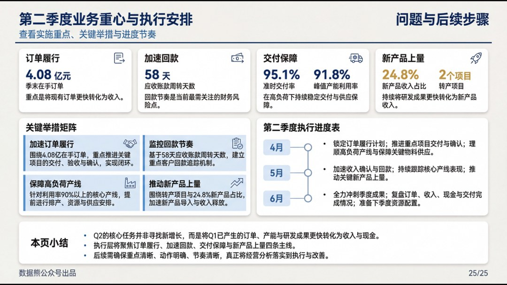
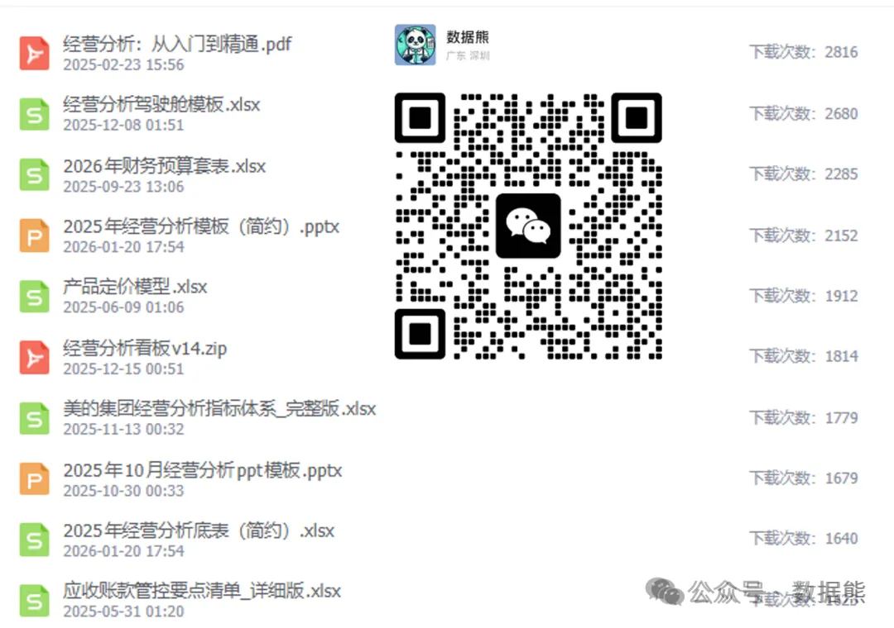

# 经营分析报告，要抓住主要矛盾（附经营分析报告.pptx)

> 来源：微信公众号「数据熊」 · 作者 宋岳清 · 发布于 2026-04-22 09:15  
> 原文链接：http://mp.weixin.qq.com/s?__biz=Mzg2MTg5OTgzNA==&mid=2247498489&idx=1&sn=9dddeed4ea375ae1e8fb2832c859b5e9&chksm=ce12a7acf9652eba35fe1eeda7a48e3c0a2609b8273db65dcf0d140a49c59ab2cf73b276d38c

汇报能力才是职场的顶级能力，文末左下角点击
阅读原文

，下载完整版《2026年1季度财务分析报告.pptx》

往期推荐

2026年经营计划模板

经营分析报告模板.pptx

财务总监述职报告

2026年2月经营分析报告

详解美的集团经营分析体系

2026年1季度财务工作总结.pptx

2026年1季度经营分析报告

