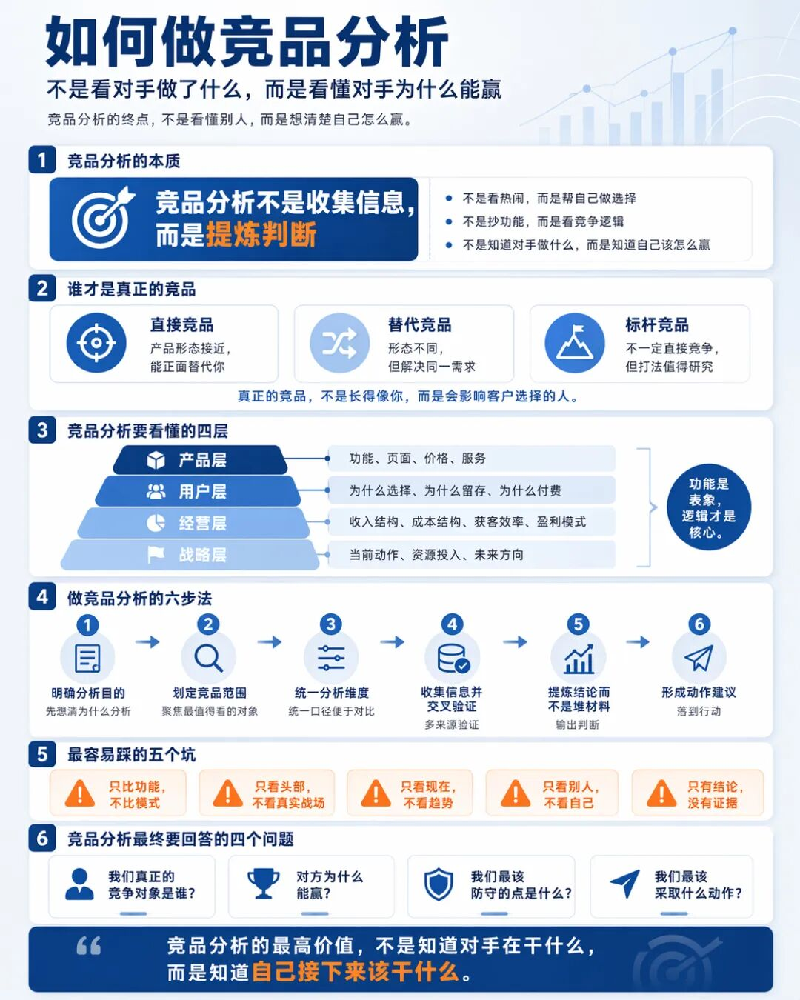
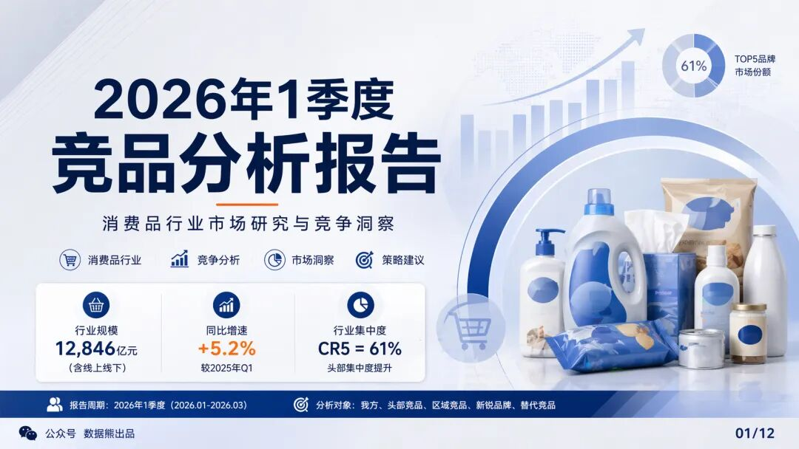
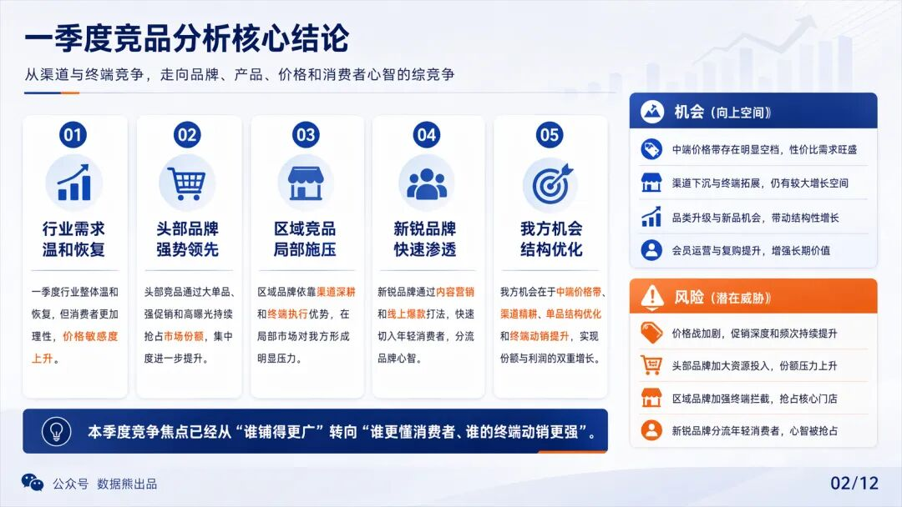
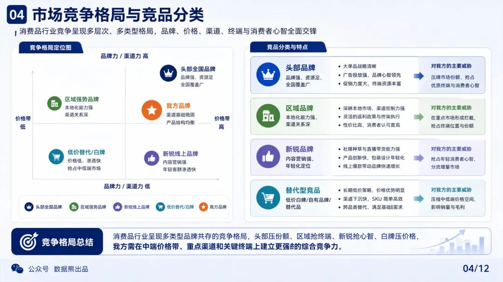
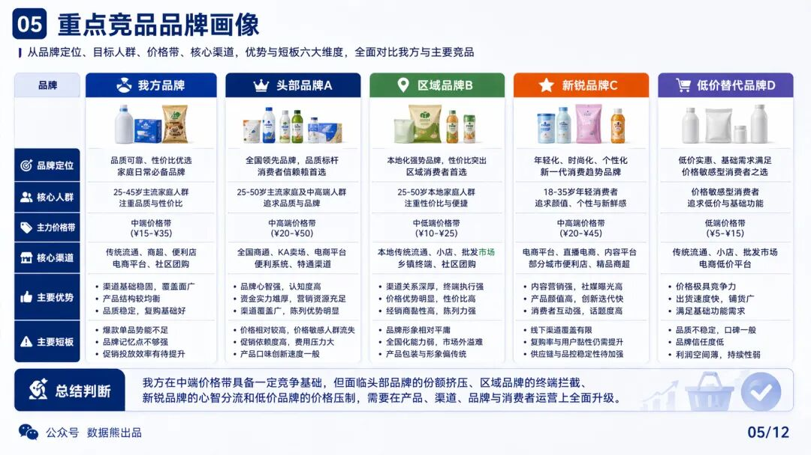
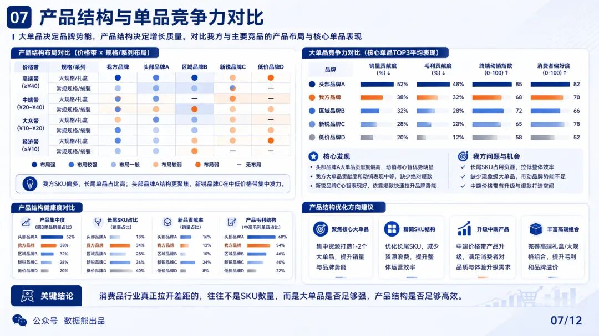
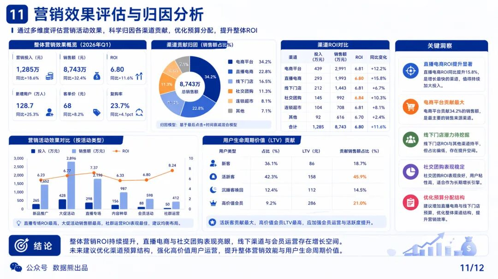
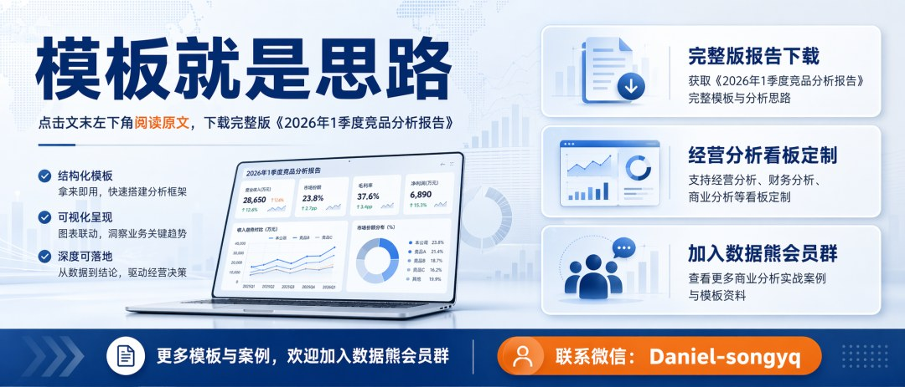

# 2026年1季度竞品分析报告

> 来源：微信公众号「数据熊」 · 作者 宋岳清 · 发布于 2026-04-23 09:15  
> 原文链接：http://mp.weixin.qq.com/s?__biz=Mzg2MTg5OTgzNA==&mid=2247498495&idx=1&sn=015f98e4cb984aa3506c20b0a468d3ec&chksm=ce12a7aaf9652ebc9e8ab4e05db31985fb47f51a73b424818691c88f0aef2dca5cda7dcafa00

汇报能力才是职场的顶级能力，文末左下角点击阅读原文，下载完整版《2026年1季度竞品分析报告》

往期推荐

2026年1季度存货分析报告.pptx

2026年1季度应收账款分析报告.pptx

2026年1季度经营分析报告.pptx

经营分析报告模板.pptx

2026年1季度财务分析报告.pptx

2026年1季度财务工作总结.pptx
