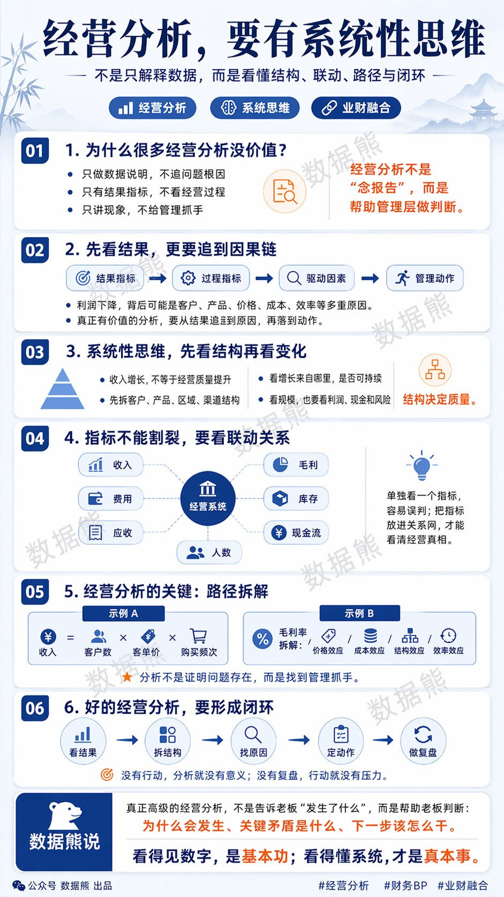
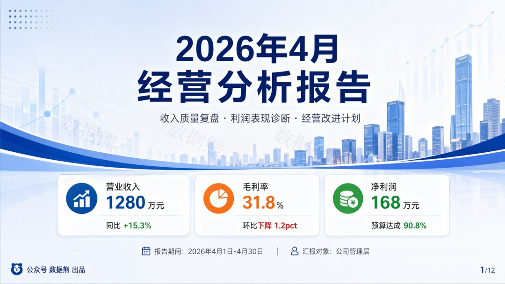
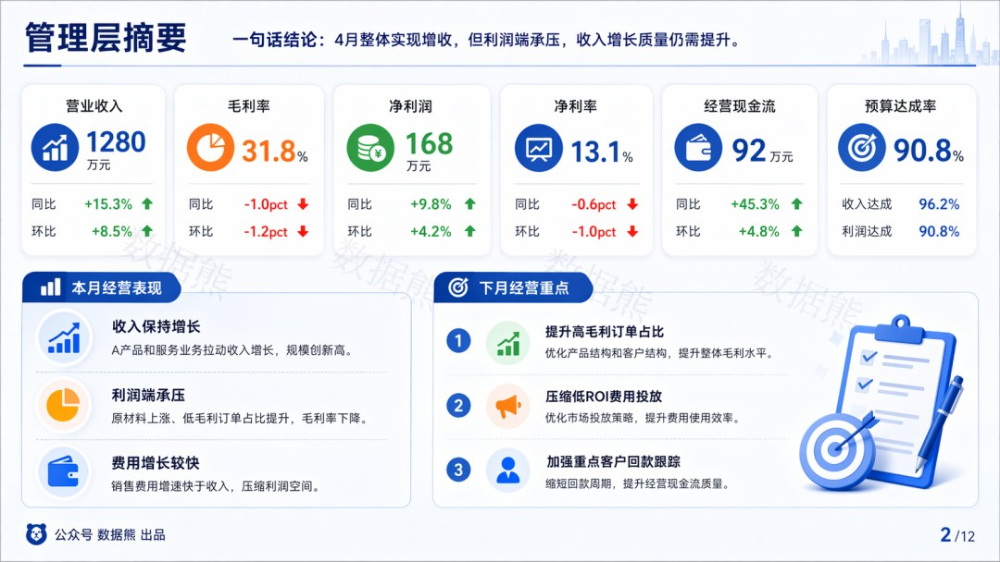
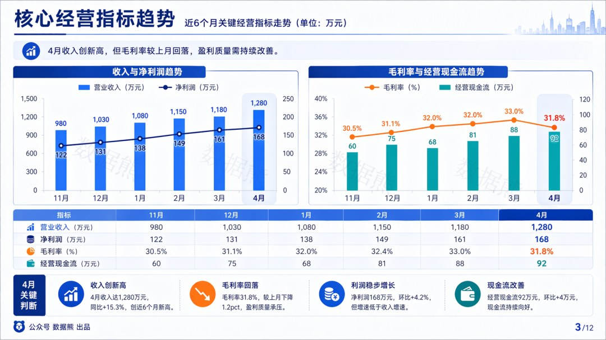
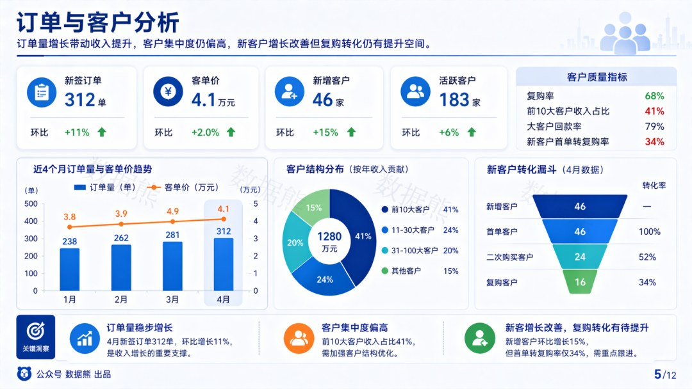
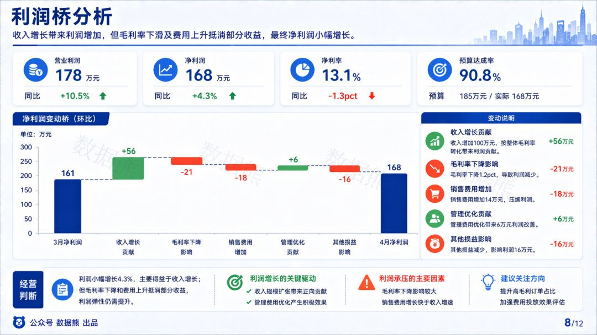
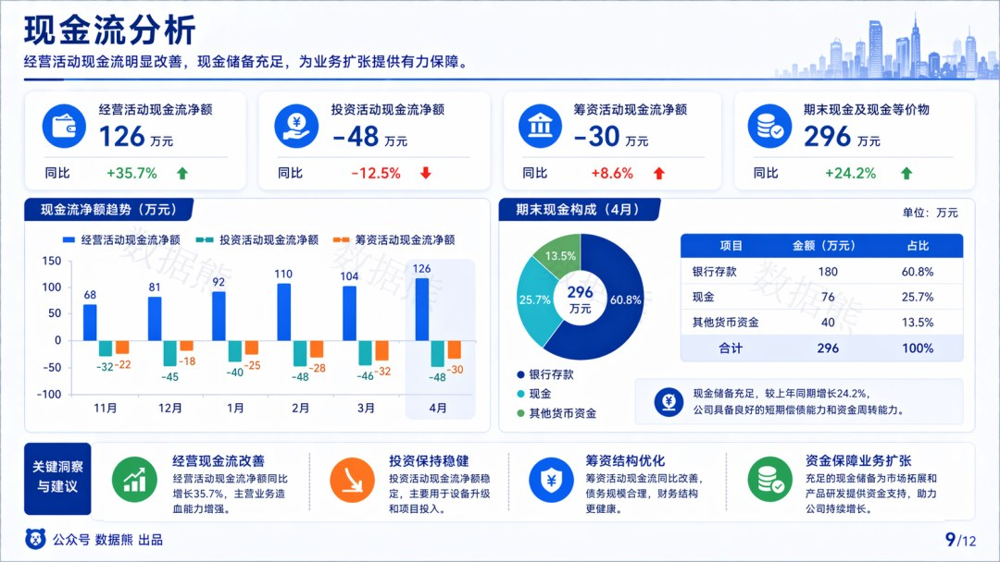
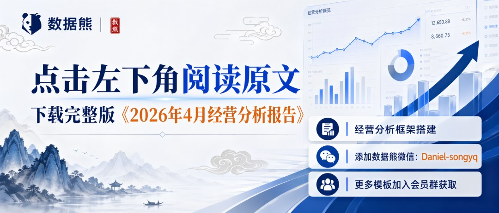
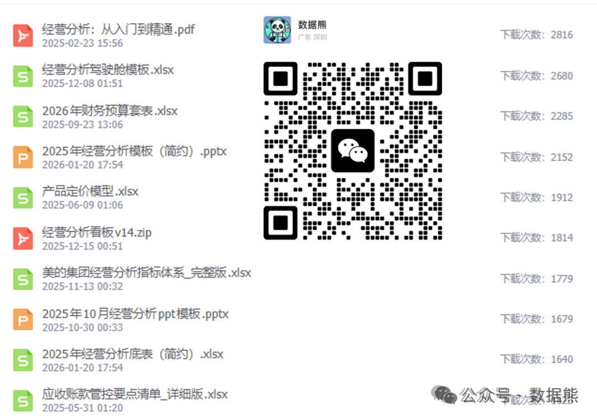

# 2026年4月经营分析报告

> 来源：微信公众号「数据熊」 · 作者 宋岳清 · 发布于 2026-04-24 14:47
> 原文链接：http://mp.weixin.qq.com/s?__biz=Mzg2MTg5OTgzNA==&mid=2247498536&idx=1&sn=cdfe0ca779064e3bdbff81f8a0f2f970&chksm=ce12a67df9652f6b9152a166e3c14911d23c8b1aa5dbda1015290ecee37c132f7a3190b0f331

汇报能力才是职场的顶级能力，点击文末左下角
阅读原文
，下载完整版《2026年4月经营分析报告》

往期推荐

详解美的集团经营分析体系

美的集团经营指标体系（附excel）

2026年1季度应收账款分析报告.pptx

2026年1季度存货分析报告.pptx

2026年1季度经营分析报告.pptx

经营分析报告模板.pptx

2026年1季度财务分析报告.pptx

2026年1季度财务工作总结.pptx

