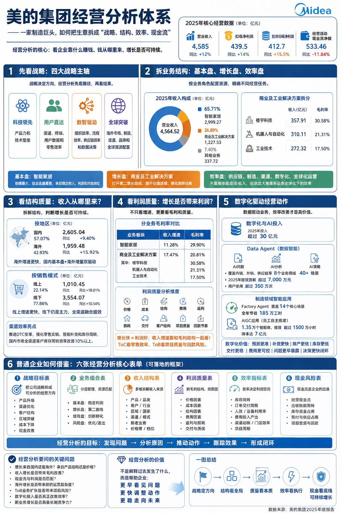
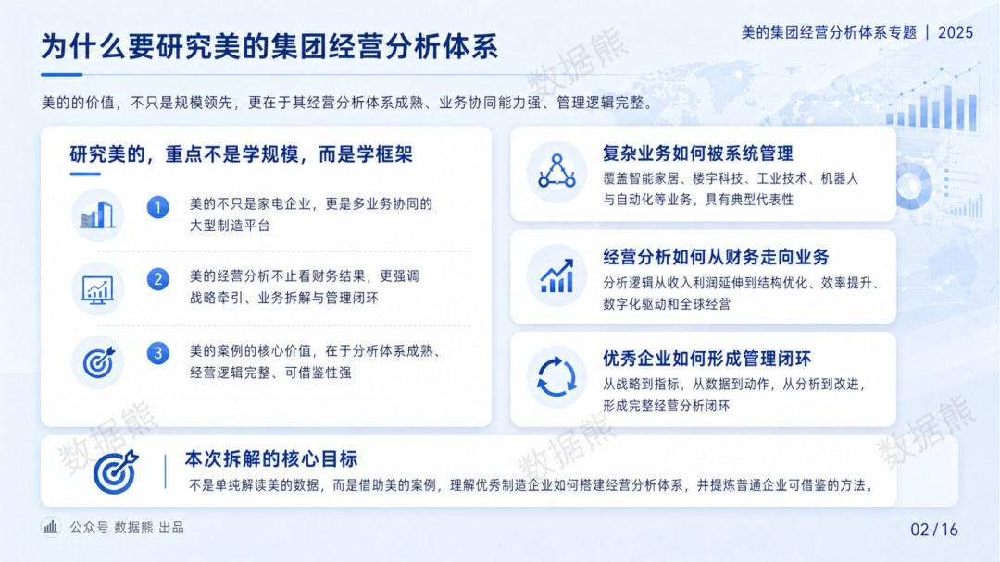
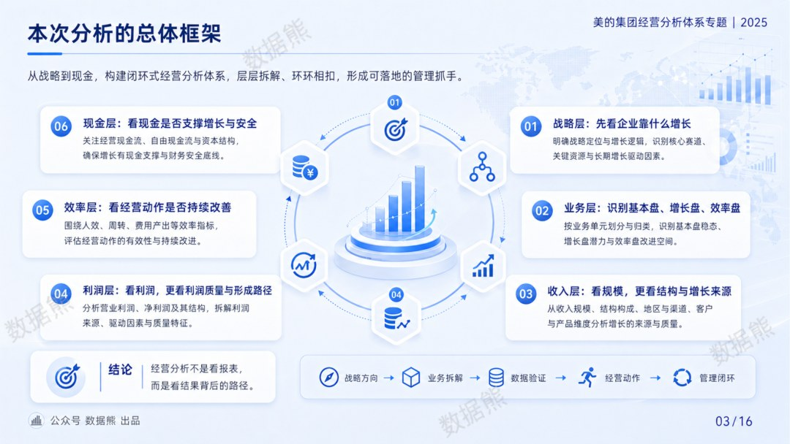
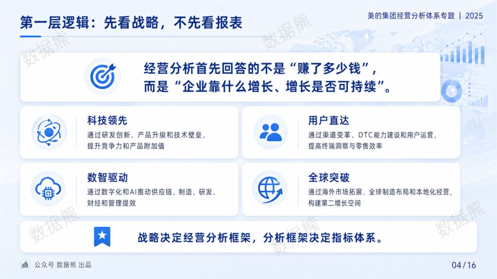
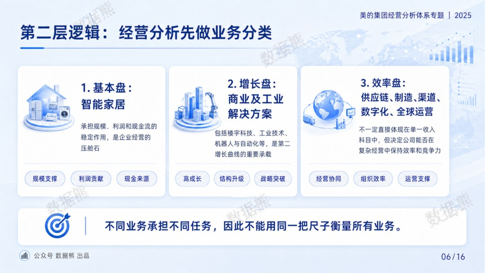
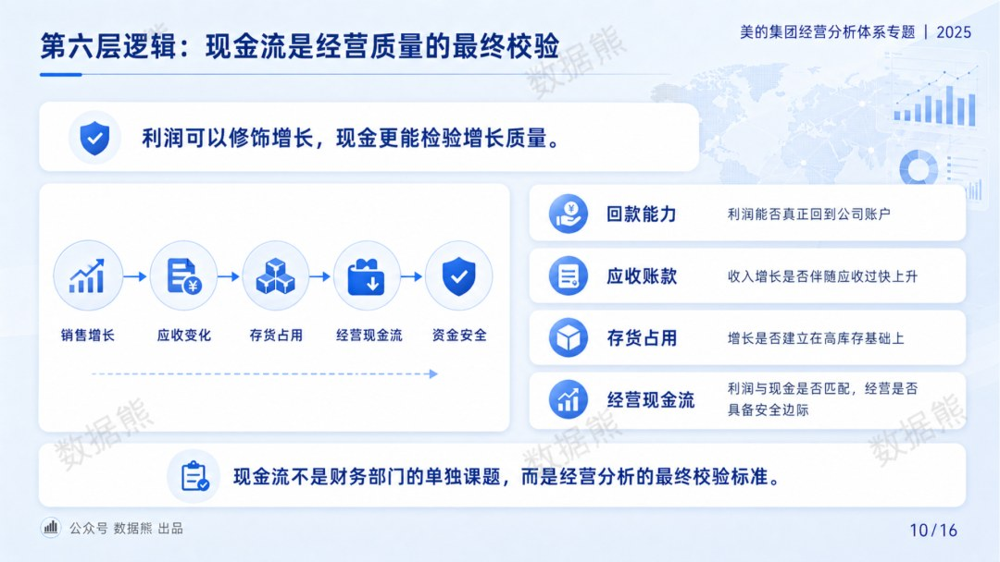
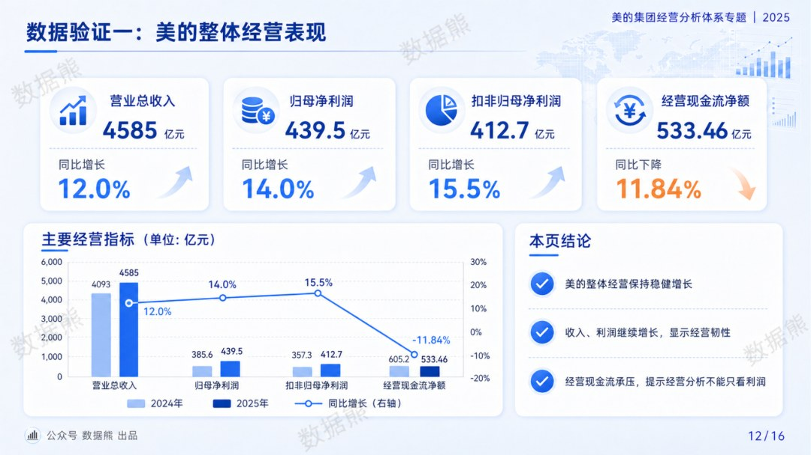
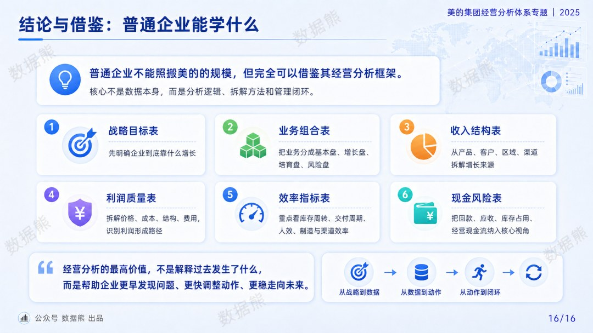
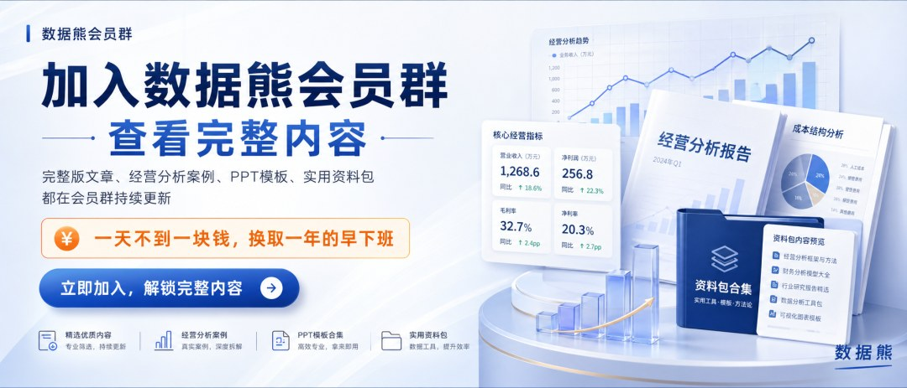
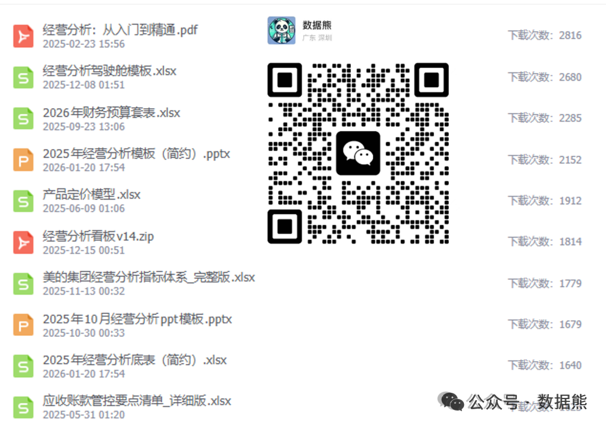

# 详解美的集团经营分析体系

> 来源：微信公众号「数据熊」 · 作者 宋岳清 · 发布于 2026-04-25 13:42
> 原文链接：http://mp.weixin.qq.com/s?__biz=Mzg2MTg5OTgzNA==&mid=2247498565&idx=1&sn=c5dda6e4ace271a4e94cbef22f73a895&chksm=ce12a610f9652f0676a7ff6e667eb4f796834867214bc3e9c32702f639535ef65477b332cc1d

加入数据熊的会员群，查看完整内容

往期推荐

2026年1季度存货分析报告.pptx

2026年1季度应收账款分析报告.pptx

2026年1季度经营分析报告.pptx

经营分析报告模板.pptx

2026年1季度财务分析报告.pptx

2026年1季度财务工作总结.pptx

