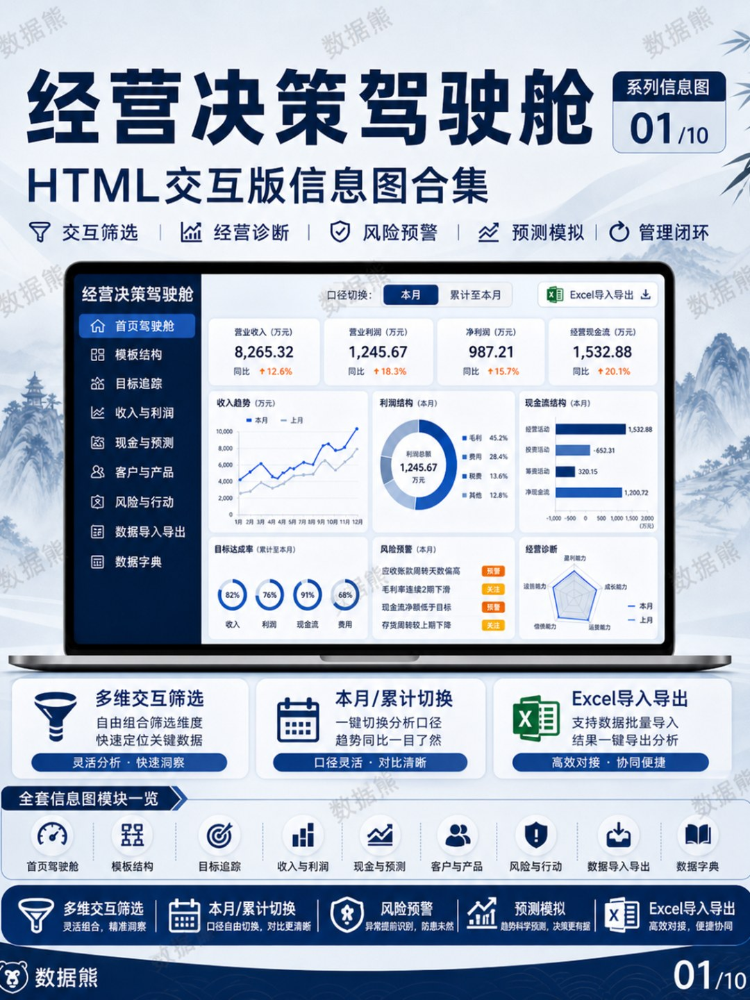
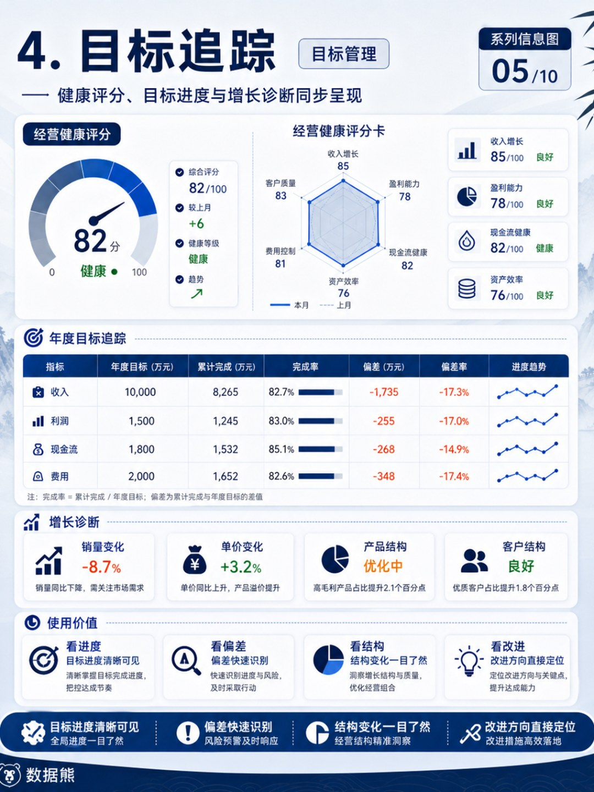
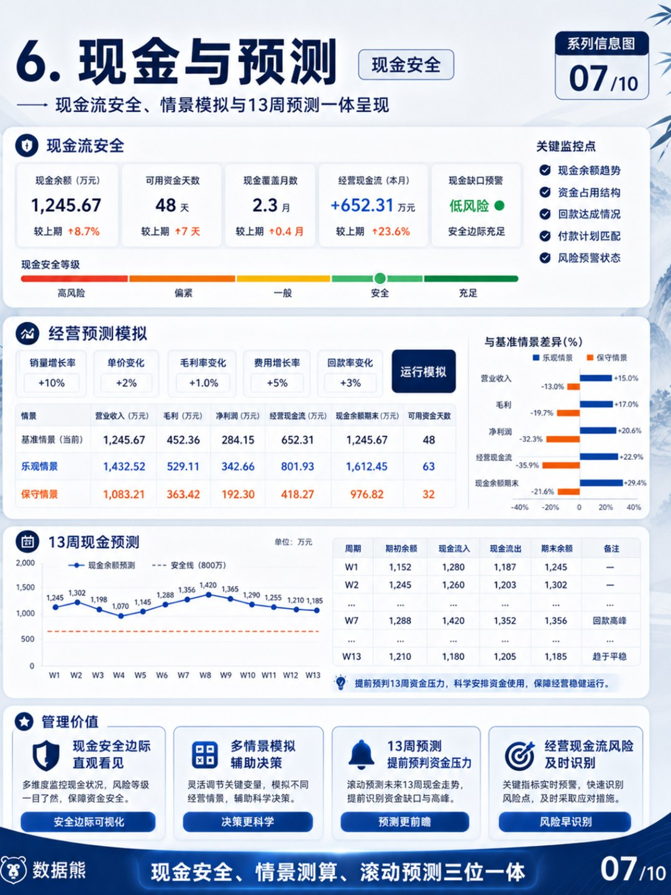
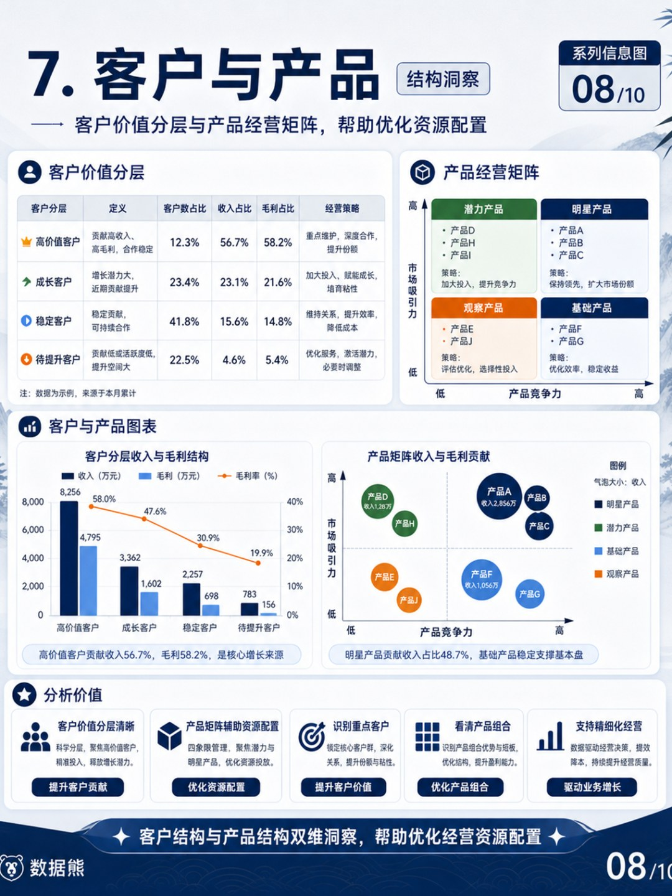

# 数据熊 | 经营分析驾驶舱

> 来源：微信公众号「数据熊」 · 作者 宋岳清 · 发布于 2026-05-05 10:57
> 原文链接：http://mp.weixin.qq.com/s?__biz=Mzg2MTg5OTgzNA==&mid=2247499022&idx=1&sn=d46f90decf7960db48ad5d90263fb18b&chksm=ce12a05bf965294d633bdd121af8ff90edd91c551035f5b60d11e92c243028f569c51d2eeae8

